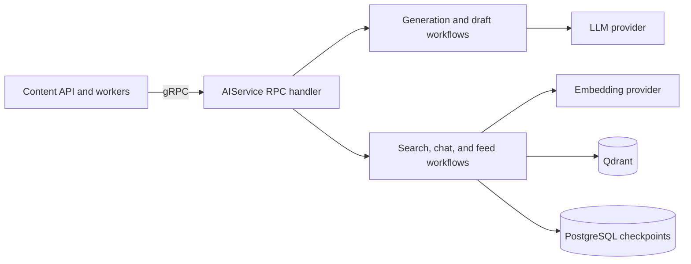

# AI service documentation

The AI service is a Python gRPC service. It provides generation, draft
workflows, hybrid retrieval, grounded chat, and personalised recommendations to
other Topos services. The browser never calls it directly.

## Start here

1. [Quick start](getting-started/quickstart.md) — install, generate stubs, and run it.
2. [Architecture](concepts/architecture.md) — understand the transport and application boundaries.
3. [Retrieval and recommendations](concepts/retrieval-and-recommendations.md) — understand Qdrant data and ranking.
4. [RPC reference](components/rpc-reference.md) — use the protobuf API safely.

## Documentation by task

| Task | Read |
| --- | --- |
| Generate or review post content | [Generation and draft workflow](concepts/generation-and-review.md) |
| Understand grounded chat | [Retrieval and recommendations](concepts/retrieval-and-recommendations.md) |
| Configure fake versus real dependencies | [Configuration and startup](operations/configuration-and-startup.md) |
| Diagnose a service issue | [Health and observability](operations/health-and-observability.md) |
| Run tests | [Testing](testing/overview.md) |

## Boundary overview

