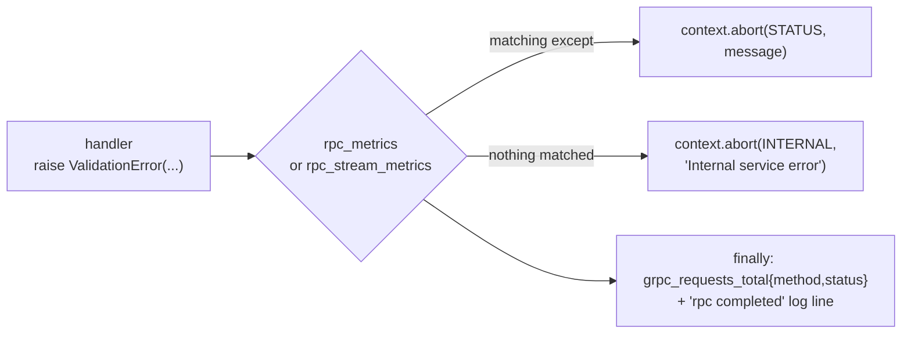
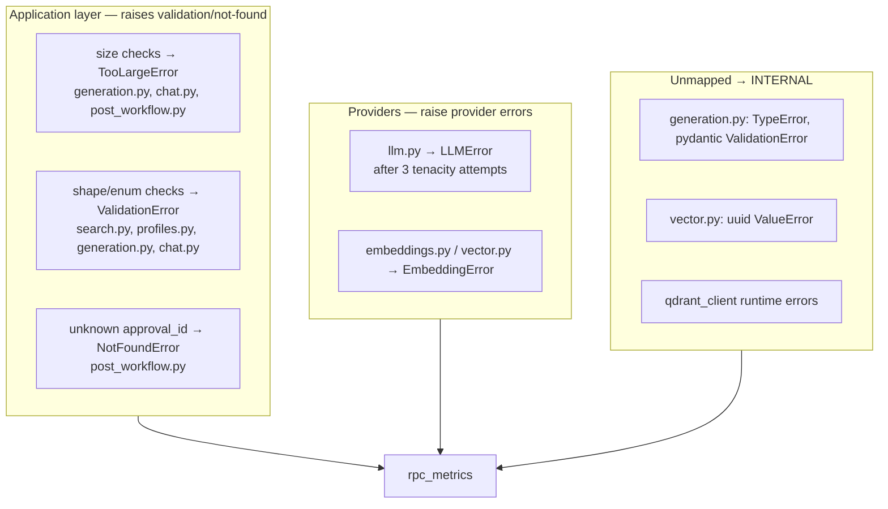

# Error handling

Errors in this service are raised as **typed Python exceptions** and converted
to gRPC status codes by one shared decorator. Handlers never call
`context.abort()` themselves (with two exceptions) and never return error
objects — they raise, and the decorator does the wire work.



The whole mechanism lives in
[`src/application/support.py`](../../src/application/support.py) — roughly 80
lines, applied as a decorator to every handler.

## The three application exceptions

| Class | Raised when | Constructed with |
| --- | --- | --- |
| `TooLargeError` | A request exceeds a configured size limit | The limit only (`raise TooLargeError(settings.MAX_INPUT_CHARS)`) — **there is no message field** |
| `ValidationError` | The request is malformed, out of range, or has an unsupported enum value | A human-readable message |
| `NotFoundError` | A referenced workflow/resource does not exist | A message |

Two more live beside them, raised by the providers rather than the
application layer:

| Class | Module | Raised when |
| --- | --- | --- |
| `LLMError` | [`src/llm.py`](../../src/llm.py) | Transport failure, non-2xx after retries exhausted, malformed reply payload |
| `EmbeddingError` | [`src/embeddings.py`](../../src/embeddings.py) | Transport failure, wrong embedding count, wrong dimension, inference-mode misuse |

`TooLargeError` is deliberately message-less so the decorator can render a
consistent sentence:

```python
f"Input exceeds the maximum length of {exc.limit} characters"
```

## The mapping

`rpc_metrics` (unary handlers):

| Exception | gRPC status | Log level | Message on the wire |
| --- | --- | --- | --- |
| `TooLargeError` | `INVALID_ARGUMENT` | `logger.exception` | `Input exceeds the maximum length of {limit} characters` |
| `ValidationError` | `INVALID_ARGUMENT` | `logger.exception` | The message you raised |
| `NotFoundError` | `NOT_FOUND` | `logger.exception` | The message you raised |
| `LLMError` | `UNAVAILABLE` | `logger.exception` | `LLM provider unavailable` (original swallowed) |
| `EmbeddingError` | `UNAVAILABLE` | `logger.exception` | `Embedding provider unavailable` (original swallowed) |
| `asyncio.CancelledError` | re-raised | — | Recorded as `CANCELLED` |
| **anything else** | `INTERNAL` | `logger.exception` | `Internal service error` (original swallowed) |

`rpc_stream_metrics` (`ChatAnswer`) is identical **except that it has no
`NotFoundError` branch**. A `NotFoundError` escaping the chat handler would
surface as `INTERNAL`, not `NOT_FOUND`. Today nothing raises it there, so this
is a latent difference rather than a live bug — but do not start raising it
from chat code without adding the branch.

### Two deliberate asymmetries

1. **Validation and not-found messages reach the caller; provider and parse
   messages do not.** A bad `limit` tells you exactly what was wrong. A failed
   LLM call becomes the opaque `LLM provider unavailable`, with the real cause
   only in the server log. That keeps internals off the wire.
2. **Both providers map to the same status.** You cannot distinguish "the LLM
   is down" from "the embedding server is down" from the status code alone.
   Look at `llm_requests_total{status}` versus
   `dependency_up{dep="embedding"}` — see
   [Health and observability](../operations/health-and-observability.md).

## What is *not* mapped → `INTERNAL`

The catch-all is `except Exception`, so anything unmapped becomes
`INTERNAL` + `Internal service error`. In practice that covers:

| Source | Exception | Why it lands here |
| --- | --- | --- |
| `GenerateTags` with an unparseable reply | `TypeError("LLM response tags are not a list")` | Not in the map — a **parse** failure, not a provider failure |
| `GeneratePost` with an invalid JSON payload | pydantic `ValidationError` | Also not in the map |
| `IndexPost` with a non-hex post id | `ValueError` from `uuid.UUID(hex=...)` | Raised deep in `_point_id` |
| **A Qdrant outage at runtime** | `qdrant_client`'s own exception | Nothing wraps the store; only *startup* has retries |
| Any graph that fails to configure | `RuntimeError` | e.g. `ChatAnswer` with `chat_graphs is None` |
| `GeneratePostDraft` with a missing graph | `RuntimeError` | Same |

> **The Qdrant one is the sharp edge.** Startup retries the store
> (`QDRANT_STARTUP_RETRIES` × 5 s), but *runtime* Qdrant calls are wrapped in
> nothing. Once the service is `SERVING`, a store outage turns every search,
> related, recommend, and index call into `INTERNAL` — not `UNAVAILABLE`.
> Read more in [Reliability](../operations/reliability.md).

### The `TypeError` naming trap

`support.py` defines `ValidationError`, and `generation.py` *also* imports
`ValidationError` from pydantic. They are different classes with the same
name, and the module-level import decides which one you get:

```python
from pydantic import BaseModel, ValidationError   # ← this one
from src.application.support import TooLargeError, access_logger, rpc_metrics
```

So `raise TypeError(...)` and pydantic's `ValidationError` in that module both
mean "the model's output did not parse", and both land on `INTERNAL`. Neither
is retried by tenacity — the HTTP call itself succeeded, so the provider never
saw a failure.

## Where each exception comes from



`PostFetchError` ([`src/posts.py`](../../src/posts.py)) deserves its own note:
it is **never** allowed to reach the decorator. The chat tool dispatcher
catches it and returns `{"error": "…"}` to the model, so a content-service
outage degrades an answer rather than failing the stream — see
[Chat flow](../concepts/chat-flow.md).

## Only two handlers abort directly

Everything else goes through the decorator. The exceptions:

```python
# search.py — Embed
if settings.EMBEDDING_MODE == "inference":
    await context.abort(
        grpc.StatusCode.UNIMPLEMENTED,
        "Embed is unavailable in inference mode: Qdrant embeds server-side",
    )
```

and `DeleteUserProfile`, which aborts from the **generated** servicer stub
before any decorator runs — which is why it never appears in
`grpc_requests_total`. See
[RPC reference](rpc-reference.md#deleteuserprofile-declared-not-implemented).

## Status codes, and what usually causes them

| Status | Meaning here | Typical cause |
| --- | --- | --- |
| `OK` | Success | |
| `INVALID_ARGUMENT` | Request rejected before I/O | Over a `MAX_*`/`SEARCH_*` limit, empty required field, bad enum, `offset+limit > 1000` |
| `NOT_FOUND` | Referenced workflow does not exist | Wrong `approval_id`, wiped checkpoint store |
| `UNAVAILABLE` | A configured provider is unreachable | LLM or embedding server down, `LLM_MODE=real` with no key |
| `UNIMPLEMENTED` | Deliberately not served | `DeleteUserProfile` always; `Embed` under `EMBEDDING_MODE=inference` |
| `INTERNAL` | Unmapped exception | Parse failure, Qdrant outage, non-hex id, `RuntimeError` |
| `CANCELLED` | Client hung up mid-stream | Chat client disconnected before `done` |

Note what is **absent**: there is no `DEADLINE_EXCEEDED` branch — the AI
service sets no per-RPC deadline. Deadlines come from the caller (content's
`chatTimeout` etc.), and when they fire you see `CANCELLED` here, not a timeout
status.

## Observability

Every failure produces three artefacts:

1. **Metrics** — `grpc_requests_total{method,status}` and
   `grpc_request_duration_seconds{method,status}` with the status above;
   `grpc_active_requests` decremented in `finally`.
2. **Access log** — a single-line `rpc completed` record with `method`,
   `status`, `duration_ms`, `trace_id`, `span_id`.
3. **Server log** — `logger.exception(...)` with the original traceback, at
   `ERROR` for the catch-all and for provider failures.

The `status` label is derived *before* `context.abort()` runs, so it always
matches what the caller received. Because `CANCELLED` re-raises instead of
aborting, a cancelled stream is still counted — with `status="CANCELLED"` and a
normal `finally`.

## Recipes

**"The client says `Internal service error` — what actually happened?"**

Search the server log for `unexpected error in` at the same timestamp; the
traceback is there. Then check whether the cause was a parse (`TypeError`) or
a store failure (`qdrant`) — the two need different fixes.

**"I get `INVALID_ARGUMENT` but the input looks fine."**

Almost always one of the numeric windows rather than a length:
`offset + limit > SEARCH_MAX_RESULT_WINDOW (1000)` or `limit > 100`. The
message names the window, but it reads like a size limit.

**"Every RPC returns `UNAVAILABLE`."**

One of exactly two providers is down, or `LLM_MODE=real` with an empty key.
`dependency_up{dep}` tells you which: `qdrant`, `embedding`, or `checkpoint`.

**"Everything returns `INTERNAL` right after it started."**

Qdrant went away after startup. Runtime calls have no retry — see
[Reliability](../operations/reliability.md).

**"I need a new failure mode."**

Add a typed exception and a `except` branch in **both** decorators. Adding it
to only one silently changes the status of `ChatAnswer` relative to everyone
else.

## Next steps

- [RPC reference](rpc-reference.md) — the validation each RPC performs.
- [Reliability](../operations/reliability.md) — dependency failures in depth.
- [Health and observability](../operations/health-and-observability.md) — the
  metrics these failures increment.
