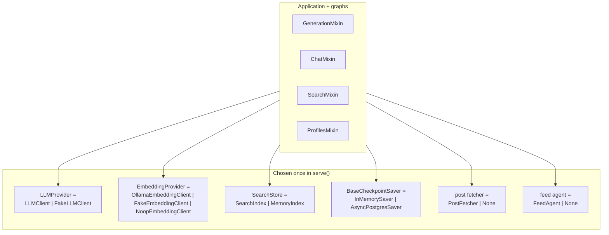

# Providers

Every external dependency sits behind a small class chosen once at startup by
a mode switch. Nothing in the application layer knows whether it is talking to
Lightning AI or a canned string, to Qdrant or a dict — so the whole system can
run with no containers at all.



The switch itself is four settings — see
[Configuration](../getting-started/configuration.md).

## LLM provider

`LLMProvider` is a `typing.Protocol` ([`src/llm.py`](../../src/llm.py)) with
three methods:

| Method | Used by | Contract |
| --- | --- | --- |
| `generate_completion(system, user)` | summary, tags, post, draft, rewrite, judge, compaction, feed preset | Returns the raw reply text |
| `generate_stream(system, user)` | the `answer` chat node | Async iterator of deltas |
| `generate_tool_completion(messages, tools)` | the `tool_loop` node | Returns a `CompletionReply` with prose plus `ToolRequest`s |
| `close()` | shutdown | Releases the HTTP client |

### `LLMClient` — the real one

`httpx.AsyncClient` against an OpenAI-compatible endpoint
(`LLM_API_URL`, default Lightning AI), `Authorization: Bearer {LLM_API_KEY}`.

**Retry policy** (hard-coded, not configurable):

```text
@retry(stop=stop_after_attempt(3),
       wait=_wait_for_retry,                       # 2^attempt, capped at 10 s
       retry=retry_if_exception(_is_retryable),    # only transient failures
       before_sleep=_before_retry,                 # logs + llm_retries_total++
       reraise=True)
```

| Retried | Not retried |
| --- | --- |
| `httpx.RequestError` — connection refused, DNS, timeout | Any 4xx other than 429 |
| `HTTPStatusError` with status in `{429, 500, 502, 503, 504}` | A 200 whose JSON body cannot be parsed |

The wait function honours a `Retry-After` header up to **30 s**, otherwise
exponential backoff capped at 10 s. Three attempts then `reraise`, and the
caller's decorator maps the `LLMError` to gRPC `UNAVAILABLE`.

**Streaming has its own rule:** only `_open_stream` is retried. Once the first
delta has been yielded, a mid-stream failure raises `LLMError` and is **not**
retried — a partial answer cannot be replayed safely. This is why a chat that
dies halfway reports `UNAVAILABLE` but you will not see `llm_retries_total`
increment for it.

**Sampling parameters depend on the model name:**

```python
if "gpt-5" in settings.LLM_MODEL:
    return {"max_completion_tokens": 2048}            # no temperature
else:
    return {"temperature": 0.7, "max_tokens": 2048}
```

GPT-5-family models reject `max_tokens` and a fixed `temperature` (the
Lightning proxy surfaces both as 500s), so the code branches on a substring of
`LLM_MODEL`. **If you point `LLM_MODEL` at another GPT-5 variant whose name
does not contain the literal `gpt-5`, you get the wrong parameter set** and a
500 from the proxy.

### `FakeLLMClient` — canned, and keyed by prompt

```python
self._responses = {
    SUMMARY_PROMPT: "A concise three-sentence summary generated for load testing.",
    TAGS_PROMPT: '["loadtest", "capacity", "benchmark", "grpc", "performance"]',
    POST_PROMPT: {...},
    CHAT_SYSTEM_PROMPT: "The platform stores posts in Qdrant ... [1] ... [2]",
    REWRITE_QUERY_PROMPT: "how do langgraph checkpoints persist conversation state",
    JUDGE_RELEVANCE_PROMPT: '{"relevant": true, "score": 0.9}',
    HISTORY_SUMMARY_PROMPT: "The user explored Topos blog features ...",
    FEED_AGENT_PROMPT: "balanced",
}
return self._responses.get(system, self._SUMMARY)
```

Consequences worth knowing before you rely on it:

- **Lookup is by the exact system prompt.** Editing a prompt in
  [`src/domain/prompts.py`](../../src/domain/prompts.py) without adding the
  new constant to this dict silently falls back to the *summary* string. A
  tags request would then receive a sentence instead of JSON — and raise.
- **The canned chat answer contains citations** `[1] [1] [2]`, so
  `cited_post_ids` is never empty under `LLM_MODE=fake`. Do not treat that as
  evidence that citation logic works.
- **`generate_stream` emits word by word with `await asyncio.sleep(0.001)`**,
  deliberately, so streaming is actually exercised rather than returned as one
  blob.
- **`generate_tool_completion` pops from a scripted queue.** Tests pass a
  `tool_replies` list to control the loop; an empty queue returns a plain
  completion with no tool requests, which ends `tool_loop` immediately.
- **No metrics are recorded.** `llm_requests_total` and `llm_tokens_total` stay
  flat in fake mode.

## Embedding provider

`EmbeddingProvider` is a Protocol with `embed(texts)` and `close()`.

| `EMBEDDING_MODE` | Class | Behaviour |
| --- | --- | --- |
| `fake` | `FakeEmbeddingClient` | SHA-256 seeds a `random.Random`, draws `QDRANT_VECTOR_SIZE` gaussians, normalises to unit length |
| `ollama` | `OllamaEmbeddingClient` | `POST {EMBEDDING_URL}/api/embed`, batched at `EMBEDDING_BATCH_SIZE` (64) |
| `inference` | `NoopEmbeddingClient` | **Raises `EmbeddingError` on every call** |

Two properties of the fake make it good enough for local work:

- Identical text ⇒ **exactly** the same vector ⇒ cosine similarity 1.0.
- Unrelated text ⇒ ≈0 ⇒ the `SEARCH_DENSE_SCORE_THRESHOLD` (0.3) gate is
  meaningful rather than decorative.

That is also why "index a post, then search for a paraphrase" returns nothing
under `fake` — there is no semantic similarity to find.

`OllamaEmbeddingClient` validates every response through
`_validate_embeddings()` before it can reach the store:

```python
if len(vectors) != len(texts):                    # count mismatch
    raise EmbeddingError(...)
if any(len(v) != settings.QDRANT_VECTOR_SIZE):    # dimension mismatch
    raise EmbeddingError(f"embedding dimension must be {settings.QDRANT_VECTOR_SIZE}")
```

So pointing at the wrong model fails loudly instead of writing garbage vectors.
It also updates `dependency_up{dep="embedding"}` and
`embedding_requests_total{status,mode}` on every call — **the fake client does
neither**, so those series simply do not exist under `EMBEDDING_MODE=fake`.

### Inference mode changes more than embeddings

`NoopEmbeddingClient` exists because in `inference` mode **Qdrant embeds
server-side**: you store raw text in a named payload field and Qdrant applies
its configured embedding model. Consequences:

1. Any client-side call is a wiring bug, so it raises rather than returning
   junk.
2. `Embed` returns `UNIMPLEMENTED` (explicit check in
   [`src/application/search.py`](../../src/application/search.py)).
3. `build_search()` **refuses `VECTOR_MODE=fake`** with a `RuntimeError` — the
   in-memory twin has no server to embed for it. This is the one incompatible
   mode pair in the service.

## Search store

```python
SearchStore = SearchIndex | MemoryIndex      # src/vector.py:1069
```

There is **no Protocol** here — it is a union of two concrete classes that
happen to implement the same methods. Both provide:

```text
ensure_collection, upsert, delete, related, count, search,
retrieve_by_vector, retrieve_by_text, get_posts,
user_tag_weights, post_tags, update_user_profile,
recommend, recommend_surprise, close
```

Adding a method to one and not the other is a type error only where the union
is consumed — so keep them in step.

| | `SearchIndex` | `MemoryIndex` |
| --- | --- | --- |
| Backing store | Qdrant, two collections | `dict`s in process memory |
| Sparse weighting | Qdrant IDF | Raw term frequency |
| Tie-breaking | Qdrant's ordering | Python's stable sort ⇒ insertion order |
| Per-operation metrics | `@_record_qdrant` on **every** method | None |
| `dependency_up{dep="qdrant"}` | Updated on every operation | Never appears |
| Survives restart | Yes | No |

`_record_qdrant` wraps 14 methods (`ensure_collection`, `upsert`, `delete`,
`related`, `count`, `search`, `retrieve_by_vector`, `retrieve_by_text`,
`get_posts`, `user_tag_weights`, `post_tags`, `update_user_profile`,
`recommend`, `recommend_surprise`) and on **every** call:

```python
success → qdrant_requests_total{operation, status="success"}++
          dependency_up{dep="qdrant"} = 1
error   → qdrant_requests_total{operation, status="error"}++
          dependency_up{dep="qdrant"} = 0
```

That is why `dependency_up{dep="qdrant"}` is a genuinely live gauge — the
docstring calls it out as a way to "alert on store health without a separate
probe loop".

> **Note the `status` vocabulary differs between metrics.** Qdrant operations
> use `success`/`error`; gRPC and recommender metrics use `OK`/…. Do not write
> one alert expression for both.

`_record_qdrant` re-raises, so a store failure still becomes gRPC `INTERNAL` —
the metric wrapper does not translate exceptions. See
[Error handling](error-handling.md).

## Checkpointer

```python
def build_checkpointer() -> BaseCheckpointSaver:
    if not settings.CHECKPOINT_DB_URL:
        return InMemorySaver(serde=_SERDE)
    ...
    return AsyncPostgresSaver(pool, serde=_SERDE)
```

| Setting | Purpose |
| --- | --- |
| `CHECKPOINT_DB_URL` | Empty ⇒ `InMemorySaver`. Set ⇒ pooled runtime URL (RDS Proxy in prod) |
| `CHECKPOINT_DB_URL_MIGRATE` | Direct-writer URL used **only** for `saver.setup()` DDL |
| `CHECKPOINT_POOL_MIN/MAX_SIZE` | Runtime pool bounds (1 / 10) |
| `CHECKPOINT_STARTUP_RETRIES` | Startup attempts (12 × 5 s) |

The two-URL split exists for one reason: `CREATE INDEX CONCURRENTLY` cannot
run inside a transaction and cannot run through a pooler (it pins the session).
`start_checkpointer()` opens a throwaway single-connection pool against the
migrate URL, runs `setup()` there, then opens the runtime pool.

Other details that are easy to miss:

- The pool is constructed with `open=False` so connection failures surface
  **inside** the startup retry loop rather than at construction.
- `autocommit=True` and `prepare_threshold=0` keep statements unnamed so RDS
  Proxy sessions are never pinned.
- `setup()` is idempotent, so retry-loop re-runs are safe.
- `build_chat_graph` compiles a *second* graph with no checkpointer for
  stateless chat; the draft graph always shares the sessioned one.
- **`dependency_up{dep="checkpoint"}` is set once at startup** and never
  updated afterwards — unlike `qdrant`, it is not a live health signal.
- The custom dataclasses in `ChatState` must be listed in `_SERDE`; anything
  missing degrades silently to a raw `dict` on reload.

With an empty URL everything still works — chat sessions just do not survive a
restart, and pending draft approvals are lost.

## Post fetcher

| `CONTENT_INTERNAL_TOKEN` | Built? | `get_post_body` behaviour |
| --- | --- | --- |
| Empty | **No** — `post_fetcher = None` | Returns a placeholder |
| Set | `PostFetcher()` | `GET {CONTENT_SERVICE_URL}/internal/posts/{id}` with `X-Internal-Secret` |

`PostFetcher` maps failures to `PostFetchError`, which the chat tool dispatcher
catches and turns into `{"error": ...}` for the model. A 10 s timeout keeps a
stuck fetch from stalling the whole turn.

> `serve()` never calls `post_fetcher.close()`. The `httpx.AsyncClient` is
> released when the process exits, but it is absent from the shutdown
> `finally` block that does close the LLM, search, embeddings, and checkpointer.
> Documented as-is.

A `FakePostFetcher` exists in the same module for tests: it stores bodies in a
dict and records `fetched` ids.

## Feed agent

```python
if settings.AGENT_MODE != "deterministic":
    agent_llm = FakeLLMClient() if settings.AGENT_MODE == "fake" else llm
    feed_agent = FeedAgent(agent_llm, search)
```

| `AGENT_MODE` | Effect |
| --- | --- |
| `deterministic` | No agent — `RecommendFeed` runs the engine paths directly (the pre-agent behaviour) |
| `agent` | Real LLM picks a blend preset, cached for `AGENT_DECISION_TTL_SECONDS` (300 s) |
| `fake` | `FakeLLMClient` — always returns `"balanced"` |

Note the `agent_llm` line: **`AGENT_MODE=fake` uses a fake LLM even when
`LLM_MODE=real`**, and `AGENT_MODE=agent` reuses whatever `LLM_MODE` selected.

`FeedAgent` is optional in the `AIService` constructor — passing `None` puts
`RecommendFeed` permanently on the deterministic path. That is how the unit
tests exercise the service without any graph.

> Its decision cache is a plain dict keyed by `user_id`. Entries expire
> logically but are never pruned, so users who return once and never again
> leave keys behind for the life of the process. See
> [Reliability](../operations/reliability.md).

## Compatibility matrix

`OK` = works, `err` = startup `RuntimeError`, `✗` = runtime `UNIMPLEMENTED`.

| `LLM_MODE` | `VECTOR_MODE` | `EMBEDDING_MODE` | Result |
| --- | --- | --- | --- |
| `real` | `qdrant` | `ollama` | **Full production behaviour** |
| `fake` | `qdrant` | `ollama` | Real embeddings + real store, canned text |
| `fake` | `fake` | `fake` | **Fully offline** — no containers at all |
| `real` | `fake` | `fake` | Real LLM, ephemeral index (lost on restart) |
| `real` | `qdrant` | `inference` | Qdrant embeds; `Embed` = `✗` |
| any | **`fake`** | **`inference`** | **`RuntimeError` at startup** |

## Recipes

```bash
# No containers, no API key — what the k6 load tests use
LLM_MODE=fake VECTOR_MODE=fake EMBEDDING_MODE=fake make run

# Real model, ephemeral index
LLM_MODE=real LIGHTNING_AI_API_KEY=sk-... VECTOR_MODE=fake make run

# Real everything against local infra (what Compose gives you)
LLM_MODE=fake EMBEDDING_MODE=ollama VECTOR_MODE=qdrant make run

# Feed agent against the real LLM, everything else fake
AGENT_MODE=agent LLM_MODE=real LIGHTNING_AI_API_KEY=sk-... make run
```

**Swapping in a new provider** means implementing the same three or four
methods and adding one branch to `build_embeddings()` / `build_search()` in
[`src/main.py`](../../src/main.py) (and, for the LLM, the ternary in
`serve()`). There is no registry or plugin mechanism — deliberately.

## Next steps

- [Configuration](../getting-started/configuration.md) — every setting and its
  default.
- [Architecture](../concepts/architecture.md) — where these are constructed in
  the startup sequence.
- [Reliability](../operations/reliability.md) — what happens when one of them
  goes down.
