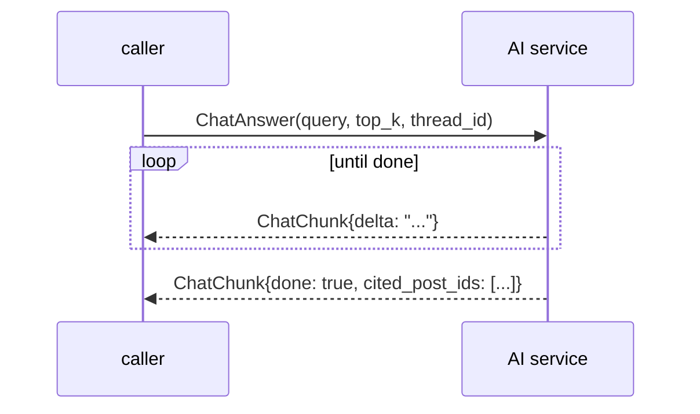

# RPC reference

The contract is one proto: [`proto/ai/ai_service.proto`](../../proto/ai/ai_service.proto).
Sixteen RPCs on the service `ai.AIService`, package `ai`.

```text
service AIService {
    rpc GenerateSummary   (ContentRequest)           returns (ContentResponse);
    rpc GenerateTags      (ContextRequest)           returns (TagsResponse);
    rpc GeneratePost      (PostGenerationRequest)    returns (PostGenerationResponse);
    rpc GeneratePostDraft (PostGenerationRequest)    returns (PostWorkflowState);
    rpc ApprovePost       (ApprovePostRequest)       returns (PostWorkflowState);
    rpc RejectPost        (RejectPostRequest)        returns (PostWorkflowState);
    rpc IndexPost         (IndexRequest)             returns (IndexResponse);
    rpc DeletePost        (DeleteRequest)            returns (DeleteResponse);
    rpc SearchPosts       (SearchRequest)            returns (SearchResponse);
    rpc RelatedPosts      (RelatedRequest)           returns (RelatedResponse);
    rpc RelatedPostsBatch (RelatedBatchRequest)      returns (RelatedBatchResponse);
    rpc Embed             (EmbedRequest)             returns (EmbedResponse);
    rpc ChatAnswer        (ChatAnswerRequest)        returns (stream ChatChunk);   // ← only stream
    rpc UpdateUserProfile (UserProfileUpdateRequest) returns (UserProfileUpdateResponse);
    rpc RecommendFeed     (RecommendRequest)         returns (RecommendResponse);
    rpc DeleteUserProfile (DeleteUserProfileRequest) returns (DeleteUserProfileResponse);  // ← unimplemented
}
```

## Calling it

```bash
poetry run python load-tests/healthcheck.py   # exits 0 when SERVING
grpcurl -plaintext localhost:50051 ai.AIService/SearchPosts
```

For a typed call in Python, use the generated stubs — see the snippet in
[Quick start](../getting-started/quickstart.md).

Regenerating after a proto change requires `make generate` **here** *and* in
[`services/content`](../../../content) so both ends stay in sync.

## At a glance

| RPC | Style | Typical latency | Main limits |
| --- | --- | --- | --- |
| `GenerateSummary` | unary | LLM-bound | text ≤ `MAX_INPUT_CHARS` (5000) |
| `GenerateTags` | unary | LLM-bound | body ≤ 5000; prompt sees ≤ 200 title / 3000 body |
| `GeneratePost` | unary | LLM-bound, up to 3 calls | prompt ≤ 5000; keywords ≤ 500; key points ≤ 2000 |
| `GeneratePostDraft` | unary | LLM-bound | prompt must be non-empty and ≤ 5000 |
| `ApprovePost` | unary | checkpoint-bound | `approval_id` required |
| `RejectPost` | unary | checkpoint-bound | `approval_id` required |
| `IndexPost` | unary | embedding-bound | body **truncated** to 8000, never rejected |
| `DeletePost` | unary | fast | `post_id` required |
| `SearchPosts` | unary | store-bound | query ≤ 512; `offset+limit` ≤ 1000 |
| `RelatedPosts` | unary | store-bound | `limit` ≤ 100; default 10 |
| `RelatedPostsBatch` | unary | store-bound | ≤ 100 per item; duplicate ids deduped |
| `Embed` | unary | embedding-bound | text ≤ 512; **`UNIMPLEMENTED` in inference mode** |
| `ChatAnswer` | **server stream** | LLM-bound | query ≤ 512; `top_k` ≤ 10 |
| `UpdateUserProfile` | unary | store-bound | `user_id`/`post_id` ≤ 128 |
| `RecommendFeed` | unary | store-bound | `limit` ≤ 100; `offset+limit` ≤ 1000 |
| `DeleteUserProfile` | unary | — | **always `UNIMPLEMENTED`** |

## Cross-cutting conventions

1. **Validation happens before any I/O.** Every handler checks its inputs first,
   so an `INVALID_ARGUMENT` never touches Qdrant or the LLM.
2. **`0` means "not supplied"** for every `uint32` field — `limit`, `top_k`.
   proto3 has no presence for scalars, so zero is the default.
3. **Every RPC except `DeleteUserProfile` is wrapped** by `rpc_metrics` (unary)
   or `rpc_stream_metrics` (stream) from
   [`src/application/support.py`](../../src/application/support.py), which
   increments `grpc_requests_total` / `grpc_active_requests` and writes the
   `rpc completed` access log line.
4. **`extra_fields` exists on exactly two RPCs.** `RecommendFeed` logs
   `mode`, `result_count`, `total`; `UpdateUserProfile` logs `kind`. Everyone
   else gets only `method`, `status`, `duration_ms`, `trace_id`, `span_id`.
5. **Errors are raised, not returned.** The decorator converts them to gRPC
   statuses — see [Error handling](error-handling.md).

---

## Generation

### `GenerateSummary(ContentRequest) → ContentResponse`

```text
request:  text   — HTML or plain text
response: summary — exactly 3 sentences, or "" for empty input
```

Strips HTML with `clean_html()` first. **An empty or markup-only body returns
`summary: ""` without calling the LLM** — a real behaviour you can observe as
`llm_requests_total` not incrementing.

### `GenerateTags(ContextRequest) → TagsResponse`

```text
request:  title, body
response: repeated string tags
```

The prompt gets `Title: {title[:200]}` and `Body: {clean_html(body).strip()[:3000]}`
— so the 5000-char validation and the 3000-char prompt truncation are different
numbers. The reply must parse as a JSON array (or `{"tags": [...]}`);
non-string entries are silently dropped.

### `GeneratePost(PostGenerationRequest) → PostGenerationResponse`

```text
request:  prompt, optional audience/tone/length/structure, keywords, key_points
response: title, body, summary, repeated tags
```

Limits: `prompt` ≤ `MAX_POST_CHARS` (5000), `keywords` ≤
`MAX_KEYWORDS_CHARS` (500), `key_points` ≤ `MAX_KEY_POINTS_CHARS` (2000) —
over any of them → `INVALID_ARGUMENT`. When any brief field is set, the
prompt is built with `styled_post_user_prompt` (audience, tone, length,
structure steer the outline; keywords shape titles and tags; key points
shape the middle sections); otherwise the legacy `post_user_prompt`
runs. `body` is sanitised through `sanitize_post_html()` — a bleach
allowlist over a fixed tag set. No emptiness check on `prompt`, unlike
`GeneratePostDraft`.

Every reply goes through a bounded verify-and-repair loop (up to
`MAX_POST_ATTEMPTS = 3` LLM calls): the JSON must parse into all four
fields, and the body must match the section shape for the chosen length
(`QUICK` 2 sections, `STANDARD` 3–4, `DEEP_DIVE` 5–6, no fenced code,
no page-structure tags). A failing draft is sent back with a repair
prompt describing the issues; cosmetic gaps (empty title/summary, tag
count outside 5–7) are only logged. If all attempts fail, the last
unparseable error raises, otherwise the best-effort draft is returned.
Outcomes are counted in `POST_GENERATION_VERIFICATIONS`
(`first-pass`/`repaired`/`best-effort`) with per-rule
`POST_GENERATION_ISSUES` and `POST_GENERATION_DURATION` timing.

---

## Review workflow

All three return the same `PostWorkflowState`:

```text
title, body, summary, tags, approval_id, status
status ∈ {UNSPECIFIED, PENDING, APPROVED, REJECTED}
```

### `GeneratePostDraft(PostGenerationRequest) → PostWorkflowState`

Generates, checkpoints under `post-draft:{uuid4.hex}`, and **pauses at
`interrupt()`**. Returns `PENDING` with a fresh `approval_id`.

- `prompt` empty after strip → `INVALID_ARGUMENT`
- `prompt` > `MAX_POST_CHARS` → `INVALID_ARGUMENT`
- Graph not configured (never built at startup) → `INTERNAL`
- **No LLM is called again on later approvals** — the payload is in the
  checkpoint.

### `ApprovePost(ApprovePostRequest) → PostWorkflowState`

```text
request: approval_id, optional {title, body, summary}, repeated tags
```

| Situation | Result |
| --- | --- |
| unknown / empty checkpoint | `NOT_FOUND: unknown approval_id: …` |
| already `APPROVED` | returns the stored payload, **no re-run** |
| otherwise | applies the optional edits, resumes with `approved` |

Edits use proto3 `optional`, so presence is explicit (`HasField`) — sending an
untouched field is not an edit. **Exception: `tags`** — it is a plain repeated
field, and `draft_edits_patch` only includes it when non-empty, so **an empty
`tags` means "no change", not "remove them"**.

### `RejectPost(RejectPostRequest) → PostWorkflowState`

```text
request: approval_id, reason
```

A pure state update — **no resume**, so the thread stays paused and a later
`ApprovePost` still works. An empty/whitespace `reason` is not stored.
Idempotent.

---

## Indexing and retrieval

### `IndexPost(IndexRequest) → IndexResponse`

```text
request:  post_id, title, body, summary, repeated tags, optional google.protobuf.Timestamp created_at
response: {}
```

| Rule | Detail |
| --- | --- |
| `post_id` required | Empty → `INVALID_ARGUMENT` |
| `post_id` must be hex | `_point_id` pads a MongoDB ObjectID into a UUID; non-hex raises → `INTERNAL` |
| Body **truncated** at `EMBEDDING_MAX_CHARS` (8000) | Content allows ~1 MiB; the head is indexed rather than the write rejected |
| `created_at` optional | Absent → `""`, and the post then **never appears in any feed** |
| Upsert, not insert | Deterministic point id, so re-indexing overwrites |

### `DeletePost(DeleteRequest) → DeleteResponse`

Deletes one point. Missing point is not an error.

### `SearchPosts(SearchRequest) → SearchResponse`

```text
request:  query, offset, limit
response: repeated string post_ids, total
```

| Check | Limit | Failure |
| --- | --- | --- |
| `query` empty after strip | — | `INVALID_ARGUMENT` |
| `query` length | `SEARCH_MAX_QUERY_CHARS` (512) | `INVALID_ARGUMENT` |
| `limit` (`0` → 10) | `SEARCH_MAX_LIMIT` (100) | `INVALID_ARGUMENT` |
| `offset + limit` | `SEARCH_MAX_RESULT_WINDOW` (1000) | `INVALID_ARGUMENT` |

Hybrid dense + sparse retrieval fused by Qdrant RRF, dense-gated at
`SEARCH_DENSE_SCORE_THRESHOLD` (0.3).

> **`total` is capped at 1000**, not counted: Qdrant 1.19 exposes no total for
> query-points, so `_rank_window()` fetches the whole window and slices it.
> Exact for small corpora, approximate beyond.

### `RelatedPosts(RelatedRequest) → RelatedResponse`

```text
request:  post_id, limit (0 → RELATED_DEFAULT_LIMIT = 10)
response: repeated string post_ids, total
```

Uses the post's stored vector — no re-embedding — and excludes the post itself.
Unindexed post → empty `post_ids`, no error.

> **`total` here is `count()`, the size of the whole index.** The proto comment
> even says so (*"number of indexed posts available as related candidates"*).
> It is not the number of neighbours returned.

### `RelatedPostsBatch(RelatedBatchRequest) → RelatedBatchResponse`

```text
request:  repeated post_id, limit
response: repeated {post_id, repeated related_post_ids, total}
```

- Empty `post_ids` → `INVALID_ARGUMENT`.
- **Duplicate ids are deduped** with `dict.fromkeys` (order preserved), so a
  resolver that resolves the same post twice makes one lookup.
- Any empty id → `INVALID_ARGUMENT` for the whole batch.
- Items are fetched concurrently with `asyncio.gather` — one slow neighbour
  does not serialise the rest.
- Every item shares the same index-wide `total`.

### `Embed(EmbedRequest) → EmbedResponse`

```text
request:  text (≤ SEARCH_MAX_QUERY_CHARS = 512)
response: repeated float vector
```

| `EMBEDDING_MODE` | Behaviour |
| --- | --- |
| `fake` | Deterministic hashed vector |
| `ollama` | Self-hosted model |
| **`inference`** | **`UNIMPLEMENTED`** — "Qdrant embeds server-side" |

**There is no caller for this RPC anywhere in the repository** — not in content,
not in the tests as a live call. It exists as a debugging/diagnostic endpoint.
If you are building something on it, note that it is the only RPC whose status
depends on a mode switch rather than on the request.

---

## Chat

### `ChatAnswer(ChatAnswerRequest) → stream ChatChunk`

```text
request:  query, repeated ChatMessage history, top_k, thread_id
chunk:    delta, done, repeated cited_post_ids, error
```



| Check | Limit | Failure |
| --- | --- | --- |
| `query` empty after strip | — | `INVALID_ARGUMENT` |
| `query` length | 512 | `INVALID_ARGUMENT` |
| `top_k` (`0` → `CHAT_TOP_K_DEFAULT` = 5) | `CHAT_MAX_TOP_K` (10) | `INVALID_ARGUMENT` |
| `history` role (only when `thread_id` empty) | must be `user` or `assistant` | `INVALID_ARGUMENT` |
| `history` content (stateless only) | 5000 per message | `INVALID_ARGUMENT` |

Streaming details:

- **The last chunk is the only one with `done: true`**, and it carries
  `cited_post_ids`. Earlier chunks carry only `delta`.
- If the stream ends without any custom payload, the final chunk has
  `done: true` and an **empty** `cited_post_ids`.
- With a `thread_id`, **`history` is ignored** — the checkpoint owns the
  session. See [Request flows](../concepts/request-flows.md).
- Client cancellation is recorded as `CANCELLED` in `grpc_requests_total`, not
  `INTERNAL`.

> **`ChatChunk.error` is never set by this service.** Failures arrive as gRPC
> status errors on the stream instead. Content's client checks the field, so
> it is safe, but nothing will ever populate it.

---

## Profiles and feed

### `UpdateUserProfile(UserProfileUpdateRequest) → UserProfileUpdateResponse`

```text
request:  user_id, post_id, kind, source_mode
response: {}
```

| Field | Rule |
| --- | --- |
| `kind` | `VIEW` (1.0), `LIKE` (3.0), `SAVE` (5.0), `UNSPECIFIED` (0 → no fold) |
| `source_mode` | Must be `UNSPECIFIED`, `DEFAULT`, or `SURPRISE` — **`FRESH`/`EXPLORER` are rejected here** even though they are valid `RecommendFeed` modes |
| `user_id`, `post_id` | Required; both ≤ `PROFILE_MAX_ID_CHARS` (128) |
| `source_mode=SURPRISE` | Weight × `PROFILE_SURPRISE_FEEDBACK_MULTIPLIER` (0.5) |
| post not in the index | Silently skipped — logged at `DEBUG`, response still `OK` |

**Folding is idempotent only in the sense that a repeat interaction adds
weight again.** There is no de-duplication; calling it twice for the same
`(user, post)` doubles that post's contribution.

### `RecommendFeed(RecommendRequest) → RecommendResponse`

```text
request:  user_id, offset, limit, mode, seed
response: repeated string post_ids, total, map<string,string> reasons
```

| Field | Rule |
| --- | --- |
| `user_id` | Required, ≤ 128 chars |
| `limit` (`0` → 10) | ≤ `SEARCH_MAX_LIMIT` (100) |
| `offset + limit` | ≤ 1000 |
| `mode` | `UNSPECIFIED`/`DEFAULT`, `SURPRISE`, `FRESH`, `EXPLORER` |
| `seed` | Makes surprise ordering deterministic — same seed + profile = same feed |
| `reasons` | Absent for surprise feeds and for posts with no overlapping interest tag |

Two `total` semantics depending on mode:

| Mode | `total` |
| --- | --- |
| `DEFAULT`, `FRESH` | Size of the filtered ranking window (capped at 1000) |
| `EXPLORER` | **`len(blended)`** — the fetched, interleaved list, not the pool |
| `SURPRISE` | Size of the post-shuffle window |

Cold start (no profile, or `total_weight ≤ 0`) returns
`post_ids: []`, `total: 0` — not an error. See
[Retrieval](../concepts/retrieval-and-recommendations.md).

---

## `DeleteUserProfile`: declared, not implemented

```text
rpc DeleteUserProfile (DeleteUserProfileRequest) returns (DeleteUserProfileResponse);
```

The proto declares it, `protoc` generates the servicer stub, and content's Go
client has a method for it. **No Python mixin overrides it**, so it falls
through to the generated base:

```python
def DeleteUserProfile(self, request, context):
    context.set_code(grpc.StatusCode.UNIMPLEMENTED)
    context.set_details('Method not implemented!')
    raise NotImplementedError('Method not implemented!')
```


Three things follow:

1. **The proto comment is aspirational.** Do not read "returns
   `DeleteUserProfileResponse`" as a working contract.
2. **It is invisible in metrics** — the base stub bypasses `rpc_metrics`, so
   there is no `grpc_requests_total{method=".../DeleteUserProfile"}` counter
   even after a call.
3. **No caller in this repository exercises it.** Content's
   `internal/infrastructure/ai/client.go` has the method, but nothing in
   production invokes it — and nothing should until a `ProfilesMixin` handler
   is written.

If you need to remove a user's profile today, delete the point from Qdrant
directly (`users` collection, id from `_user_point_id(user_id)`).

---

## Next steps

- [Error handling](error-handling.md) — what each failure becomes on the wire.
- [Providers](providers.md) — which backend answers `Embed`, `IndexPost`, and
  `ChatAnswer` under each mode.
- [Health and observability](../operations/health-and-observability.md) — the
  metrics these RPCs increment.
