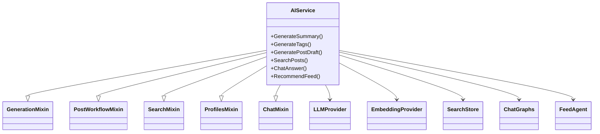

# AI service architecture

The gRPC handler is a composition root. It combines focused application mixins
for generation, draft workflow, search, user profiles, and chat over shared
provider interfaces.

The diagram represents the actual mixin/provider composition in
[`src/api/service.py`](../../src/api/service.py). It is a Python class diagram;
providers are abstractions so real services can be replaced by fakes in tests.

## Key boundaries

| Boundary | Responsibility |
| --- | --- |
| gRPC API | Parse RPC inputs and expose the protobuf contract |
| Application mixins | Validate, orchestrate, and map domain outcomes to RPC responses |
| LLM provider | Generate summaries, tags, content, and agent decisions |
| Embedding provider | Produce dense vectors when Qdrant is not embedding server-side |
| Search store | Index, retrieve, rank, relate, and profile content |
| Chat graphs/checkpointer | Run grounded chat and retain optional conversation state |

The complete protocol is [`proto/ai/ai_service.proto`](../../proto/ai/ai_service.proto).
