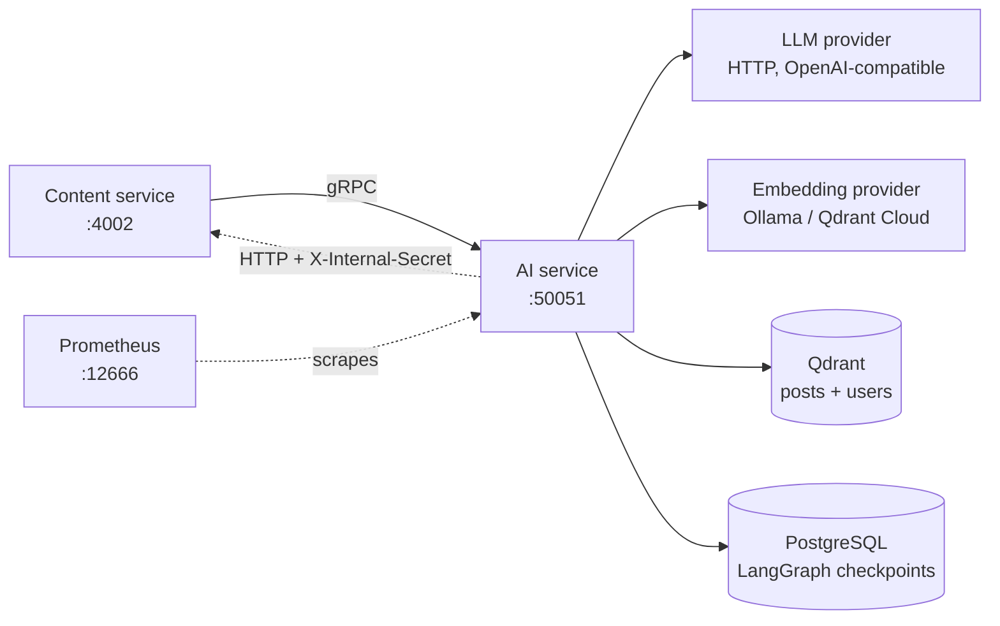
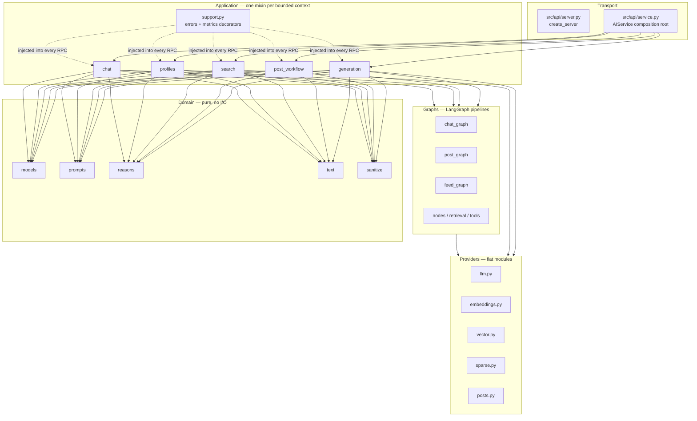
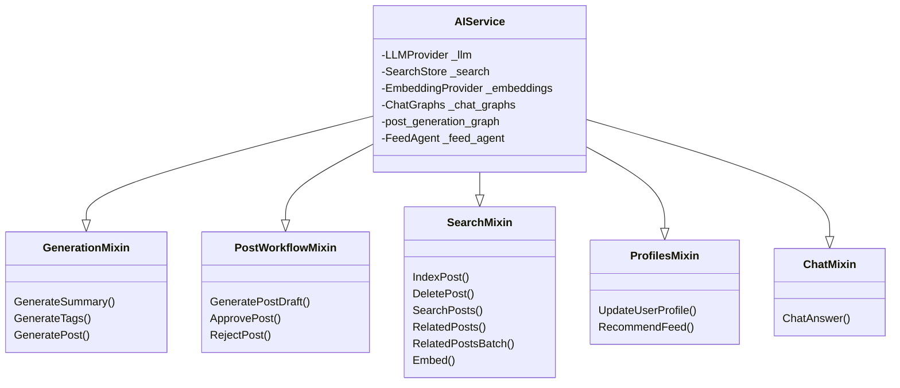
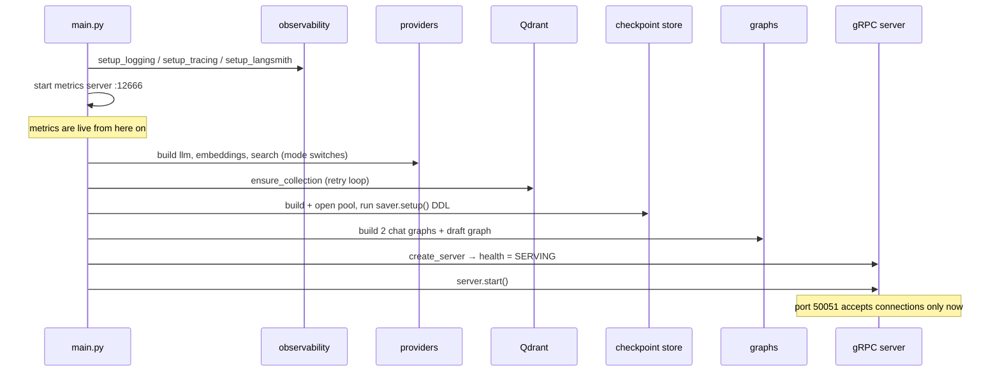
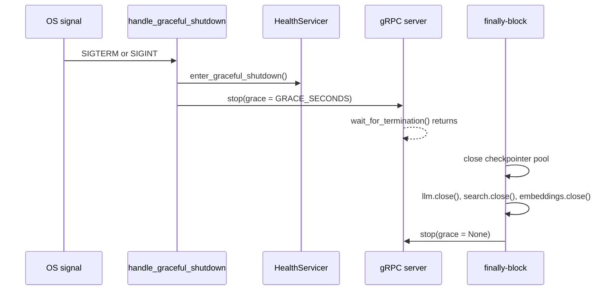

# AI service architecture

This document explains how the AI service is structured: which layer owns which
responsibility, how one `AIService` object ends up serving sixteen RPCs, and
exactly what happens between `python -m src.main` and a server that reports
`SERVING`.

If you are new, read [Overview](#overview) and
[How the code is organized](#how-the-code-is-organized) first, then use the rest
as a reference.

## Overview

The service is **one Python process** with two listeners:

| Listener | Serves |
| --- | --- |
| gRPC on `:50051` | 16 RPCs on `ai.AIService`, plus the standard gRPC health service |
| HTTP on `:12666` | `GET /metrics` for Prometheus |

It talks to four things:



**Why does it call content back?** The `get_post_body` chat tool needs a full
post body when an excerpt is too short. Rather than duplicate posts here, the
service fetches them from content's internal route
([`src/posts.py`](../../src/posts.py)). If `CONTENT_INTERNAL_TOKEN` is unset the
fetcher is never built and the tool returns a placeholder instead.

**Why two listeners?** gRPC and Prometheus are different protocols, and
separating them means a metrics scrape can succeed while the gRPC server is
still starting up — which it routinely does during the retry loops below.

## How the code is organized



| Directory | Responsibility | Rule |
| --- | --- | --- |
| [`src/api/`](../../src/api) | gRPC wiring: build the server, register health, compose the service | No business logic, no validation |
| [`src/application/`](../../src/application) | One mixin per bounded context; validation, orchestration, response mapping | Decorated with `rpc_metrics` / `rpc_stream_metrics` |
| [`src/domain/`](../../src/domain) | Dataclasses, prompts, HTML/JSON helpers, recommendation evidence | No I/O, no settings access except limits |
| [`src/graphs/`](../../src/graphs) | LangGraph state graphs: chat, draft review, feed agent | Nodes are async closures over their providers |
| `src/*.py` (flat) | Provider implementations and cross-cutting config | Swappable via the mode switches |
| [`src/observability/`](../../src/observability) | JSON logging, OTel tracing, Prometheus metrics, LangSmith | No business behaviour |
| [`src/generated/`](../../src/generated) | `protoc` output | Never edited; partly gitignored |

> The providers live as **flat modules**, not inside an `infrastructure/`
> package — unlike the content service. Match the layout you find rather than
> inventing a new one.

## The composition root

`AIService` ([`src/api/service.py`](../../src/api/service.py)) is a plain class
whose bases are five application mixins plus the generated servicer. Its
`__init__` only stores constructor state:

```python
class AIService(
    GenerationMixin, PostWorkflowMixin, SearchMixin,
    ProfilesMixin, ChatMixin, ai_service_pb2_grpc.AIServiceServicer,
):
    def __init__(self, llm, search, embeddings,
                 chat_graphs=None, post_generation_graph=None, feed_agent=None):
        self._llm = llm
        self._search = search
        ...
```



Method resolution order matters here: `ChatMixin.ChatAnswer` overrides the
`NotImplementedError` stub generated into `AIServiceServicer`, and every mixin
reads its dependencies off `self` — which is why the docstrings say *"State:
`self._llm` (provided by AIService)"*.

Validation, error mapping, and metrics live in
[`src/application/support.py`](../../src/application/support.py), not in the
mixins themselves — see [Error handling](../components/error-handling.md).

## Startup sequence

`serve()` ([`src/main.py`](../../src/main.py)) runs this, in order:



| Step | Code | Failure behaviour |
| --- | --- | --- |
| 1 | `setup_logging()` | Never fails |
| 2 | `setup_tracing()` | Disabled if `OTEL_EXPORTER_OTLP_ENDPOINT` is empty |
| 3 | `setup_langsmith()` | Disabled unless `LANGCHAIN_TRACING` |
| 4 | `start_http_server(METRICS_PORT)` | **Metrics are up before anything else** |
| 5 | `build_embeddings()` / `build_search()` | `RuntimeError` for `inference` + `fake` |
| 6 | `_ensure_search_ready()` | `ensure_collection()` × `QDRANT_STARTUP_RETRIES`, 5 s apart → raises |
| 7 | `_ensure_checkpointer_ready()` | Opens the pool, runs DDL, × `CHECKPOINT_STARTUP_RETRIES` → raises |
| 8 | `build_chat_graph()` ×2, `build_post_generation_graph()` | Pure compilation |
| 9 | `create_server()` | Registers health and sets `ai.AIService` = `SERVING` |
| 10 | `server.start()` → `wait_for_termination()` | Blocks until a signal |

Two consequences worth internalising:

- **The health service reports `SERVING` only after steps 6 and 7.** A slow
  or absent Qdrant or Postgres keeps the port closed, not merely unhealthy —
  so a connection refused during startup is expected, not a crash.
- **The metrics port opens at step 4**, roughly two minutes before gRPC. That
  is why "metrics answer, gRPC does not" is the normal startup signature —
  see [Reliability](../operations/reliability.md).

## Two chat graphs, one draft graph

`serve()` compiles the chat graph **twice**:

| Variant | Compiled with | Used when |
| --- | --- | --- |
| `ChatGraphs.sessioned` | the checkpointer | `thread_id` is non-empty — resumes prior turns |
| `ChatGraphs.stateless` | no checkpointer, and called with `config=None` | `thread_id` is empty — caller supplies `history` |

`graphs_for_request()` picks one per request. Two compilations exist because a
graph compiled *without* a checkpointer cannot be given a config, and a graph
compiled *with* one would silently persist stateless calls under an auto
thread id.

The draft graph shares the **sessioned** checkpointer — that is what lets an
approval survive a restart. Its threads are namespaced with the
`post-draft:` prefix so a review can never collide with a chat session.

See [Chat flow](chat-flow.md) and
[Generation and review](generation-and-review.md) for the graphs themselves.

## Shutdown



Health flips to `NOT_SERVING` **before** the grace period starts, so a
load balancer drains the instance while in-flight RPCs finish. `GRACE_SECONDS`
defaults to `5`.

> `PostFetcher`'s `httpx.AsyncClient` is **not** in that close list — it is
> built in `serve()` and never closed. The socket is released when the process
> exits, but a long-lived embedding of this code in a test harness would leak
> it. Documented as-is in [Reliability](../operations/reliability.md).

## Where each behaviour lives

| I want to change… | Read |
| --- | --- |
| An RPC's validation or response | [`src/application/`](../../src/application) + [RPC reference](../components/rpc-reference.md) |
| A prompt | [`src/domain/prompts.py`](../../src/domain/prompts.py) + [Data model](data-model.md) |
| Ranking, profiles, or fusion | [`src/vector.py`](../../src/vector.py) + [Retrieval](retrieval-and-recommendations.md) |
| The chat pipeline | [`src/graphs/`](../../src/graphs) + [Chat flow](chat-flow.md) |
| Retry or timeout behaviour | [`src/llm.py`](../../src/llm.py), [`src/embeddings.py`](../../src/embeddings.py) + [Providers](../components/providers.md) |
| A default value | [`src/config.py`](../../src/config.py) + [Configuration](../getting-started/configuration.md) |
| Startup order or health | [`src/main.py`](../../src/main.py) + [Reliability](../operations/reliability.md) |

## Next steps

- [Data model](data-model.md) — what is actually stored.
- [Request flows](request-flows.md) — how the content service drives all of this.
