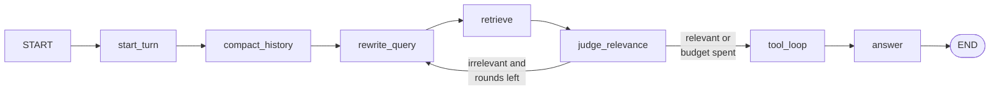
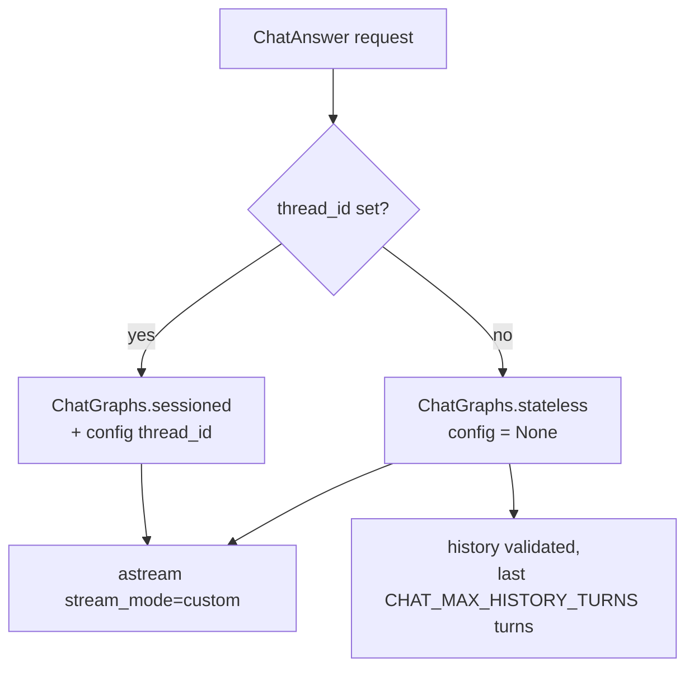
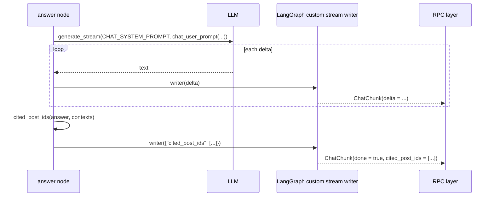

# Chat flow

`ChatAnswer` is the only server-streaming RPC in the API. It runs a LangGraph
pipeline that rewrites the question, retrieves grounding posts from two sources
in parallel, judges whether they are good enough, optionally lets the model
call tools, and then streams the answer back token by token.

Every claim in an answer is supposed to be traceable to a retrieved post —
that is the whole point of the graph.

## The graph at a glance



Seven nodes, one conditional edge. In code
([`src/graphs/chat_graph.py`](../../src/graphs/chat_graph.py)):

```python
builder.add_edge(START, "start_turn")
builder.add_edge("start_turn", "compact_history")
builder.add_edge("compact_history", "rewrite_query")
builder.add_edge("rewrite_query", "retrieve")
builder.add_edge("retrieve", "judge_relevance")
builder.add_conditional_edges(
    "judge_relevance", route_after_judge,
    {"rewrite_query": "rewrite_query", "answer": "tool_loop"},
)
builder.add_edge("tool_loop", "answer")
builder.add_edge("answer", END)
```

> The conditional edge's map says `"answer": "tool_loop"` — the *route name* is
> `"answer"`, the *node* it goes to is `tool_loop`. Easy to misread as a
> shortcut straight to the answer node.

## Request entry

[`src/application/chat.py`](../../src/application/chat.py) validates, then
chooses a graph:

| Check | Limit | Failure |
| --- | --- | --- |
| `query` empty after strip | — | `INVALID_ARGUMENT` |
| `query` too long | `SEARCH_MAX_QUERY_CHARS` (512) | `INVALID_ARGUMENT` |
| `top_k` above the cap | `CHAT_MAX_TOP_K` (10) | `INVALID_ARGUMENT` |
| history role not `user`/`assistant` | — | `INVALID_ARGUMENT` |
| history message too long | `MAX_INPUT_CHARS` (5000) | `INVALID_ARGUMENT` |

`top_k` of `0` is treated as "not supplied" and becomes `CHAT_TOP_K_DEFAULT`
(5).



**With a `thread_id`** the request's `history` field is ignored entirely — the
checkpoint already holds this session's turns, and `start_turn` appends to it.
**Without one**, the caller's history seeds the state and nothing is persisted.

This is why `serve()` compiles the graph twice: a graph built without a
checkpointer cannot be handed a config, and a stateless call against a
checkpointed graph would persist under an auto-generated thread id.

## Node by node

### `start_turn`

Appends the user's question to `messages` and writes
`RetrievedReplacement([])` into `retrieved`.

That second assignment is the important one: `merge_retrieved` replaces the
whole context when it sees the marker type, so **each turn starts with empty
grounding**. Without it, turn 2 would cite turn 1's posts.

### `compact_history`

Runs every turn but usually does nothing: it only acts once `len(messages) >
CHAT_MAX_HISTORY_TURNS` (6).

```text
messages = [...old, old, ... tail(6)]
folded   = everything before the tail
summary  = LLM(HISTORY_SUMMARY_PROMPT, prior_summary + folded turns)
messages = MessageReplacement([summary turn] + tail)
```

The `MessageReplacement` marker makes `merge_messages` **replace** rather than
append, which is how a rolling summary survives repeated compactions: the
previous summary is itself part of `folded`, so no information is lost across
rounds.

If the LLM fails or returns nothing, the node returns `{}` and history is kept
intact rather than truncated blind. No metric is recorded for a *failed*
compaction — only `CHAT_COMPACTS` for a successful one.

### `rewrite_query`

Turns the raw question into a standalone search query, using the last
`CHAT_MAX_HISTORY_TURNS` turns as context — this is what lets "what about its
pricing?" retrieve something useful.

On an `LLMError` **or** an empty rewrite it falls back to the original query
and increments `query_rewrites_total{outcome="kept_original"}`. Retrieval
therefore always has something to run on; a broken rewrite degrades quality,
never availability.

### `retrieve`

Fans out over two sources concurrently:

| Source | What it does | Weight |
| --- | --- | --- |
| `DenseSource` | Embeds the query (or passes raw text in `inference` mode), reads the top-k nearest posts | `CHAT_DENSE_SOURCE_WEIGHT` (1.0) |
| `HybridSource` | Runs full hybrid `search()`, then hydrates the ids into posts with `get_posts()` | `CHAT_HYBRID_SOURCE_WEIGHT` (0.8) |

Both are wrapped in `fan_out()`, which shares one `asyncio.Semaphore` of
`CHAT_RETRIEVAL_CONCURRENCY` (2) and gathers with `return_exceptions=True`.
**A failing source is logged and skipped**, so one flaky path degrades the turn
to the remaining sources. Only a *total* failure propagates — a turn with no
grounding attempt at all is not worth continuing.

Results fuse through `fuse_context()`:

```text
score(post) = Σ over sources  weight / (60 + rank)     # rank from 0
```

Weighted reciprocal-rank fusion, so consensus between sources outranks a single
hit, and a heavier source ranks its own hits higher. Posts are then filled
greedily by score into a `CHAT_MAX_CONTEXT_CHARS` (12000) character budget —
**the post that crosses the budget is truncated mid-body and the rest are
dropped**.

`retrieval_rounds` increments by one on every `retrieve` call.

### `judge_relevance`

Asks the LLM whether the excerpts answer the question, expecting
`{"relevant": bool, "score": float}`. The reply is matched with
`re.search(r"\{.*\}", raw, re.DOTALL)` before `json.loads`, so a model that
wraps its JSON in prose still parses.

**It fails open.** An `LLMError`, unparseable JSON, or missing keys all produce:

```python
RelevanceVerdict(relevant=True, reason="judge unavailable or unparseable; proceeding")
```

with `chat_judge_verdicts_total{verdict="unavailable"}`. The reasoning in the
code is that retrieval already applies a dense score threshold, and burning the
rewrite budget on an identical second opinion helps nobody.

### `route_after_judge`

```python
rounds = state.get("retrieval_rounds", 0)
if (judge is None or not judge.relevant) and rounds < CHAT_MAX_RETRIEVAL_ROUNDS:
    return "rewrite_query"
return "answer"        # routed to tool_loop
```

With `CHAT_MAX_RETRIEVAL_ROUNDS = 2`, the sequence is **at most two retrieval
rounds**: retrieve (rounds=1) → judge → maybe rewrite → retrieve (rounds=2) →
judge → exit regardless. The budget is spent either way; there is no
unbounded loop.

### `tool_loop`

Lets the model ask for more before the answer is written. The transcript lives
**only inside this node** — state keeps the executed `ToolCall` records (which
the answer prompt reads) but not the wire-format messages, so conversation
compaction never sees tool protocol noise.

| Tool | Backed by | Failure behaviour |
| --- | --- | --- |
| `search_posts(query, limit=3)` | `SearchStore.search` + `get_posts` | JSON error string |
| `related_posts(post_id, limit=3)` | `SearchStore.related` + `get_posts` | JSON error string |
| `get_post_body(post_id)` | `PostFetcher` → content's `/internal/posts/{id}` | Placeholder if no token configured |

The loop runs while the model keeps requesting tools, capped at
`CHAT_MAX_TOOL_CALLS` (6) executions. **A tool failure never fails the turn:**
unknown tool, bad arguments, and any raised exception are converted by
`format_tool_error()` into a `{"error": …}` string the model can read and react
to.

Bodies fed back to the model are truncated to `_RESULT_BODY_CHARS` (400) — the
model needs the gist, not the document.

### `answer`

Streams the response and does the citation bookkeeping:



Two kinds of payload travel the same `stream_mode="custom"` channel: plain
strings are deltas, the final dict carries the cited ids. The handler in
`ChatMixin` branches on `isinstance(payload, str)`.

After the stream, `ChatMixin` logs `chat completed` with
`completion_tokens_est` (characters ÷ 4 — `estimate_tokens()`), `cited_posts`,
and `thread_id`; then the stream metrics decorator logs `rpc completed` in its
`finally`. **Every chat therefore produces two log lines.**

## Citations

`cited_post_ids()` maps `[n]` markers in the answer back to post ids:

```python
_CITATION_RE = re.compile(r"\[(\d+)\]")
for match in _CITATION_RE.finditer(answer):
    index = int(match.group(1)) - 1
    if 0 <= index < len(posts):
        ...                      # first occurrence wins, order preserved
if not cited:
    cited = [post.post_id for post in posts]   # ← cite everything
```

Two consequences:

- **Markers outside the retrieved range are ignored** — a hallucinated `[9]`
  with only 3 excerpts contributes nothing.
- **An uncited answer cites *every* retrieved post.** This is deliberate: the
  client can still show the sources the answer was grounded in. It also means
  `cited_post_ids` being non-empty does **not** prove the model cited
  anything — check whether the answer actually contains `[n]`.

Note that `contexts` are the *fused, possibly truncated* excerpts, so the
numbering the model sees is the numbering the citations resolve against.

## State and reducers

`ChatState` ([`src/graphs/state.py`](../../src/graphs/state.py)) is one
`TypedDict`. The reducers decide what accumulates:

| Field | Reducer | Why |
| --- | --- | --- |
| `messages` | `merge_messages` | Append turns — unless marked `MessageReplacement` (compaction) |
| `retrieved` | `merge_retrieved` | Accumulate across rewrite rounds, deduped — unless marked `RetrievedReplacement` (turn start) |
| `tool_calls` | `operator.add` | Every executed call is kept |
| `answer` | `operator.add` | Deltas concatenate into the full text |
| `rewritten_query`, `judge`, `cited_post_ids` | last write wins | One value per turn |

The two marker-aware reducers are the mechanism behind both "a new turn forgets
yesterday's posts" and "compaction replaces history instead of appending to it".

## Limits

| Setting | Default | Effect |
| --- | --- | --- |
| `SEARCH_MAX_QUERY_CHARS` | 512 | Max question length |
| `CHAT_TOP_K_DEFAULT` / `CHAT_MAX_TOP_K` | 5 / 10 | Posts requested per source |
| `CHAT_MAX_HISTORY_TURNS` | 6 | Turns kept after compaction *and* sent to the LLM |
| `CHAT_MAX_CONTEXT_CHARS` | 12000 | Total grounding budget per turn |
| `CHAT_MAX_RETRIEVAL_ROUNDS` | 2 | Rewrite→retrieve→judge iterations |
| `CHAT_MAX_TOOL_CALLS` | 6 | Tool executions per turn |
| `CHAT_RETRIEVAL_CONCURRENCY` | 2 | Parallel source fetches |
| `CONTENT_INTERNAL_TOKEN` | `""` | Empty disables the `get_post_body` bridge |

## Metrics

| Metric | Labels | Meaning |
| --- | --- | --- |
| `query_rewrites_total` | `outcome=rewritten\|kept_original` | Rewrite node outcome |
| `chat_judge_verdicts_total` | `verdict=relevant\|irrelevant\|unavailable` | Judge outcome, including fail-open |
| `chat_compactions_total` | — | Successful history folds only |
| `retrieval_fetch_duration_seconds` | `source=dense\|hybrid` | Per-source latency |
| `retrieval_fetch_errors_total` | `source=dense\|hybrid` | Per-source failures |
| `grpc_active_requests` | — | Includes streaming calls for their whole duration |
| `llm_requests_total` | `status`, `model` | Every node's LLM call shares this counter |

There is **no per-node latency metric** — individual node timings are not
exported to Prometheus. Use OpenTelemetry traces (`@traceable` decorates every
node) or the `chat answered` log line's `completion_chars` instead.

## Common symptoms

| Symptom | Likely cause |
| --- | --- |
| Answer cites nothing useful | Fake embeddings only match identical text — index with real embeddings |
| `cited_post_ids` non-empty but no `[n]` in the text | The cite-everything fallback fired |
| Answer ignores earlier turns | No `thread_id` — the stateless graph has no memory |
| Turn answers yesterday's question | Should not happen; `start_turn` resets `retrieved` — check for a stale checkpoint |
| Chat never completes, retries pile up | `LLM_MODE=real` against a slow provider; see [Reliability](../operations/reliability.md) |

## Next steps

- [Retrieval and recommendations](retrieval-and-recommendations.md) — the
  sources this graph fuses.
- [Request flows](request-flows.md) — how the content service drives a chat.
- [Health and observability](../operations/health-and-observability.md) — the
  metrics above in context.
