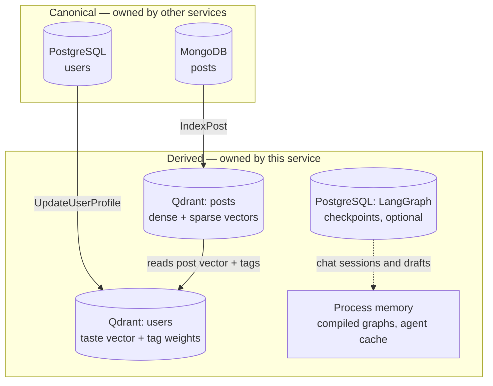
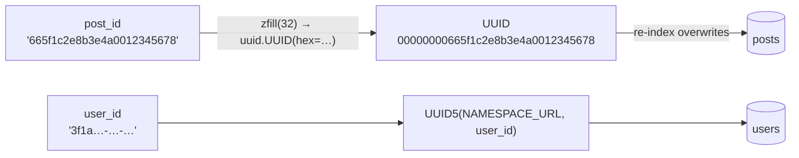

# Data model

The AI service stores **no canonical data**. Posts live in MongoDB, accounts in
PostgreSQL — this service only keeps the derived structures it needs to rank,
retrieve, and ground: two Qdrant collections, an optional Postgres-backed
checkpoint store, and the in-memory graph state that ties them together.

## What is stored where



Deleting a post therefore takes **two** coordinated writes: content removes it
from MongoDB, and the search worker calls `DeletePost` to remove the Qdrant
point. Until the second one lands, search can still return a stale id — the
content service drops those during hydration.

## Qdrant collections

Both collections are created together by `ensure_collection()`
([`src/vector.py`](../../src/vector.py)) and share one vector configuration:

```text
vectors:       dense  → COSINE, size = QDRANT_VECTOR_SIZE (1024)
sparse_vectors: sparse → modifier = IDF   (Qdrant applies IDF itself)
```

Existing collections are left untouched — a pre-existing `posts` collection
keeps its data and configuration, so changing `QDRANT_VECTOR_SIZE` against a
live collection does **not** migrate it.

### The `posts` collection

| Field | Type | Notes |
| --- | --- | --- |
| `id` | UUID | Deterministic mapping of the post id — see below |
| `dense` | vector(1024) | `title + body + summary`, cleaned and capped at `EMBEDDING_MAX_CHARS` |
| `sparse` | sparse | BM25-style term frequencies plus prefix tokens |
| `title` | payload | As supplied by content |
| `body` | payload | `clean_html(body)[:EMBEDDING_MAX_CHARS]` — HTML stripped, then truncated |
| `summary` | payload | |
| `tags` | payload | Array of strings |
| `created_at` | payload | `"%Y-%m-%dT%H:%M:%SZ"`; a **payload index** on this field is created at setup |

The payload body is what makes chat possible without a network hop: retrieval
reads excerpts straight out of Qdrant. Only the `get_post_body` tool goes back
to content, and only when an excerpt is cut short.

The `created_at` payload index exists because the surprise feed's fallback
orders by recency, and Qdrant only permits `order_by` on an indexed field.

### Point ids

Qdrant accepts only unsigned integers or UUIDs, but post ids are MongoDB
ObjectIDs (24 hex characters) and user ids are PostgreSQL UUIDs (36, dashed).
Two different mappings handle them:



- **`_point_id(post_id)`** pads the ObjectID to 32 characters and parses it as
  a UUID. The mapping is stable, so re-indexing a post **overwrites** its
  point instead of creating a duplicate. It also reverses cleanly:
  `_post_id_from_point()` strips the leading `00000000` pad.
- **`_user_point_id(user_id)`** uses UUID5 under `NAMESPACE_URL`, because
  dashed PostgreSQL UUIDs are longer than the pad trick accepts and could
  collide.

> **`_point_id` assumes a hex post id.** Content's ObjectIDs satisfy this. A
> post id containing other characters raises `ValueError` inside `upsert`,
> which the metrics decorator reports as gRPC `INTERNAL`. See
> [Error handling](../components/error-handling.md).

### Sparse vectors

[`src/sparse.py`](../../src/sparse.py) builds `{token: term_frequency}` maps:

1. Lower-case, split on `[a-z0-9]+`, drop tokens shorter than
   `SPARSE_MIN_TOKEN_LENGTH`.
2. Snowball-stem each token (English).
3. Add **prefix tokens** from length 3 up to the token's own length — this is
   the typo-tolerance trick: a query token that diverges from the stored token
   still shares its prefixes.
4. Stop once `SPARSE_MAX_TOKENS` (512) entries are accumulated.

Qdrant hashes each token to a `uint32` index with blake2b
(`_token_id`), sorts by token so indices are stable, and applies collection-level
IDF on top.

### The `users` collection

One point per user:

| Field | Type | Notes |
| --- | --- | --- |
| `id` | UUID5 | Namespaced from the user id |
| `dense` | vector(1024) | The **taste vector** — a renormalised running average |
| `sparse` | sparse | `tag_weights`, so profiles are searchable by interest tag |
| `total_weight` | payload | Denominator of the running average |
| `tag_weights` | payload | `{tag: accumulated weight}` |
| `seen_post_ids` | payload | Latest interactions, deduplicated, capped |
| `updated_at` | payload | ISO timestamp of the last fold |

#### How one interaction folds in

`_fold_profile()` ([`src/vector.py`](../../src/vector.py)) applies a single
interaction with weight `w`:

```text
dense      = normalise( (prev_dense * total + post_dense * w) / (total + w) )
tag[t]     = min(tag[t] + w, PROFILE_TAG_WEIGHT_CAP)          # 10.0
seen       = (seen − post_id) + post_id, last PROFILE_SEEN_POSTS_CAP  # 200
total      = total + w
```

Details that matter:

- **No embedding call.** The interacted post's existing dense vector is read
  straight out of the `posts` collection, so folding is two point reads and one
  write.
- **An unindexed post is a no-op.** If the post is not in Qdrant yet, the
  update is logged at `DEBUG` and dropped — interactions racing the index
  worker never block event processing.
- **Tag map eviction.** At `PROFILE_MAX_TAGS` (64) the *weakest* tag is
  removed to make room, so a profile converges on its dominant interests.
- **Dense vectors are renormalised** after every fold so cosine similarity stays
  comparable across profiles.

Weights come from `PROFILE_VIEW_WEIGHT` / `LIKE` / `SAVE` (1 / 3 / 5), applied
in `ProfilesMixin.UpdateUserProfile`. Interactions attributed to a `SURPRISE`
feed are additionally multiplied by `PROFILE_SURPRISE_FEEDBACK_MULTIPLIER`
(0.5) — they started from anti-taste suggestions, so they count for less.

## LangGraph state

Three `TypedDict` schemas carry graph state. All of them are checkpointed.

### `ChatState` — one chat turn

| Field | Reducer | Meaning |
| --- | --- | --- |
| `query`, `thread_id`, `top_k` | last write wins | Request inputs |
| `retrieval_rounds` | last write wins | Loop counter for the judge budget |
| `messages` | `merge_messages` | Conversation; accumulates across turns |
| `rewritten_query` | last write wins | Searchable form; last rewrite wins |
| `retrieved` | `merge_retrieved` | Grounding context; deduped by post id |
| `judge` | last write wins | The relevance verdict |
| `tool_calls` | `operator.add` | Executed tool invocations |
| `answer` | `operator.add` | Streamed deltas concatenate |
| `cited_post_ids` | last write wins | Computed once, at the end |

Two reducers are **marker-aware**, which is the subtle part:

```python
class MessageReplacement(list): ...   # compaction: replace, don't append
class RetrievedReplacement(list): ... # turn start: reset, don't accumulate
```

`merge_messages` swaps the whole conversation when it sees a
`MessageReplacement`, otherwise appends. `merge_retrieved` swaps on
`RetrievedReplacement` (written by `start_turn` so a new question never cites
stale posts) and otherwise appends while deduplicating by post id — which is
what lets the rewrite loop accumulate evidence across rounds.

The custom dataclasses stored in these channels (`ChatMessage`,
`RelevanceVerdict`, `RetrievedPost`, `ToolCall`) must be explicitly allowed in
the serializer:

```python
_SERDE = JsonPlusSerializer(allowed_msgpack_modules={ChatMessage, RelevanceVerdict,
                                                     RetrievedPost, ToolCall})
```

Anything missing would be silently degraded to a raw `dict` when a checkpoint
reloads — see [`src/graphs/checkpointer.py`](../../src/graphs/checkpointer.py).

### `PostWorkflowState` — one draft review

| Field | Meaning |
| --- | --- |
| `prompt` | The original request |
| `title`, `body`, `summary`, `tags` | Generated payload |
| `decision` | `approved` / `rejected`, recorded on resume |
| `status` | `pending` → `approved` or `rejected` |
| `reason` | Optional note from `RejectPost` |

Only plain strings and lists — deliberately, so checkpoints round-trip through
the shared serializer with no extra registrations.

Thread ids are namespaced: `post-draft:{approval_id}`.

### `FeedState` — one agent decision

`user_id` → `summary` → `preset`. Tiny and stateless: the graph runs
`fetch_profile` then `decide_preset`, and the result is cached in a plain
process dict, not a checkpoint.

## Checkpoints (Postgres)

Empty `CHECKPOINT_DB_URL` means `InMemorySaver` — no database, no durability.
With a URL set, `AsyncPostgresSaver` persists every chat turn and every draft
workflow, which is what makes these two behaviours possible:

- A chat with a `thread_id` resumes after a service restart.
- A draft paused at its `review` interrupt survives a restart, so an approver
  can still approve it.

The two-URL setup (`CHECKPOINT_DB_URL` for runtime, `CHECKPOINT_DB_URL_MIGRATE`
for DDL) exists because `CREATE INDEX CONCURRENTLY` cannot run through a
pooler. See [Configuration](../getting-started/configuration.md).

## Prompts

All prompts live in [`src/domain/prompts.py`](../../src/domain/prompts.py) as
module constants, with small builder functions for the user-turn part.

| Prompt | Used by | Output contract |
| --- | --- | --- |
| `SUMMARY_PROMPT` | `GenerateSummary` | Exactly 3 sentences, plain text |
| `TAGS_PROMPT` | `GenerateTags` | A raw JSON array of 5–7 strings |
| `POST_PROMPT` | `GeneratePost`, `generate_draft` | JSON object with `title`, `body`, `summary`, `tags` |
| `CHAT_SYSTEM_PROMPT` | `answer` node | Prose with `[n]` citations |
| `REWRITE_QUERY_PROMPT` | `rewrite_query` node | Bare rewritten query |
| `JUDGE_RELEVANCE_PROMPT` | `judge_relevance` node | `{"relevant": bool, "score": float}` |
| `HISTORY_SUMMARY_PROMPT` | `compact_history` node | Bare summary paragraph |
| `FEED_AGENT_PROMPT` | `decide_preset` node | One word: `balanced`, `fresh`, or `explorer` |

Three of them return JSON that the service parses defensively: markdown fences
are stripped by `extract_json()`, and a reply that still does not parse becomes
an exception — see [Error handling](../components/error-handling.md).

`POST_PROMPT` output is additionally passed through `sanitize_post_html()`, an
allowlist clean with `bleach` over a fixed tag set (`h1`–`h6`, `p`, `ul`, `li`,
`a`, `code`, `pre`, …) permitting only `http`/`https`/`mailto` on links.

## Prompt-specific limits

Some limits are baked into prompts rather than enforced by validation — the
prompt says "3 sentences", "5–7 keywords", "exactly these keys". Those are
model instructions, not guarantees. Parsing assumes they held; when they did
not, you get an `INTERNAL` rather than a retry.

## Next steps

- [Retrieval and recommendations](retrieval-and-recommendations.md) — how these
  structures are queried.
- [Chat flow](chat-flow.md) — how `ChatState` moves through the graph.
- [Architecture](architecture.md) — where each of these is built.
