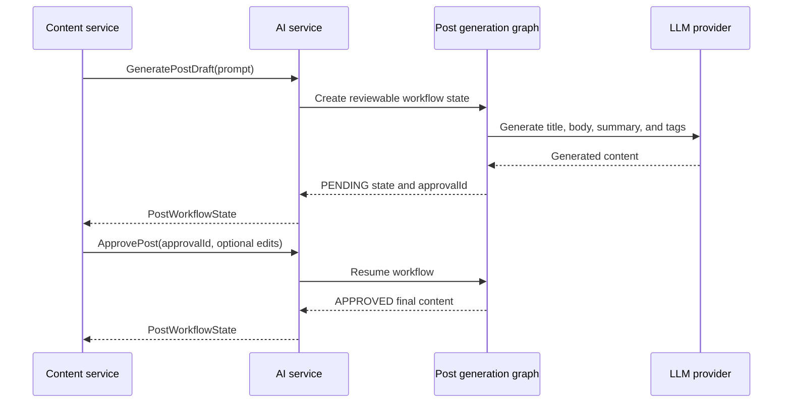

# Generation and review workflow

Generation can return a complete post immediately or pause an AI-generated
draft for human review. The latter uses an approval ID that the content service
stores with its `PostDraft` record.

A rejection marks the workflow `REJECTED`; it remains resumable. The content
service owns peer-review rules and canonical post persistence, while the AI
service owns the generated draft workflow.
