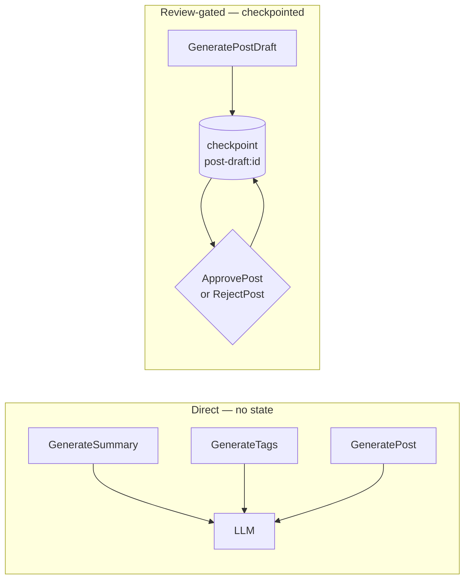
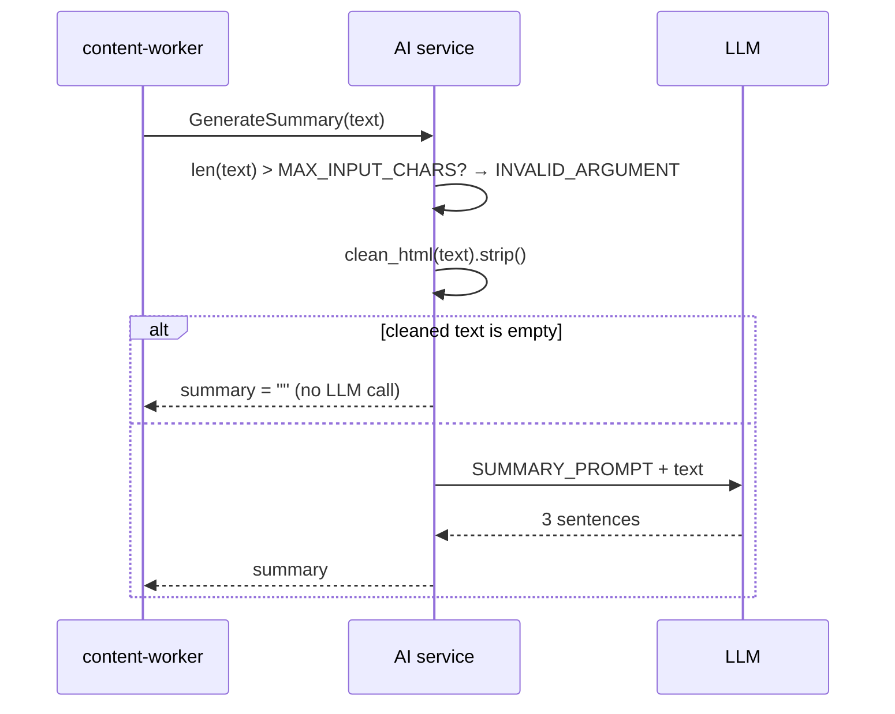
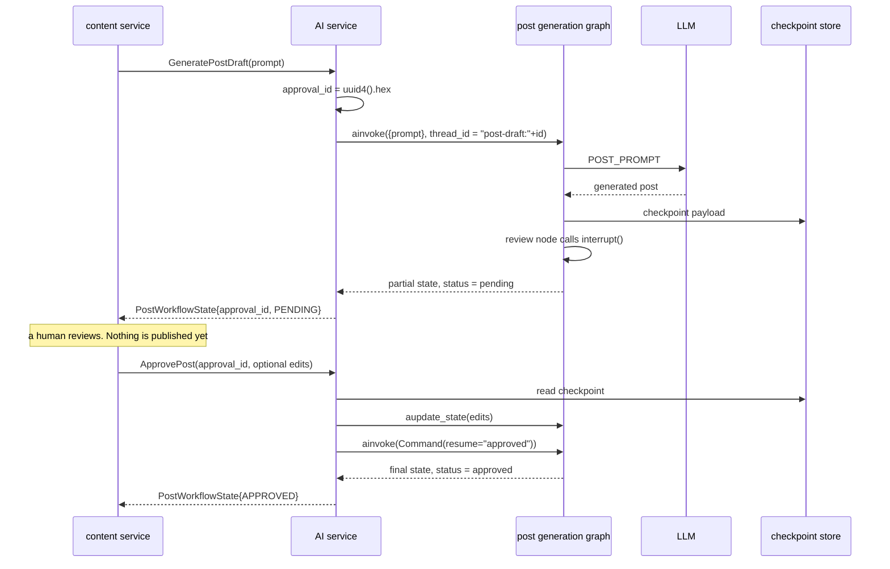
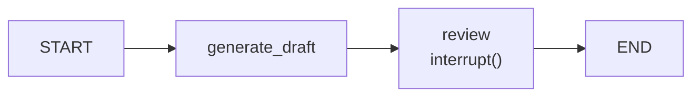
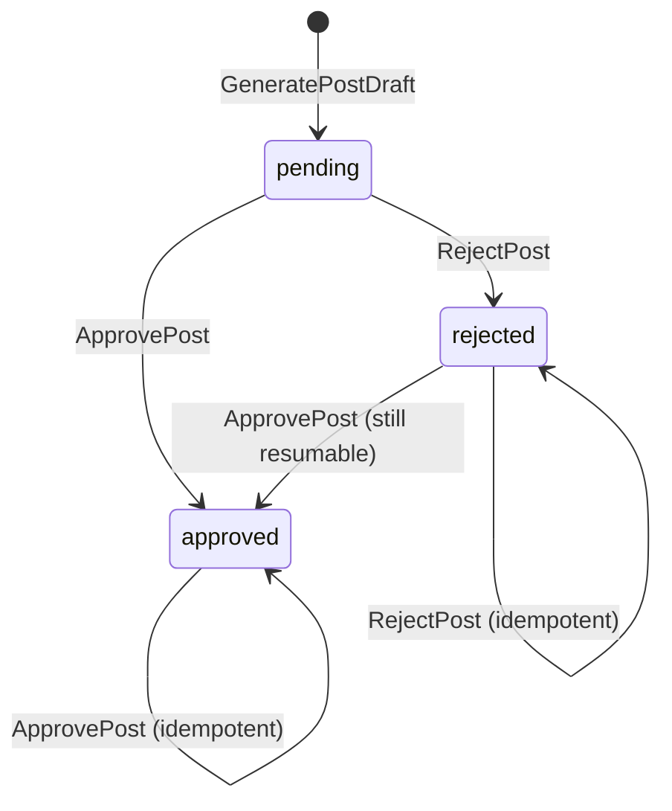

# Generation and review

Generation comes in two shapes: a **direct** call that returns content
immediately, and a **review-gated** workflow that pauses at a human approval
step before anything is considered final.

Both produce the same payload — `title`, `body`, `summary`, `tags` — built from
one prompt and validated the same way. What differs is where the state lives.



## Direct generation

All three handlers live in [`src/application/generation.py`](../../src/application/generation.py)
and follow the same three steps: validate the input size, ask the LLM, parse
the reply into a proto response.

### `GenerateSummary`



Two behaviours worth knowing:

- **HTML is stripped before prompting**, using `clean_html()`, which drops
  `script`, `style`, `iframe`, and `noscript` content along with all markup.
- **An empty or markup-only body returns `""` without an LLM call.** A post
  whose entire body is an `` therefore yields an empty summary, not an
  error — the metrics show no `llm_requests_total` increment for it.

### `GenerateTags`

The prompt gets `Title: {title[:200]}` and `Body: {clean_html(body)[:3000]}` —
both **truncated**, while the *size check* is against the raw body at
`MAX_INPUT_CHARS` (5000). So a body between 3000 and 5000 characters passes
validation but is silently shortened before the model sees it.

The reply must parse as JSON:

```python
raw = await self._llm.generate_completion(TAGS_PROMPT, content)
parsed = json.loads(extract_json(raw))          # markdown fences stripped first
tags = parsed.get("tags") if isinstance(parsed, dict) else parsed
if not isinstance(tags, list):
    raise TypeError("LLM response tags are not a list")
return TagsResponse(tags=[t for t in tags if isinstance(t, str)])
```

A non-list reply raises a bare `TypeError`, which is not one of the mapped
exception types — so it surfaces as gRPC `INTERNAL`. The `TypeError` and the
`ValidationError` imported from `support` are unrelated classes; see
[Error handling](../components/error-handling.md).

Non-string entries are dropped rather than rejected, so a model that returns
`["ok", 3, null]` still succeeds with `["ok"]`.

### `GeneratePost`

```text
len(prompt) > MAX_POST_CHARS (5000)?        → INVALID_ARGUMENT
len(keywords) > MAX_KEYWORDS_CHARS (500)?   → INVALID_ARGUMENT
len(key_points) > MAX_KEY_POINTS_CHARS (2000)? → INVALID_ARGUMENT
brief fields set? styled_post_user_prompt   : post_user_prompt(prompt) → LLM
extract_json(raw)                           → GeneratedPost.model_validate_json(...)
sanitize_post_html(post.body)               → bleach allowlist clean
verify_post(...) vs length spec             → repair prompt → LLM (≤ 3 attempts)
```

`GeneratedPost` is a pydantic model requiring all four fields, so a reply
missing `title`, `summary`, or `tags` raises pydantic's own `ValidationError` —
again an unmapped exception, again `INTERNAL`.

When the caller sends a writing brief (audience, tone, length, structure,
keywords, key points), the user prompt is built by
`styled_post_user_prompt`: the brief steers the outline and voice, keywords
guide titles and tags, and key points shape the middle sections. With no
brief the legacy `post_user_prompt` runs unchanged.

After parsing, every draft goes through structural verification against
the length spec (`QUICK` wants 2 `<h2>` sections, `STANDARD` 3–4,
`DEEP_DIVE` 5–6; no markdown fences, no page-structure tags). A failing
draft is re-asked with a repair prompt naming the issues, up to
`MAX_POST_ATTEMPTS = 3` LLM calls in total. Cosmetic gaps — an empty
title or summary, or a tag count outside 5–7 — are logged, never
repaired. If nothing parses on any attempt the last error raises;
otherwise the best-effort draft is returned. Each run is timed in
`POST_GENERATION_DURATION` and counted as `first-pass`, `repaired`, or
`best-effort` in `POST_GENERATION_VERIFICATIONS`.

Unlike the other two, `GeneratePost` does **not** reject an empty prompt.

> The body is sanitised **after** generation, not before. `sanitize_post_html`
> runs `bleach.clean` over a fixed allowlist (`h1`–`h6`, `p`, `ul`, `ol`, `li`,
> `a`, `code`, `pre`, `blockquote`, `strong`, `em`, …) permitting only
> `http`/`https`/`mailto` hrefs. A model that emits `<script>` loses the tag
> (`strip=True`) but keeps its text content.

## The review-gated workflow



The graph itself
([`src/graphs/post_graph.py`](../../src/graphs/post_graph.py)) is three lines:



`generate_draft` runs exactly once and stores its output in the checkpoint.
`review` then calls `interrupt("awaiting approval decision")`, which raises a
graph interrupt — LangGraph stops, saves state, and returns the partial values
to the caller. Nothing downstream runs until a resume arrives.

**Why this shape rather than a status field?** Because the pause *is* a
checkpoint:

- The workflow **survives a restart** — an approver can come back tomorrow.
- `generate_draft` is **never re-executed against a stale payload**; the LLM
  is called once per `approval_id`, no matter how long approval takes.
- The thread id is namespaced `post-draft:{approval_id}`, so drafts can never
  collide with chat sessions even though they share one checkpointer.

## Status transitions



Proto values: `WORKFLOW_STATUS_PENDING = 1`, `APPROVED = 2`, `REJECTED = 3`.

### `ApprovePost`

Guards, in order:

| Check | Result |
| --- | --- |
| graph not configured | `RuntimeError` → `INTERNAL` |
| `approval_id` empty | `INVALID_ARGUMENT`: *approval_id must be a non-empty string* |
| checkpoint has no `title` | `NOT_FOUND`: *unknown approval_id: …* |
| already `approved` | Returns the stored payload — **no re-run** |
| otherwise | Apply edits, resume with `"approved"` |

Optional edits are applied with `aupdate_state()` **before** the resume, so the
reviewer's changes land in the payload the `review` node writes back:

```python
edits = draft_edits_patch(
    title=request.title if request.HasField("title") else None,
    body=request.body if request.HasField("body") else None,
    summary=request.summary if request.HasField("summary") else None,
    tags=list(request.tags) or None,     # ← empty list means "no change"
)
```

> **You cannot clear tags.** `draft_edits_patch` only includes `tags` when the
> list is truthy, so sending an empty `tags` is indistinguishable from omitting
> it. This mirrors `updatePost` in the content service — the same
> append-only-skip pattern on both sides of the boundary.

### `RejectPost`

Rejection is deliberately **not** a terminal state. It is a pure state update:

```python
updates = {"status": STATUS_REJECTED}
if request.reason.strip():
    updates["reason"] = request.reason
await self._post_generation_graph.aupdate_state(config, updates)
```

No resume happens, so the thread **stays paused at the `review` interrupt**. A
reviewer can reject, change their mind, and approve later — which is why the
state diagram above has a `rejected → approved` edge. An empty `reason` is
dropped rather than stored as `""`.

Repeating either call is safe: both short-circuit on the current status and
return the stored payload without touching the graph.

## Metrics and logs

| Metric | Labels | Incremented when |
| --- | --- | --- |
| `POST_WORKFLOW_TRANSITIONS` | `transition=drafted\|approved\|rejected` | After each successful RPC |
| `GRPC_REQUESTS` / `_DURATION` | `method`, `status` | Every call, via `rpc_metrics` |

There is no metric for an *idle* workflow — a draft created and never reviewed
is invisible in Prometheus and only findable in the checkpoint store.

## Who calls what

| Content-side caller | RPC |
| --- | --- |
| `content-worker` (Kafka `posts`) | `GenerateSummary` |
| `PostService.GenerateTags` (GraphQL mutation) | `GenerateTags` |
| `PostService.GeneratePost` (GraphQL mutation) | `GeneratePost` |
| `PostDraftService` (create draft) | `GeneratePostDraft` |
| `PostDraftService` (approve) | `ApprovePost` |
| `PostDraftService` (reject) | `RejectPost` |

Traced end to end in [Request flows](request-flows.md).

## Failure modes

| Symptom | Cause | What the caller sees |
| --- | --- | --- |
| `Input exceeds the maximum length of 5000 characters` | `TooLargeError` | `INVALID_ARGUMENT` |
| `unknown approval_id: …` | Wrong id, or the checkpoint store was wiped | `NOT_FOUND` |
| `Internal service error` | Unparseable LLM reply (tags not a list, post JSON invalid) | `INTERNAL` |
| `LLM provider unavailable` | Provider down or `LLM_MODE=real` with no key | `UNAVAILABLE` |
| Draft stuck at `pending` forever | Nobody resumed the interrupt | Nothing — check checkpoints |

Because the third row is a *parse* failure rather than a provider failure, it
is **not retried**: the LLM call itself succeeded, so tenacity never fired.
See [Reliability](../operations/reliability.md).

## Next steps

- [Data model](data-model.md) — `PostWorkflowState` and the checkpoint schema.
- [Error handling](../components/error-handling.md) — the full exception map.
- [Request flows](request-flows.md) — the content-side workflow around this.
