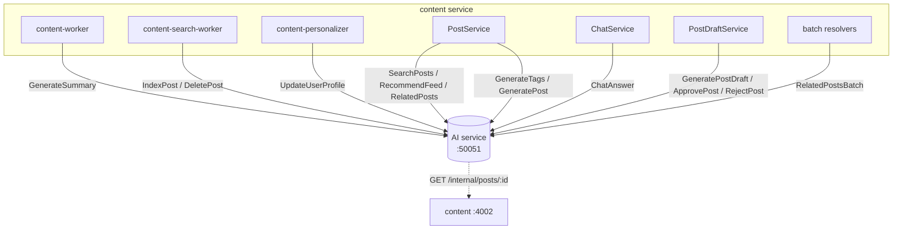
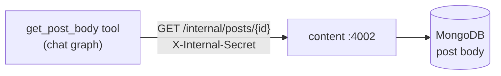
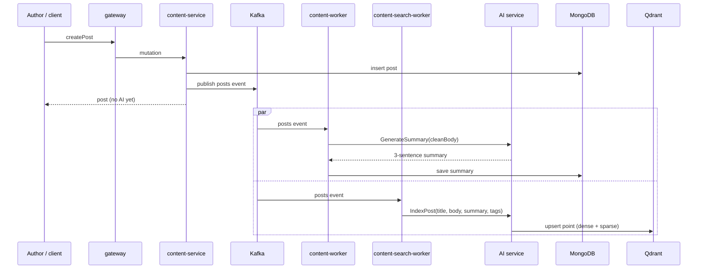
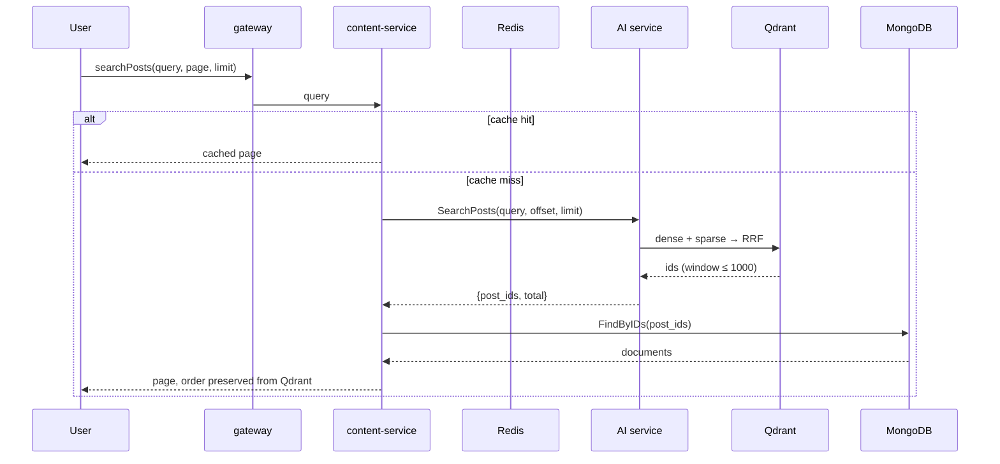
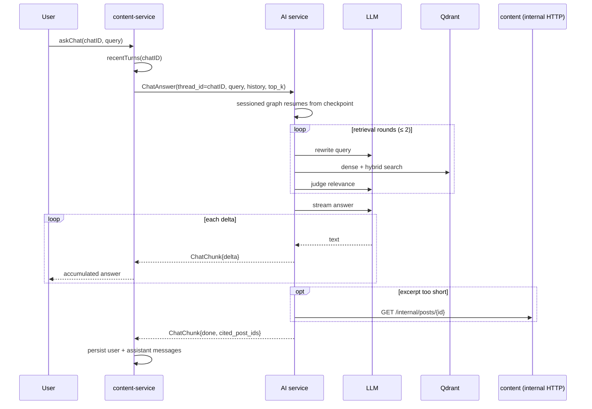
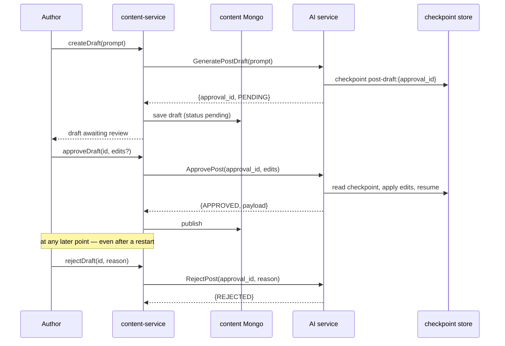
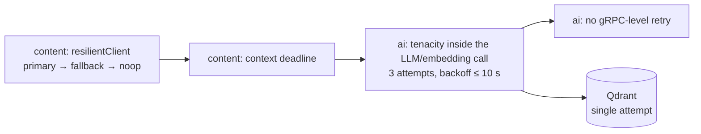

# Request flows

The browser never talks to this service. Everything it does arrives through
the content service, over gRPC — and the content service is the **only**
caller.

This page maps each of the sixteen RPCs to the code path that triggers it, and
traces the four flows you are most likely to debug.

## The caller map



### Every RPC, and who calls it

| RPC | Content-side caller | Trigger |
| --- | --- | --- |
| `GenerateSummary` | `content-worker` → `worker.go` | Kafka `posts` event (new post) |
| `GenerateTags` | `PostService.GenerateTags` | GraphQL `generateTags` mutation |
| `GeneratePost` | `PostService.GeneratePostContent` | GraphQL `generatePostContent` mutation |
| `GeneratePostDraft` | `PostDraftService.CreateDraft` | GraphQL create-draft mutation |
| `ApprovePost` | `PostDraftService.ApproveDraft` | GraphQL approve mutation |
| `RejectPost` | `PostDraftService.RejectDraft` | GraphQL reject mutation |
| `IndexPost` | `content-search-worker` → `search_worker.go` | Kafka `posts` event |
| `DeletePost` | `content-search-worker` → `search_worker.go` | Kafka `posts` delete event |
| `SearchPosts` | `PostService.SearchPosts` | GraphQL `searchPosts` query |
| `RelatedPosts` | `PostService.RelatedPosts` | Post page, non-batched |
| `RelatedPostsBatch` | `PostService.RelatedPostsBatch` via `batchRegistry.relatedBatcher` | Post page with the batching middleware — **one gRPC call for every related-posts field in the request** |
| `RecommendFeed` | `PostService.RecommendedPosts` | GraphQL `recommendedPosts` query |
| `ChatAnswer` | `ChatService.AskChat` | GraphQL `askChat` mutation |
| `Embed` | — | **No caller anywhere in the repository** |
| `DeleteUserProfile` | Go client exists in `infrastructure/ai/client.go` | **No caller — and never implemented on the Python side** |

Two observations worth keeping in mind:

- **Fourteen of sixteen RPCs are on a live path.** `Embed` is implemented but
  unreachable; `DeleteUserProfile` is reachable from Go but always returns
  `UNIMPLEMENTED` because no mixin implements it.
- **Batching changes the call shape, not the API.** With
  `WithBatching` installed, N related-posts fields in one GraphQL request cost
  one `RelatedPostsBatch` call instead of N `RelatedPosts` calls.

### The reverse direction



The chat graph's `get_post_body` tool is the **only** place this service calls
back into content ([`src/posts.py`](../../src/posts.py)). It fires when an
excerpt read out of Qdrant is cut short of `CHAT_MAX_CONTEXT_CHARS`. With
`CONTENT_INTERNAL_TOKEN` empty the fetcher is never constructed and the tool
returns a placeholder string instead — see
[Providers](../components/providers.md).

## Flow 1 — publishing a post



**Nothing blocks the author.** `createPost` returns as soon as MongoDB
answers; the summary and the index land seconds later. That is why:

- A post is **searchable but has no summary** for a few seconds.
- A post can be **searchable but absent from its own related-posts results**
  until the index worker finishes.
- AI downtime **never prevents publishing** — the events are queued and the
  workers retry.

`IndexPost` truncates the body to `EMBEDDING_MAX_CHARS` (8000) rather than
rejecting a long post, so a 1 MiB article still indexes its head.

## Flow 2 — search and the feed



Three details that usually surprise people:

1. **Hydration loses nothing.** Content re-queries Mongo by id but explicitly
   preserves the Qdrant ordering — the rank the AI service computed is the
   order the reader sees.
2. **Offset arithmetic happens in content.** `(page-1)*limit` is computed
   there, so the AI service only ever sees a flat `offset`.
3. **The feed has a recency fallback.** If `RecommendFeed` errors *or* returns
   zero ids, `PostService.RecommendedPosts` logs, increments its own
   `recommend_feed_cold_start_total`, and serves
   `postRepo.FindAllExceptAuthor(...)`. **A broken feed degrades to newest
   first; a broken search does not** — `SearchPosts` failures surface as a
   GraphQL error.

Content also caches both queries briefly and invalidates on post writes, so a
single AI call can back many page views.

## Flow 3 — a chat turn



### The redundant history fetch

Content always sends `thread_id = chatID`, and the AI service branches on that
first:

```python
if request.thread_id:
    graph, config = graphs_for_request(self._chat_graphs, request.thread_id)
else:
    # ... validate and use request.history
    inputs["messages"] = history[-CHAT_MAX_HISTORY_TURNS:]
```

So on the normal path **`history` is populated by `recentTurns()` and then
ignored entirely** — the checkpoint is the source of truth for the session.
The field is only consulted for stateless callers, which today there are none
in-repo. The `recentTurns()` call is not wasted work for the message
persistence around it, but it is not feeding the model either.

This also means chat history and AI sessions are **the same key**: if content
and the AI service ever disagree about `chatID` (for example a checkpoint store
wiped while chats remain), the AI side silently starts a new session rather
than resuming.

### `chunk.error` is a dead field

Content's client checks it:

```go
if chunk.Error != "" {
    return nil, errors.New(chunk.Error)
}
```

The Python side never sets `ChatChunk.error` — failures are raised as gRPC
status errors on the stream instead. The check is harmless but unreachable, so
**do not add error detail to that field expecting content to read it**; use a
gRPC status. See [Error handling](../components/error-handling.md).

## Flow 4 — the human-in-the-loop draft



The pause lives in the AI service, not in content's Mongo record. Consequences:

- **Content can restart freely** — the approval id is opaque and the state is
  durable in the checkpoint store.
- **The AI service restarting is also survivable**, *provided*
  `CHECKPOINT_DB_URL` is set. With the default in-memory saver, a restart
  loses every pending approval and content starts receiving
  `NOT_FOUND: unknown approval_id: …`.
- **Rejecting does not close the door.** The thread stays paused, so a later
  approve still works.

Full detail in [Generation and review](generation-and-review.md).

## Failure propagation

| Content call | AI fails / is down | What the reader sees |
| --- | --- | --- |
| `SearchPosts` | Propagates | GraphQL error — **search breaks** |
| `RecommendFeed` | Propagates, then caught | Recency fallback — feed still works |
| `RelatedPosts` | Propagates | GraphQL error on that field |
| `GenerateSummary`, `GenerateTags`, `GeneratePost` | Propagates | Mutation error; no summary saved |
| `GeneratePostDraft`, `ApprovePost`, `RejectPost` | Propagates | Mutation error; draft stays pending |
| `ChatAnswer` | Propagates | `askChat` fails |
| `IndexPost`, `DeletePost` | Propagates to the worker | Event dead-letters; post not searchable |
| `UpdateUserProfile` | Propagates to the worker | Event dead-letters; profile not updated |

Read the asymmetry: **the feed degrades, search does not.** That is a deliberate
content-side choice (it keeps the home page alive) with an operational
consequence — a green feed tells you nothing about whether search works.

To tell the two apart from this service's metrics, watch
`grpc_requests_total{status}` per method rather than the recommender counters,
which only ever record `status="OK"` (see
[Health and observability](../operations/health-and-observability.md)).

## Retry ownership



| Layer | Retries | Gives up when |
| --- | --- | --- |
| Content `resilientClient` | Tries primary then fallback (the no-op client) | Both endpoints fail |
| Content call site | One context deadline | `chatTimeout` etc. elapse |
| AI LLM/embedding | 3 attempts, exponential backoff capped at 10 s, honours `Retry-After` ≤ 30 s | Third attempt fails |
| AI → Qdrant at startup | `QDRANT_STARTUP_RETRIES` × 5 s | Budget exhausted → process exits |
| AI → Qdrant at runtime | None | First failure surfaces |

**Nobody retries a gRPC call.** A failed `SearchPosts` is not re-attempted, so
an `UNAVAILABLE` from this service is immediately visible to the caller. To
turn that into resilience you have two honest options: fix the dependency, or
have content retry (it already has the fallback machinery for the feed).

## Practical debugging order

| Symptom | Start here |
| --- | --- |
| Post not searchable | Did the search worker's `IndexPost` succeed? `qdrant_requests_total{operation="upsert"}` |
| Post searchable but no summary | Did `content-worker` succeed? `grpc_requests_total{method="...GenerateSummary"}` |
| Feed empty | `recommend_cold_start_total`, then check `profile_updates_total` |
| Chat answer ignores history | Is `thread_id` non-empty? Then the checkpoint, not the request, owns history |
| Chat answers cite nothing | [Chat flow](chat-flow.md) → [Retrieval](retrieval-and-recommendations.md) |
| Draft approval returns `NOT_FOUND` | Checkpoint store wiped, or wrong `approval_id` |
| Everything gRPC fails but metrics answer | [Reliability](../operations/reliability.md) — startup retries still running |

## Next steps

- [RPC reference](../components/rpc-reference.md) — the request/response
  shapes behind each call above.
- [Architecture](architecture.md) — what `serve()` builds before any of this
  can run.
- [Reliability](../operations/reliability.md) — what a dependency outage does
  to each flow.
