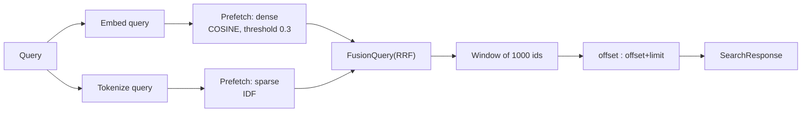
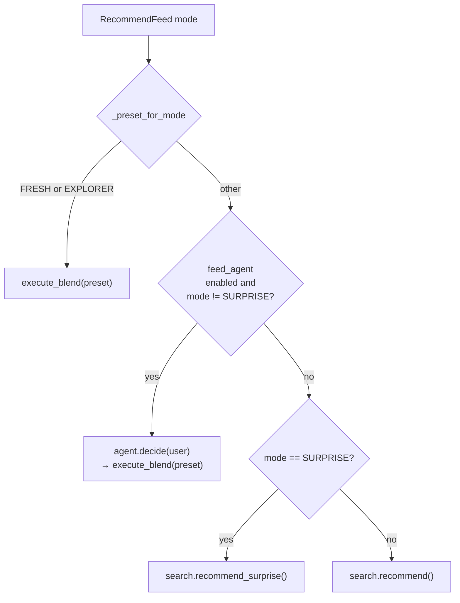
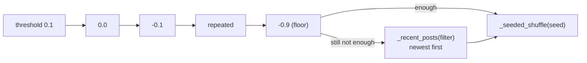

# Retrieval and recommendations

Qdrant holds two **derived** collections — one for posts, one for user interest
profiles. Neither is a source of truth: content owns posts in MongoDB and the
user service owns accounts in PostgreSQL. This service only ever reads and
writes its own index.

The field-by-field schemas are in [Data model](data-model.md). This page is
about how they are **queried and ranked**.

## Two ranking channels

Every post carries two vectors:

| Channel | Signal | Built from |
| --- | --- | --- |
| `dense` | Meaning | `title + body + summary`, embedded to 1024 floats |
| `sparse` | Terms | BM25-style term frequencies plus prefix tokens |



Both channels run as **parallel prefetches inside a single Qdrant query**,
fused by Qdrant's own `FusionQuery(fusion=RRF)`. If the query has no sparse
terms, only the dense channel runs.

### The dense threshold

`SEARCH_DENSE_SCORE_THRESHOLD` (0.3) is applied to the dense prefetch *and* to
`retrieve_by_vector`. Without it, a gibberish query would still return the
least-bad match, and unrelated text would surface as a "best match". With fake
embeddings the number is meaningful too: identical text scores ~1.0, unrelated
text ~0.0.

### Why `total` is a window, not a count

```python
async def _rank_window(self, dense, sparse_weights, query_filter, ...):
    """Qdrant 1.19 does not expose a total count for query points, so
    fetching the whole window once is the only way to report an exact
    total while keeping every page of the same query on a single ranking."""
```

`_rank_window()` fetches up to `SEARCH_MAX_RESULT_WINDOW` (**1000**) ids and
slices them. So:

- `total` is exact for result sets up to 1000 and **capped** beyond that.
- Every page of one query shares a single ranking — page 2 is a slice of the
  same list page 1 came from, never a re-query.
- `offset + limit > 1000` is rejected with `INVALID_ARGUMENT` before the store
  is touched.

> **`RelatedPosts.total` is not the number of related posts.**
> [`SearchMixin.RelatedPosts`](../../src/application/search.py) fills it with
> `await self._search.count()` — the size of the whole index. The same applies
> to every item in `RelatedPostsBatch`. Treat it as "how many posts exist", not
> "how many neighbours were found".

## Index and delete

| RPC | Behaviour |
| --- | --- |
| `IndexPost` | Embeds, builds the sparse vector, upserts one point |
| `DeletePost` | Deletes one point |

- **The body is truncated, not rejected.** Content allows ~1 MiB bodies while
  `EMBEDDING_MAX_CHARS` is 8000, so `IndexPost` slices the body rather than
  failing — a long post still indexes its head instead of landing in the
  content service's DLQ.
- **The id must be hex.** `_point_id` pads a MongoDB ObjectID into a UUID; a
  non-hex id raises and surfaces as `INTERNAL`.
- **Re-indexing overwrites.** The point id is deterministic, so a corrected
  post replaces its old point rather than duplicating.
- **Deleting is a separate conversation.** Content deletes from MongoDB, then
  the search worker calls `DeletePost`. Between the two, search can return a
  stale id; content drops those during hydration.

## Related posts

`related(post_id, limit)` queries Qdrant **with the post's own stored dense
vector** — no re-embedding — and excludes the post itself with a
`must_not` ID filter. The dense threshold applies.

An unindexed post returns `[]` rather than an error, so a brand-new post
degrades gracefully while the search worker catches up.

Defaults: `RELATED_DEFAULT_LIMIT` (10) when the request omits `limit`;
`limit > SEARCH_MAX_LIMIT` (100) is rejected.

## Interest profiles

`UpdateUserProfile` folds one interaction into the user's Qdrant point. The
weights mirror content's fixed view/like/save values:

| Kind | Weight | Setting |
| --- | --- | --- |
| `VIEW` | 1.0 | `PROFILE_VIEW_WEIGHT` |
| `LIKE` | 3.0 | `PROFILE_LIKE_WEIGHT` |
| `SAVE` | 5.0 | `PROFILE_SAVE_WEIGHT` |

Two extra rules:

- **`source_mode=SURPRISE` halves the weight** via
  `PROFILE_SURPRISE_FEEDBACK_MULTIPLIER` (0.5) and increments
  `surprise_interactions_total`. Surprise suggestions start from anti-taste, so
  liking one counts for less than a direct like.
- **An unindexed post is silently skipped** — the interaction never blocks the
  content personalizer's Kafka consumption.

`user_id` and `post_id` are capped at `PROFILE_MAX_ID_CHARS` (128), and
`source_mode` must be `UNSPECIFIED`, `DEFAULT`, or `SURPRISE` — anything else
is rejected even though `FRESH` and `EXPLORER` are valid *recommend* modes.

The fold itself (running average, tag caps, seen-post history) is documented in
[Data model](data-model.md).

## `RecommendFeed`

### Routing



| Mode | Path |
| --- | --- |
| `UNSPECIFIED`, `DEFAULT` | Feed agent if `AGENT_MODE != deterministic`, otherwise `search.recommend()` |
| `FRESH` | `execute_blend("fresh")` → `recommend(recency_days = FEED_FRESH_RECENCY_DAYS)` |
| `EXPLORER` | `execute_blend("explorer")` → default ranking interleaved with surprise pages |
| `SURPRISE` | `recommend_surprise()` — **never routed through the agent** |

`UNSPECIFIED` is served as `default` in metrics and logs (`_mode_name`), so the
two share one label.

### The three presets

`execute_blend()` composes the same engine paths the RPC has always used, so
`AGENT_MODE=deterministic` is behaviourally identical to what shipped before
the agent existed.

| Preset | Implementation |
| --- | --- |
| `balanced` | `search.recommend(user_id, offset, limit)` — the standard path |
| `fresh` | Same, with `recency_days = FEED_FRESH_RECENCY_DAYS` (14) |
| `explorer` | Fetch a default page plus a surprise page, `_interleave`, then slice |

`_interleave()` is deterministic: every third slot comes from the surprise list
(`len(out) % 3 == 2`), everything else keeps base order, duplicates dropped.
`FEED_EXPLORER_SURPRISE_RATIO` (0.3) sizes the surprise list rather than
directly controlling the interleaving pattern.

> **`explorer` reports an approximate `total`.** It is `len(blended)` — the
> length of the fetched and interleaved list — not the size of the matching
> pool. Expect `total` to be close to `offset + limit` rather than a full
> result count.

### The feed agent

When `AGENT_MODE` is `agent`, each `DEFAULT` feed first runs a tiny two-node
graph: `fetch_profile` summarises the user's top tags, then `decide_preset`
asks the LLM for one word (`fresh`, `balanced`, or `explorer`).

- Decisions are cached in a **process dict** for
  `AGENT_DECISION_TTL_SECONDS` (300 s), so one user costs at most one LLM call
  per five minutes.
- Any failure — `LLMError` or an unparsable word — falls back to `balanced`
  and increments `feed_agent_decisions_total{outcome="fallback"}`.
- `outcome=hit` is a cache hit; `outcome=miss` is a *fresh LLM decision* (the
  naming reads oddly: a "miss" means the LLM was consulted).

> **The cache is never pruned.** Entries are overwritten when the same user
> returns and expire logically after their TTL, but stale keys for users who
> never return stay in memory for the life of the process. See
> [Reliability](../operations/reliability.md).

> **The agent's profile summary miscounts.** `fetch_profile` passes
> `seen_count=len(tag_weights)`, and `profile_summary()` renders it as
> *"N posts interacted with"*. `tag_weights` is the number of **distinct
> interest tags** (capped at `PROFILE_MAX_TAGS`, 64), not the number of posts.
> The real interaction count lives in `seen_post_ids` and is not consulted.
> Documented as-is — the LLM sees a wrong-but-plausible number.

### Surprise mode

Surprise deliberately queries for posts unlike the user:

```text
dense  → the negated taste vector:  cos(profile, post) < -threshold
sparse → the user's 10 LEAST-used tags (weakest expression of taste)
filter → recent posts (60 days), excluding everything already seen
```

Because "unlike my taste" is a much bigger pool than "like my taste", the
threshold relaxes in steps until the page fills:



- `SURPRISE_DENSE_SCORE_THRESHOLD` (0.1) → `SURPRISE_THRESHOLD_FLOOR` (-0.9),
  stepping by `SURPRISE_THRESHOLD_STEP` (0.1) — **11 attempts** at most.
- If the window still does not fill, it falls back to the newest posts
  matching the filter (this is why `created_at` has a payload index).
- The final window is shuffled with `random.Random(seed)`, so the **same seed
  always yields the same ordering** — that is what makes surprise paging stable
  across requests.

Surprise returns an **empty feed** for a user with no profile, exactly like
`recommend()`.

### Cold start

`_user_profile()` returns `None` when the point is missing **or**
`total_weight <= 0`. Both count as cold start, and both yield
`SearchResult([], 0)` — an empty feed the content service can fall back from.

`recommend_cold_start_total` increments on each such call, and
`recommend_cold_start_ratio` is the **cumulative share since process start**
(`_cold_start_calls / _recommend_calls`, module-level globals — they reset on
restart).

> The cold-start counter is driven by `result.total == 0`, so it also counts a
> *warm* user whose feed came back empty — for instance someone whose only
> interests are older than `RECOMMEND_RECENCY_DAYS`. It means "empty feed",
> not "new user".

## Evidence lines

`RecommendResponse.reasons` maps `post_id → "Because you engage with {tag}"`,
built by [`src/domain/reasons.py`](../../src/domain/reasons.py):

- Only tags the post **actually shares** with the profile are used — nothing is
  invented.
- The **strongest** shared tag (highest profile weight) backs each line.
- Posts with no overlap get **no entry at all** rather than a generic reason.
- Surprise feeds get **no reasons** — taste-based evidence would be misleading
  for deliberately off-taste posts.

## Windows and filters

| Filter | Applies to | Setting |
| --- | --- | --- |
| `created_at >= now - N days` | All feeds | `RECOMMEND_RECENCY_DAYS` (60); `FEED_FRESH_RECENCY_DAYS` (14) for `fresh` |
| Exclude `seen_post_ids` | All feeds | `PROFILE_SEEN_POSTS_CAP` (200) |
| Dense score ≥ 0.3 | Search, related, default recommend | `SEARCH_DENSE_SCORE_THRESHOLD` |

> **A post with no usable `created_at` never reaches a feed.** Indexing stores
> `created_at` as `""` when `IndexRequest` omits the field, and both the Qdrant
> range filter and `MemoryIndex._created_after()` require it. Index with a
> timestamp or the post is invisible to recommendations.

## Fidelity of `VECTOR_MODE=fake`

`MemoryIndex` reimplements all of this in process memory with the same recipe:
cosine similarity gated by the same threshold, sparse overlap fused by RRF,
the same recency and seen-post filters, the same surprise threshold ladder.

It is **approximate, not bit-for-bit**:

- Ties break by insertion order.
- Sparse weights are raw term frequencies, not Qdrant's IDF-modified values.

That is enough for local work and load tests, and not enough for tuning ranking.

## Metrics

| Metric | Labels | Notes |
| --- | --- | --- |
| `recommend_requests_total` | `method`, `status` | **`status` is always `OK`** — failures never appear here |
| `recommend_request_duration_seconds` | `method`, `status` | Same |
| `recommend_cold_start_total` | — | Empty feeds |
| `recommend_cold_start_ratio` | — | Cumulative gauge, 0–1 |
| `profile_updates_total` | `kind=view\|like\|save` | |
| `surprise_interactions_total` | `kind` | Only when `source_mode=SURPRISE` |
| `feed_agent_decisions_total` | `outcome=hit\|miss\|fallback` | |
| `qdrant_requests_total` | `operation`, `status` | |

`recommend_requests_total` is incremented *inside* `_record_recommend()`, which
only runs on the success path. Failures are visible exclusively in
`grpc_requests_total{method="/ai.AIService/RecommendFeed", status="..."}`. The
docstring says as much — *"Total number of successful recommend feed calls"* —
but the label pair `status="OK"` reads like it could hold other values. It
cannot.

## Next steps

- [Data model](data-model.md) — the collections and the fold arithmetic.
- [Request flows](request-flows.md) — who calls these RPCs and when.
- [Providers](../components/providers.md) — what backs `SearchStore` and the
  embedding provider.
