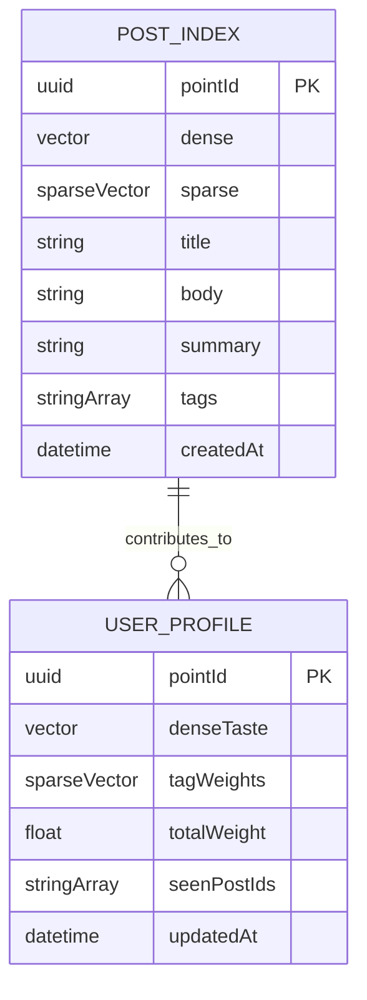
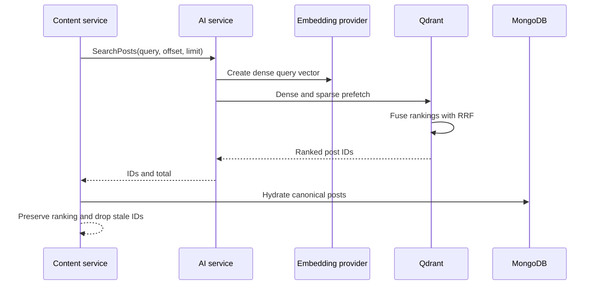

# Retrieval and recommendations

The AI service uses Qdrant for two derived collections: posts for retrieval and
user profiles for recommendation. Neither collection is the canonical source of
a post or account.

The post point ID is deterministically derived from the MongoDB post ID, so a
re-index overwrites the existing record. The user-profile point ID is a stable
UUID5 derived from the user-service ID. These mappings are implemented in
[`src/vector.py`](../../src/vector.py).

## Hybrid post search

Dense search captures meaning; sparse search captures terms. Qdrant fuses both
channels with reciprocal-rank fusion (RRF). A dense score threshold filters
weak semantic matches so unrelated text does not appear merely because it is
the least-bad result.

## Recommendation signals

Views, likes, and saves have weights of 1, 3, and 5. The personalizer worker
sends each event to `UpdateUserProfile`. The AI service folds the indexed post's
dense vector and tags into the user profile; an interaction for a post not yet
indexed is skipped rather than blocking event processing.

`RecommendFeed` supports `DEFAULT`, `SURPRISE`, `FRESH`, and `EXPLORER` modes.
The protobuf comments define their ranking intent and response fields.
