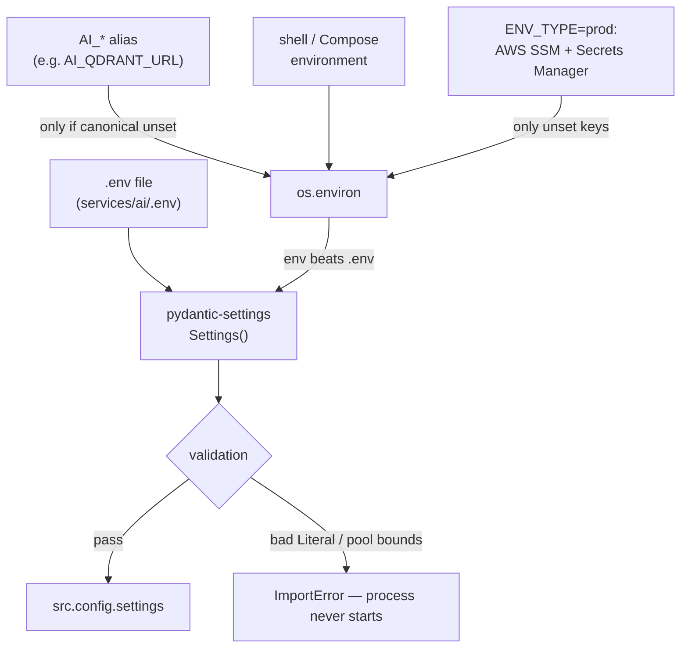
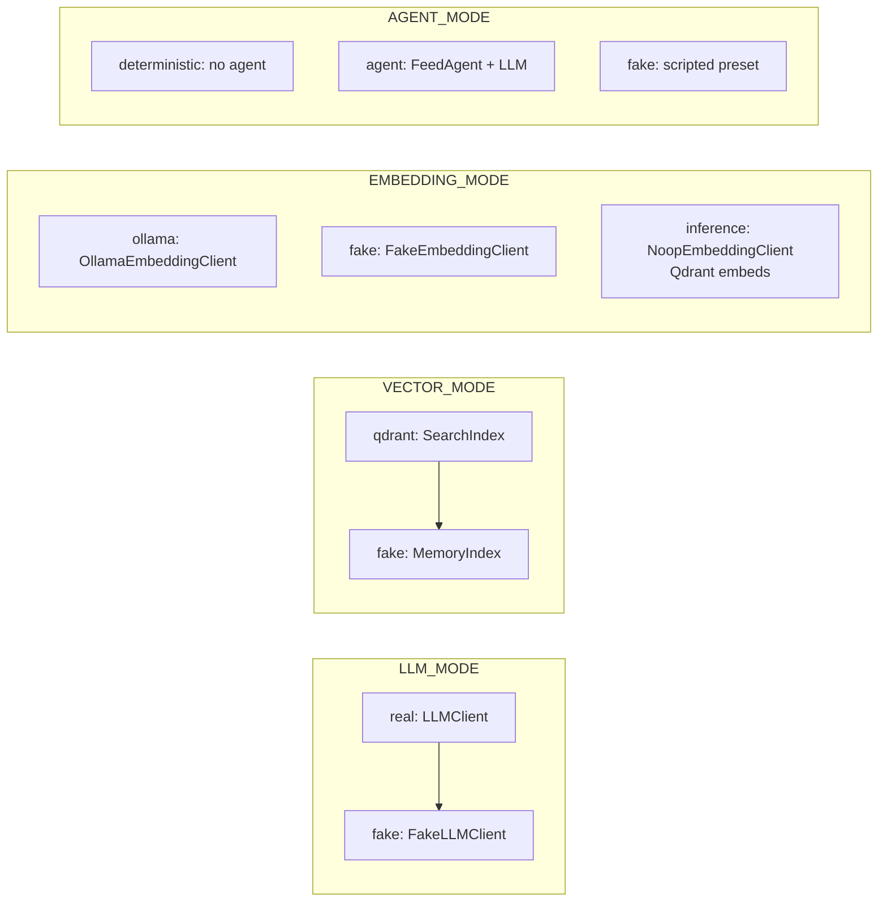

# Configuration

Every setting lives in one class, `Settings`
([`src/config.py`](../../src/config.py)). There is no other configuration file
and no runtime reconfiguration — settings are read once at import time and
never reloaded.

## How a value is resolved



Precedence, highest first:

1. **Environment variables** — always win over the `.env` file. This is what
   makes `LLM_MODE=fake make run` work: Make passes your shell environment
   through to Python.
2. **`.env`** — `env_file=".env"`, resolved relative to the working directory.
3. **The defaults** declared on `Settings`.

The `AI_*` aliases and the AWS hydration do not participate in precedence so
much as *pre-fill* the environment before pydantic ever runs.

### Aliases

Compose sets `AI_`-prefixed names, so `_AI_ALIASES` maps **24** of them onto
the canonical key:

```python
# src/config.py — applied at import, then again inside Settings.__init__
if os.environ.get(aliased, "").strip() and not os.environ.get(canonical, "").strip():
    os.environ[canonical] = os.environ[aliased].strip()
```

The rule is one-directional: **an alias only applies when the canonical name is
unset or blank.** Setting both means the canonical one wins.

| Alias | Canonical | Alias | Canonical |
| --- | --- | --- | --- |
| `AI_SERVICE_INT_PORT` | `PORT` | `AI_QDRANT_URL` | `QDRANT_URL` |
| `AI_METRICS_INT_PORT` | `METRICS_PORT` | `AI_QDRANT_API_KEY` | `QDRANT_API_KEY` |
| `AI_LOG_LEVEL` | `LOG_LEVEL` | `AI_QDRANT_VECTOR_SIZE` | `QDRANT_VECTOR_SIZE` |
| `AI_LLM_API_URL` | `LLM_API_URL` | `AI_SEARCH_DENSE_SCORE_THRESHOLD` | `SEARCH_DENSE_SCORE_THRESHOLD` |
| `LIGHTNING_AI_API_KEY` | `LLM_API_KEY` | `AI_EMBEDDING_MODE` | `EMBEDDING_MODE` |
| `AI_LIGHTNING_MODEL` | `LLM_MODEL` | `AI_EMBEDDING_URL` | `EMBEDDING_URL` |
| `AI_LLM_MODE` | `LLM_MODE` | `AI_EMBEDDING_MODEL` | `EMBEDDING_MODEL` |
| `AI_TIMEOUT_SECONDS` | `LLM_TIMEOUT_SECONDS` | `AI_OTLP_ENDPOINT` | `OTEL_EXPORTER_OTLP_ENDPOINT` |
| `AI_CONTENT_SERVICE_URL` | `CONTENT_SERVICE_URL` | `AI_CHECKPOINT_DB_URL` | `CHECKPOINT_DB_URL` |
| `AI_LANGCHAIN_TRACING` | `LANGCHAIN_TRACING` | `AI_CHECKPOINT_DB_URL_MIGRATE` | `CHECKPOINT_DB_URL_MIGRATE` |
| `AI_LANGCHAIN_API_KEY` | `LANGCHAIN_API_KEY` | `AI_CHECKPOINT_POOL_MIN_SIZE` | `CHECKPOINT_POOL_MIN_SIZE` |
| `AI_LANGCHAIN_PROJECT` | `LANGCHAIN_PROJECT` | `AI_CHECKPOINT_POOL_MAX_SIZE` | `CHECKPOINT_POOL_MAX_SIZE` |

`AI_SECRETS_NAME` and `AI_CONFIG_PARAM` are *not* aliases — they are settings
in their own right, read directly from the environment by the AWS loader.

### Production hydration

When `ENV_TYPE=prod`, `_hydrate_from_aws()` runs at import and fills any key
that is still unset:

| Source | Default name | Holds |
| --- | --- | --- |
| SSM Parameter Store | `/topos/ai/config` (`AI_CONFIG_PARAM`) | Non-secret config |
| Secrets Manager | `topos/ai/secrets` (`AI_SECRETS_NAME`) | Credentials — LLM key, Qdrant key, checkpoint URL |

Rules, all of which favour availability over strictness:

- **Never raises.** Missing boto3, a failed client init, a network error, a
  malformed JSON body — all are logged and skipped.
- **Never overwrites** an existing non-empty environment value.
- `ParameterNotFound` / `ResourceNotFoundException` are logged at `DEBUG`, not
  `WARNING` — an absent parameter is a normal first-deploy state.
- Timeouts are 5 s with a single attempt, so a slow AWS cannot stall startup.
- `AWS_ENDPOINT_URL` (Floci / LocalStack) switches the clients to a custom
  endpoint and falls back to dummy credentials.

Because hydration writes into `os.environ` *before* `Settings()` is built, the
hydrated values behave exactly like environment variables — and therefore beat
`.env`.

## The four mode switches

These decide which implementation you get. They are the settings most worth
getting right.

| Setting | Values | Default | Effect |
| --- | --- | --- | --- |
| `LLM_MODE` | `real`, `fake` | **`real`** | `LLMClient` (HTTP to Lightning AI) or `FakeLLMClient` (canned strings) |
| `VECTOR_MODE` | `qdrant`, `fake` | `qdrant` | `SearchIndex` (Qdrant) or `MemoryIndex` (in-process dict) |
| `EMBEDDING_MODE` | `fake`, `ollama`, `inference` | `fake` | Deterministic vectors, a self-hosted Ollama server, or Qdrant Cloud embedding server-side |
| `AGENT_MODE` | `deterministic`, `agent`, `fake` | `deterministic` | Fixed feed engine paths, an LLM that picks a blend preset, or a scripted pick |



### Incompatible combinations

```bash
EMBEDDING_MODE=inference VECTOR_MODE=fake make run   # RuntimeError at startup
```

`build_search()` refuses this outright: the in-memory twin has no server to
hand raw text to, so server-side embedding is meaningless against it. Every
other combination is allowed.

> **`EMBEDDING_MODE=inference` changes more than embeddings.** It makes
> `NoopEmbeddingClient` the provider, which *raises* if anything calls it, and
> it makes the `Embed` RPC return `UNIMPLEMENTED`. See
> [Providers](../components/providers.md).

### The `real` default trap

`LLM_MODE` defaults to `real`, and `LLM_API_KEY` defaults to empty. Starting
the server with no `.env` **succeeds** — nothing validates the key at startup —
and then every LLM-backed RPC fails with gRPC `UNAVAILABLE`. For local work,
set the modes explicitly or copy [`.env.example`](../../.env.example).

## Settings by area

### Server

| Setting | Default | Notes |
| --- | --- | --- |
| `PORT` | `"50051"` | gRPC listen port (a **string**, matching Compose) |
| `METRICS_PORT` | `12666` | Prometheus HTTP port |
| `GRACE_SECONDS` | `5` | Drain window passed to `server.stop()` |
| `LOG_LEVEL` | `"INFO"` | One of `DEBUG`, `INFO`, `WARNING`, `ERROR` |
| `ENV_TYPE` | `"dev"` | `dev` or `prod` — `prod` triggers AWS hydration |

### LLM

| Setting | Default | Notes |
| --- | --- | --- |
| `LLM_API_URL` | `https://lightning.ai/api/v1/chat/completions` | OpenAI-compatible endpoint |
| `LLM_API_KEY` | `""` | Sent as `Authorization: Bearer …` |
| `LLM_MODEL` | `openai/gpt-5-nano` | `.env.example` and Compose use `lightning-ai/gpt-oss-20b` |
| `LLM_TIMEOUT_SECONDS` | `60` | `httpx` client timeout |

Retry behaviour is **not** configurable: `_post` and `_open_stream` are wrapped
in tenacity with a hard-coded 3 attempts, exponential backoff capped at 10 s,
and `Retry-After` honoured up to 30 s. See [Providers](../components/providers.md).

### Input limits

| Setting | Default | Enforced by |
| --- | --- | --- |
| `MAX_INPUT_CHARS` | `5000` | `GenerateSummary`, `GenerateTags`, each chat history message |
| `MAX_POST_CHARS` | `5000` | `GeneratePost`, `GeneratePostDraft` |
| `MAX_KEYWORDS_CHARS` | `500` | `GeneratePost` keywords (steer titles and tags) |
| `MAX_KEY_POINTS_CHARS` | `2000` | `GeneratePost` key points (shape the middle sections) |
| `MAX_BODY_CHARS` | `3000` | Body truncation inside `GenerateTags` |
| `MAX_TITLE_CHARS` | `200` | Title truncation inside `GenerateTags` |
| `SEARCH_MAX_QUERY_CHARS` | `512` | `SearchPosts`, `ChatAnswer`, `Embed` |

Exceeding a `MAX_*` limit raises `TooLargeError` → gRPC `INVALID_ARGUMENT`.
The `SEARCH_*` limits raise `ValidationError` instead, with a different message
shape — see [Error handling](../components/error-handling.md).

### Qdrant and search

| Setting | Default | Notes |
| --- | --- | --- |
| `QDRANT_URL` | `http://localhost:6333` | Compose sets `http://qdrant:6333` |
| `QDRANT_API_KEY` | `""` | |
| `QDRANT_COLLECTION` | `posts` | Post index |
| `QDRANT_USERS_COLLECTION` | `users` | Interest profiles — created alongside `posts` |
| `QDRANT_VECTOR_SIZE` | `1024` | **Must match the embedding model's output size** |
| `QDRANT_TIMEOUT_SECONDS` | `10` | Client timeout |
| `QDRANT_STARTUP_RETRIES` | `12` | Attempts, 5 s apart, before startup fails |
| `SEARCH_DENSE_SCORE_THRESHOLD` | `0.3` | Minimum cosine similarity for any result |
| `SEARCH_MAX_RESULT_WINDOW` | `1000` | Sizes every ranking window and caps `total` |
| `SEARCH_MAX_LIMIT` | `100` | Max `limit` on `SearchPosts`, `RelatedPosts`, `RecommendFeed` |
| `RELATED_DEFAULT_LIMIT` | `10` | `RelatedPosts` / `RelatedPostsBatch` when `limit` is 0 |

Note the **dimension mismatch risk**: `EMBEDDING_MODEL` and `QDRANT_VECTOR_SIZE`
are independent settings. `_validate_embeddings()` rejects any vector whose
length is not `QDRANT_VECTOR_SIZE`, so pointing at a model with a different
dimension fails loudly rather than corrupting the index.

### Embeddings and sparse vectors

| Setting | Default | Notes |
| --- | --- | --- |
| `EMBEDDING_URL` | `http://embedding-service:11434` | Ollama base URL |
| `EMBEDDING_MODEL` | `snowflake-arctic-embed2:568m` | |
| `EMBEDDING_BATCH_SIZE` | `64` | Requests are chunked to this size |
| `EMBEDDING_MAX_CHARS` | `8000` | Also the cap on stored post bodies |
| `EMBEDDING_TIMEOUT_SECONDS` | `30` | |
| `SPARSE_MIN_TOKEN_LENGTH` | `2` | Tokens shorter than this are dropped |
| `SPARSE_PREFIX_MIN_LENGTH` | `3` | Prefix tokens start here (typo tolerance) |
| `SPARSE_MAX_TOKENS` | `512` | Budget per sparse vector |

### Profiles and feeds

| Setting | Default | Notes |
| --- | --- | --- |
| `PROFILE_VIEW_WEIGHT` | `1.0` | Interaction weight; mirrors content's fixed weights |
| `PROFILE_LIKE_WEIGHT` | `3.0` | |
| `PROFILE_SAVE_WEIGHT` | `5.0` | |
| `PROFILE_SURPRISE_FEEDBACK_MULTIPLIER` | `0.5` | Surprise-sourced interactions count half |
| `PROFILE_SEEN_POSTS_CAP` | `200` | Interaction history kept per user |
| `PROFILE_MAX_TAGS` | `64` | Distinct tags per profile; weakest is evicted when full |
| `PROFILE_TAG_WEIGHT_CAP` | `10.0` | Ceiling on any single tag |
| `PROFILE_MAX_ID_CHARS` | `128` | Max length of `user_id` / `post_id` in profile RPCs |
| `RECOMMEND_RECENCY_DAYS` | `60` | Posts older than this never reach a feed |
| `AGENT_DECISION_TTL_SECONDS` | `300` | How long an agent preset is reused |
| `FEED_FRESH_RECENCY_DAYS` | `14` | The `fresh` preset's window |
| `FEED_EXPLORER_SURPRISE_RATIO` | `0.3` | Surprise share when interleaving |
| `SURPRISE_DENSE_SCORE_THRESHOLD` | `0.1` | Starting strictness for anti-taste search |
| `SURPRISE_THRESHOLD_STEP` | `0.1` | Relaxation per attempt |
| `SURPRISE_THRESHOLD_FLOOR` | `-0.9` | Stop relaxing here, then fall back to recency |
| `SURPRISE_TAG_TOP_K` | `10` | Least-used tags feeding the sparse channel |

### Chat

| Setting | Default | Notes |
| --- | --- | --- |
| `CHAT_TOP_K_DEFAULT` | `5` | Used when the request omits `top_k` |
| `CHAT_MAX_TOP_K` | `10` | `top_k` above this → `INVALID_ARGUMENT` |
| `CHAT_MAX_HISTORY_TURNS` | `6` | Turns kept after compaction, and turns sent to the LLM |
| `CHAT_MAX_CONTEXT_CHARS` | `12000` | Grounding budget; the crossing excerpt is truncated |
| `CHAT_MAX_RETRIEVAL_ROUNDS` | `2` | Rewrite→retrieve→judge iterations per turn |
| `CHAT_MAX_TOOL_CALLS` | `6` | Tool invocations allowed in one turn |
| `CHAT_DENSE_SOURCE_WEIGHT` | `1.0` | Weighted RRF weight of the dense source |
| `CHAT_HYBRID_SOURCE_WEIGHT` | `0.8` | Weight of the hybrid source |
| `CHAT_RETRIEVAL_CONCURRENCY` | `2` | Semaphore size for the source fan-out |

### Content bridge

| Setting | Default | Notes |
| --- | --- | --- |
| `CONTENT_SERVICE_URL` | `http://content-service:4002` | Base URL for `GET /internal/posts/{id}` |
| `CONTENT_INTERNAL_TOKEN` | `""` | Sent as `X-Internal-Secret` |

An empty token means `post_fetcher` is **never constructed**, so the
`get_post_body` chat tool returns a placeholder string. This is a wiring
decision made in `serve()`, not inside the tool.

### Checkpoints, tracing, telemetry

| Setting | Default | Notes |
| --- | --- | --- |
| `CHECKPOINT_DB_URL` | `""` | Empty → `InMemorySaver`; no database needed |
| `CHECKPOINT_DB_URL_MIGRATE` | `""` | Direct-writer URL used **only** for `saver.setup()` DDL; empty falls back to the runtime URL |
| `CHECKPOINT_POOL_MIN_SIZE` / `MAX` | `1` / `10` | Runtime pool bounds |
| `CHECKPOINT_STARTUP_RETRIES` | `12` | Attempts, 5 s apart |
| `OTEL_EXPORTER_OTLP_ENDPOINT` | `""` | Empty → tracing disabled entirely |
| `OTEL_SERVICE_NAME` | `ai-service` | |
| `LANGCHAIN_TRACING` | `false` | Enables LangSmith |
| `LANGCHAIN_API_KEY` | `""` | |
| `LANGCHAIN_PROJECT` | `topos-ai` | |
| `AWS_REGION` | `ap-south-1` | |
| `AWS_ENDPOINT_URL` | `""` | Set for Floci/LocalStack |
| `AI_SECRETS_NAME` | `topos/ai/secrets` | |
| `AI_CONFIG_PARAM` | `/topos/ai/config` | |

The two checkpoint URLs exist because **DDL cannot run through a pooler**:
`CREATE INDEX CONCURRENTLY` pins or breaks an RDS Proxy session. The runtime
pool therefore uses `CHECKPOINT_DB_URL` (proxy) while `saver.setup()` opens a
one-connection pool against `CHECKPOINT_DB_URL_MIGRATE` (writer). In dev both
are the same URL and the branch is skipped.

## Validation

Only two checks run, both inside `Settings.__init__`:

```python
if CHECKPOINT_POOL_MAX_SIZE < CHECKPOINT_POOL_MIN_SIZE:   # ValueError
    ...
if ENV_TYPE == "prod" and CHECKPOINT_DB_URL and "sslmode=require" not in url:
    logger.warning(...)                                    # warning only
```

Everything else is accepted as given.

### The `Literal` trap

`ENV_TYPE`, `LOG_LEVEL`, `LLM_MODE`, `VECTOR_MODE`, `EMBEDDING_MODE`, and
`AGENT_MODE` are `typing.Literal` fields, and pydantic validates them
**case-sensitively at import time**. A bad value does not produce a warning —
`src.config` fails to import and the process exits before a single log line is
written.

```bash
LOG_LEVEL=warning make run
# pydantic ValidationError: Input should be 'DEBUG', 'INFO', 'WARNING' or 'ERROR'
```

Note that `warning` (lowercase) and `warn` are rejected. This is the opposite
of the content service, where an unrecognised `LOG_LEVEL` silently falls back
to `info`.

## Practical recipes

```bash
# Fully offline, no containers
LLM_MODE=fake VECTOR_MODE=fake EMBEDDING_MODE=fake make run

# Real model, in-memory index (no Qdrant)
LLM_MODE=real LIGHTNING_AI_API_KEY=sk-... VECTOR_MODE=fake make run

# Against an external Qdrant with real embeddings
EMBEDDING_MODE=ollama EMBEDDING_URL=http://localhost:11434 QDRANT_URL=http://localhost:6333 make run

# LLM-chosen feed blends
AGENT_MODE=agent LANGCHAIN_TRACING=true LANGCHAIN_API_KEY=ls__... make run
```

## Next steps

- [Quick start](quickstart.md) — run it and verify.
- [Providers](../components/providers.md) — what each mode actually swaps in.
- [Reliability](../operations/reliability.md) — what happens when a dependency
  is unreachable.
