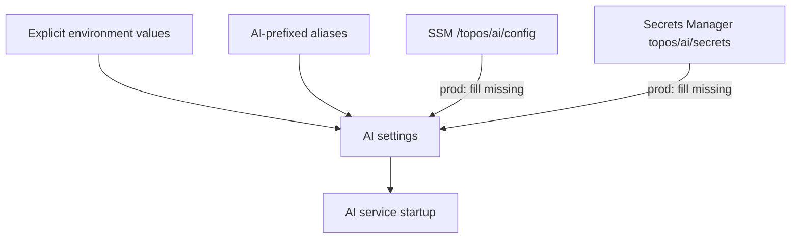

# Configuration and startup

`src/config.py` is the authoritative source for AI service settings and their
defaults. It supports canonical variables and selected `AI_` aliases used by
Compose.

## Configuration sources

In production mode, AWS configuration hydration fills values that are not
already explicitly set. It does not replace an existing process environment
value. SSM holds non-secret configuration; Secrets Manager holds values such as
LLM, Qdrant, and checkpoint connection credentials.

## Important mode choices

| Setting | Options | Effect |
| --- | --- | --- |
| `LLM_MODE` | `real`, `fake` | Remote language-model calls or deterministic fake replies |
| `VECTOR_MODE` | `qdrant`, `fake` | Persistent Qdrant index or in-memory index |
| `EMBEDDING_MODE` | `fake`, `ollama`, `inference` | Fake, self-hosted, or Qdrant Cloud embedding path |
| `AGENT_MODE` | `deterministic`, `agent`, `fake` | Feed ranking strategy selection |

Checkpoint persistence is optional. An empty checkpoint URL keeps graph state
in memory; configured production URLs distinguish the pooled runtime connection
from the direct-writer migration/setup connection.
