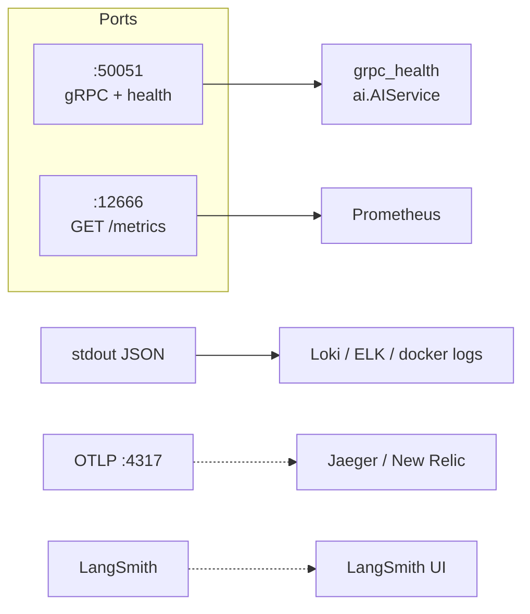
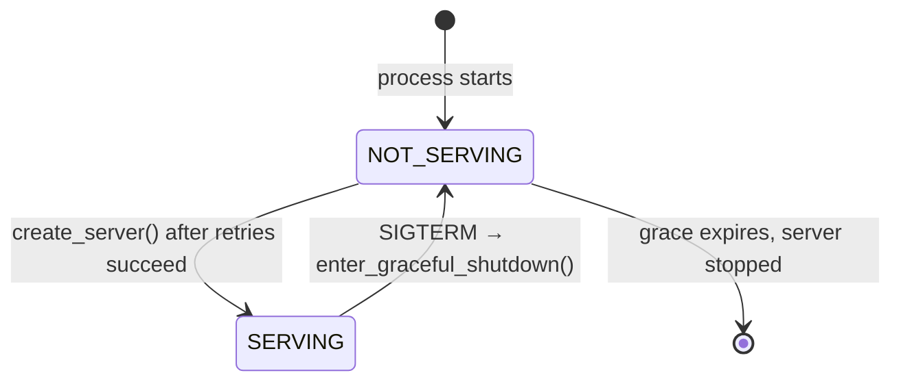

# Health and observability

The service emits three kinds of signal: a **gRPC health status**, **26
Prometheus metrics** on a plain HTTP port, and **structured JSON logs** to
stdout. Traces and LangSmith are optional extras.



## Health

### There is no HTTP health endpoint

Health is served over **gRPC's standard health protocol**
(`grpc.health.v1`) under the service name:

```text
ai.AIService
```

```python
# src/api/server.py
health_servicer = HealthServicer()
health_pb2_grpc.add_HealthServicer_to_server(health_servicer, server)
ai_service_pb2_grpc.add_AIServiceServicer_to_server(service, server)
await health_servicer.set("ai.AIService", HealthCheckResponse.SERVING)
```

So `curl localhost:50051/healthz` fails by design. Probe it with one of:

```bash
poetry run python load-tests/healthcheck.py && echo SERVING   # exits 0/1, prints nothing

grpcurl -plaintext localhost:50051 grpc.health.v1.Health/Check

poetry run python - <<'PY'
import grpc
from grpc_health.v1 import health_pb2, health_pb2_grpc
ch = grpc.insecure_channel("127.0.0.1:50051")
r = health_pb2_grpc.HealthStub(ch).Check(
    health_pb2.HealthCheckRequest(service="ai.AIService"), timeout=5
)
print(r.status)   # SERVING or NOT_SERVING
PY
```

Both `Check` and `Watch` are supported; the service name is registered for
`ai.AIService` only (an empty `service` in `Check` also works and reports the
aggregate).

### The status lifecycle



| Moment | Status | Port open? |
| --- | --- | --- |
| `serve()` begins, observability up | not registered yet | no |
| Qdrant retry loop (`QDRANT_STARTUP_RETRIES` × 5 s) | not registered | no |
| Checkpoint retry loop (`CHECKPOINT_STARTUP_RETRIES` × 5 s) | not registered | no |
| `create_server()` runs | **`SERVING`** | about to be |
| `server.start()` returns | `SERVING` | **yes** |
| SIGTERM/SIGINT | `NOT_SERVING` immediately, then `stop(GRACE_SECONDS)` | draining |

Two operational consequences:

- **`SERVING` means "dependencies were reachable at startup", not "they are
  reachable now."** The status is set once and only ever flipped to
  `NOT_SERVING` on shutdown. Use `dependency_up` for current health.
- **During the retry loops the port is not merely unhealthy — it refuses
  connections.** A load balancer sees a connection error, not a
  `NOT_SERVING` response.

### Compose wiring

[`infra/compose.yml`](../../infra/compose.yml) runs an inline Python probe:

```yaml
healthcheck:
  test: [CMD, python, -c, "...HealthStub.Check(service='ai.AIService')..."]
  interval: 30s
  timeout: 10s
  retries: 3
  start_period: 10s
```

> **The healthcheck and the startup budget disagree.** The probe's first
> failure window is `start_period 10s + 3 retries × 30s` ≈ **100 s** before
> Docker marks the container unhealthy. Startup can legitimately take
> **~120 s** (60 s of Qdrant retries + 60 s of checkpoint retries), and
> `depends_on: ... condition: service_healthy` means dependents wait. On a cold
> first boot with a slow Postgres, the ordering can time out before the service
> ever answers. Raise `start_period`, or lower
> `QDRANT_STARTUP_RETRIES` / `CHECKPOINT_STARTUP_RETRIES` for local work.

## Metrics

`GET http://localhost:12666/metrics` — served by
`start_http_server(settings.METRICS_PORT)`, which runs **first** in `serve()`,
before any dependency is touched. It answers while gRPC is still starting.

> **Names are global and unprefixed** (`grpc_requests_total`, not
> `ai_grpc_requests_total`). There is no `CONTENT_`-style namespace, so if you
> scrape the content service and this service into one Prometheus you must
> disambiguate by `instance`, not by metric name.

### The full set (26)

| Metric | Type | Labels | Meaning |
| --- | --- | --- | --- |
| `grpc_requests_total` | Counter | `method`, `status` | Every RPC, incl. `CANCELLED`; `method` = `/ai.AIService/<Rpc>` |
| `grpc_request_duration_seconds` | Histogram | `method`, `status` | Per-RPC latency |
| `grpc_active_requests` | Gauge | — | In-flight, incl. streams for their whole life |
| `llm_requests_total` | Counter | `status`, `model` | `status` ∈ `success`/`error`; shared by **every** graph node |
| `llm_request_duration_seconds` | Histogram | `model` | |
| `llm_retries_total` | Counter | — | Tenacity retries of transient LLM failures |
| `llm_tokens_total` | Counter | `method`, `token_type`, `model` | `token_type` ∈ `prompt`/`completion`/`total`; **estimated** (chars ÷ 4) when the provider omits usage |
| `query_rewrites_total` | Counter | `outcome` | `rewritten` / `kept_original` |
| `chat_compactions_total` | Counter | — | Successful history folds only |
| `embedding_requests_total` | Counter | `status`, `mode` | **Absent under `EMBEDDING_MODE=fake`** |
| `embedding_request_duration_seconds` | Histogram | `mode` | |
| `recommend_requests_total` | Counter | `method`, `status` | **`status` is always `OK`** |
| `recommend_request_duration_seconds` | Histogram | `method`, `status` | Same |
| `profile_updates_total` | Counter | `kind` | `view`/`like`/`save` |
| `surprise_interactions_total` | Counter | `kind` | Only when `source_mode=SURPRISE` |
| `recommend_cold_start_total` | Counter | — | Empty feeds |
| `recommend_cold_start_ratio` | Gauge | — | Cumulative empty-feed share since process start, 0–1 |
| `feed_agent_decisions_total` | Counter | `outcome` | `hit` (cache), `miss` (fresh LLM call), `fallback` (agent failed) |
| `qdrant_requests_total` | Counter | `operation`, `status` | `status` ∈ `success`/`error`; `operation` is the store method name |
| `qdrant_request_duration_seconds` | Histogram | `operation`, `status` | |
| `dependency_up` | Gauge | `dep` | `1`/`0`; see caveats below |
| `dependency_ping_duration_seconds` | Histogram | `dep` | Despite the name, **operation** latency, not a probe |
| `retrieval_fetch_duration_seconds` | Histogram | `source` | `dense` / `hybrid` |
| `retrieval_fetch_errors_total` | Counter | `source` | |
| `chat_judge_verdicts_total` | Counter | `verdict` | `relevant` / `irrelevant` / `unavailable` |
| `post_workflow_transitions_total` | Counter | `transition` | `drafted` / `approved` / `rejected` |

### `dependency_up` is not uniform

| `dep` | Updated | Actually live? |
| --- | --- | --- |
| `qdrant` | On **every** store operation via `@_record_qdrant` | **Yes** |
| `embedding` | On **every** embed call, but **only** by `OllamaEmbeddingClient` | Yes under `ollama`; never appears under `fake` or `inference` |
| `checkpoint` | **Once**, in `start_checkpointer()` | **No** — startup value only |

A dashboard that treats all three as current health will quietly show a
green checkpoint long after Postgres went away.

### Metric quirks to design around

1. **`recommend_requests_total{status}` can only be `OK`.** The counter is
   incremented inside `_record_recommend()`, which runs on the success path.
   Failures show up only in `grpc_requests_total`.
2. **`grpc_requests_total` is the only complete error signal.** It is the one
   metric written by the catch-all in both decorators.
3. **`recommend_cold_start_ratio` never resets** — it is
   `_cold_start_calls / _recommend_calls` held in module-level globals. It
   survives cache-less queries but not a process restart, and a long-running
   process makes a spike look smaller and smaller.
4. **`llm_requests_total{model}`** always reports `settings.LLM_MODEL`, so a
   fake run is labelled with the real model name.
5. **`grpc_active_requests` decrements in `finally`**, so a cancelled stream is
   released correctly.
6. **Fake modes remove series entirely.** With `LLM_MODE=fake` there are no
   `llm_*` series at all; with `EMBEDDING_MODE=fake` there are no
   `embedding_*` series. Absence of a metric is not a failure.

### Useful expressions

```promql
# Error rate by RPC (the only reliable one)
sum by (method) (rate(grpc_requests_total{status!="OK"}[5m]))
  / sum by (method) (rate(grpc_requests_total[5m]))

# Store health
dependency_up{dep="qdrant"} == 0

# Chat quality: how often the judge gives up
sum(rate(chat_judge_verdicts_total{verdict="unavailable"}[10m]))
  / sum(rate(chat_judge_verdicts_total[10m]))

# Feed emptiness trending
deriv(recommend_cold_start_ratio[30m])

# Retry pressure — should be ~0 in steady state
rate(llm_retries_total[5m])
```

## Logs

JSON on stdout, one object per line, formatted by `JsonLogFormatter`
([`src/observability/logging.py`](../../src/observability/logging.py)).

**Stable schema:**

```json
{"timestamp": "2026-09-30T12:00:00+00:00", "level": "INFO",
 "logger": "src.application.support", "message": "rpc completed",
 "service": "ai", "method": "/ai.AIService/SearchPosts", "status": "OK",
 "duration_ms": 12.4, "trace_id": "-", "span_id": "-"}
```

| Field | Always present? | Notes |
| --- | --- | --- |
| `timestamp`, `level`, `logger`, `message`, `service` | yes | `service` is the literal `ai` |
| `trace_id`, `span_id` | only when a span is active | Otherwise `-` in the access line, omitted elsewhere |
| `stacktrace` | on errors | `exc_info` is popped and re-emitted here |
| `method`, `status`, `duration_ms` | on `rpc completed` | From the decorator's `extra={}` |

`httpx`, `grpc`, and `asyncio` loggers are forced to `WARNING` so a single
request does not produce dozens of lines.

### Every RPC produces one `rpc completed` line

```python
access_logger.info("rpc completed", extra={
    "method": method, "status": status,
    "duration_ms": round(duration * 1000, 1),
    "trace_id": trace_id, "span_id": span_id, **(extra or {}),
})
```

Written from the decorator's `finally`, so **it exists for failures too** —
that makes `status` the most useful field for a log-based error rate.

Two RPCs add fields: `RecommendFeed` adds `mode`, `result_count`, `total`;
`UpdateUserProfile` adds `kind`.

**Chat answers log twice:**

```text
{"message": "chat completed", "completion_tokens_est": 842, "cited_posts": 2, "thread_id": "abc"}
{"message": "rpc completed",  "method": "/ai.AIService/ChatAnswer", "status": "OK", ...}
```

`completion_tokens_est` is characters ÷ 4 (`estimate_tokens()`), the same
estimate used by `llm_tokens_total`.

Other messages worth knowing:

| Message | When | Level |
| --- | --- | --- |
| `AI service starting` | first line of `serve()` | INFO |
| `prometheus metrics exposed on port %s` | early in `serve()` | INFO |
| `qdrant not ready, retrying` | each failed startup attempt | WARNING |
| `retrying LLM call (%s) after attempt %s` | tenacity backoff | WARNING |
| `unexpected error in %s` | unmapped exception ⇒ `INTERNAL` | ERROR + traceback |
| `tool %s failed: %s` | a chat tool raised | WARNING (turn continues) |
| `post fetch failed, using placeholder` | content bridge down | WARNING |

## Tracing (OpenTelemetry)

Enabled only when `OTEL_EXPORTER_OTLP_ENDPOINT` is non-empty; otherwise
`setup_tracing()` logs `tracing disabled` and returns.

```text
OTEL_EXPORTER_OTLP_ENDPOINT   collector; :4318 is auto-remapped to :4317 (gRPC)
OTEL_SERVICE_NAME             resource attribute service.name (default ai-service)
```

Instrumentation is automatic for **gRPC server** calls and **httpx** client
calls (`GrpcAioInstrumentorServer`, `HTTPXClientInstrumentor`). Every graph
node is decorated `@traceable(run_type="chain")` and every LLM call
`@traceable(run_type="llm")`, so LangGraph emits spans too.

Endpoint normalisation is forgiving: `host`, `http://host`, `host:4318`, and a
full URL all work; `:4318` becomes `:4317` because the exporter speaks gRPC.

`trace_id` / `span_id` in the JSON logs come from `get_span_ids()` — set them
on the log line and you can join logs to traces.

## LangSmith

Enabled by `LANGCHAIN_TRACING=true`. `setup_langsmith()` copies
`LANGCHAIN_TRACING`, `LANGCHAIN_API_KEY`, and `LANGCHAIN_PROJECT` into
`os.environ` **because the SDK reads environment variables and caches them**,
while `Settings` also reads `.env` — a config file alone would otherwise be
invisible to the SDK.

With `AGENT_MODE=agent` and LangSmith on, feed preset decisions are recorded as
traces; `make eval-chat --upload` records full evaluation experiments.

## Dashboards worth building

| Panel | Query |
| --- | --- |
| Traffic & errors | `sum by (status) (rate(grpc_requests_total[5m]))` |
| Saturation | `grpc_active_requests` |
| LLM health | `rate(llm_requests_total{status="error"}[5m])` + `rate(llm_retries_total[5m])` |
| Store health | `dependency_up` (knowing `checkpoint` is static) |
| Chat quality | `chat_judge_verdicts_total`, `query_rewrites_total{outcome="kept_original"}` |
| Feed quality | `recommend_cold_start_ratio`, `feed_agent_decisions_total{outcome="fallback"}` |

## Alerting recipes

| Condition | Expression | Why |
| --- | --- | --- |
| RPC error burst | `rate(grpc_requests_total{status!="OK"}[5m]) > 0.05` | The single complete signal |
| Store down | `dependency_up{dep="qdrant"} == 0` | Set by the failing operation itself |
| LLM failing | `rate(llm_requests_total{status="error"}[5m]) > 0` sustained | Provider is up but returning bad payloads |
| Judge degraded | judge `unavailable` ratio > 0.2 | Retrieval quality silently dropping |
| Agent broken | `rate(feed_agent_decisions_total{outcome="fallback"}[10m]) > 0` | Every feed falling back to `balanced` |
| Pod crash-looping | absent `grpc_active_requests` for 2 min | `:12666` gone means the process is gone |

Do **not** alert on `dependency_up{dep="checkpoint"}` — it does not update.

## Quick triage

```bash
# Is it up?
poetry run python load-tests/healthcheck.py && echo SERVING

# Metrics alive even while gRPC is starting?
curl -s localhost:12666/metrics | head

# Which RPCs are failing, right now?
curl -s localhost:12666/metrics | grep '^grpc_requests_total' | grep -v 'status="OK"'

# Any recent error tracebacks?
docker logs <container> 2>&1 | grep -m5 '"level": "ERROR"'

# Is the store the problem?
curl -s localhost:12666/metrics | grep '^dependency_up'
```

## Next steps

- [Reliability](reliability.md) — what each failure actually does to callers.
- [Configuration](../getting-started/configuration.md) — the port and log
  settings behind all of this.
- [Testing](../testing/overview.md) — which tests cover which signal.
