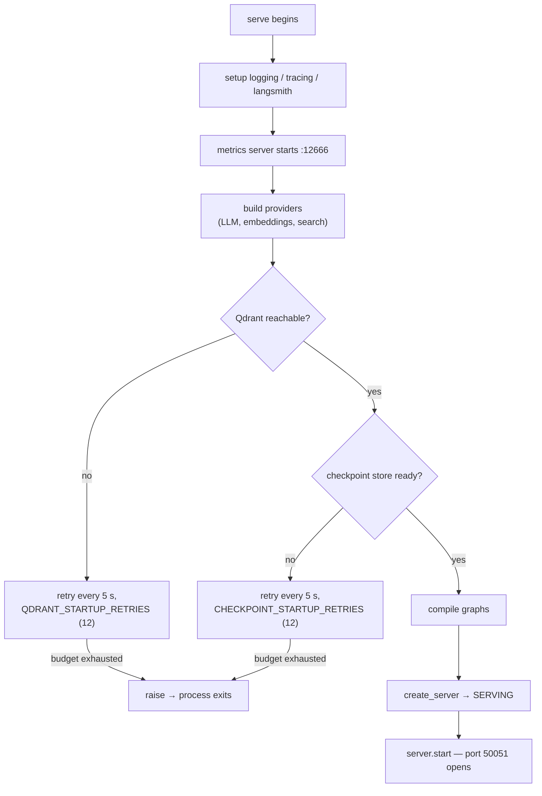
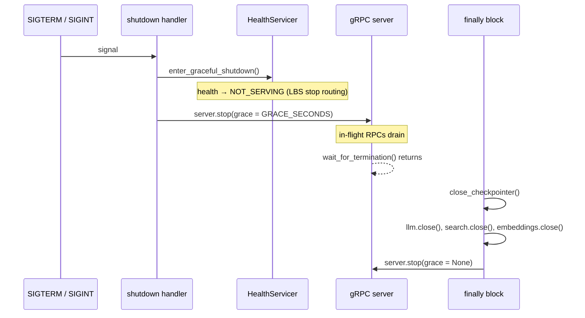

# Reliability

How this service behaves when something is slow, missing, or broken — and what
you should expect to see when it does.

## Startup: retry, then die



| Retry loop | Budget | Interval | On exhaustion |
| --- | --- | --- | --- |
| `_ensure_search_ready` | `QDRANT_STARTUP_RETRIES` (12) | 5 s | re-raise ⇒ exit |
| `_ensure_checkpointer_ready` | `CHECKPOINT_STARTUP_RETRIES` (12) | 5 s | re-raise ⇒ exit |

Roughly **60 s each, up to ~120 s combined** — each loop only starts after the
previous one succeeded.

Design intent (from the docstring): *"wait with a short backoff instead of
crashing on a transient startup blip (e.g. the store still restarting)"*. The
service **does** crash eventually; it just does not crash on a blip.

**The metrics port opens before either loop**, so the observable signature of a
long startup is:

```text
curl localhost:12666/metrics   → 200 OK
nc -z localhost 50051          → refused
docker logs                    → "qdrant not ready, retrying (1/12)"
```

> Metrics answering while gRPC refuses connections is **normal**, not a
> half-broken state. Conversely, if neither answers, the process is not running
> — check for an import-time `pydantic` `ValidationError`.

### Only `inference + fake` fails fast

`build_search()` raises `RuntimeError` before any retry loop runs. Every other
bad combination is caught by the first provider call instead, after the
process is already up.

## Graceful shutdown



| Property | Value | Why it matters |
| --- | --- | --- |
| Health flips **first** | `NOT_SERVING` before the grace period | Load balancers drain while requests still finish |
| `GRACE_SECONDS` | 5 (default) | In-flight RPCs get 5 s; a slow LLM call can be cut off |
| Closing order | checkpointer → LLM → search → embeddings → server | Graph state is durable before the process loses network access |
| `KeyboardInterrupt` at top level | swallowed | Clean Ctrl-C during local runs |

> **`post_fetcher` is not closed.** `PostFetcher` owns an `httpx.AsyncClient`
> that never appears in the `finally` block. On process exit the sockets are
> reclaimed, so this is invisible in production — but it leaks a client if you
> ever import `serve()` in a long-lived test harness. Documented as-is.

## Dependency failure scenarios

### LLM down (or `LLM_MODE=real` with no key)

| Layer | Behaviour |
| --- | --- |
| Provider | tenacity: 3 attempts, backoff `2^n` capped at 10 s, honours `Retry-After` ≤ 30 s, only for `{429,500,502,503,504}` and connection errors |
| Wire | gRPC `UNAVAILABLE`, message `LLM provider unavailable` |
| Metrics | `llm_requests_total{status="error"}`, `llm_retries_total`, `grpc_requests_total{status="UNAVAILABLE"}` |
| Impact | **Everything text-generation-dependent fails**: summaries, tags, posts, drafts, chat. Retrieval and profiles are unaffected. |

The chat graph has one partial exception: the **query rewrite** and the
**relevance judge** both fail soft (keep the original query / proceed as
relevant), so a broken LLM still lets retrieval run — it just cannot produce an
answer.

No key at startup: **nothing fails at startup.** The key is only read when the
first request is made, so you get a healthy-looking service that returns
`UNAVAILABLE` on every LLM RPC. Set `LLM_MODE=fake` unless you have a key.

### Embedding server down

| Layer | Behaviour |
| --- | --- |
| Provider | `httpx` error → `EmbeddingError` |
| Wire | `UNAVAILABLE`, `Embedding provider unavailable` |
| Metrics | `embedding_requests_total{status="error"}`, `dependency_up{dep="embedding"} = 0` |
| Impact | Search, related, chat grounding, indexing, profile folds — **anything that needs a query vector** |

`Embed` and `IndexPost` fail loudly. There is **no embedding cache**, so even a
cached result needs the provider.

Under `EMBEDDING_MODE=fake` this scenario does not exist — which is exactly
why the load tests use it.

### Qdrant down

This is the sharpest edge in the service, because behaviour differs before and
after startup.

| Phase | Behaviour |
| --- | --- |
| **Startup** | Retried 12 × 5 s, then the process exits — `dependency_up{dep="qdrant"} = 0`, `qdrant_requests_total{operation="ensure_collection", status="error"}` |
| **Runtime** | **No retry.** `_record_qdrant` counts the error, sets `dependency_up = 0`, and re-raises the raw qdrant exception — which is **unmapped**, so the caller gets gRPC `INTERNAL`, not `UNAVAILABLE` |

| Impact | |
| --- | --- |
| Fails | `SearchPosts`, `RelatedPosts`, `RelatedPostsBatch`, `IndexPost`, `DeletePost`, `RecommendFeed`, `UpdateUserProfile`, all chat grounding |
| Still works | `GenerateSummary`, `GenerateTags`, `GeneratePost`, the whole draft workflow |
| Content-side effect | **Search breaks** (`SearchPosts` errors propagate); the **feed falls back to recency**; publish still works |

> An `INTERNAL` from a search RPC is the tell. A genuine caller bug gives
> `INVALID_ARGUMENT`; a store outage gives `INTERNAL`. See
> [Error handling](../components/error-handling.md).

### Checkpoint store (Postgres) down

| Phase | Behaviour |
| --- | --- |
| Startup | Retried 12 × 5 s, then exit |
| Runtime | `AsyncPostgresSaver` raises; unmapped ⇒ `INTERNAL` |
| Impact | Chat sessions and draft approvals — **not** single-turn generation or retrieval |

With the default empty `CHECKPOINT_DB_URL` there is no store at all:
`InMemorySaver` keeps everything in process memory. Two consequences:

- Chat with a `thread_id` **loses history on restart**.
- Pending draft approvals are **lost on restart**, and content starts seeing
  `NOT_FOUND: unknown approval_id: …`.

`dependency_up{dep="checkpoint"}` is written **once at startup** and never
again, so it does not tell you about a runtime outage.

### Content service down (the `get_post_body` bridge)

| Layer | Behaviour |
| --- | --- |
| Fetcher | 10 s timeout → `PostFetchError` |
| Tool dispatcher | catches **everything** → `{"error": "content service unreachable: …"}` |
| Impact | **The chat turn continues.** The model sees the error string and answers from what it already has. |

There is no metric for this — only a WARNING log
(`post fetch failed, using placeholder`). If `CONTENT_INTERNAL_TOKEN` is unset
the fetcher is never built and the tool returns a placeholder every time.

### Everything down

The service still starts (unless Qdrant retries exhaust) and still answers
gRPC health `SERVING`, because **`SERVING` only reflects startup-time
reachability**. Triage with `dependency_up` and
`grpc_requests_total{status}`, never with health alone.

## Degraded modes

| Situation | What the reader sees | Signal |
| --- | --- | --- |
| LLM down | Search and feeds work; no summaries, tags, drafts, chat answers | `llm_requests_total{status="error"}` |
| Embedding down | Generation works; nothing searchable | `dependency_up{dep="embedding"} = 0` |
| Qdrant down (runtime) | Generation works; search/feed/chat grounding all fail | `dependency_up{dep="qdrant"} = 0`, `INTERNAL` statuses |
| Checkpoint down | Everything except sessions/drafts works | unmapped errors from graph nodes |
| Feed agent LLM failing | Feeds always `balanced` — deterministic, slightly bland | `feed_agent_decisions_total{outcome="fallback"}` |
| Judge unparseable | Retrieval proceeds on the first round without rewrites | `chat_judge_verdicts_total{verdict="unavailable"}` |
| Content bridge down | Chat answers use excerpts only | WARNING log, no metric |
| No user profile | Empty feed, not an error | `recommend_cold_start_total` |
| Index lagging after publish | Post searchable before its summary, or missing from related posts | none — eventual consistency |

## Known limitations

These are properties of the current code, documented as-is rather than
prescribed.

| Limitation | Consequence | Where |
| --- | --- | --- |
| **No runtime Qdrant retry** | One store blip ⇒ a burst of `INTERNAL` | [`src/vector.py`](../../src/vector.py) |
| **`SERVING` is set once** | Health does not reflect current dependency state | [`src/api/server.py`](../../src/api/server.py) |
| **`LLM_MODE` defaults to `real`** with an empty key | A bare `make run` serves `UNAVAILABLE` for every LLM RPC | [`src/config.py`](../../src/config.py) |
| **`FeedAgent._decisions` never pruned** | Users who return once leave cache keys for the process lifetime; the TTL only stops them being *used* | [`src/graphs/feed_graph.py`](../../src/graphs/feed_graph.py) |
| **`post_fetcher` never closed** | One leaked `httpx.AsyncClient` per `serve()` invocation | [`src/main.py`](../../src/main.py) |
| **Healthcheck vs startup budget** | Docker can declare unhealthy before the 120 s retry budget is spent | [`infra/compose.yml`](../../infra/compose.yml) |
| **`recommend_*` counters only record successes** | An outage is invisible in the recommender series | [`src/application/support.py`](../../src/application/support.py) |
| **No per-RPC deadline** | A hung LLM call is bounded only by `LLM_TIMEOUT_SECONDS` (60) × 3 attempts | [`src/llm.py`](../../src/llm.py) |
| **No embedding cache** | Every query pays a round trip to the embedding server | [`src/embeddings.py`](../../src/embeddings.py) |
| **Unmapped store/parse errors ⇒ `INTERNAL`** | Outage and caller bug share a status code | [Error handling](../components/error-handling.md) |

## Worst-case latency budget

A single `ChatAnswer` turn, when everything is slow:

```text
rewrite   3 × LLM (60 s timeout, up to 3 attempts each)   × 1
retrieve  2 × embedding (30 s timeout) + Qdrant query
judge     3 × LLM                                          × ≤ 2 rounds
tool loop LLM + tools (fetch 10 s)                         × ≤ 6 calls
answer    streaming LLM
```

There is **no overall deadline** on the RPC. The bound comes from the caller —
content's `chatTimeout` — and when it fires, this service records
`status="CANCELLED"`, not `DEADLINE_EXCEEDED`.

If you see `CANCELLED` climbing, the AI service is slow but not failing;
`llm_request_duration_seconds` tells you whether the LLM is the cause.

## Runbook

| Symptom | First check | Likely fix |
| --- | --- | --- |
| Port refused, metrics OK | `docker logs` for `retrying (n/12)` | Wait, or fix `QDRANT_URL` / `CHECKPOINT_DB_URL` |
| Nothing answers, no metrics | Start-up import error in logs | Bad `LOG_LEVEL` / `*_MODE` value (pydantic `Literal`) |
| Everything `INTERNAL` | `dependency_up{dep="qdrant"}` | Qdrant outage — no retry will save you; restart it |
| Everything `UNAVAILABLE` | `llm_requests_total{status}` | Provider down, or missing `LLM_API_KEY` |
| Feed empty, search fine | `recommend_cold_start_total` | No profile yet, or all interests older than 60 days |
| Chat answers have no citations | `cited_post_ids` + text | Fake embeddings match only identical text |
| Draft approve returns `NOT_FOUND` | Checkpoint store | In-memory saver lost it across a restart |
| Deploy container flips unhealthy | `start_period` vs retry budget | Raise `start_period` or lower `*_STARTUP_RETRIES` |
| `CANCELLED` rate high | `llm_request_duration_seconds` | LLM latency above the caller's deadline |

## Next steps

- [Health and observability](health-and-observability.md) — the signals this
  page refers to.
- [Configuration](../getting-started/configuration.md) — every timeout and
  retry budget.
- [Architecture](../concepts/architecture.md) — the startup sequence in code.
