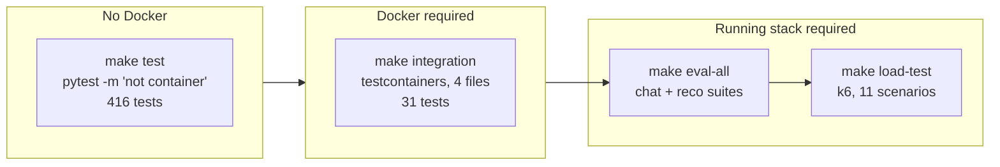
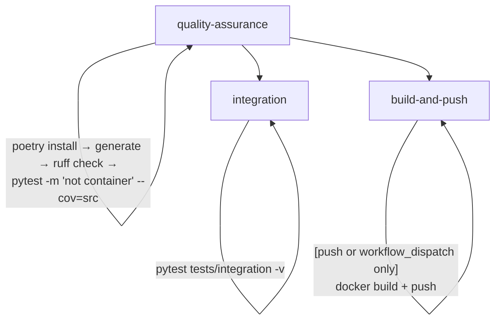

# Testing

Four layers, each with a different cost. Run the first one before every push.



## Commands

All run from `services/ai/`:

| Command | Layer | Needs Docker? | Needs a stack? |
| --- | --- | --- | --- |
| `make generate` | pre-step | no | no |
| `make test` | unit / in-process | no | no |
| `make test-coverage` | unit + coverage report | no | no |
| `make integration` | container integration | **yes** | no — it builds its own |
| `make lint` | `ruff check .` | no | no |
| `make format` | `ruff format .` | no | no |
| `make format-check` | `ruff format --check .` (CI style) | no | no |
| `make eval-chat` / `eval-reco` / `eval-all` | evaluation | yes | **yes** |
| `make load-test` (+ per-scenario targets) | load | yes | no — `compose.load.yml` |
| `make clean` | remove `src/generated`, caches | no | no |

### `make generate` first

`src/generated/` is partly gitignored, so a fresh clone has no stubs and
**every test fails at import**. The target also rewrites the generated imports
to be relative:

```bash
find src/generated -type f -name "*.py" -exec sed -i 's/^import ai_service_pb2/from . import ai_service_pb2/' {} +
```

Skip that rewrite and you get `ModuleNotFoundError: ai_service_pb2` only at
runtime — the unit tests will not catch it.

> **When the proto changes**, run `make generate` here **and** in
> [`services/content`](../../../content) so both ends of the gRPC boundary
> match. CI does the same in both services.

## The unit suite

```bash
make test          # pytest -m "not container"
make test-coverage # same + --cov=src --cov-report=term-missing
```

**42 test files, 416 test functions**, none of which needs Docker.

| Location | Tests | Covers |
| --- | --- | --- |
| `tests/*.py` (root) | 220 | Chat graph, retrieval, vectors, LLM, posts, config, main, checkpointer, eval helpers |
| `tests/api/` | 103 | The 15 RPC handlers, validation, metrics decorators, streaming |
| `tests/domain/` | 28 | Pure helpers: sanitisation, prompt builders, evidence lines |
| `tests/observability/` | 34 | Metrics, JSON logging, tracing, LangSmith |
| `tests/integration/` | 31 | Docker-backed (excluded from `make test`) |
| `tests/support/` | 0 | Shared fakes and helpers |

`asyncio_mode = "auto"` and `pythonpath = ["."]` are set in
[`pyproject.toml`](../../pyproject.toml), so async tests need no decorator and
`from src...` imports work without `PYTHONPATH=.`.

### What the unit tests deliberately do not prove

They run against fakes by construction — `FakeLLM`,
`FakeEmbeddingClient`/`MemoryIndex`, `FakePostFetcher`. So they verify
*logic* (routing, limits, reducers, error mapping) but not:

- That real Qdrant accepts the collection config.
- That a real embedding model produces `QDRANT_VECTOR_SIZE` floats.
- That the LLM returns JSON the parser accepts.
- That the container starts and reports `SERVING`.

That is what the next three layers are for.

## Container integration tests

```bash
make integration       # pytest tests/integration -v
```

Four files, **31 tests**, all marked `container`:

| File | Proves |
| --- | --- |
| `test_container.py` | The image builds, boots, reports `SERVING`, and serves RPCs |
| `test_search_container.py` | Real Qdrant accepts the collections and returns results |
| `test_checkpoint_container.py` | Real Postgres backs `AsyncPostgresSaver`, DDL runs |
| `test_post_workflow_container.py` | The approval interrupt round-trips through a durable store |

`tests/integration/conftest.py`:

- Builds `topos-ai:integration` from [`Dockerfile`](../../Dockerfile) **once
  per session**, and `pytest.skip`s if Docker is unavailable (so a machine
  without Docker still passes CI's unit job).
- Starts the container on a shared network with Qdrant/Postgres testcontainers.
- Blocks on `_wait_healthy()` — gRPC channel readiness **plus** a
  `HealthCheck("ai.AIService") == SERVING` poll with a **60 s** deadline.
- Tears everything down after the session.

These tests need Docker; the marker keeps them out of `make test`.

## Evaluation suites

Not unit tests — they score **quality** against a live stack.

```bash
docker compose -f services/ai/infra/compose.yml up -d --build   # from repo root

make eval-dataset        # build the curated corpus
make eval-verify         # confirm it is retrievable
make eval-chat           # citations + optional LLM-as-judge
make eval-reco           # precision@k vs the recorded baseline
make eval-all            # everything; non-zero exit on any regression
```

| Suite | Gate | What it catches |
| --- | --- | --- |
| `chat` | Fixed minimum thresholds (no baseline file) | **Invented citations** — rows with a `[n]` pointing at an unknown post fail; citing known posts is reported only |
| `reco` | Recorded baseline, printed side by side | Precision@k drift, tag diversity collapse, seen-ratio regressions |

- `make eval-reco-baseline` rewrites the baseline (`--update-baseline`); do
  that **deliberately**, not to make a red run green.
- `--upload` records a LangSmith experiment (needs `LANGSMITH_API_KEY` and a
  pushed dataset).
- **These are local gates on purpose — there is no CI wiring.** A regression
  here will not block a PR; run `make eval-all` before a recommender or
  citation change.

`make eval-chat` works with a fake LLM (deterministic citation checks) but the
judge scores need `AI_LLM_MODE=real` plus a key.

## Load tests

```bash
make load-test-search      # one scenario
make load-test             # SCRIPT=mixed by default
make load-test-stop        # tear down
make load-test-summary     # 11 scenarios, sequential
```

Eleven k6 scenarios in [`load-tests/k6/`](../../load-tests/k6):
`generate-summary`, `generate-tags`, `generate-post`, `generate-search`,
`generate-related`, `generate-recommend`, `generate-surprise`,
`generate-fresh`, `generate-explorer`, `generate-chat`, `mixed`.

- **Isolated stack** — `infra/compose.load.yml` under the project name
  `topos-ai-loadtest`, so it never collides with dev or prod.
- **Per-scenario latency budgets** are `P95`/`P99` thresholds baked into the
  Makefile and widened automatically with the modes:

  | Scenario | `EMBEDDING_MODE=fake` | `ollama`/`inference` | `LLM_MODE=real` |
  | --- | --- | --- | --- |
  | `search` / `recommend` | 500 / 1500 ms | 2000 / 4000 ms | — |
  | `chat` | 500 / 1500 ms | 2000 / 4000 ms | **15000 / 30000 ms** |

- The Ollama container is **profile-gated** (`--profile embedding-real`) so
  fake runs never pull the model.
- The default mode combination is `LLM_MODE=fake` + `EMBEDDING_MODE=fake` +
  `VECTOR_MODE=fake` — no external dependencies, which is what makes the
  thresholds meaningful.
- The target always stops the stack afterwards, even on failure, and exits
  with k6's status.

## CI

[`.github/workflows/service-ai.yaml`](../../../../.github/workflows/service-ai.yaml)
runs on pushes/PRs touching `services/ai/**`:



| Job | Trigger | Notable |
| --- | --- | --- |
| `quality-assurance` | every matching push/PR | `ruff check` **then** tests with coverage |
| `integration` | after QA passes | Docker is available on the runner |
| `build-and-push` | **push only** (never on PRs) | Tags: branch ref, `latest` on `main`, and sha |

The workflow regenerates the stubs itself with the same `protoc` + `sed`
command as `make generate`, so CI does not depend on committed generated code.

## Before you push

```bash
cd services/ai
make generate && make lint && make test     # the floor
make integration                             # if you touched vector/store/checkpointer
make eval-all                                # if you touched ranking or citations
```

`make format-check` tells you what CI-style formatting would change without
changing your files; `make format` applies it.

## Writing tests

- **Unit tests: no Docker, no network.** Reuse the fixtures in
  [`tests/conftest.py`](../../tests/conftest.py): `fake_llm`, `running_server`,
  `stub` (a real gRPC stub against an in-process server), `agent_stub`.
- **Prefer `stub` over calling mixins directly** when the behaviour is about
  validation or status codes — it exercises the `rpc_metrics` decorator, which
  is where the wire mapping actually happens.
- **Mark anything needing Docker** with `@pytest.mark.container`. The marker
  is declared in `pyproject.toml`; forgetting it means the test runs in the
  fast job and fails for lack of a daemon.
- **Do not assert on fake-LLM strings you do not control** — they change when
  `FakeLLMClient` changes. Assert on structure (`tags` is a list, the answer
  carries `cited_post_ids`) instead.
- **New behaviour needs a test**, per [AGENTS.md](../../../../AGENTS.md).

## Next steps

- [Reliability](../operations/reliability.md) — what these tests do not
  simulate.
- [Health and observability](../operations/health-and-observability.md) —
  asserting on metrics.
- [Configuration](../getting-started/configuration.md) — the mode switches
  that make tests hermetic.
