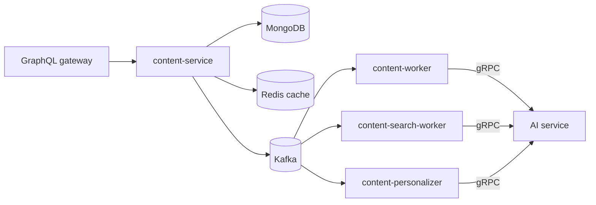

# Content service documentation

The Content service is Topos's Go GraphQL subgraph for posts, tags, drafts,
chats, and reader interactions. It also publishes events that let independent
workers generate summaries, index posts, and update recommendation profiles.

## Start here

1. [Quick start](getting-started/quickstart.md) — run the service with its dependencies.
2. [Architecture](concepts/architecture.md) — understand API, storage, cache, events, and workers.
3. [Data model](concepts/data-model.md) — see the logical MongoDB relationships and indexes.
4. [Publishing flow](concepts/publishing-flow.md) — follow a post through asynchronous work.

## Documentation by task

| Task | Read |
| --- | --- |
| Integrate with the GraphQL API | [GraphQL API](components/graphql-api.md) |
| Understand drafts and review | [Draft lifecycle](concepts/draft-lifecycle.md) |
| Understand chat persistence and citations | [Chat flow](concepts/chat-flow.md) |
| Debug late or failed AI work | [Reliability, retries, and DLQ](operations/reliability.md) |
| Run checks | [Testing](testing/overview.md) |

## Runtime responsibilities

The API and all three workers are distinct processes. This makes the caller's
response independent from summary generation, indexing, and profile updates.
