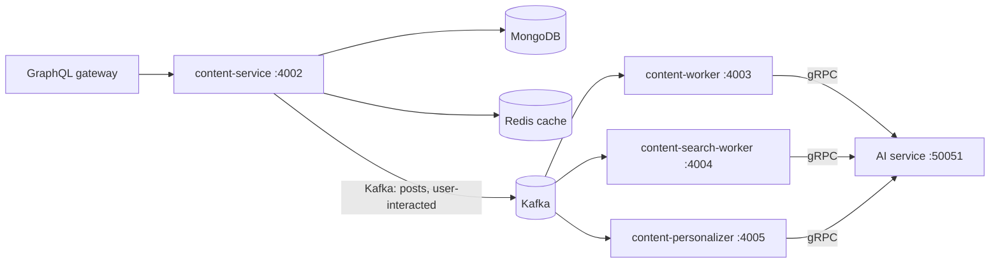

# Content service documentation

The Content service is the Go GraphQL subgraph that owns posts, tags, chats,
reader interactions, and the peer-review draft workflow. It also publishes the
Kafka events that drive summary generation, search indexing, and recommendation
profiles.

These pages explain how it works and how to run it, assuming no prior knowledge
of the service.

## New to this service?

Start here:

1. **[Quick start](getting-started/quickstart.md)** — get the service running
   and prove it works.
2. **[Architecture](concepts/architecture.md)** — see how the code is layered
   and what the five binaries each do.
3. **[Publishing flow](concepts/publishing-flow.md)** — follow one post from a
   mutation response through background AI work.

> **Read the [user service docs](../../user/docs/README.md) first?** Not
> required, but authentication is shared: this service verifies the JWT that the
> user service issues. See [Authentication](concepts/authentication.md).

## Documentation by topic

### Getting started

| Document | What you'll learn | When to read |
| --- | --- | --- |
| [Quick start](getting-started/quickstart.md) | Run the API and workers with Docker or on the host | First time using the service |
| [Configuration](getting-started/configuration.md) | Every setting, its default, and where it comes from | Setting up a new environment |

### Concepts

| Document | What you'll learn | When to read |
| --- | --- | --- |
| [Architecture](concepts/architecture.md) | How the code is layered, and why there are five binaries | Understanding the system |
| [Data model](concepts/data-model.md) | The collections, fields, indexes, and invariants | Changing or querying content |
| [Authentication](concepts/authentication.md) | How identity is derived and who may do what | Working with auth or permissions |
| [Publishing flow](concepts/publishing-flow.md) | What happens when a post is created, edited, or deleted | Debugging summaries or indexing |
| [Draft lifecycle](concepts/draft-lifecycle.md) | The peer-review states and the atomic review rules | Working on drafts |
| [Chat flow](concepts/chat-flow.md) | How conversations and citations are persisted | Working on chat |
| [Request flows](concepts/request-flows.md) | What happens inside each read query, step by step | Debugging a query |
| [Caching and resilience](concepts/caching-and-resilience.md) | Redis caching, circuit breakers, and degraded modes | Performance or reliability work |

### Components

| Document | What you'll learn | When to read |
| --- | --- | --- |
| [GraphQL API](components/graphql-api.md) | Every query and mutation, with auth requirements and examples | Integrating with the service |
| [Error handling](components/error-handling.md) | What each error means and what the client actually receives | Decoding a failed response |

### Operations

| Document | What you'll learn | When to read |
| --- | --- | --- |
| [Reliability, retries, and DLQ](operations/reliability.md) | Retry policy, dead-lettering, and replay | Debugging failed background work |
| [Health and observability](operations/health-and-observability.md) | Probe semantics, all 29 metrics, logs, and traces | Monitoring or debugging the service |

### Testing

| Document | What you'll learn | When to read |
| --- | --- | --- |
| [Testing overview](testing/overview.md) | Unit, integration, and load tests; coverage rules | Writing or running tests |

## Reading order by role

### New developer

1. [Quick start](getting-started/quickstart.md) — get it running
2. [Architecture](concepts/architecture.md) — understand the big picture
3. [Data model](concepts/data-model.md) — learn what is stored
4. [Publishing flow](concepts/publishing-flow.md) — see a post end to end
5. [GraphQL API](components/graphql-api.md) — learn the API

### Backend developer integrating with this service

1. [GraphQL API](components/graphql-api.md) — learn the API
2. [Authentication](concepts/authentication.md) — get a valid token and understand permissions
3. [Error handling](components/error-handling.md) — handle failures
4. [Request flows](concepts/request-flows.md) — understand pagination and hydration
5. [Testing overview](testing/overview.md) — verify your integration

### DevOps / SRE

1. [Quick start](getting-started/quickstart.md) — run it
2. [Configuration](getting-started/configuration.md) — configure it
3. [Health and observability](operations/health-and-observability.md) — set up probes, metrics, and alerts
4. [Reliability, retries, and DLQ](operations/reliability.md) — understand background failure
5. [Caching and resilience](concepts/caching-and-resilience.md) — understand degraded behaviour

### Contributor to this codebase

1. [Architecture](concepts/architecture.md) — the layers and their boundaries
2. [Data model](concepts/data-model.md) — indexes and invariants you must respect
3. [Error handling](components/error-handling.md) — the sentinel-error convention
4. [Testing overview](testing/overview.md) — where tests go and what must not need Docker

## Runtime responsibilities

The API and the three long-running workers are distinct processes. This makes a
caller's response independent from summary generation, indexing, and profile
updates.

In text: `content-service` reads and writes MongoDB, uses Redis as a
best-effort cache, and publishes to Kafka. The three workers consume from Kafka
and call the AI service over gRPC — the search worker writes to the vector
index, the personalizer updates recommendation profiles, and the summary worker
writes summaries back to MongoDB.

A fifth binary, `content-dlq-replay`, is run on demand rather than as a service;
see [Reliability, retries, and DLQ](operations/reliability.md).

## Related files

- **Service README**: [`../README.md`](../README.md) — overview and command reference
- **GraphQL schema**: [`../graph/schema.graphqls`](../graph/schema.graphqls)
- **Proto contract**: [`../proto/ai/ai_service.proto`](../proto/ai/ai_service.proto)
- **Environment template**: [`../.env.example`](../.env.example)
- **Compose stacks**: [`../infra/compose.yml`](../infra/compose.yml)
- **Build and run targets**: [`../Makefile`](../Makefile)
- **Project documentation**: [`../../../docs/README.md`](../../../docs/README.md)
