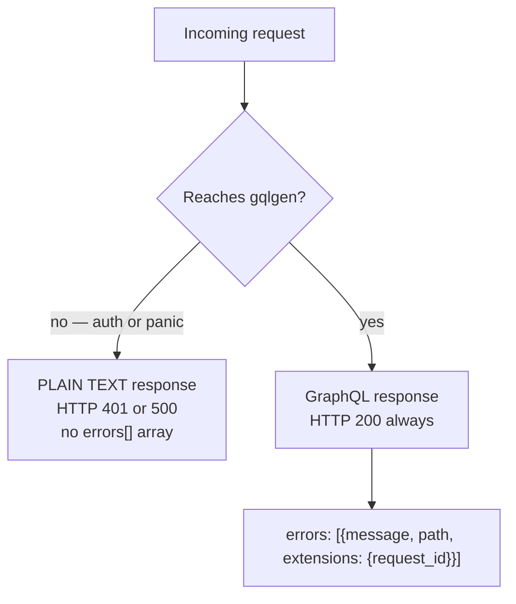
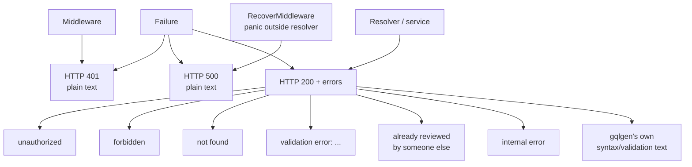

# Error handling

Every failure in this service ends up as one small, predictable shape —
unless it fails *before* GraphQL runs, in which case the shape is
completely different. Understanding that split is the difference between
an integration that retries correctly and one that silently swallows
failures.

## The two error surfaces



| Surface | HTTP status | Body shape | When |
| --- | --- | --- | --- |
| Pre-GraphQL | 401 / 500 | Plain text | Bad `Authorization` header, recovered panic |
| GraphQL | **200** (even on failure) | `{"errors": [...]}` | Everything else |

> **GraphQL errors always ride on HTTP 200.** An HTTP-level alert on
> `status >= 500` will not see a single resolver failure. That is exactly
> why `content_graphql_errors_total` exists.

## The exact response a client receives

```json
{
  "errors": [
    {
      "message": "validation error: title is too long (max 200 bytes)",
      "path": ["createPost"],
      "extensions": { "request_id": "665f1c2e-8a3b-4f00-9123-456789abcdef" }
    }
  ]
}
```

Three fields, no more:

| Field | Always present? | Notes |
| --- | --- | --- |
| `message` | yes | The only thing you can reliably branch on |
| `path` | when the failure is in a field | Which field failed |
| `extensions.request_id` | when a request ID was set | Correlate with server logs |

> ### The `kind` extension never reaches you
>
> Internally every error is tagged with a `kind` — `unauthorized`,
> `forbidden`, `not_found`, `validation`, `conflict`, `unavailable`,
> `internal`, `client`. It is attached in `mapDomainError` and used to pick the
> message and increment a metric.
>
> But `PresentError` in [`graph/errors.go`](../../graph/errors.go)
> rebuilds the error for the wire and sets `extensions` to **only**
> `{request_id}`. The `kind` is deliberately discarded.
>
> **Consequence: you must branch on the message string.** There is no
> machine-readable code in the response.

## The message catalogue

Produced by `mapDomainError`. This is the complete set:

| Internal sentinel | `kind` (server-side) | Message you receive |
| --- | --- | --- |
| `domain.ErrUnauthorized` | `unauthorized` | `unauthorized` |
| `domain.ErrForbidden` | `forbidden` | `forbidden` |
| `domain.ErrNotFound` | `not_found` | `not found` |
| `domain.ErrValidation` | `validation` | the full wrapped text, e.g. `validation error: title is required` |
| `domain.ErrConflict` | `conflict` | `already reviewed by someone else` |
| `domain.ErrAIUnavailable` | `unavailable` | `AI service is temporarily unavailable, please try again` |
| anything unclassified | `internal` | `internal error` |
| gqlgen validation/protocol | `client` | gqlgen's own message |

Three rules follow from that table:

1. **`forbidden` and `unauthorized` are always bare.** The wrapped
   explanation — `only the author can resubmit`, `drafts must be
   reviewed by another user` — **stays on the server**. You get the
   category, not the reason.
2. **`validation` messages are detailed**, because that branch forwards
   `err.Error()` verbatim. This is the one kind where the human-readable
   text is intended for the client.
3. **`conflict` is a single hardcoded sentence** —
   `already reviewed by someone else` — regardless of which transition
   lost the race.

### Recognising a validation message

Validation messages always start with the sentinel's own text:

```
validation error: title is required
validation error: title is too long (max 200 bytes)
validation error: body is required
validation error: body is too long (max 1048576 bytes)
validation error: too many tags (max 20)
validation error: tag is too long (max 64 bytes)
validation error: slug "my-post" is already taken
validation error: prompt exceeds 5000 characters
validation error: only rejected drafts can be resubmitted
validation error: no changes to resubmit
validation error: only pending drafts can be withdrawn
validation error: approved drafts cannot be rejected
```

A safe client-side classifier:

```ts
function classify(message: string): string {
  if (message.startsWith("validation error:")) return "invalid_input";
  if (message === "unauthorized") return "needs_auth";
  if (message === "forbidden") return "wrong_user";
  if (message === "not found") return "missing";
  if (message === "already reviewed by someone else") return "stale";
  return "server";
}
```

## <a name="internal-error-is-overused"></a>`internal error` is over-used

`internal error` means "something we did not classify failed". Because
only the six sentinels are classified, a plain `errors.New(...)` from a
service silently becomes `internal error` even when the cause is
trivially a client mistake.

The clearest example is `renameChat`:

```go
// internal/service/chat_service.go
if title == "" {
    return nil, fmt.Errorf("title must not be empty")   // ← not wrapped with ErrValidation
}
```

The client sends `title: ""` and receives:

```json
{"errors":[{"message":"internal error"}]}
```

Meanwhile the server logs `graphql operation failed` with the real
reason, and increments
`content_graphql_errors_total{operation="renameChat", kind="internal"}`.

| Symptom | Explanation |
| --- | --- |
| `internal error` for obviously bad input | The service forgot to wrap with `domain.ErrValidation` |
| An `internal error` with no server log | Not possible — every one is logged with `error`, `request_id`, and `operation` |
| High `kind="internal"` rate | Real bugs or missing sentinel wrappers; either way it needs a human |

**When debugging, always pair the client message with the server log**
using `extensions.request_id`.

## Panics

`RecoverMiddleware` catches panics in the handler chain before gqlgen
can:

```
HTTP/1.1 500 Internal Server Error
Content-Type: text/plain

internal server error
```

- **Plain text**, not JSON, not GraphQL.
- The panic value and full stack are logged server-side.
- `content_http_panics_total` increments.
- A panic *inside a resolver* is instead caught by gqlgen's recover func
  (`graph.RecoverError`) and surfaces as a normal GraphQL
  `{"message": "internal error"}` with HTTP 200.

So: **500 plain text = panicked outside resolvers; 200 with
`internal error` = panicked inside a resolver or returned an
unclassified error.**

## Bad tokens: a third shape

`AuthMiddleware` runs before gqlgen. A *present but invalid* token never
becomes a GraphQL error:

```
HTTP/1.1 401 Unauthorized
Content-Type: text/plain

unauthorized: invalid or expired token
```

| You send | What you get |
| --- | --- |
| No `Authorization` header | GraphQL error `unauthorized` (HTTP 200), if the operation needs identity |
| `Bearer <invalid>` | **HTTP 401 plain text**, regardless of the operation |
| `Basic xyz` | HTTP 401 `unauthorized: unsupported authorization scheme` |

See [Authentication](../concepts/authentication.md#why-the-distinction-matters).

## Every way a response can fail



| You see | Meaning | Retry? |
| --- | --- | --- |
| HTTP 401 plain text | Token rejected | No — fix the token |
| HTTP 500 plain text | Panic outside a resolver | Yes, with backoff |
| `unauthorized` | Operation needs identity; none supplied | No — send a token |
| `forbidden` | Authenticated as the wrong user | No |
| `not found` | Resource missing | No — including `post(id)` for a missing post |
| `validation error: …` | Bad input, with details | No — fix the input |
| `already reviewed by someone else` | Lost a race on a draft | Optionally, by re-reading |
| `internal error` | Unclassified failure | Maybe — check the server log |
| gqlgen message | Query syntax or validation problem | No |

## Metrics

```promql
# failures by operation and kind
content_graphql_errors_total

# rate per kind
sum by (kind) (rate(content_graphql_errors_total[5m]))

# real server-side failures only
sum by (operation) (
  rate(content_graphql_errors_total{kind="internal"}[5m])
)
```

| Kind | Alert? |
| --- | --- |
| `internal` | **Yes** — indicates a real failure |
| `client` | No — malformed queries from a caller |
| `unauthorized`, `forbidden` | Watch for spikes (token misconfiguration) |
| `validation` | Watch — a client may be sending bad data in a loop |
| `not_found` | Usually benign |
| `conflict` | Low volume; expected under concurrent review |

## Design notes

| Decision | Consequence |
| --- | --- |
| Sentinel values, not error types | One small set crosses every layer; easy to test with `errors.Is` |
| `kind` stripped before the wire | Clients branch on strings; no stable machine-readable code |
| `validation` forwards the full text | Only input errors are self-describing |
| Everything else is generic | No internal details leak, at the cost of `internal error` being vague |
| Errors counted by `kind` | Operators can separate real failures from client mistakes |

Compare with the [user service](../../../user/docs/components/error-handling.md),
which uses Prisma error codes and HTTP 400s for some failures. The two
services do **not** share an error format beyond GraphQL itself.

## Next steps

- [Authentication](../concepts/authentication.md) — where 401s come from
- [GraphQL API](graphql-api.md) — which operations produce which errors
- [Health and observability](../operations/health-and-observability.md) — alerting on `kind="internal"`
