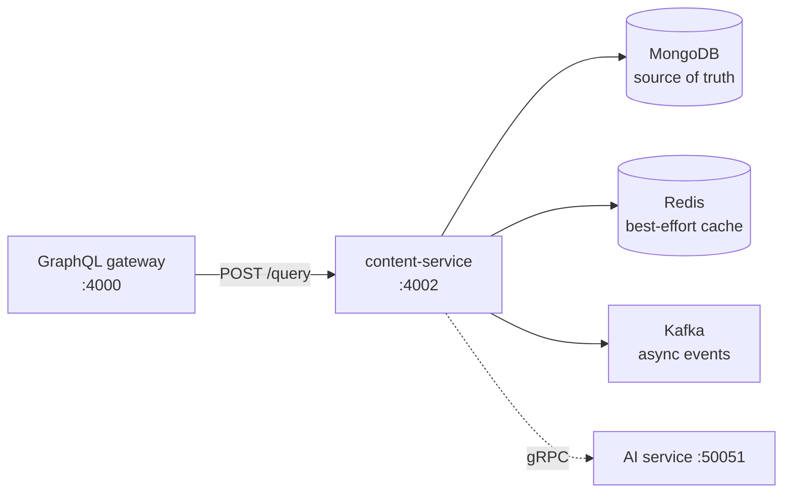
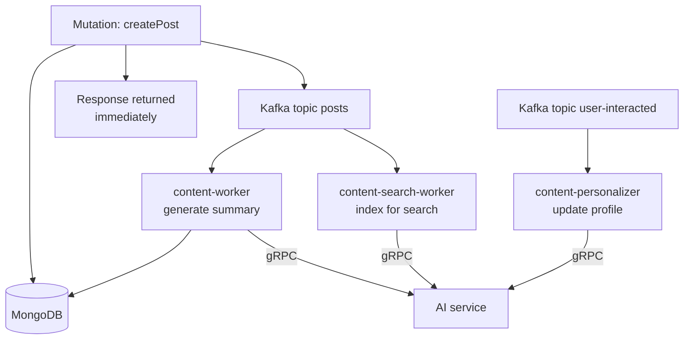
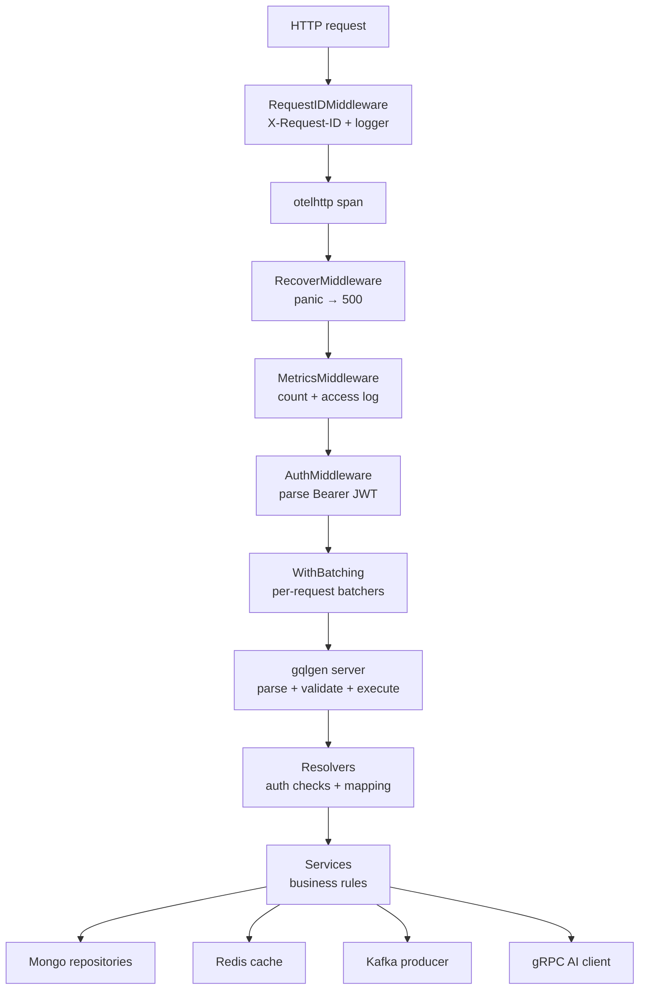
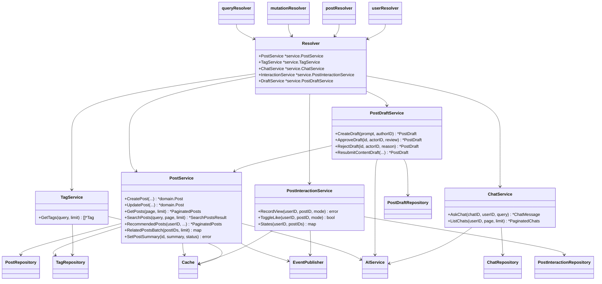
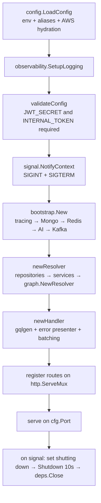

# Content service architecture

This document explains how the Content service is structured: what runs when a
request arrives, which type owns which responsibility, why there are five
binaries, and how startup works.

If you are new, read the [overview](#overview) and
[how the code is organized](#how-the-code-is-organized) first, then use the rest
as a reference.

## Overview

`content-service` is a single Go process serving port `4002`. It hosts:

1. **A GraphQL subgraph** at `POST /query` — every read and write.
2. **Operational endpoints** — `/healthz`, `/readyz`, `/metrics`.
3. **One internal HTTP route** — `GET /internal/posts/{id}`, which the AI
   service calls to fetch a post body for grounding. It is guarded by a shared
   `X-Internal-Secret` header.

It talks to four things:



**Why is Redis best-effort?** Content must be readable and writable even when
the cache is broken, so MongoDB is required and Redis is not. Every cache
operation swallows its own errors — see
[Caching and resilience](caching-and-resilience.md).

**Why is the AI link dotted?** The API calls the AI service for a handful of
*optional* features: generating tags, drafting content, search, and
recommendations. A `createPost` does not wait on it. Background enrichment
happens in workers instead — see [Publishing flow](publishing-flow.md).

**Why a subgraph?** Topos splits its GraphQL API across services and merges
them behind one gateway. Each backend service is a *subgraph*. This one owns
`Post`, `Tag`, `Chat`, and the draft types; the user service owns `User`.

## Why five processes



| Binary | Consumes | Needs Mongo | Needs Redis | Needs Kafka | Needs AI |
| --- | --- | --- | --- | --- | --- |
| `content-service` | — (publishes only) | yes | yes | yes (produce) | yes |
| `content-worker` | `posts` | yes | yes | yes | yes |
| `content-search-worker` | `posts` | **no** | **no** | yes | yes |
| `content-personalizer` | `user-interacted` | **no** | **no** | yes | yes |

The search worker indexes **the event payload alone** — it never re-reads
MongoDB, which is why it needs no database. The summary worker deliberately
*does* re-read the post, because the post may have been edited or deleted since
the event was published.

Construction follows from this: `internal/bootstrap` has exactly two
constructors.

- **`bootstrap.New`** — tracing, Mongo, Redis, AI client, Kafka producer.
  Used by `content-service` and `content-worker`.
- **`bootstrap.NewSearch`** — tracing, AI client, Kafka producer only. Used by
  `content-search-worker` and `content-personalizer`.

## How a request travels

Every GraphQL operation passes through the same stops, in this order:



| Stop | Source file | Responsibility |
| --- | --- | --- |
| Request ID | [`internal/middleware/observability.go`](../../internal/middleware/observability.go) | Accepts or generates `X-Request-ID`, attaches a per-request logger |
| Tracing | [`cmd/server/main.go`](../../cmd/server/main.go) | `otelhttp` wraps `/query` in a span named `graphql` |
| Recovery | [`internal/middleware/recover.go`](../../internal/middleware/recover.go) | Panic → plain HTTP 500, counts `content_http_panics_total` |
| Metrics | [`internal/middleware/observability.go`](../../internal/middleware/observability.go) | Counts HTTP requests and emits one access log line |
| Auth | [`internal/middleware/auth.go`](../../internal/middleware/auth.go) | Parses the `Authorization` header; stores the user ID in context |
| Batching | [`graph/batch.go`](../../graph/batch.go) | Coalesces `related`, entity, and interaction lookups within one request |
| Execution | [`graph/generated.go`](../../graph/generated.go) | gqlgen: parse, validate, execute |
| Resolvers | [`graph/schema.resolvers.go`](../../graph/schema.resolvers.go), [`graph/helpers.go`](../../graph/helpers.go) | Auth checks, argument handling, domain→model mapping |
| Services | [`internal/service/`](../../internal/service) | Business rules; the only layer that composes repositories, cache, and events |
| Repositories | [`internal/repository/`](../../internal/repository) | All MongoDB queries |

Resolvers never build a MongoDB filter and services never build a GraphQL
response. That split is what lets most rules be tested with plain fakes — see
[`internal/service/post_service_test.go`](../../internal/service/post_service_test.go).

### Middleware order is not symmetrical

The chain in [`cmd/server/main.go`](../../cmd/server/main.go) wraps in this
order: `RequestID → otelhttp → Recover → Metrics → Auth → batching → gqlgen`.

Two consequences worth knowing:

- **Auth runs after metrics**, so an unauthenticated request is still counted
  and logged.
- **Auth returning 401 never becomes a GraphQL error.** A present-but-invalid
  `Authorization` header produces a plain-text HTTP 401 before gqlgen runs. A
  *missing* header passes through as anonymous, and the resolver decides what
  that means — see [Authentication](authentication.md).

## How the code is organized

### Type diagram

The names below are the real types and interfaces in the repository, with the
file that defines each one.



| Type or interface | File | What it owns |
| --- | --- | --- |
| `Resolver` | [`graph/resolver.go`](../../graph/resolver.go) | The five services, handed to every resolver |
| `queryResolver`, `mutationResolver`, `postResolver`, `userResolver` | [`graph/schema.resolvers.go`](../../graph/schema.resolvers.go) | The gqlgen resolver implementations (unexported, each embeds `*Resolver`) |
| `PostService` | [`internal/service/post_service.go`](../../internal/service/post_service.go) | Posts: validation, slugs, ownership, search/recommend hydration, cache invalidation, event publishing |
| `PostDraftService` | [`internal/service/post_draft_service.go`](../../internal/service/post_draft_service.go) | Draft creation, atomic review transitions, publishing on approval |
| `ChatService` | [`internal/service/chat_service.go`](../../internal/service/chat_service.go) | Chat ownership, message history, the AI call ordering |
| `PostInteractionService` | [`internal/service/post_interaction_service.go`](../../internal/service/post_interaction_service.go) | View/like/save idempotency and their events |
| `TagService` | [`internal/service/tag_service.go`](../../internal/service/tag_service.go) | Tag lookup and suggestion |
| `PostRepository` and friends | [`internal/domain/post.go`](../../internal/domain/post.go) (interface), [`internal/repository/`](../../internal/repository) (Mongo impl) | Every MongoDB query |
| `Cache` | [`internal/cache/cache.go`](../../internal/cache/cache.go) | Redis with a circuit breaker; fail-open by construction |
| `EventPublisher` | [`internal/domain/event.go`](../../internal/domain/event.go) (interface), [`internal/infrastructure/messaging/kafka_producer.go`](../../internal/infrastructure/messaging/kafka_producer.go) (impl) | Publishing post and interaction events |
| `AIService` | [`internal/domain/ai.go`](../../internal/domain/ai.go) (interface), [`internal/infrastructure/ai/client.go`](../../internal/infrastructure/ai/client.go) (impl) | All 17 gRPC calls to the AI service, with per-domain breakers |

Three more pieces are not services but shape every file:

- **`domain.Err*` sentinels** ([`internal/domain/errors.go`](../../internal/domain/errors.go)) —
  six error values (`ErrNotFound`, `ErrForbidden`, `ErrUnauthorized`,
  `ErrConflict`, `ErrValidation`, `ErrAICircuitOpen`) that carry meaning across
  layer boundaries. See [Error handling](../components/error-handling.md).
- **`pagination.Normalize`** ([`internal/pagination/pagination.go`](../../internal/pagination/pagination.go)) —
  the single place `page` and `limit` are clamped.
- **`config.Config`** ([`internal/config/config.go`](../../internal/config/config.go)) —
  loaded once at startup, validated per-binary. See
  [Configuration](../getting-started/configuration.md).

### Project structure

```
services/content/
├── graph/
│   ├── schema.graphqls     # GraphQL schema (the API contract)
│   ├── resolver.go         # Resolver root struct
│   ├── schema.resolvers.go # Query/Mutation/Post/User resolvers (gqlgen-managed)
│   ├── entity.resolvers.go # Federation entity resolvers
│   ├── federation.go       # Generated federation plumbing — do not edit
│   ├── generated.go        # Generated gqlgen server — do not edit
│   ├── batch.go            # Per-request request coalescing
│   ├── errors.go           # Error presenter and domain→GraphQL mapping
│   ├── helpers.go          # Model mapping, deref helpers, mode conversion
│   └── model/              # Generated Go types
├── cmd/
│   ├── server/             # content-service
│   ├── worker/             # content-worker (summaries)
│   ├── search-worker/      # content-search-worker (indexing)
│   ├── personalizer/       # content-personalizer (profiles)
│   └── dlq-replay/         # content-dlq-replay (on demand)
├── internal/
│   ├── bootstrap/          # Dependency construction (New / NewSearch)
│   ├── cache/              # Redis + circuit breaker
│   ├── config/             # Env parsing, aliases, AWS hydration
│   ├── db/                 # Mongo connect + index creation
│   ├── dlq/                # Replay logic
│   ├── domain/             # Types, interfaces, sentinel errors
│   ├── health/             # Liveness/readiness handlers
│   ├── infrastructure/
│   │   ├── ai/             # gRPC client, breakers, noop fallback
│   │   └── messaging/      # Kafka producer + DLQ envelope
│   ├── metrics/            # Prometheus definitions
│   ├── middleware/         # auth, internal auth, metrics, recovery, request ID
│   ├── observability/      # slog setup, OTLP tracing
│   ├── pagination/         # Normalize(page, limit)
│   ├── repository/         # MongoDB implementations
│   ├── service/            # Business rules
│   ├── shutdown/           # Process-wide shutting-down flag
│   ├── slug/               # URL slug generation
│   ├── testutil/           # Mocks and Kafka test helpers
│   └── worker/             # Kafka consumer runners and message handlers
├── proto/ai/               # Generated gRPC stubs
├── load-tests/             # k6 scenarios + Go event producer
├── infra/                  # Compose stacks (dev, prod, load)
└── docs/                   # This documentation
```

`graph/generated.go` and `graph/model/` are gqlgen output and are **committed**;
`proto/ai/` is protoc output. Never edit generated files by hand.

## Startup sequence

`cmd/server/main.go` is deliberately short. In order:



1. **`config.LoadConfig()`** reads `.env`, applies `CONTENT_*` aliases, and — if
   `ENV_TYPE=prod` — hydrates missing values from AWS SSM and Secrets Manager.
   Configuration is *not* schema-validated the way the user service is; missing
   values fall back to defaults, and only `JWT_SECRET` and `INTERNAL_TOKEN` are
   checked afterwards by `validateConfig`.
2. **`bootstrap.New()`** builds dependencies in order. Mongo is **best-effort**:
   the budget is 5 attempts with exponential backoff (1s, 2s, 4s, 8s, 16s)
   and a 5 s ping timeout each; a bad URI fails immediately. If the budget is
   exhausted the service boots with a lazy client and reports `/readyz` 503
   rather than crash-looping.
   Redis, Kafka, and the AI client never fail startup — they degrade at call
   time. Only tracing setup can abort startup.
3. **`newResolver()`** constructs the five repositories and five services by
   hand — there is no dependency-injection framework.
4. **`serve()`** starts the HTTP server. On a signal it flips the
   `shutdown.SetShuttingDown(true)` flag (probes immediately return 503), calls
   `srv.Shutdown` with a 10 s deadline, then `deps.Close()` tears down in
   reverse order: producer → AI → cache → Mongo → tracing.

### Degraded boot

| Dependency at startup | What happens |
| --- | --- |
| MongoDB unreachable | Boot proceeds with a lazy client; `/readyz` → 503 `degraded` |
| Redis unreachable | Boot proceeds; the cache breaker opens and every read falls through to Mongo |
| Kafka unreachable | Boot proceeds; publishing fails per-call, `/readyz` → 503 |
| AI unreachable | Boot proceeds (lazy gRPC dial); breakers open at call time |
| OTLP endpoint unset | Tracing disabled — the normal local mode |
| OTLP exporter cannot be created | **Startup fails** — the only hard failure (`setup tracing: …`) |

The gRPC dial used by the exporter is lazy, so a *reachable-but-down*
collector does not usually abort startup; it fails later at export time.
An invalid endpoint configuration does abort.

This is what `make up WITH_MONGO=0` and friends exercise. See
[Caching and resilience](caching-and-resilience.md) for the full failure matrix.

## Why this design

| Decision | Benefit |
| --- | --- |
| **Resolvers → services → repositories** | Rules are testable without GraphQL or MongoDB |
| **Auth in middleware *and* resolvers** | Middleware parses; resolvers decide. Anonymous access is a first-class case, not an afterthought |
| **Request coalescing in `graph/batch.go`** | A page of 20 posts with `related` and `likedByMe` costs one AI call and one Mongo query, not 40 |
| **Fail-open cache with a breaker** | A Redis outage cannot stop people reading posts |
| **Workers re-read state from Mongo** | A stale or deleted post is handled correctly regardless of event ordering |
| **Two bootstrap constructors** | The search worker genuinely needs no database, so it takes none |
| **Sentinel errors, not error types** | One small set of values crosses every boundary and maps cleanly to client messages |
| **Best-effort MongoDB boot** | A database blip during deploy degrades readiness instead of crash-looping every replica |

## Next steps

- [Data model](data-model.md) — what is stored and how it is indexed
- [Authentication](authentication.md) — who may call what
- [Request flows](request-flows.md) — a query end to end
- [Publishing flow](publishing-flow.md) — the asynchronous half of the service
- [GraphQL API](../components/graphql-api.md) — the API contract
