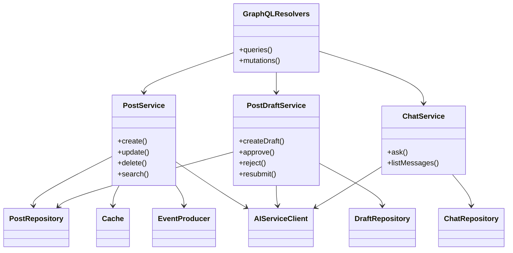

# Content service architecture

The service separates transport, business rules, storage, cache, event
publishing, and background work. The GraphQL API owns the user-facing content
operations; workers consume the resulting events later.

This is a responsibility diagram, not a claim that every item is a single Go
class. The concrete domain interfaces are in `internal/domain/`; repositories,
cache, Kafka producer, and gRPC AI client are implementations of those
boundaries.

## Startup and degraded behaviour

`internal/bootstrap` wires MongoDB, Redis, Kafka, the AI client, and tracing.
MongoDB can start in a degraded state, so the process remains alive while its
readiness reports it cannot serve normally. Redis cache failures are fail-open:
reads fall back to MongoDB rather than treating cached data as required.

The search worker needs only Kafka, tracing, and the AI client; it does not need
MongoDB or Redis to index event payloads. This distinction is visible in
`bootstrap.NewSearch`.
