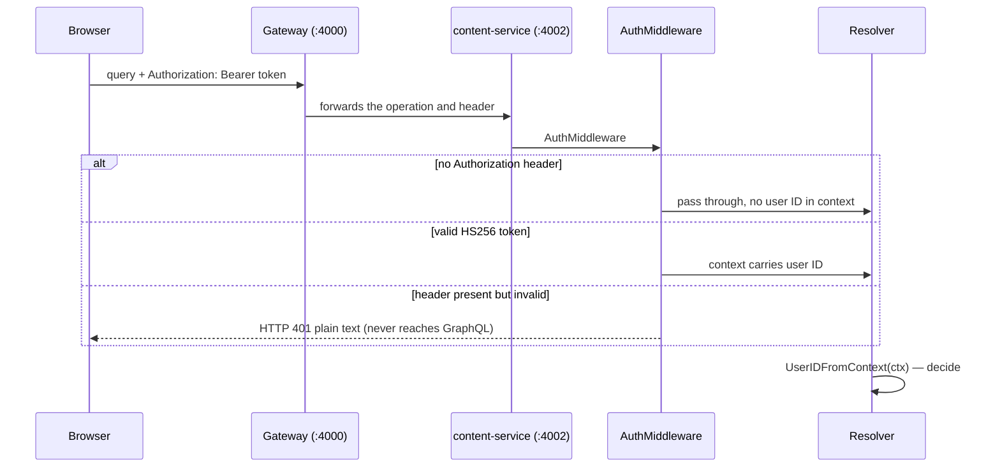
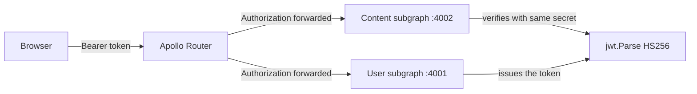

# Authentication and authorization

How the Content service decides who is calling, what they may do, and what
happens when they are not who they say they are.

Two properties shape everything below:

- **Stateless.** There are no sessions here. This service reads the same HS256
  JWT that the [user service](../../../user/docs/concepts/authentication-flow.md)
  issues, and verifies it independently.
- **Anonymous is normal.** Most read queries work without a token. Only some
  operations require identity, and asking for an unavailable field on a public
  query returns `null` rather than an error.

## Where identity comes from



The middleware is in
[`internal/middleware/auth.go`](../../internal/middleware/auth.go). It does
three things and nothing else:

1. **No `Authorization` header** → pass through as anonymous. No error.
2. **Header present but invalid** → **HTTP 401**, plain text, *before* gqlgen
   runs. The response is not a GraphQL error and has no `errors[]` array.
3. **Valid** → put the user ID in the request context under the `userId` key.

The resolver then calls `middleware.UserIDFromContext(ctx)` and decides what
anonymous means for *its* operation.

### Why the distinction matters

| You send | Result |
| --- | --- |
| Nothing | Operation runs anonymously; a protected one fails with a GraphQL error saying `unauthorized` |
| `Authorization: Bearer <expired or wrong-secret token>` | HTTP **401** with a plain-text message like `unauthorized: invalid or expired token` |
| `Authorization: Basic xyz` | HTTP **401** `unauthorized: unsupported authorization scheme` |

This trips up clients: **a bad token produces a completely different response
shape than no token.** If your HTTP client only inspects GraphQL `errors[]`, a
401 will look like a transport failure.

## What the token must satisfy

Parsed with `golang-jwt/jwt/v5` in `userIDFromHeader`:

| Check | Requirement |
| --- | --- |
| Scheme | `Bearer ` prefix |
| Algorithm | `HS256` only — other algorithms are rejected |
| Secret | `JWT_SECRET`, default issuer `user-service`, audience `topos` |
| `exp` | Must be present and in the future |
| `id` claim | Must be a **non-empty string** |

The `id` claim is deliberately a string. JWT libraries decode JSON numbers as
`float64`, which loses precision above 2^53 — a numeric user ID could silently
become a different number. A token carrying a numeric `id` is rejected with
`token is missing a valid id claim`.

> **`JWT_SECRET`, `JWT_ISSUER`, and `JWT_AUDIENCE` must match the user
> service exactly.** If they drift, tokens minted by the user service are
> rejected here. See [Configuration](../getting-started/configuration.md).

## Who may do what

`AuthMiddleware` only parses. The **resolver** enforces. Every resolver starts
by reading the user ID from context and returning `domain.ErrUnauthorized` when
identity is required but absent.

### Queries

| Operation | Auth | Behaviour without a token |
| --- | --- | --- |
| `posts` | Public | Works normally |
| `post(id)` | Public | Works normally |
| `tags` | Public | Works normally |
| `postsByTag` | Public | Works normally |
| `searchPosts` | Public | Works normally |
| `recommendedPosts` | **Required** | `unauthorized` error |
| `chats` | **Required** | `unauthorized` error |
| `chat(id)` | **Required** | `unauthorized` error |
| `chatMessages(chatId)` | **Required** | `unauthorized` error |
| `postDrafts` | **Required** | `unauthorized` error |
| `myPostDrafts` | **Required** | `unauthorized` error |

`recommendedPosts` needs identity because it personalises a feed *for that
user*. The draft queues need it because both are scoped to a viewer: the
community queue excludes your own drafts, and "mine" is meaningless without a
caller.

### Mutations

**All 18 mutations require authentication.** They are:

```
createPost            updatePost             deletePost
generateTags          generatePostContent
createChat            renameChat             deleteChat            askChat
recordPostView        likePost               savePost
createPostDraft       createContentDraft     resubmitContentDraft
approvePostDraft      rejectPostDraft        deletePostDraft
```

`generateTags` and `generatePostContent` check only that *some* valid identity
exists — they ignore the value, because they cost AI time and should not be a
publicly callable proxy for the AI service.

### Field-level behaviour

Not everything on an authenticated operation is gated the same way:

| Field | Anonymous result |
| --- | --- |
| `Post.related` | Works normally — no personalisation needed |
| `Post.likedByMe` | `false` |
| `Post.savedByMe` | `false` |
| `User.email` | Not a field on this subgraph — owned by the user service |

`likedByMe` and `savedByMe` return the **empty state rather than an error** so
that a public `posts` listing does not break when the viewer is signed out
([`interactionState`](../../graph/helpers.go)).

## Ownership rules

Authentication says *who you are*; these rules say *what you may do with it*.
Violations produce `domain.ErrForbidden` (`forbidden`), not `unauthorized`.

| Resource | Rule | Enforced in |
| --- | --- | --- |
| Post update / delete | Only the post's `authorId` | `PostService.UpdatePost`, `DeletePost` |
| Chat read / rename / delete / ask | Only the chat's `userId` | `ChatService.GetChat` |
| Draft review (approve / reject) | The reviewer must **not** be the author | `PostDraftService.authorizedDraft` |
| Draft resubmit | Only the author | `PostDraftService.ResubmitContentDraft` |
| Draft withdraw | Only the author, and only while `PENDING` | `PostDraftService.WithdrawDraft` |

The author-cannot-review rule means **you need at least two accounts** to walk
the draft lifecycle. That is intentional: peer review is the whole point.

### Layers of defence

Resolvers check identity, but **services re-check ownership**. A resolver that
forgot to gate a call still cannot delete someone else's post, because
`PostService.DeletePost` compares `AuthorID` to the actor itself. Tests cover
this at the service layer, which is where it belongs.

## The internal API

`GET /internal/posts/{id}` is a separate surface used by the AI service to fetch
a post body when answering a chat question.

```http
GET /internal/posts/665f1c2e8a3b2f0012345678
X-Internal-Secret: <INTERNAL_TOKEN>
```

| Condition | Result |
| --- | --- |
| Header matches `INTERNAL_TOKEN` | `200 {"id","title","body"}` |
| Header missing or wrong | `401 unauthorized` |
| Server `INTERNAL_TOKEN` empty | **Everything is denied** — an empty server secret fails closed, not open |
| Post does not exist | `404 post not found` |

The comparison uses `crypto/subtle.ConstantTimeCompare`, so a timing attack
cannot walk the token character by character.

`content-service` **refuses to start without `INTERNAL_TOKEN`** — see
`validateConfig` in [`cmd/server/main.go`](../../cmd/server/main.go).

> This endpoint is the reason the header exists at all. It is not a user-facing
> API and must never be exposed through the gateway.

## Cross-service picture



The gateway forwards `Authorization` to whichever subgraph resolves the
operation. Neither service calls the other to check a token — **the shared
secret is the contract.**

| Variable | User service | Content service | Must match |
| --- | --- | --- | --- |
| Secret | `USER_JWT_SECRET` → `JWT_SECRET` | `CONTENT_JWT_SECRET` → `JWT_SECRET` | yes |
| Issuer | `JWT_ISSUER` (default `user-service`) | `JWT_ISSUER` (default `user-service`) | yes |
| Audience | `JWT_AUDIENCE` (default `topos`) | `JWT_AUDIENCE` (default `topos`) | yes |
| Expiry | `JWT_EXPIRES_IN` (default `7d`) | *(not read — `exp` is only verified)* | n/a |

The local stack's env template spells this out:
`infrastructure/docker/local/.env.local.example` notes that `USER_JWT_SECRET`
and `CONTENT_JWT_SECRET` must be the same value.

Note that the content service never *issues* tokens and does not care how long
they last; it only verifies them.

## Troubleshooting

| Symptom | Likely cause |
| --- | --- |
| Plain-text HTTP 401, no `errors[]` array | Token present but invalid — expired, wrong secret, non-string `id`, or non-`Bearer` scheme |
| GraphQL error `unauthorized` on `chats` or `myPostDrafts` | No `Authorization` header sent at all |
| `unauthorized` on every mutation | Header missing — check the browser is actually attaching the token |
| `forbidden` on `updatePost` | You are not the post's author |
| `forbidden` on `approvePostDraft` | You are approving your own draft — use a second account |
| Works against `:4001`, fails at `:4002` | `JWT_SECRET` differs between the user and content services |
| `401 unauthorized` from `/internal/posts/{id}` | Missing `X-Internal-Secret`, or `INTERNAL_TOKEN` differs on the caller |
| Service exits immediately at startup | `JWT_SECRET` or `INTERNAL_TOKEN` is empty — both are required |

## Next steps

- [GraphQL API](../components/graphql-api.md) — auth requirements per operation
- [Error handling](../components/error-handling.md) — what `unauthorized` and `forbidden` look like on the wire
- [Configuration](../getting-started/configuration.md) — JWT and secret settings
- [User service: authentication flow](../../../user/docs/concepts/authentication-flow.md) — how the token is created
