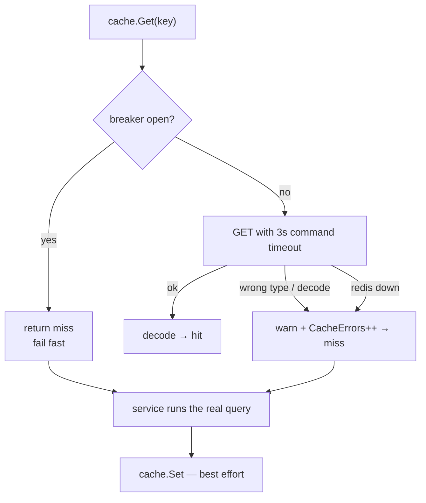
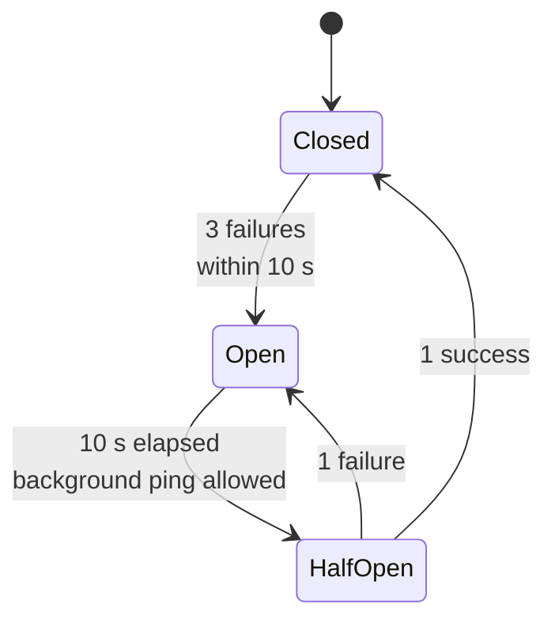
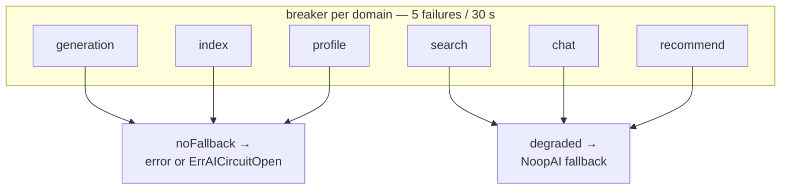
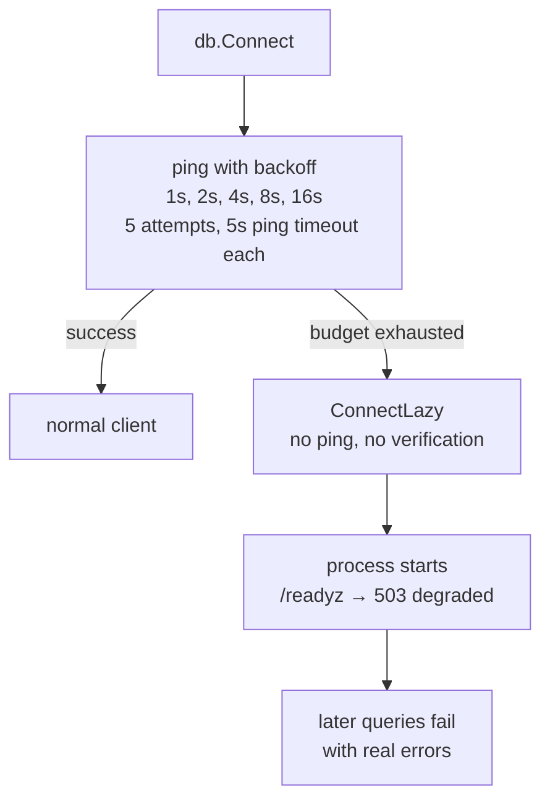

# Caching and resilience

Two of this service's design goals conflict: content must always be
readable, but the infrastructure behind it will fail. The resolution is
a strict rule — **MongoDB is required, everything else is optional** —
and a set of circuit breakers that make degradation fast and visible
instead of slow and silent.

This page explains each dependency's failure behaviour, the two circuit
breakers, and what your application sees at every level of degradation.

## The resilience contract

| Dependency | Required to boot | Failure at call time | Result |
| --- | --- | --- | --- |
| MongoDB | No (degraded boot) | Queries fail | `internal error` |
| Redis | No | Swallowed | Correct, slower |
| Kafka | No | Swallowed | Events lost, mutation still succeeds |
| AI service | No | Fallback or error | Depends on the operation |
| Tracing exporter | **Yes** | — | Startup aborts |

Only tracing can stop the process from starting. Everything else is
designed to be absent.

## Redis: fail-open caching

### The cache is a cache, never a source of truth

Every Redis operation in [`internal/cache/cache.go`](../../internal/cache/cache.go)
returns a *miss* or *no-op* on failure rather than an error. There are no
code paths where a Redis outage produces a client-visible failure.



### Timeouts and retries

Explicitly set so behaviour never silently depends on `go-redis`
defaults:

| Setting | Value |
| --- | --- |
| Dial timeout | 2 s |
| Command timeout | 3 s |
| Client retries | 3 (backoff 50–500 ms) |
| **Worst-case block per Redis call** | ~10 s without a breaker |

That last row is the whole reason the breaker exists: an unreachable
Redis would otherwise add seconds to every request.

### The cache circuit breaker



| Parameter | Value | Constant |
| --- | --- | --- |
| Failures to open | 3 | `cacheFailureThreshold` |
| Successes to close | 1 | `cacheSuccessThreshold` |
| Reset window | 10 s | `cacheResetWindow` |
| Probe | Background `PING` every 10 s in `reconnectLoop` | |

While open, `canProceed()` is false, so `Get` returns a miss
immediately and `Set` is skipped — **zero Redis traffic, zero added
latency**. A background goroutine pings every 10 seconds; one success
closes the breaker and normal caching resumes without a restart.

State is exported as `content_cache_breaker_state` (0 closed, 1 open,
2 half-open).

### Single-flight coalescing

`cache.Coalesce(key, fill)` merges concurrent fills of the same key into
one call. Two simultaneous `posts(page:1)` requests with a cold cache
produce **one** Mongo query; the second waits on a channel and shares
the result.

This works even with no Redis at all — coalescing is in-process, keyed
per instance.

### Redis key inventory

| Key | TTL | Invalidated by |
| --- | --- | --- |
| `post:{id}` | 5 min | `post:*` on create/update/delete |
| `posts:{page}:{limit}` | 1 min | `posts:*` |
| `posts:author:{id}:{page}:{limit}` | 1 min | `posts:*` |
| `posts:tag:{tag}:{page}:{limit}` | 1 min | `posts:*` |
| `tags:{query}:{limit}` | 5 min | `tags:*` |
| `search:{query}:{page}:{limit}` | 2 min | `search:*` |
| `related:{postID}:{limit}` | 2 min | `related:*` |
| `rec:{user}:{mode}:{seed}:{page}:{limit}` | 30 s | `recommend:*` |
| `view:{user}:{postID}` | 24 h | — (dedupe flag, never flushed) |

Invalidation is by **pattern flush** on write: a `createPost` deletes
`posts:*`, `tags:*`, `search:*`, `related:*`, and `recommend:*`. Those
are best-effort too — if the flush fails, the TTL eventually catches up.

> `recommend:*` has the shortest TTL (30 s) because **the content
> service has no invalidation signal for a user's interest profile**.
> Freshness is bounded by the TTL alone.

## The AI service: six breaker domains

The AI client groups its 17 RPCs into six independent failure domains so
a chat outage cannot break search, and an indexing outage cannot break
recommendations.



| Domain | RPCs | Strategy on failure |
| --- | --- | --- |
| `generation` | `GenerateSummary`, `GenerateTags`, `GeneratePost`, `GeneratePostDraft`, `ApprovePost`, `RejectPost` | **noFallback** — return the error |
| `index` | `IndexPost`, `DeletePost` | **noFallback** — `ErrAICircuitOpen` |
| `profile` | `UpdateUserProfile`, `DeleteUserProfile` | **noFallback** — errors are swallowed by the caller |
| `search` | `SearchPosts`, `RelatedPosts` | **degraded** — local fallback |
| `chat` | `ChatAnswer` | **degraded** — canned fallback text |
| `recommend` | `RecommendFeed` | **degraded** — recency fallback (or the service-level fallback) |

AI breaker parameters:

| Parameter | Value |
| --- | --- |
| Failures to open | 5 (`failureThreshold`) |
| Successes to close | 2 (`successThreshold`) |
| Reset window | 30 s (`resetWindow`) |

> The asymmetry is the key idea: **read paths degrade, write paths never
> fabricate.** A summary generated by a noop function would be stored as
> real content; an empty search result is merely an empty search result.

### The two wrappers

```go
// degraded — returns the fallback, never an error
func degraded[T any](b *circuitBreaker, op string, primary, fallback func() (T, error)) (T, error)

// noFallback — returns the real error, or ErrAICircuitOpen
func noFallback[T any](b *circuitBreaker, op string, primary func() (T, error)) (T, error)
```

Both increment `content_ai_fallback_engaged_total{operation}` and log a
warning, so "running in fallback mode" is observable even though the
client sees a normal response.

`ErrAICircuitOpen` matters for workers: it is classified as a
**permanent** failure, so the summary worker skips its five retries and
dead-letters immediately. See
[Reliability](../operations/reliability.md).

## MongoDB: best-effort boot



| Mode | Trigger | Behaviour |
| --- | --- | --- |
| Normal | `Connect` succeeded | Everything works |
| Lazy | 5 failed pings or `WITH_MONGO=0` | Boots anyway; `/readyz` reports `degraded`; queries return `internal error` |

Index creation runs afterwards against whichever client exists, wrapped
in a 30-second timeout; failure logs a warning and the service keeps
running. See [Data model](data-model.md#indexes).

> The point is **a database blip during a deploy degrades readiness
> instead of crash-looping every replica**. Kubernetes sees `503` on
> `/readyz`, routes traffic elsewhere, and the pod recovers when Mongo
> returns.

## Kafka: at-least-once, best-effort publish

The producer is configured for durability on the broker side:

| Setting | Value |
| --- | --- |
| `RequiredAcks` | `RequireAll` |
| `MaxAttempts` | 10 |
| Compression | gzip |
| Write timeout | 5 s on `context.WithoutCancel` |

But **the publish itself is best-effort from the caller's perspective**:

```go
// PostService — publish failure never fails the mutation
if err := s.publisher.PublishPostCreated(ctx, post); err != nil {
    slog.Warn("failed to publish event", "error", err)
}
// ...return the post anyway
```

| Failure | Consequence |
| --- | --- |
| Kafka down during `createPost` | Post saved, **event lost**, no summary, no search index |
| Kafka down during `deletePost` | Post removed, **tombstone lost**, index keeps a stale entry |
| Worker down | No loss — offsets are not committed until handling succeeds |
| Consumer crash mid-handler | Message redelivered; handlers are idempotent |

The lost-publish case is the one real hole in the design. It is
deliberate — losing the author's post would be worse than losing a
summary — but you should know it exists. See
[Reliability](../operations/reliability.md#the-quiet-failure-mode) for
how you would notice.

## Degradation matrix

What each operation does as dependencies fail, in the order they break:

| Operation | Redis down | AI down (breaker open) | Kafka down | Mongo down |
| --- | --- | --- | --- | --- |
| `posts`, `post`, `postsByTag`, `tags` | Normal (slower) | Normal | Normal | `internal error` |
| `searchPosts` | Normal | Empty results | Normal | `internal error` |
| `related` | Normal | Empty results | Normal | `internal error` |
| `recommendedPosts` | Normal | **Recency fallback** | Normal | `internal error` |
| `chats`, `chatMessages` | Normal | Normal | Normal | `internal error` |
| `askChat` | Normal | Canned fallback text | Normal | `internal error` |
| `createPost`, `updatePost`, `deletePost` | Normal | **Unaffected** | **Succeeds, event lost** | `internal error` |
| `generateTags`, `generatePostContent` | Normal | **Error** | Normal | Normal (no DB) |
| `createPostDraft`, `approvePostDraft` (AI draft) | Normal | **Error** | Normal | `internal error` |
| `approvePostDraft` (human draft) | Normal | **Unaffected** | Normal | `internal error` |
| `likePost`, `savePost`, `recordPostView` | Normal | Normal (profile update lost) | **Succeeds, event lost** | `internal error` |
| Summary worker | Normal | **Retries → DLQ** | Idle | Retries → DLQ |
| Search worker | n/a | **Retries → DLQ** | Idle | n/a (no DB) |
| Personalizer | n/a | **Retries → DLQ** | Idle | n/a (no DB) |

## Shutdown behaviour

On `SIGINT`/`SIGTERM`:

1. `shutdown.SetShuttingDown(true)` — `/healthz` and `/readyz`
   immediately return 503, so load balancers stop sending traffic.
2. `srv.Shutdown(ctx)` with a 10-second deadline drains in-flight
   requests.
3. `deps.Close()` tears down in reverse construction order: producer →
   AI → cache → Mongo → tracing.

In-flight requests still complete normally; only *new* requests are
rejected.

## Verifying degraded modes

```bash
# from services/content/
make up WITH_REDIS=0      # cache disabled, everything still works
make up WITH_MONGO=0      # boots degraded, /readyz = 503
make up-worker WITH_KAFKA=0

# check the state
curl -s localhost:4002/readyz | jq
curl -s localhost:4002/metrics | grep -E 'cache_breaker_state|ai_fallback_engaged'
```

```bash
# stop the AI container and watch reads degrade, writes survive
docker stop topos-content-ai-1
curl -s localhost:4002/query -H 'Content-Type: application/json' \
  -d '{"query":"{ posts(limit:1) { posts { id } } }"}'   # still works
```

## Design principles

| Principle | How it shows up |
| --- | --- |
| **Cache never breaks reads** | Every Redis error is swallowed and counted, never returned |
| **Breakers fail fast** | ~10 s worst case → ~0 s once open |
| **Degrade, don't crash** | Lazy Mongo boot, noop AI fallback, best-effort publish |
| **Never fabricate content** | `noFallback` for generation, index, profile |
| **Observability over silence** | Every swallowed error increments a metric and logs a warning |
| **Recover without restart** | Background Redis probe, breaker half-open transitions, Mongo driver reconnects |

## Next steps

- [Reliability, retries, and DLQ](../operations/reliability.md) — what happens when background work fails
- [Health and observability](../operations/health-and-observability.md) — the metrics named above
- [Request flows](request-flows.md) — how caching shapes query cost
- [Configuration](../getting-started/configuration.md) — timeouts, addresses, and flags
