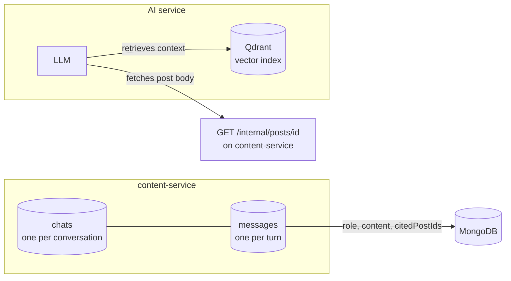
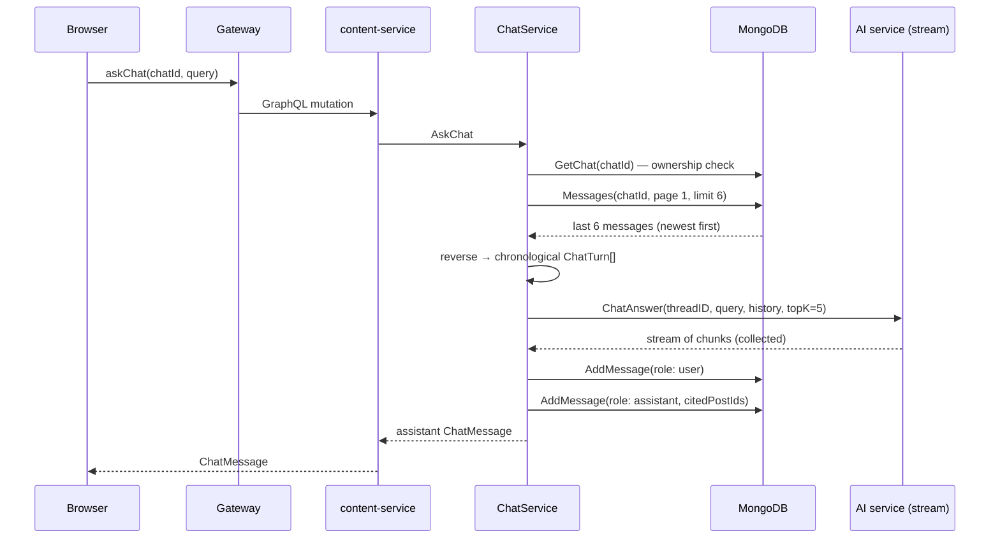
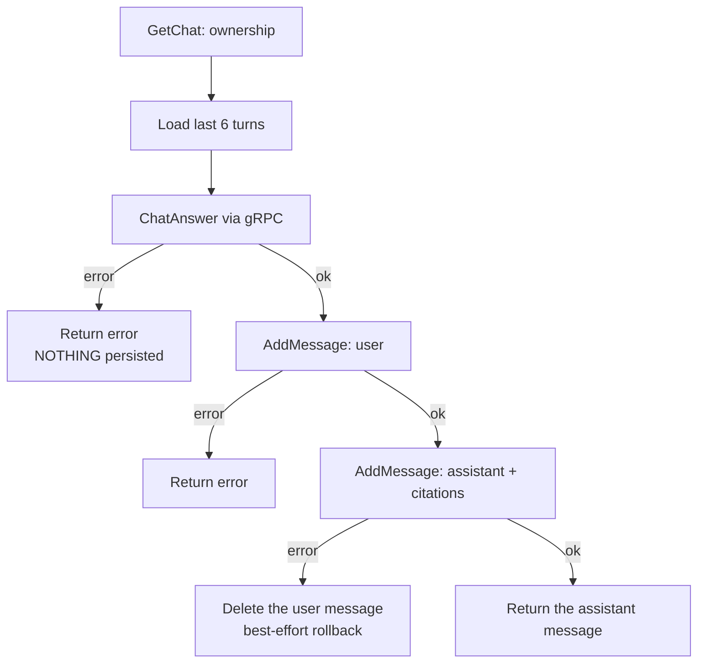

# Chat flow

Topos lets a reader ask questions about posts and get answers grounded in
the actual content. This page explains how a conversation is stored, how
one question becomes an answer, what "cited" means, and what happens when
the AI service is unavailable.

## What is stored where



| Store | Holds | Held by |
| --- | --- | --- |
| `chats` | Ownership, title, timestamps | content-service |
| `messages` | Every turn: role, content, cited post IDs | content-service |
| Vector index | Post embeddings for retrieval | AI service |
| LLM conversation memory | Nothing — history is **re-sent each turn** | — |

The content service keeps no AI-side state. Every question sends the
recent history along with it, because the AI service is stateless across
gRPC calls.

## The full round trip



Four properties of this sequence are worth knowing:

1. **Ownership is checked first.** `GetChat` compares the chat's `userId`
   to the caller; a mismatch returns `forbidden` before any AI work.
2. **History is the last 6 messages**, fetched newest-first from the
   index-backed `(chatId, createdAt)` query and then reversed into
   chronological order. Older turns are simply dropped from context.
3. **`topK = 5`** — at most five passages are retrieved to ground the
   answer.
4. **The AI call happens before anything is written.** This ordering is
   deliberate and is the next section's subject.

## Why the AI call comes first

The naive design would be: save the user's question, ask the AI, save the
answer. That fails badly — if the AI call fails, you have persisted a
question that was never answered, and retrying duplicates it.

Instead ([`ChatService.AskChat`](../../internal/service/chat_service.go)):



| Failure point | What is in MongoDB afterwards |
| --- | --- |
| Ownership check fails | Nothing changed |
| History load fails | Nothing changed |
| **AI call fails** | **Nothing changed — no ghost question** |
| User message insert fails | Nothing changed |
| Assistant message insert fails | User message **deleted** (rollback), nothing else |

If the rollback delete itself fails, the code logs
`failed to roll back user message after assistant persist failure` and
returns the original error. That leaves one orphaned `user` message with
no reply — the worst case, and it is visible in the logs.

> **A retry after a failure cannot duplicate the question.** This is the
> entire reason for the ordering.

## Citations

An assistant message carries `citedPostIds: [ID!]!` — the posts the
answer was grounded on. User messages always carry an empty list.

```graphql
query {
  chatMessages(chatId: "c1a2...") {
    messages {
      role          # USER | ASSISTANT
      content
      citedPostIds  # only non-empty for ASSISTANT
      createdAt
    }
    totalMessages
    currentPage
  }
}
```

Citations are **IDs only**. To display titles you follow them yourself:

```graphql
query {
  post(id: "665f1c2e8a3b2f0012345678") { title slug }
}
```

or, if you have a list of IDs, query them one by one — this subgraph has
no `postsByIds` query for clients. Inside the API, `PostService.FindByIDs`
does bulk hydration (capped at 100 IDs), but it is not exposed.

> **A citation can dangle.** If the cited post is deleted after the
> answer was generated, `post(id)` returns `null`. Handle it: render the
> link as missing rather than assuming the ID resolves.

### How the answer gets grounded

The AI service does the retrieval, not this one. When it needs a post's
full text it calls back:

```http
GET /internal/posts/{id}
X-Internal-Secret: <INTERNAL_TOKEN>
```

That callback is why `INTERNAL_TOKEN` is **required** at startup. If it
is wrong, chat answers degrade because the AI service cannot read post
bodies — see [Authentication](authentication.md#the-internal-api).

## Chat CRUD

| Operation | Auth | Rule |
| --- | --- | --- |
| `createChat(title)` | required | Empty or omitted title becomes **`New Chat`** |
| `chats(page, limit)` | required | Only your chats, newest first |
| `chat(id)` | required | `forbidden` if not yours |
| `renameChat(id, title)` | required | Title must not be blank after trimming |
| `deleteChat(id)` | required | Owner only |
| `chatMessages(chatId, …)` | required | Owner only |

`renameChat` has a quirk: it returns a bare Go error
(`title must not be empty`) rather than wrapping `domain.ErrValidation`,
so it surfaces as `internal error` instead of `validation error` — see
[Error handling](../components/error-handling.md#internal-error-is-overused).

Deleting a chat does **not** publish a Kafka event and does not touch
the AI service. There is no profile to update, because chat history
lives only here.

## Degraded behaviour

Chat is the one feature where AI failure is *visible by design*.

| Condition | What the client sees |
| --- | --- |
| AI service down, first attempt | `Chat is currently unavailable in fallback mode.` as the **answer content** |
| AI breaker open (5 failures / 10 s) | Same fallback message, returned immediately |
| AI returns an empty answer | Stored as-is; nothing is substituted |
| Mongo down | `internal error` — the ownership check cannot run |
| History load fails | Error returned; nothing persisted |

The fallback string comes from
[`noop.go`](../../internal/infrastructure/ai/noop.go) and is returned
**with `nil` error**, so the mutation succeeds. Your client will show a
normal-looking assistant message containing that sentence.

That is intentional: a chat UI that errors out on an AI blip is worse
than one that answers "unavailable" and lets the reader retry. But it
means **you cannot detect fallback mode from the GraphQL response** — you
have to compare `content` against the known string, or watch
`content_ai_operation_total{operation="ChatAnswer"}`.

The AI client classifies `ChatAnswer` as `domainChat`, which is one of
the three domains with a local fallback (`search`, `related`,
`chat`). The other three — `GenerateSummary`, `GenerateTags`,
`GeneratePostContent` — have **no** fallback and return the real error.
See [Caching and resilience](caching-and-resilience.md).

## Role values differ between layers

| Layer | User | Assistant |
| --- | --- | --- |
| GraphQL enum `MessageRole` | `USER` | `ASSISTANT` |
| MongoDB `role` field | `user` | `assistant` |
| Go type `ChatMessageRole` | `ChatMessageRoleUser` | `ChatMessageRoleAssistant` |

The mapping happens in the model layer. If you query MongoDB directly
during an incident you will see lowercase; through GraphQL you will see
uppercase.

## Walkthrough

```graphql
# 1. start a conversation
mutation { createChat(title: "Understanding Kafka") { id title } }

# 2. ask a question
mutation {
  askChat(chatId: "c1a2...", query: "How does Topos retry failed events?") {
    id role content citedPostIds
  }
}

# 3. read it back with history
query {
  chatMessages(chatId: "c1a2...", limit: 20) {
    messages { role content citedPostIds }
    totalMessages
  }
}

# 4. follow a citation
query { post(id: "<one of the citedPostIds>") { title slug summary } }
```

## Troubleshooting

| Symptom | Likely cause |
| --- | --- |
| `forbidden` on every chat operation | You are using someone else's `chatId` |
| `unauthorized` | Missing token — all five chat operations require auth |
| Answer says `Chat is currently unavailable in fallback mode.` | AI service unreachable or its breaker is open |
| Answers ignore earlier questions | Only the last 6 messages are sent as history |
| `citedPostIds` is empty | The AI found no matching posts, or it is a fallback answer |
| A citation resolves to `null` | The post was deleted after the answer |
| Chat operations return `internal error` | Mongo unavailable, or `renameChat` got a blank title |
| Orphaned user messages in the logs | The assistant-message insert failed and the rollback delete also failed |

## Next steps

- [Authentication](authentication.md) — how the owner check derives identity
- [Caching and resilience](caching-and-resilience.md) — the fallback machinery
- [GraphQL API](../components/graphql-api.md) — exact chat operations
- [Health and observability](../operations/health-and-observability.md) — the AI metrics to watch
