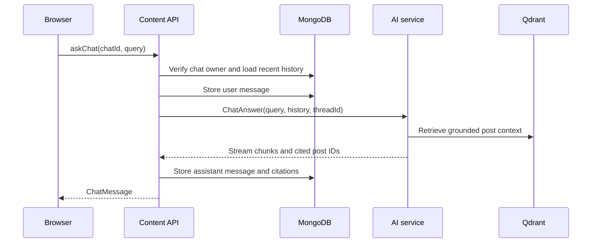

# Chat flow and citations

Chats and messages are persisted by the content service. The AI service
produces an answer from retrieved post context; the content service stores the
answer and the IDs of posts cited by it.

A `Chat` belongs to a user. Each `ChatMessage` belongs to a chat and has a
`user` or `assistant` role. Only assistant messages carry `citedPostIds`.
These fields are in [`internal/domain/chat.go`](../../internal/domain/chat.go).

The GraphQL mutation returns a saved message rather than exposing the internal
gRPC stream directly. The current GraphQL API contract is
[`graph/schema.graphqls`](../../graph/schema.graphqls).
