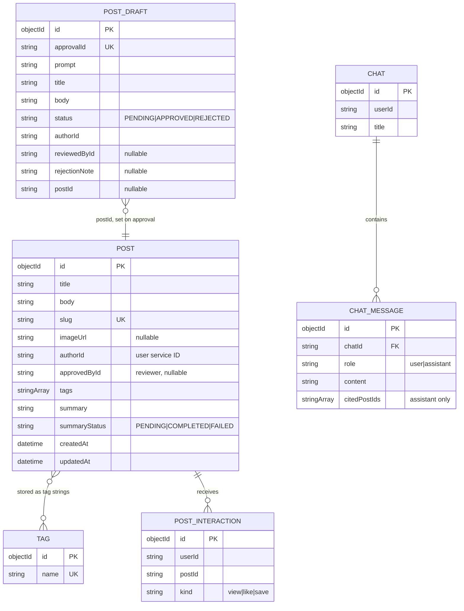

# Content data model

The Content service is the only service that writes content documents. They
live in one MongoDB database (`blog_content` by default) across six
collections, managed by the repositories in
[`internal/repository/`](../../internal/repository).

This page is for anyone who needs to know what is stored, what each field
means, which indexes exist, and which rules the application relies on.

## A logical diagram, not a foreign-key schema

MongoDB does not enforce relationships. Nothing below is a constraint the
database will uphold — the service applies these rules in its own code, and the
indexes are what actually protect you.



`authorId`, `userId`, and `approvedById` reference users in the **user
service's** PostgreSQL database. There is no foreign key across those two
databases — the link exists only at the GraphQL level through federation. See
[the cross-service note](#users-are-not-here).

## Collections

Source of truth for the field lists is
[`internal/domain/`](../../internal/domain); the `bson` tags are what MongoDB
actually stores.

### `posts`

| Field | Type | Notes |
| --- | --- | --- |
| `_id` | string (ObjectID hex) | Exposed as `id` |
| `title` | string | Required, ≤ 200 bytes (see [slugs](#slugs)) |
| `body` | string | Required, ≤ 1 MiB |
| `slug` | string | URL slug, **unique**, regenerated when the title changes |
| `imageUrl` | string, optional | HTTP(S) cover image |
| `authorId` | string | The user who wrote it |
| `approvedById` | string, optional | The peer reviewer who approved it; empty for directly published posts |
| `tags` | array of strings | Stored *on the post* for fast retrieval; max 20, each ≤ 64 bytes |
| `summary` | string | AI-generated; empty until the summary worker succeeds |
| `summaryStatus` | `PENDING` \| `COMPLETED` \| `FAILED` | Drives the summary worker's decisions |
| `createdAt`, `updatedAt` | datetime | `createdAt` is the pagination sort key |

A `ResetSummary` flag exists on the Go struct but has `bson:"-"` — it is
transient and never persisted. It tells the repository to blank `summary` and
set `summaryStatus` back to `PENDING` on this write.

### `post_drafts`

| Field | Type | Notes |
| --- | --- | --- |
| `approvalId` | string, **unique** | One workflow = one ID. AI drafts get a generated ID; human drafts are prefixed `human-` |
| `prompt` | string | The originating prompt (AI drafts); ≤ 5000 chars |
| `title`, `body`, `summary` | string | The content under review |
| `tags`, `imageUrl` | array / string | Content under review |
| `status` | `PENDING` \| `APPROVED` \| `REJECTED` | Moved only by an atomic compare-and-set |
| `authorId` | string | Who submitted it |
| `reviewedById`, `reviewedAt` | string / datetime, optional | Last reviewer; cleared on resubmission |
| `rejectionNote` | string, optional | The reviewer's note; cleared on approval and resubmission |
| `postId` | string, optional | Set once approval published it; for human drafts linking a live post, set from the start |

### `chats` and `messages`

| Collection | Field | Notes |
| --- | --- | --- |
| `chats` | `userId`, `title` | One chat belongs to one user; empty title becomes `New Chat` |
| `messages` | `chatId`, `role`, `content` | `role` is lowercase `user` / `assistant` in Mongo; the GraphQL enum is uppercase `USER` / `ASSISTANT` |
| `messages` | `citedPostIds` | Only assistant messages carry it — the posts the answer was grounded on |

### `post_interactions`

| Field | Type | Notes |
| --- | --- | --- |
| `userId`, `postId` | string | Both required |
| `kind` | `view` \| `like` \| `save` | With `userId` + `postId` this triple is **unique** |
| `createdAt` | datetime | |
| ~~`mode`~~ | *not persisted* | `bson:"-"` — carried on the event so the personalizer knows which feed produced the interaction |

### `tags`

| Field | Type | Notes |
| --- | --- | --- |
| `name` | string, **unique** | The `tags` collection exists for creation and suggestion; posts carry their own copy of tag strings for retrieval |

## Indexes

There are **no migration files**. Every index is created at startup by
[`internal/db/mongo_indexes.go`](../../internal/db/mongo_indexes.go), wrapped
in a 30-second timeout. If index creation fails the service **logs a warning and
keeps running degraded** — it does not stop.

| Collection | Index name | Keys | Unique | Serves |
| --- | --- | --- | --- | --- |
| `posts` | `authorId_createdAt` | `{authorId: 1, createdAt: -1}` | no | `posts` filtered by author (`User.posts`) |
| `posts` | `tags_createdAt` | `{tags: 1, createdAt: -1}` | no | `postsByTag` |
| `posts` | `createdAt_desc` | `{createdAt: -1}` | no | The unfiltered `posts` feed |
| `posts` | `slug_unique` | `{slug: 1}` | **yes** | Slug lookup and the uniqueness backstop |
| `tags` | `name_unique` | `{name: 1}` | **yes** | `CreateOrFind` upsert |
| `chats` | `userId_createdAt` | `{userId: 1, createdAt: -1}` | no | Listing a user's chats |
| `messages` | `chatId_createdAt` | `{chatId: 1, createdAt: -1}` | no | A chat's message history |
| `post_interactions` | `userId_postId_kind_unique` | `{userId: 1, postId: 1, kind: 1}` | **yes** | Idempotent likes and saves |
| `post_interactions` | `userId_createdAt` | `{userId: 1, createdAt: -1}` | no | A user's interaction history |
| `post_drafts` | `status_createdAt` | `{status: 1, createdAt: -1}` | no | The community review queue (`postDrafts`) |
| `post_drafts` | `authorId_createdAt` | `{authorId: 1, createdAt: -1}` | no | A user's own drafts (`myPostDrafts`) |
| `post_drafts` | `approval_id_unique` | `{approvalId: 1}` | **yes** | One workflow per approval ID |

### How the indexes are used

List queries all follow the same shape
([`findWithPagination`](../../internal/repository/mongo_post.go)):

```js
// what a typical list query becomes
db.posts.countDocuments(filter)                  // for totalPosts / totalPages
db.posts.find(filter)
  .sort({ createdAt: -1 })                       // matches createdAt_desc
  .skip((page - 1) * limit)
  .limit(limit)
```

Two properties matter:

- **Sorting is always `createdAt` descending.** Every list index above carries
  `createdAt` as its second (or only) key so the sort is served by the index
  rather than a collection scan.
- **Pagination is offset-based, not cursor-based.** `page`/`limit` are used
  directly. Unlike the user service — which rejects a malformed cursor with a
  `400` — this service never rejects pagination input; it silently clamps it.
  See [Request flows](request-flows.md#pagination).

`FindBulk` (used to hydrate search and recommendation results) accepts at most
**100 IDs per query** and silently drops malformed ones, so a corrupted ID in a
vector index cannot break a whole page.

## Invariants

These are the rules the code enforces. None of them are database constraints
except where noted.

| Invariant | Enforced by | Backstop |
| --- | --- | --- |
| Slug is unique | `ensureSlugAvailable` pre-check + up to 5 retries with a fresh timestamp | **Unique index `slug_unique`** |
| A user may like/save a given post at most once | Upsert with `$setOnInsert` | **Unique index `userId_postId_kind_unique`** |
| A user may have at most one pending revision for a post | `FindPendingByAuthorAndPost` — an existing pending draft is updated in place | — |
| Only the author may edit or delete a post | `PostService` compares `AuthorID` to the actor | — |
| Only the author may review their own draft | `authorizedDraft` | — |
| Only one reviewer wins a race | `TransitionStatus` uses `FindOneAndUpdate` filtered on the current status | — |
| An `approvalId` identifies exactly one workflow | Service generates it | **Unique index `approval_id_unique`** |
| Only the owner may read or mutate a chat | `ChatService.GetChat` compares `UserID` | — |

The compare-and-set on draft status is the subtle one: the update filter
requires the document to *still be* in one of the allowed source statuses, so
two reviewers clicking simultaneously cannot both win. The loser gets
`domain.ErrConflict` — see [Draft lifecycle](draft-lifecycle.md).

## Slugs

`slug.Generate(title, now)` in [`internal/slug/slug.go`](../../internal/slug/slug.go):

1. Lowercase the title.
2. Keep letters and digits; collapse everything else (spaces, punctuation) into
   single dashes.
3. Trim trailing dashes. If nothing survives, use `post`.
4. Append `-` plus a UTC timestamp with nanosecond resolution, e.g.
   `my-first-post-20260929101530.123456789`.

The **title is capped at 200 bytes** specifically so the resulting slug stays
under MongoDB's 1024-byte index key limit. When a title changes, `UpdatePost`
regenerates the slug — old links will break.

## Users are not here

| Not stored here | Where it lives |
| --- | --- |
| Account credentials, profiles, JWTs | [User service](../../../user/docs/README.md) (PostgreSQL) |
| Vector embeddings, chat grounding context, summaries | [AI service](../../../ai/docs/README.md) (Qdrant + LLM) |
| Recommendation profiles | AI service, updated by `content-personalizer` |

`Post.author` is a federation reference. When the gateway needs a `User`'s
fields, it sends the ID back to the user subgraph; the content service only
supplies the ID. `FindUserByID` here returns a **stub with just the ID** for
exactly this reason ([`graph/entity.resolvers.go`](../../graph/entity.resolvers.go)).

Conversely, a post's author may have deleted their account. There is no
constraint preventing a dangling `authorId` — the user service renders a
placeholder for that case, as documented in
[its data model](../../../user/docs/concepts/data-model.md#soft-deletion).

## Operational notes

```bash
# from services/content/
make up                     # starts MongoDB and creates indexes on boot
make logs SERVICE=content-service | grep "ensure indexes"
make clean                  # DELETES the content_mongo_data volume
```

- Index creation is **idempotent** and runs on every start. Adding an index
  means editing `mongo_indexes.go` and redeploying — there is no migration step.
- Because there are no migrations, a schema change that must rename or drop
  fields needs a manual operation or a backfill script; the service only ever
  creates indexes.
- `WITH_MONGO=0` boots without MongoDB at all — the service starts, but
  `/readyz` reports `degraded` and every query fails safely.

## Next steps

- [Architecture](architecture.md) — where the repositories sit
- [Request flows](request-flows.md) — how each query uses these indexes
- [Publishing flow](publishing-flow.md) — how a post reaches these collections
- [GraphQL API](../components/graphql-api.md) — the fields exposed over the API
