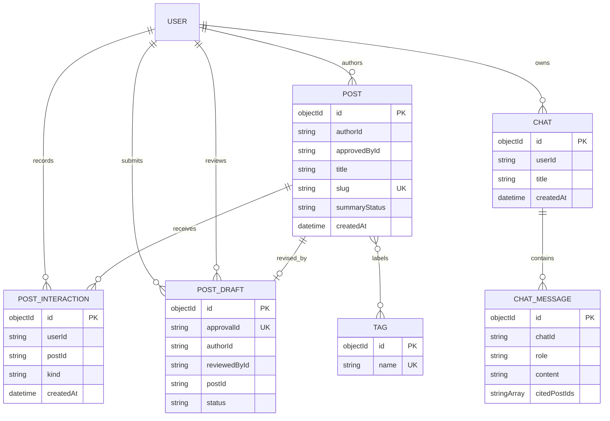

# Content data model

This is a **logical** ER diagram of MongoDB documents and references. MongoDB
does not enforce these links as foreign keys; the content service applies the
rules in its services and repositories.

## Collection facts and indexes

| Collection | Important fields | Implemented indexes |
| --- | --- | --- |
| `posts` | `authorId`, `tags`, `slug`, `createdAt` | author/date, tag/date, date descending, unique slug |
| `tags` | `name` | unique name |
| `chats` | `userId`, `createdAt` | user/date |
| `messages` | `chatId`, `createdAt` | chat/date |
| `post_interactions` | `userId`, `postId`, `kind` | unique user/post/kind and user/date |
| `post_drafts` | `approvalId`, `authorId`, `status` | unique approval ID, author/date, status/date |

Tags are stored on posts as strings for retrieval; the `tags` collection
supports tag creation and suggestion. The indexes are established at startup by
[`internal/db/mongo_indexes.go`](../../internal/db/mongo_indexes.go).

## Data invariants

- `slug` is unique.
- A like/save interaction is idempotent for the same user, post, and kind.
- `approvalId` identifies one draft workflow.
- A draft status transition is an atomic compare-and-set operation, preventing
two reviewers from approving the same draft.
