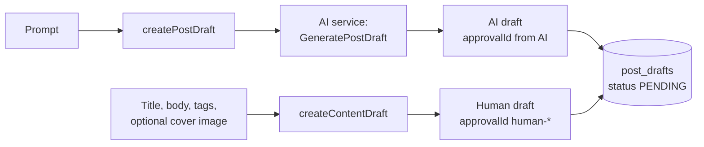
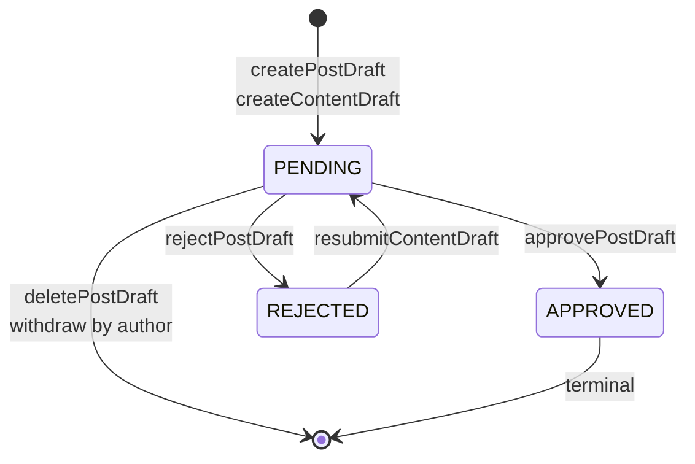
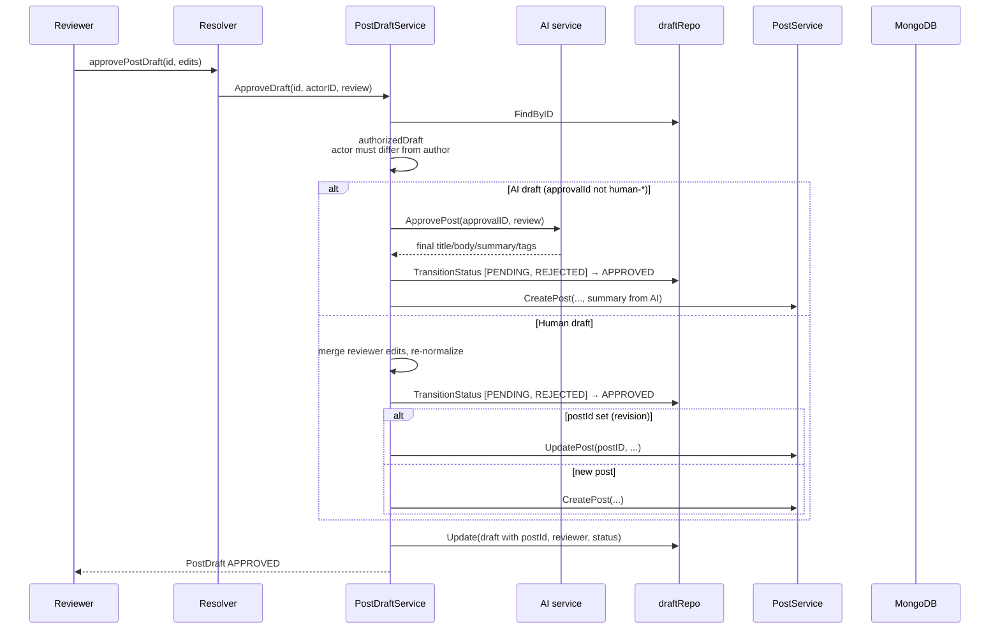

# Draft lifecycle

A draft is a post paused for peer review. Someone writes or generates
content, it sits in a queue, and a *different* user decides whether it
becomes a real post.

This page covers both kinds of draft, every state transition, the exact
rules the code enforces, and the race conditions the design handles.

## Two kinds of draft

| | **AI draft** | **Human draft** |
| --- | --- | --- |
| Created by | `createPostDraft(prompt)` | `createContentDraft(input)` |
| Content origin | The AI service generates it | The author writes it |
| `approvalId` | Generated by the AI service | Generated here, prefixed `human-` |
| `prompt` | The original prompt | Title, or `Revision proposal for <postID>` |
| `imageUrl` | Always empty | Always set by the author |
| `postId` | Empty until approval | Set from the start when it is a revision |
| Approved by | `aiService.ApprovePost` | No AI call at all |

The repository distinguishes them with `isHumanDraft` — a draft whose
`approvalId` starts with `human-`. This one check changes the entire
approval path, because **there is no AI workflow to confirm for
human-written content.**



`PostDraft` carries the reviewer's trail: `reviewedById`, `reviewedAt`,
and `rejectionNote`. All three are **cleared** when the draft is
resubmitted or approved, so each review round starts clean.

## The state machine



| Transition | Allowed from | Guard |
| --- | --- | --- |
| Approve | `PENDING`, `REJECTED` | Reviewer must not be the author |
| Reject | `PENDING` only | Reviewer must not be the author |
| Resubmit | `REJECTED` only | Author only, and something must change |
| Withdraw (`deletePostDraft`) | `PENDING` only | Author only |

`APPROVED` is terminal — an approved draft cannot be rejected or
withdrawn.

The permitted source statuses are **passed into the update**, not read
beforehand:

```go
// internal/repository/mongo_post_draft.go
FindOneAndUpdate(
    bson.M{"_id": oid, "status": bson.M{"$in": fromAny}},  // must still be allowed
    bson.M{"$set": bson.M{"status": to, ...}},
)
```

If no document matches — because someone else already moved it — you get
`mongo.ErrNoDocuments`, which is wrapped as
**`domain.ErrConflict` ("draft already reviewed")**. That is the whole
mechanism: two reviewers clicking at the same instant cannot both
publish. The loser's request fails with the client message
`already reviewed by someone else`.

## Creating a draft

### AI draft — `createPostDraft(prompt)`

1. Reject an empty identity → `unauthorized`.
2. Reject `prompt` longer than **5000 characters** → `validation error`.
3. Call `aiService.GeneratePostDraft(prompt, authorID)` — a blocking gRPC
   call. This is one of the few mutations that genuinely depends on the
   AI service being up.
4. Store the returned title, body, summary, tags, and `approvalId` with
   `status = PENDING`.

There is no fallback: an AI failure here is returned to the client. See
[Caching and resilience](caching-and-resilience.md).

### Human draft — `createContentDraft(input)`

1. Reject an empty identity → `unauthorized`.
2. Normalize the content with the same rules as `createPost` — title ≤
   200 bytes, body ≤ 1 MiB, ≤ 20 tags of ≤ 64 bytes each.
3. **If `postId` is set**, look for an existing pending draft by this
   author for this post. If one exists, **update it in place** instead of
   creating a second. This is the *one-pending-draft-per-post* rule — a
   proposer can keep editing rather than queue-spamming.
4. Otherwise create a new draft with a generated `human-` approval ID.

| Input | Meaning |
| --- | --- |
| `postId: ""` | A brand-new post going through review for the first time |
| `postId: <id>` | A revision proposal against a live post |

## Listing drafts

| Query | Returns | Who sees what |
| --- | --- | --- |
| `postDrafts` | `FindPendingExceptAuthor` | Pending drafts from **everyone except you** — the reviewer's queue |
| `myPostDrafts` | `FindByAuthor` | Your own drafts, any status |

Both require authentication. The community queue deliberately hides your
own drafts: **you cannot review your own work**, so showing it would only
produce clicks that fail.

Both are paginated with the usual `pagination.Normalize` clamping.

## Approving

`approvePostDraft(id, input: DraftEditsInput)` — `input` is optional and
lets the reviewer edit the title, body, summary, or tags before
publishing.



Key details:

- **The AI draft calls `ApprovePost` *before* the status transition.**
  If the AI service rejects the approval, the draft is untouched and
  stays `PENDING`. No half-approvals.
- **The summary ships with the approval.** `CreatePost` receives the
  AI-provided summary with `COMPLETED` status, so the summary worker has
  nothing to regenerate. This is why approving does not trigger a
  background job.
- **A revision on a deleted post falls back to publishing fresh.** If
  `UpdatePost` returns `ErrNotFound`, the code publishes a brand-new post
  instead of failing.
- **`CreatePost` is called with `draft.AuthorID`, not the reviewer's
  ID.** The post belongs to the original author; the reviewer is recorded
  separately in `reviewedById`.

### The race that matters

Two reviewers approve the same draft simultaneously. Both pass
`authorizedDraft`, both call the AI (for an AI draft), then both attempt
`TransitionStatus`. The first wins; the second matches no document and
gets an `already reviewed by someone else` error. **Only one post is
published.** A test covers exactly this — see
[Testing](../testing/overview.md).

## Rejecting

`rejectPostDraft(id, reason)`.

| Draft state | Result |
| --- | --- |
| Already `REJECTED` | **Idempotent success** — returns the draft unchanged |
| `PENDING` | Rejected |
| `APPROVED` | `validation error: approved drafts cannot be rejected` |

The idempotency is intentional: when two reviewers race, the loser's
outcome is identical to the winner's, so an error would be noise. The
code detects `ErrConflict` from the transition and simply returns the
current document.

For an **AI draft** the code calls `aiService.RejectPost(approvalID,
reason)` **first**; if that fails, the draft stays `PENDING`. Human
drafts skip the call entirely.

`reason` is optional in the schema but is what the author reads — always
supply one.

## Resubmitting

`resubmitContentDraft(id, input)` — author only, `REJECTED` only.

Three guards, in order:

1. `draft.AuthorID != actorID` → `forbidden` (the wrapped text
   `only the author can resubmit` stays server-side)
2. `draft.Status != REJECTED` → `validation error: only rejected drafts can be resubmitted`
3. Nothing changed → `validation error: no changes to resubmit`

On success the draft flips back to `PENDING` and the reviewer trail is
wiped (`reviewedById = ""`, `reviewedAt` zeroed, `rejectionNote = ""`),
so the next reviewer starts fresh.

A `nil` `imageUrl` in the input means **"keep the stored cover"**, never
"clear it". The resubmit dialog edits text only.

## Withdrawing

`deletePostDraft(id)` calls `WithdrawDraft` — despite the name, it is a
**delete**, not a status change.

- Author only → otherwise `forbidden`.
- `PENDING` only → otherwise `validation error: only pending drafts can be withdrawn`.
- The document is removed from `post_drafts`.

There is no "withdraw a rejected draft" — you resubmit it instead. And
there is no way to withdraw an approved one, because the post already
exists.

## Where the rules live

| Rule | Location |
| --- | --- |
| Author cannot review own draft | `authorizedDraft` in [`post_draft_service.go`](../../internal/service/post_draft_service.go) |
| Reviewer cannot be the caller's own draft | (same function — resolvers do not re-check) |
| Atomic status move | `TransitionStatus` in [`mongo_post_draft.go`](../../internal/repository/mongo_post_draft.go) |
| Content normalization | `normalizeContentDraft` — shared with `createPost` |
| Queue scoping | `FindPendingExceptAuthor` / `FindByAuthor` |

Like the rest of the service, the **resolver only extracts the user ID
and calls the service**; the service re-checks everything. A missing
check in `graph/schema.resolvers.go` cannot delete someone else's draft.

## Full API surface

```graphql
# Queries (both require auth)
postDrafts(page: Int, limit: Int): PaginatedPostDrafts!   # others' pending drafts
myPostDrafts(page: Int, limit: Int): PaginatedPostDrafts! # your drafts

# Mutations (all require auth)
createPostDraft(prompt: String!): PostDraft!
createContentDraft(input: ContentDraftInput!): PostDraft!
resubmitContentDraft(id: ID!, input: ContentDraftInput!): PostDraft!
approvePostDraft(id: ID!, input: DraftEditsInput): PostDraft!
rejectPostDraft(id: ID!, reason: String): PostDraft!
deletePostDraft(id: ID!): Boolean!
```

> There is no `withdrawPostDraft` mutation — `deletePostDraft` *is* the
> withdrawal. Do not assume the name means "set status to a withdrawn
> state"; the document is gone.

## Walkthrough

Using two accounts, `alice` (author) and `bob` (reviewer):

```graphql
# as alice — file human-written content for review
mutation {
  createContentDraft(input: {
    title: "Why Go's defer is not free"
    body: "## Summary\nDefer allocates..."
    tags: ["go"]
    imageUrl: "https://cdn.example.com/defer.png"
  }) { id approvalId status }
}
```

```graphql
# as bob — see it in the queue (alice's own drafts are hidden from her here)
query { postDrafts { drafts { id title authorId status } totalDrafts } }
```

```graphql
# as alice — see her own, including rejected ones she can resubmit
query { myPostDrafts { drafts { id status rejectionNote } } }
```

```graphql
# as bob — approve with an edit to the summary
mutation {
  approvePostDraft(
    id: "665f1c2e8a3b2f0012345678"
    input: { summary: "A short, accurate summary of the defer costs." }
  ) { id status postId reviewedById }
}
```

```graphql
# as alice — try to approve her own draft
# → {"errors":[{"message":"forbidden"}]}
```

If bob and carol both hit `approvePostDraft` at the same instant, one
gets the post ID and the other gets
`{"message":"already reviewed by someone else"}`.

## Troubleshooting

| Symptom | Cause |
| --- | --- |
| `forbidden` on approve/reject | You are the author — use a second account |
| `already reviewed by someone else` | Someone else already approved or rejected it |
| `validation error: approved drafts cannot be rejected` | Too late — it is published |
| `validation error: only rejected drafts can be resubmitted` | Resubmit is exclusively for `REJECTED` |
| `validation error: no changes to resubmit` | You submitted identical content |
| `validation error: only pending drafts can be withdrawn` | Only `PENDING` drafts can be deleted |
| `unauthorized` on create | No valid token — all six mutations require auth |
| `createPostDraft` fails but `createContentDraft` works | The AI service is unreachable; human drafts need no AI |
| My draft does not appear in `postDrafts` | You authored it — the community queue excludes your own |
| Approval failed but the AI already confirmed | The `TransitionStatus` lost a race, or `CreatePost` failed — the draft is still `PENDING` and can be retried |

## Next steps

- [Publishing flow](publishing-flow.md) — what happens to the post after approval
- [Authentication](authentication.md) — why the author/reviewer split exists
- [GraphQL API](../components/graphql-api.md) — full input types
- [Error handling](../components/error-handling.md) — `conflict` vs `forbidden` vs `validation error`
