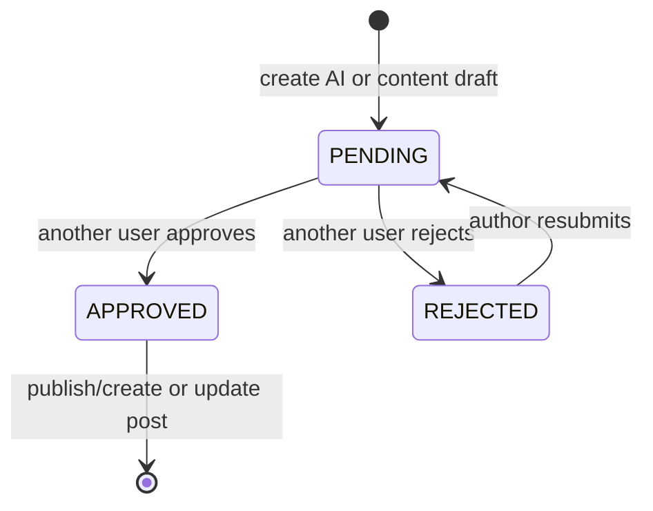
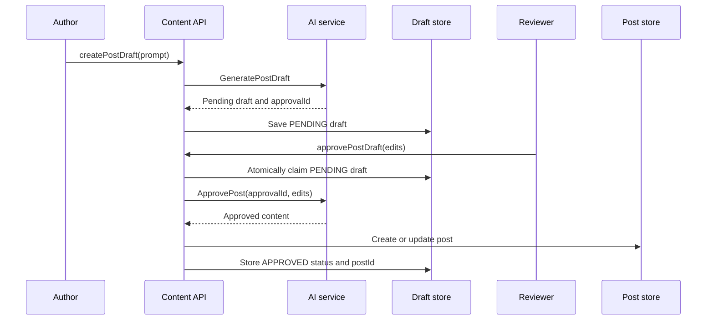

# Draft review lifecycle

Topos supports two draft origins: an AI-generated draft from a prompt, or a
human-authored content draft. Both enter the same peer-review lifecycle.

## Review rules

- The author cannot review their own draft.
- A reviewer may edit generated fields before approval.
- A rejection can include a reviewer note.
- A resubmission clears prior reviewer details and starts a fresh review.
- An atomic status transition ensures concurrent reviews do not publish twice.

`PostDraft` and its atomic repository transition are defined in
[`internal/domain/post_draft.go`](../../internal/domain/post_draft.go) and
[`internal/repository/mongo_post_draft.go`](../../internal/repository/mongo_post_draft.go).
