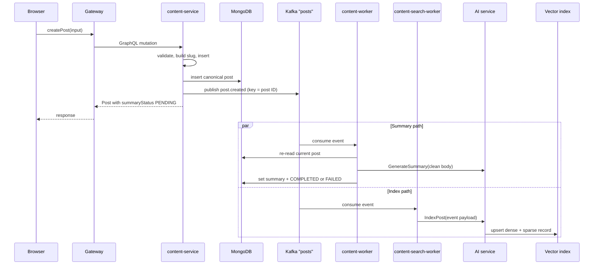
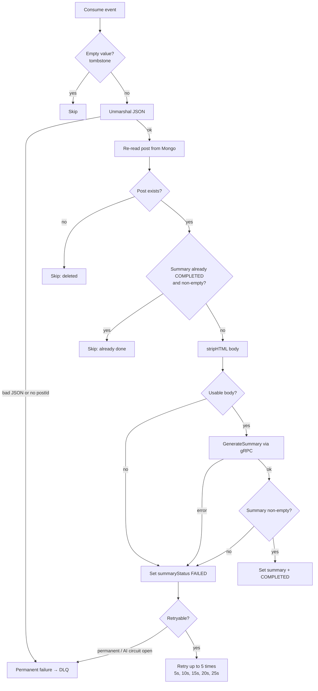
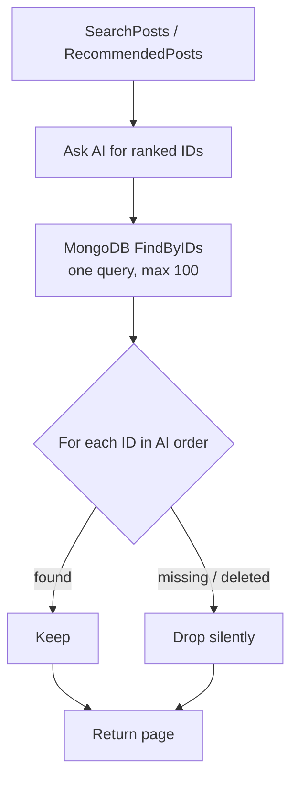

# Publishing and indexing flow

Saving a post and enriching it are deliberately separate steps. The author gets
a response as soon as MongoDB has the canonical row; AI work happens later.

This is the single most important thing to understand about the service: **the
mutation's response is independent of the AI service being up.**

## The happy path



The two workers consume the **same topic in different consumer groups**, so
each gets every message independently. If one is down, the other still
progresses, and no work is lost — the offset is only committed after handling.

## What `createPost` actually does

In order, inside [`PostService.CreatePost`](../../internal/service/post_service.go):

| # | Step | Failure behaviour |
| --- | --- | --- |
| 1 | `normalizeTitle` — trim, required, ≤ 200 bytes | `validation error: title is required` / `...too long` |
| 2 | `normalizeBody` — trim, required, ≤ 1 MiB | `validation error: body is required` / `...too long` |
| 3 | `normalizeTags` — ≤ 20 tags, each ≤ 64 bytes, empties dropped | `validation error: too many tags (max 20)` |
| 4 | `slug.Generate(title, now)` | — |
| 5 | `ensureSlugAvailable` — `FindBySlug` pre-check | `validation error: slug "..." is already taken` |
| 6 | Insert; on duplicate key, retry with a fresh timestamp | up to **5** attempts, then an error |
| 7 | `CreateOrFind` each tag into `tags` | non-fatal |
| 8 | Invalidate `posts:*`, `tags:*`, `search:*`, `related:*`, `recommend:*` | best-effort |
| 9 | `PublishPostCreated` | **best-effort** — logged, never fails the mutation |
| 10 | Return the post | — |

Two details worth knowing:

- **Step 5 fails fast** on an obviously common slug instead of burning all five
  retries. The unique index `slug_unique` is the final authority — a race
  between two simultaneous inserts is caught there.
- **Step 9 is best-effort by design.** `publishEvent` logs
  `failed to publish event` and returns success anyway. A Kafka blip must not
  lose the author's post. The cost: **an event can be silently dropped**, and
  that post will never be summarized or indexed. See
  [Reliability](../operations/reliability.md) for how you would notice.

### The event

```json
{
  "postId": "665f1c2e8a3b2f0012345678",
  "eventType": "post.created",
  "title": "My first post",
  "body": "<p>Hello world</p>",
  "imageUrl": null,
  "summary": "",
  "summaryStatus": "PENDING",
  "tags": ["go", "graphql"],
  "createdAt": "2026-09-29T10:15:00Z"
}
```

| Property | Value |
| --- | --- |
| Topic | `posts` (env `KAFKA_TOPIC`), 3 partitions |
| Message key | **post ID** — with the `Hash` balancer, all events for a post land in one partition and stay ordered |
| `eventType` | `post.created`, `post.updated`, or `user.interacted` (different topic) |
| Tombstone | Deleting publishes the key with **no value** |

Producer settings
([`kafka_producer.go`](../../internal/infrastructure/messaging/kafka_producer.go)):

| Setting | Value | Why |
| --- | --- | --- |
| `RequiredAcks` | `RequireAll` | No silent loss on the broker side |
| `MaxAttempts` | 10 | Kafka client's own retry |
| `Balancer` | `Hash` | Ordering per post ID / per user ID |
| `Compression` | gzip | Events carry full post bodies |
| Write timeout | 5 s, on `context.WithoutCancel` | The publish still completes if the request context is cancelled |

There is no idempotent producer configured, so delivery is **at-least-once**.
That is fine: every consumer below is idempotent.

## Updating a post

`UpdatePost` differs from create in two ways:

- **Ownership first.** `existing.AuthorID` must equal the actor, otherwise
  `forbidden`.
- **Changing the title or body marks the summary stale** — it calls
  `post.MarkSummaryStale()`, which blanks `summary`, sets
  `summaryStatus = PENDING`, and flags the repository to write those values.
  The summary worker then regenerates it. The comparison is against the
  *trimmed stored value*, so re-sending an identical title or body does
  **not** reset anything.

Editing **only** the image does *not* reset the summary — the text the
summary describes has not changed. Changing tags would not either, but
`updatePost` cannot clear or replace tags at all
([why](../components/graphql-api.md#inputs)).

A changed title also **regenerates the slug**, so the old URL stops
working.

`approvedById` is only written on the peer-review publish path; a direct
author edit leaves any existing reviewer attribution untouched.

## Deleting a post

Deletion publishes a **tombstone**: the message key is the post ID and the
value is empty. Consumers interpret an empty value as "remove it":

| Worker | On tombstone |
| --- | --- |
| `content-worker` (summary) | Logs `skipping tombstone` — nothing to summarize |
| `content-search-worker` | Calls `DeletePost` on the AI index |

Note the asymmetry: the **search worker's** job is to keep the index in sync,
so it must act on deletions. The summary worker only ever writes summaries, so
a deletion is a no-op for it.

## The summary worker

The summary worker **re-reads the post from MongoDB before doing anything.**
Events can arrive out of order or after the post changed, so the event payload
is a *hint*, not the truth.



The skip conditions are what make the worker safe to run repeatedly:

| Check | Why |
| --- | --- |
| Tombstone | A deleted post needs no summary |
| Post missing | Deleted between publish and consume |
| `summary != ""` **and** `summaryStatus == COMPLETED` | Already summarized — this is the idempotency guard |
| Body strips to empty | Nothing to summarize; marked `FAILED` rather than retried forever |

`stripHTML` unescapes entities, removes tags, and collapses whitespace. A post
whose body is only markup gets `FAILED`, not an infinite retry loop.

### Summary status transitions

```
           createPost (no summary given)
                    │
                    ▼
               ┌─────────┐   worker success    ┌───────────┐
               │ PENDING │ ──────────────────▶ │ COMPLETED │
               └─────────┘                     └───────────┘
                    │  ▲                            ▲
     worker failure │  │ title/body edited          │
                    ▼  │ (MarkSummaryStale)         │
               ┌─────────┐ ─────────────────────────┘
               │  FAILED │   worker retries and succeeds
               └─────────┘
```

`createPost` sets `COMPLETED` immediately **only when a summary was supplied**
in the input; otherwise it starts `PENDING`.

## The search worker

Unlike the summary worker, this one **never re-reads MongoDB** — it indexes
exactly what the event payload contained.

| Event | Action |
| --- | --- |
| Non-empty value | `IndexPost(postID, title, body, summary, tags, createdAt)` |
| Empty value (tombstone) with a key | `DeletePost(postID)` |
| Empty value with no key | Skip — nothing to remove |

Because it uses the payload rather than the stored row, **a post indexed from a
`post.created` event may be briefly behind a subsequent edit** until
`post.updated` is consumed. Both events are ordered within one partition, so
the final state converges.

### What happens to stale index IDs

Search and recommendation results come back from the AI service as **ranked
post IDs**, which the API then hydrates from MongoDB:



**Missing IDs are dropped rather than failing the query.** A post deleted
before its index entry was removed simply vanishes from the results; the page
just contains fewer items than `limit`.

`recommendedPosts` has one extra rule: **posts authored by the requesting user
are filtered out**, so you never see your own posts in your recommendations.

## Degradation when the AI service is down

| Feature | Behaviour |
| --- | --- |
| `createPost` / `updatePost` / `deletePost` | **Unaffected** |
| `searchPosts`, `recommendedPosts`, `related` | Empty or recency-fallback results — see [Request flows](request-flows.md) |
| `generateTags`, `generatePostContent`, `createPostDraft` | Fail: these are AI-only, no fallback is possible |
| Summary generation | Retries 5 times, then dead-letters |
| Search indexing | Retries 5 times, then dead-letters |
| `askChat` | Returns `Chat is currently unavailable in fallback mode.` |

The split is deliberate: **read paths degrade, write paths never fabricate
content.** The AI client classifies every call as either `degraded` (safe to
substitute a fallback) or `noFallback` (return the error). See
[Caching and resilience](caching-and-resilience.md).

## Verifying it works

```bash
# from services/content/
make up-all

# create a post, then watch the workers react
make logs SERVICE=content-worker      # "summary generated"
make logs SERVICE=content-search-worker   # "post indexed"

# confirm the summary landed
curl -s http://localhost:4002/query -H 'Content-Type: application/json' \
  -d '{"query":"{ posts(limit:1) { posts { id title summary summaryStatus } } }"}'
```

If `summaryStatus` stays `PENDING`, the summary worker is not consuming — check
its `/readyz` and consumer lag metric (`content_worker_consumer_lag`).

## Next steps

- [Architecture](architecture.md) — where publishing sits in the layering
- [Request flows](request-flows.md) — the read side of the same data
- [Reliability, retries, and DLQ](../operations/reliability.md) — what happens when these steps fail
- [Health and observability](../operations/health-and-observability.md) — metrics for each stage
