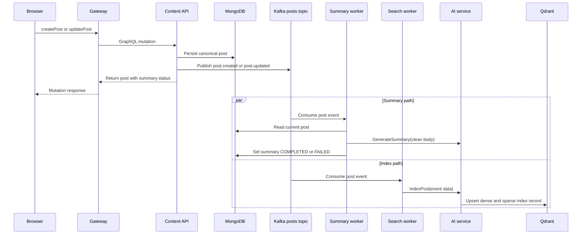

# Publishing and indexing flow

Saving a post and enriching it are deliberately separate steps. The author gets
a response after the canonical post is written; AI work is asynchronous.

The summary worker re-reads the post before acting. It skips a deleted post and
skips a summary already marked complete. An empty usable body or empty AI result
marks the summary as `FAILED`. The search worker treats an event tombstone as a
request to remove the post from the AI index.

Event payload fields and names are defined in
[`internal/domain/event.go`](../../internal/domain/event.go); worker behaviour
is implemented in `internal/worker/`.
