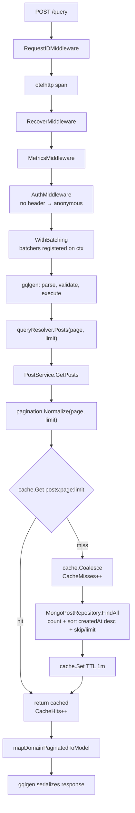
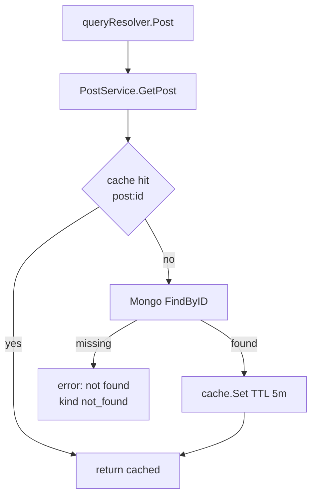
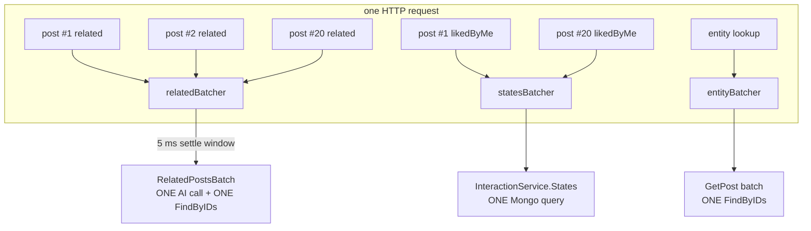
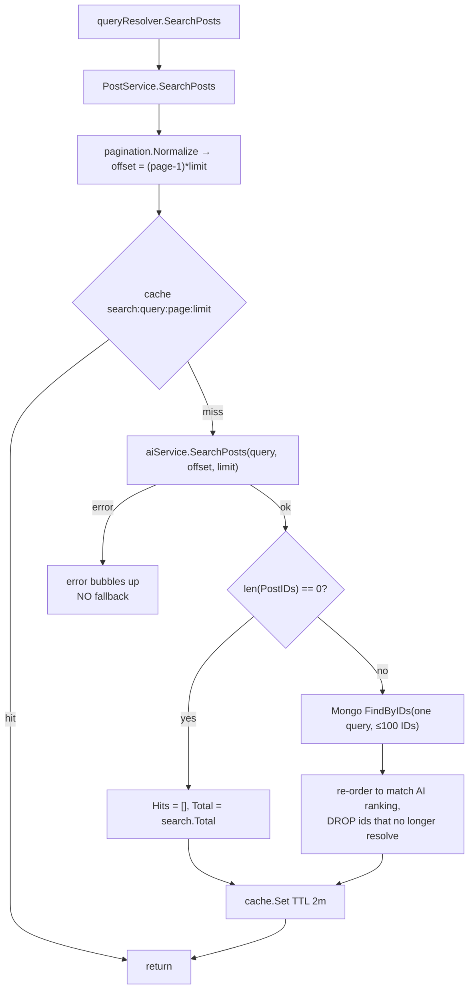
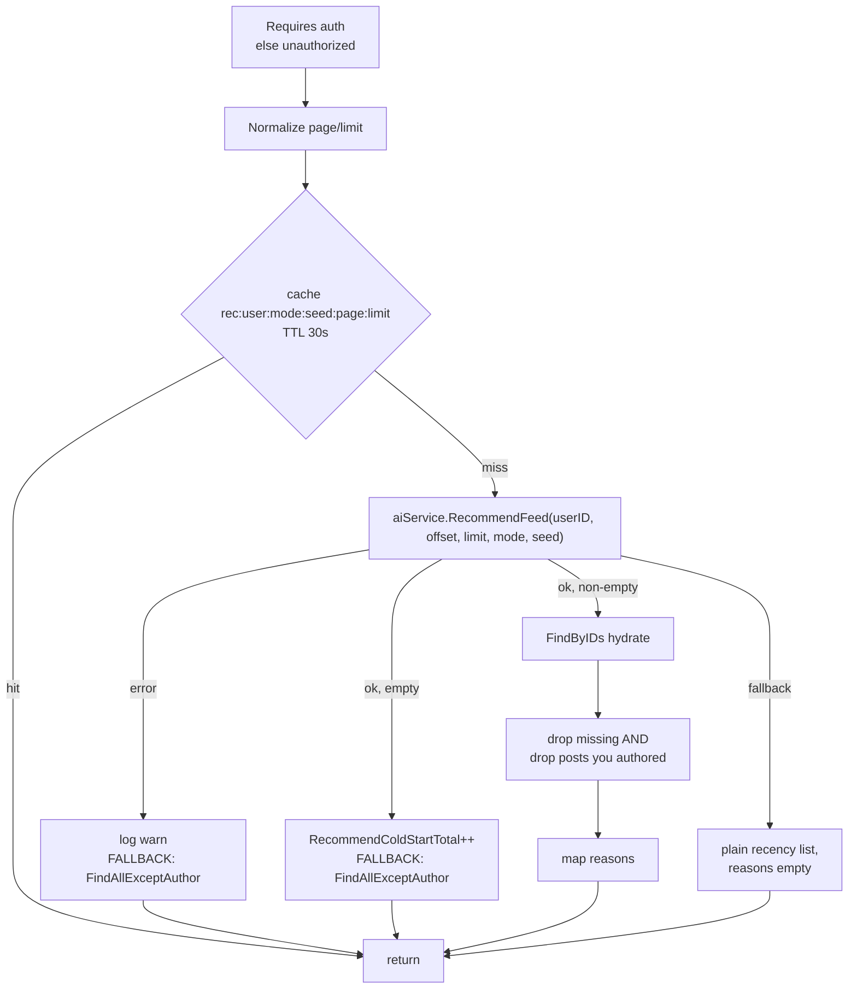
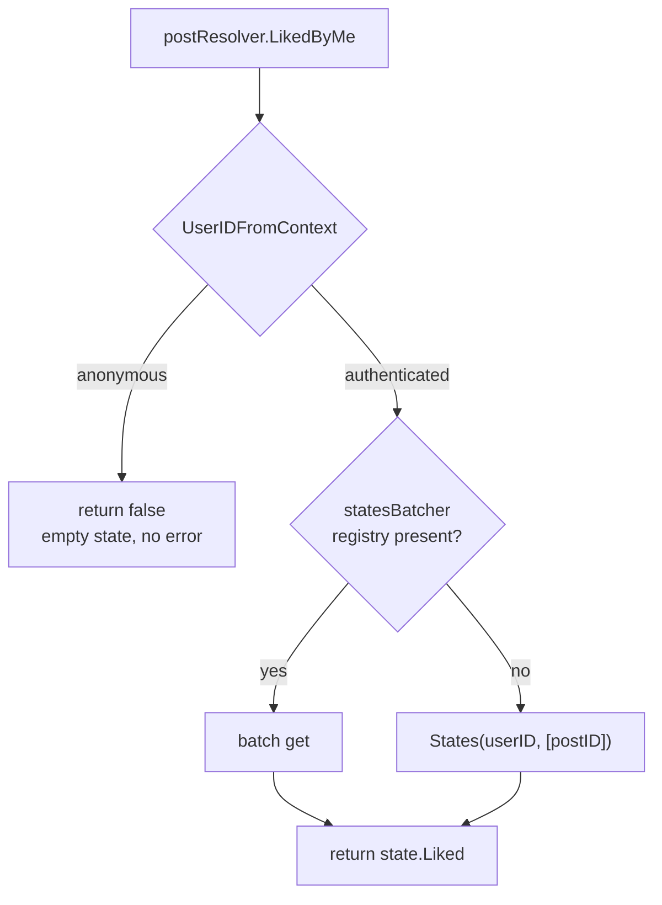
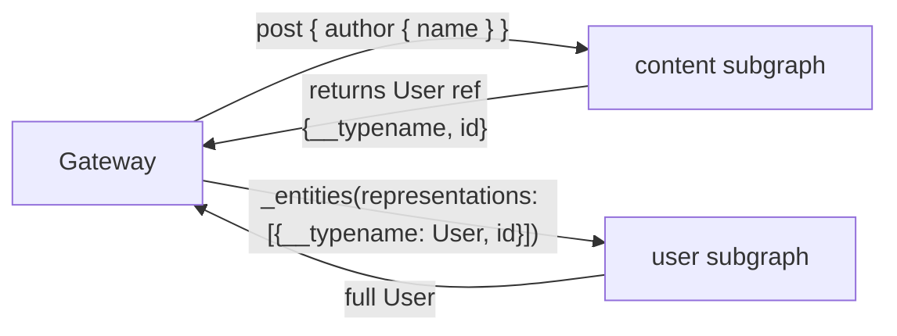

# Request flows

Every read goes through the same machinery: middleware, a resolver, a
service, a cache check, and a repository. This page walks through the
read side step by step — one query at a time — so you can predict what a
given operation will cost and where it will fail.

For the write side see [Publishing flow](publishing-flow.md).

## The five read paths

| Query | Auth | Cache | Backend |
| --- | --- | --- | --- |
| `posts` | public | `posts:{page}:{limit}` | Mongo `FindAll` |
| `post(id)` | public | `post:{id}` | Mongo `FindByID` |
| `postsByTag` | public | `posts:tag:{tag}:{page}:{limit}` | Mongo `FindByTag` |
| `tags` | public | `tags:{query}:{limit}` | Mongo |
| `searchPosts` | public | `search:{query}:{page}:{limit}` | **AI** → Mongo hydrate |
| `recommendedPosts` | **auth** | `rec:{user}:{mode}:{seed}:{page}:{limit}` | **AI** → Mongo hydrate (with fallback) |
| `chats`, `chat`, `chatMessages` | **auth** | none | Mongo |
| `postDrafts`, `myPostDrafts` | **auth** | none | Mongo |

Two shapes cover all of them: **Mongo-direct** and **AI-then-hydrate**.

## A simple query end to end: `posts`



Notice what does **not** happen: `AuthMiddleware` sees no header and
passes through. The resolver never asks who you are. An anonymous `posts`
query is a first-class path, not an error case.

### <a name="pagination"></a>Pagination

All list arguments funnel through
[`pagination.Normalize`](../../internal/pagination/pagination.go):

```go
page:  < 1 → 1        limit: < 1 → 10 (DefaultLimit)
page:  > 1000 → 1000  limit: > 100 → 100 (MaxLimit)
```

| Property | Value |
| --- | --- |
| Style | **Offset** — `skip = (page-1) * limit` |
| Default limit | 10 |
| Max limit | 100 |
| Max page | 1000 |
| On out-of-range input | **Silently clamped — never an error** |

> **This is a real behavioural difference from the user service.** The
> user service rejects a malformed cursor with a `400`; this service
> accepts anything and adjusts it. Asking for `limit: 5000` gives you
> 100 rows and `currentPage: 1`, with no warning.

Three consequences:

1. **You cannot page past 1000.** `page: 1001` returns page 1000's
   content again — an infinite-repeat bug waiting to happen in a UI.
2. **`limit: 0` or a negative limit is not "no limit".** It means 10.
3. **The clamp happens in the service, before the cache key is built.**
   So `posts(limit: 5000)` and `posts(limit: 100)` share one cache entry.
   That is deliberate: it stops a client from spraying unbounded keys at
   Redis.

`currentPage` in the response is the *normalized* page, so you can
detect clamping by comparing what you sent with what came back.

### Offset pagination's other weakness

Because sorting is always `createdAt` descending with `skip`, a post
published between page 1 and page 2 shifts the window — a reader can see
the same post twice or miss one. There is no cursor to make it stable.

## `post(id)`



> **A missing post is an error, not `null`.** The schema declares
> `post(id: ID!): Post` — nullable — which strongly implies `null` for
> "does not exist". In practice `FindByID` returns `domain.ErrNotFound`,
> `mapDomainError` converts it to `not found`, and gqlgen puts an entry
> in `errors[]`.
>
> Client code that does `if (!data.post)` will never see `null`; it will
> see a failed response instead. Handle the error.

Negative lookups are **not** cached, so hammering a random ID goes
straight to Mongo every time.

## `postsByTag`

Identical to `posts`, except:

- The filter is `{tags: tag}` and the index used is
  `tags_createdAt {tags: 1, createdAt: -1}`.
- The cache key embeds the tag.
- The tag argument is **required and case-sensitive** — `postsByTag(tag:
  "Go")` and `postsByTag(tag: "go")` are different queries and different
  cache entries.

## The N+1 problem and how it is solved

A page of posts asks for three derived fields per post:

```graphql
{ posts(limit: 20) {
    posts { id title related(limit: 3) { id } likedByMe savedByMe }
} }
```

Naively that is 1 + 20 + 20 = 41 backend calls. The service avoids this
with **request-scoped batching** in [`graph/batch.go`](../../graph/batch.go).



| Mechanism | What it coalesces | Window |
| --- | --- | --- |
| `relatedBatcher(limit)` | `Post.related` per post | 5 ms |
| `entityBatcher()` | Federation `findPostByID` | 5 ms |
| `statesBatcher(userID)` | `likedByMe` / `savedByMe` | 5 ms |

How it works:

1. `WithBatching` wraps each HTTP request and puts a *registry* of
   batchers in the context.
2. The first `related` resolver for a given `limit` creates a batcher
   and starts a `5 * time.Millisecond` settle timer.
3. Every subsequent lookup within that window registers its ID and
   blocks on a channel.
4. When the timer fires, one `RelatedPostsBatch(ids, limit)` runs:
   cache check → single `RelatedPostsBatch` gRPC call for the misses →
   single `FindByIDs` → `cache.Set` per post ID → fan out.

**Batching only applies within one HTTP request.** Two concurrent
requests each run their own batch. If you send the same query *without*
the batching middleware (for example against a handler mounted
differently), you fall back to per-ID calls.

> `statesBatcher(userID)` is keyed per user, so a batch never mixes
> interaction states between callers.

## `searchPosts` — AI-then-hydrate



Key properties:

- **The AI service's ordering is preserved.** Hydrated posts are
  re-sequenced to match `search.PostIDs`, not Mongo's return order.
- **Missing posts are dropped silently.** A post deleted after indexing
  disappears from the page; `hits.length` can be less than `limit`.
- **`total` comes from the AI service**, so `total` and `hits.length`
  can disagree when posts have been dropped.
- **No fallback.** If the AI service is down and its breaker is open,
  `searchPosts` returns an error. Only `recommendedPosts` and `related`
  substitute a fallback.

`SearchPosts` is one of the three AI domains with a local fallback
(`search`), so in practice you get `hits: []` with a `total` of 0 rather
than an error once the breaker opens — see
[Caching and resilience](caching-and-resilience.md).

## `recommendedPosts` — the fallback path

The only read that **requires authentication**, because it personalises
for a user.



| Situation | Result |
| --- | --- |
| AI returns ranked IDs | Hydrated, your own posts removed, `reasons` populated |
| AI returns an empty list | Recency fallback, `reasons: []`, `content_recommend_cold_start_total` incremented |
| AI errors / breaker open | Recency fallback, `reasons: []`, a `warn` log |
| Mongo hydration fails | Error — the fallback already failed |

Differences from `searchPosts` worth remembering:

1. **It never fails on AI trouble.** There is always a recency-sorted
   list of other people's posts to return.
2. **Your own posts are filtered out** *after* hydration — so `totalPosts`
   (taken from the AI's count) can exceed the number of items actually
   returned.
3. **`reasons` is empty in fallback.** An empty `reasons` array is the
   signal that personalisation did not run.
4. **The cache TTL is 30 seconds**, the shortest of any list — freshness
   matters more than hit rate here.

`mode` defaults to `DEFAULT`; the alternatives are `SURPRISE`, `FRESH`,
and `EXPLORER`. `seed` makes a given recommendation set reproducible —
useful for tests, and it changes the cache key, so a new seed is a cache
miss.

## `Post.related`

Resolved by `postResolver.Related` → `relatedPostsFrom` → the batcher,
or a direct `RelatedPosts` call when no registry is present.

| Property | Value |
| --- | --- |
| Default limit | 5 (schema default), normalized by `normalizeRelatedLimit` |
| Backend | AI `RelatedPosts` → `FindByIDs` hydrate |
| Cache | `related:{postID}:{limit}`, TTL 2 min |
| Drop behaviour | Missing IDs dropped silently |
| Fallback | **Yes** — the `related` domain has a local fallback |

Because `related` needs no identity, it works on public queries for
anonymous callers.

## `likedByMe` and `savedByMe`



This is the mechanism that lets a public `posts` query include
interaction fields without breaking for signed-out readers. The code
documents it explicitly: *"Anonymous callers get the empty state, so
public post listings keep working without authentication."*

There is **no** "you must sign in to see this" error on these fields.

## `Post.author` and federation

`Post.author` is typed `User!`, and `User` is declared with
`@key(fields: "id")` on the *user* subgraph. This service therefore
never joins to a user table.



Within this service, `entityResolver.FindUserByID` returns
**`&model.User{ID: id}` and nothing else** — a stub reference. All real
user fields are resolved by the user subgraph.

Practical implication: **you cannot ask this service for a user's email
or name.** A query for `post { author { name } }` works only because the
gateway composes both subgraphs. Against `:4002/query` alone, `name`
does not exist on `User`.

## `User.posts`

`extend type User { posts(page, limit): PaginatedPosts! }` resolves
against `authorId_createdAt {authorId: 1, createdAt: -1}`.

Note the extension adds `page` and `limit` arguments that the base
`Post` type does not have on other listings — a user's post list is
paginated independently of any profile context.

## Tags

`tags(query, limit)` is public and cached for 5 minutes.

- `query` filters by prefix/substring on `name`.
- `limit` goes through the same `Normalize` (default 10, max 100).
- Results come from the `tags` collection, **not** from the denormalized
  `tags` array on posts.

`CreateOrFind` is called on every `createPost`, so tags appear in this
list the moment a post referencing them is created.

## What every read costs when Redis is down

Nothing fails. `cache.Get` and `cache.Set` swallow their own errors, the
breaker opens after 3 failures in 10 seconds, and every call goes
straight through to Mongo (or the AI service).

| | With Redis | Without Redis |
| --- | --- | --- |
| `posts` | 0–1 Mongo queries | 1 Mongo query |
| 20 × `related` | 1 AI call + 1 query | 1 AI call + 1 query (batching still works) |
| Duplicate identical queries within TTL | 1 backend call | 2 backend calls |

The cost is load, not correctness. See
[Caching and resilience](caching-and-resilience.md) for the breaker
thresholds.

## Debugging a slow query

1. **Check `content_graphql_operation_seconds_bucket`** — histogram per
   operation name.
2. **Check `content_cache_hits_total` / `content_cache_misses_total`** —
   a suddenly cold cache means Redis trouble or a TTL change.
3. **Check `content_ai_operation_seconds_bucket{operation=...}`** —
   `SearchPosts` and `RecommendFeed` are the usual suspects.
4. **Look at the access log line** emitted by `MetricsMiddleware`; it
   carries duration, status, request ID, and operation.
5. **Correlate with `content_graphql_errors_total{operation, kind}`** —
   a spike in `internal` means real failures, not slow ones.

See [Health and observability](../operations/health-and-observability.md)
for the full metric list.

## Summary of quirks

| Quirk | Impact |
| --- | --- |
| `page > 1000` silently returns page 1000 | Infinite repeat in a UI |
| `limit: 0` means 10, not unlimited | Surprising page sizes |
| `post(id)` errors instead of returning `null` | Nullable schema type is misleading |
| Offset pagination is not stable | Duplicates/omissions across pages |
| `searchPosts.total` counts posts you cannot see | `total` ≠ `hits.length` |
| `recommendedPosts.totalPosts` includes your own posts | Count mismatch after filtering |
| Empty `reasons` means the fallback ran | Not an error, but personalised UI will show nothing |
| Negative lookups are not cached | ID-spraying hits Mongo directly |
| Batching is per-HTTP-request | Separate requests do not share batches |

## Next steps

- [Architecture](architecture.md) — the middleware chain in full
- [Caching and resilience](caching-and-resilience.md) — breaker behaviour
- [GraphQL API](../components/graphql-api.md) — every operation with examples
- [Health and observability](../operations/health-and-observability.md) — metrics referenced above
