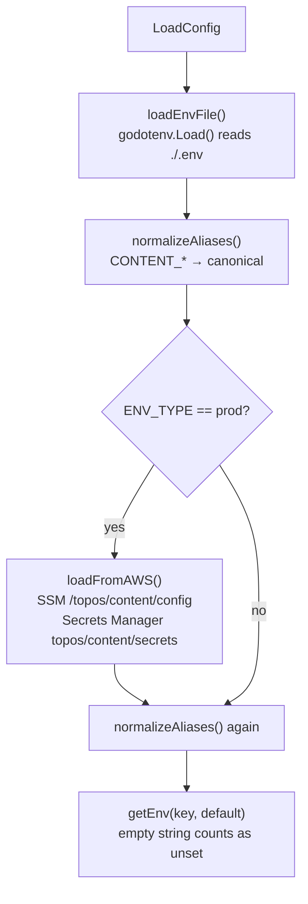

# Configuration

Every setting the Content service reads, its default, which binary cares
about it, and where the value can come from.

The single source of truth is
[`internal/config/config.go`](../../internal/config/config.go).

## How a value is resolved



Four rules worth knowing:

1. **`.env` is loaded only once** (`loadOnce`), from the process working
   directory. Values already present in the real environment are **not**
   overwritten by `godotenv`.
2. **An empty value is treated as unset.** `getEnv` requires
   `strings.TrimSpace(value) != ""`, so `JWT_SECRET=` behaves exactly like
   not setting it at all.
3. **`CONTENT_*` aliases are a fallback, not an override.** An alias is
   only copied across when the canonical name is empty.
4. **Unknown variables are ignored.** There is no schema validation and
   no "unknown key" error — a typo silently does nothing.

> There is **no** strict validation pass the way the user service has.
> Only `JWT_SECRET` and `INTERNAL_TOKEN` are checked afterwards, by
> `validateConfig` in [`cmd/server/main.go`](../../cmd/server/main.go),
> and only for the API binary.

## Core settings

| Variable | Default | Used by | Notes |
| --- | --- | --- | --- |
| `ENV_TYPE` | `dev` | all | `prod` triggers AWS SSM/Secrets Manager hydration |
| `PORT` | `4002` | all | **Every binary defaults to 4002** — set it per worker on the host |
| `LOG_FORMAT` | `json` | all | `json` or `text`; anything else falls back to JSON |
| `LOG_LEVEL` | `info` | all | `debug`, `info`, `warn`, `error`; anything else falls back to `info` |
| `OTEL_EXPORTER_OTLP_ENDPOINT` | *(empty)* | all | Empty = tracing disabled (the normal local mode) |

`LOG_LEVEL` accepts `warning` too — it falls back to `info` rather than
`warn`, which is a small trap. The recognised values are exactly
`debug`, `warn`, `error`, and everything else.

### Endpoint normalization for tracing

`normalizeOtelEndpoint` rewrites what you give it:

| You set | The exporter connects to |
| --- | --- |
| `http://otel-collector:4318` | `otel-collector:4317` (gRPC) |
| `otel-collector:4318` | `otel-collector:4317` |
| `otel-collector` | `otel-collector:4317` |
| `otel-collector:4317` | unchanged |

The collector serves gRPC on `:4317` and HTTP on `:4318`; this exporter
always speaks gRPC, so an `:4318` endpoint is mapped across. **Point it
at the gRPC port** if you set a port at all.

## Secrets

| Variable | Default | Required | Notes |
| --- | --- | --- | --- |
| `JWT_SECRET` | *(empty)* | **yes — API refuses to start** | HS256 key shared with the user service |
| `JWT_ISSUER` | `user-service` | no | Must match the user service |
| `JWT_AUDIENCE` | `topos` | no | Must match the user service |
| `INTERNAL_TOKEN` | *(empty)* | **yes — API refuses to start** | Guards `GET /internal/posts/{id}` |

```go
// cmd/server/main.go
if cfg.JwtSecret == ""    { return errors.New("JWT_SECRET is required") }
if cfg.InternalToken == "" { return errors.New("INTERNAL_TOKEN is required") }
```

Compose supplies `local-dev-secret` and `local-internal-secret` as
defaults, which is why `make up` works with no `.env`.

> `JWT_ISSUER` and `JWT_AUDIENCE` are **not** in `.env.example`. Their
> defaults happen to match the user service's, so most local setups never
> notice — but if you customise either side you must set them on both.

## Storage

| Variable | Default | Notes |
| --- | --- | --- |
| `MONGO_URI` | `mongodb://localhost:27017` | Compose uses `mongodb://content-mongo:27017` |
| `DB_NAME` | `blog_content` | All six collections live here |
| `REDIS_ADDR` | `localhost:6379` | Compose uses `user-redis:6379` — shared with the user service |
| `REDIS_PASSWORD` | *(empty)* | Not read at all if `WITH_REDIS=0` |

**There is no "disable Redis" variable.** To run without a cache you
construct no cache client — in practice that means `WITH_REDIS=0` in
Compose, or simply an unreachable `REDIS_ADDR` (the breaker opens and
reads fall through to Mongo).

## Kafka

| Variable | Default | Used by |
| --- | --- | --- |
| `KAFKA_BROKERS` | `kafka-1:9092` | all — comma-separated list |
| `KAFKA_TOPIC` | `posts` | API (produce), summary + search workers (consume) |
| `KAFKA_USER_INTERACTED_TOPIC` | `user-interacted` | API (produce), personalizer (consume) |
| `KAFKA_DLQ_TOPIC` | `posts-dlq` | all workers (dead letters) |
| `KAFKA_CONSUMER_GROUP_ID` | `content-summary-worker-group` | summary worker |
| `KAFKA_SEARCH_CONSUMER_GROUP_ID` | `content-search-worker-group` | search worker |
| `KAFKA_PERSONALIZER_CONSUMER_GROUP_ID` | `content-personalizer-worker-group` | personalizer |
| `KAFKA_REPLAY_GROUP` | `content-search-dlq-replay` | `dlq-replay` only |

Three separate consumer groups are what let all three workers read the
same `posts` topic independently — each gets every message.

> **The DLQ topic is shared.** `posts-dlq` receives dead letters from the
> `posts` *and* `user-interacted` topics. Distinguish them by decoding
> `originalTopic` in the envelope.

`KAFKA_BROKERS` is split on commas and each entry trimmed; empty entries
are dropped, so `kafka-1:9092, ,kafka-2:9092` is valid.

## AI service

| Variable | Default | Notes |
| --- | --- | --- |
| `AI_SERVICE_URL` | `ai-service:50051` | gRPC target; the dial is lazy so a wrong value does not block startup |

There is no "disable AI" flag. An unreachable address simply opens the
breakers — reads fall back, generation errors, workers dead-letter. See
[Caching and resilience](../concepts/caching-and-resilience.md).

## Workers

| Variable | Default | Notes |
| --- | --- | --- |
| `WORKER_CONCURRENCY` | `3` | Kafka readers per worker; `values < 1` are raised to `1` |

Concurrency is per process, not per topic — a worker with 3 readers
fetches up to 3 messages at once.

## AWS (production only)

Read only when `ENV_TYPE=prod`.

| Variable | Default | Purpose |
| --- | --- | --- |
| `CONTENT_CONFIG_PARAM` | `/topos/content/config` | SSM parameter holding a JSON blob of config |
| `CONTENT_SECRETS_NAME` | `topos/content/secrets` | Secrets Manager secret holding a JSON blob |
| `AWS_REGION` | `ap-south-1` | Region for both |
| `AWS_ENDPOINT_URL` | *(empty)* | Set to point at Floci (`http://localhost:4566`) instead of real AWS |
| `AWS_ACCESS_KEY_ID` / `AWS_SECRET_ACCESS_KEY` | *(empty)* | Explicit credentials, mainly for Floci |

Hydration is **best-effort and non-fatal**:

- Both sources are JSON objects of `string → string`.
- A value is written only if the environment variable is currently empty.
- `ParameterNotFound` / `ResourceNotFoundException` is logged at `debug`.
- Any other error is logged at `warn` and the process continues.
- The whole call is bounded by a **5-second** context timeout.

So a missing SSM parameter in production does not stop the service — it
falls through to defaults, which for `JWT_SECRET` means a startup
failure rather than silently weak auth.

## `CONTENT_*` aliases

Only these nine are recognised:

| Alias | Canonical |
| --- | --- |
| `CONTENT_MONGO_URI` | `MONGO_URI` |
| `CONTENT_DB_NAME` | `DB_NAME` |
| `CONTENT_REDIS_ADDR` | `REDIS_ADDR` |
| `CONTENT_REDIS_PASSWORD` | `REDIS_PASSWORD` |
| `CONTENT_JWT_SECRET` | `JWT_SECRET` |
| `CONTENT_INTERNAL_TOKEN` | `INTERNAL_TOKEN` |
| `CONTENT_AI_SERVICE_URL` | `AI_SERVICE_URL` |
| `CONTENT_KAFKA_BROKERS` | `KAFKA_BROKERS` |
| `CONTENT_KAFKA_TOPIC` | `KAFKA_TOPIC` |

There is **no** alias for `KAFKA_DLQ_TOPIC`, the consumer group IDs,
`KAFKA_USER_INTERACTED_TOPIC`, `LOG_*`, `WORKER_CONCURRENCY`, or
`PORT`. The compose files pass those directly.

Their purpose is coexistence: the full local stack shares one Redis and
one JWT secret between the user and content services, so each service can
keep its own prefixed name.

## Settings that do not exist

Hard-coded constants you might expect to be configurable but are not:

| Area | Constant | Value | Where |
| --- | --- | --- | --- |
| Pagination | `DefaultLimit` / `MaxLimit` / `MaxPage` | 10 / 100 / 1000 | [`pagination.go`](../../internal/pagination/pagination.go) |
| Post limits | title / body / tags | 200 bytes / 1 MiB / 20 × 64 bytes | [`post_service.go`](../../internal/service/post_service.go) |
| Draft prompt | `maxDraftPromptLen` | 5000 chars | [`post_draft_service.go`](../../internal/service/post_draft_service.go) |
| Worker retries | `maxRetries` / `retryBase` | 5 / 5 s | [`runner.go`](../../internal/worker/runner.go) |
| Cache TTLs | `PostsTTL` … `RecommendTTL` | 1 min – 5 min (30 s for recents) | [`cache.go`](../../internal/cache/cache.go) |
| Cache breaker | threshold / window | 3 failures / 10 s | [`cache.go`](../../internal/cache/cache.go) |
| AI breaker | threshold / window | 5 failures / 30 s, 2 successes to close | [`client.go`](../../internal/infrastructure/ai/client.go) |
| AI post timeout | `postTimeout` | 120 s (covers generation plus up to two repairs) | [`client.go`](../../internal/infrastructure/ai/client.go) |
| AI index timeout | `indexTimeout` | 90 s (cold CPU embeds are slow) | [`client.go`](../../internal/infrastructure/ai/client.go) |
| Redis timeouts | dial / command / retries | 2 s / 3 s / 3 | [`cache.go`](../../internal/cache/cache.go) |
| Request coalescing | `batchSettle` | 5 ms | [`graph/batch.go`](../../graph/batch.go) |
| Chat context | `chatHistoryTurns` / `chatTopK` | 6 / 5 | [`chat_service.go`](../../internal/service/chat_service.go) |
| Shutdown grace | `srv.Shutdown` deadline | 10 s | [`cmd/server/main.go`](../../cmd/server/main.go) |
| Mongo index timeout | `EnsureIndexes` | 30 s | [`db/`](../../internal/db) |
| DLQ replay idle window | `drainTimeout` | 30 s | [`dlq/replay.go`](../../internal/dlq/replay.go) |

Changing any of these means editing the source. They are constants
because they must agree across layers — a cache key built with one limit
and a query executed with another would break caching entirely.

## `.env.example`

The tracked template in [`services/content/.env.example`](../../.env.example):

```dotenv
PORT=4002
MONGO_URI=mongodb://localhost:27017
DB_NAME=blog_content
REDIS_ADDR=localhost:6379
REDIS_PASSWORD=
JWT_SECRET=local-dev-secret
# Shared secret guarding the internal posts API (AI service fetches bodies)
INTERNAL_TOKEN=local-internal-secret
AI_SERVICE_URL=ai-service:50051
KAFKA_BROKERS=kafka-1:9092
KAFKA_TOPIC=posts
KAFKA_USER_INTERACTED_TOPIC=user-interacted
KAFKA_CONSUMER_GROUP_ID=content-summary-worker-group
KAFKA_SEARCH_CONSUMER_GROUP_ID=content-search-worker-group
KAFKA_PERSONALIZER_CONSUMER_GROUP_ID=content-personalizer-worker-group
KAFKA_DLQ_TOPIC=posts-dlq
WORKER_CONCURRENCY=3
```

Notice it omits `JWT_ISSUER`, `JWT_AUDIENCE`, `LOG_*`,
`OTEL_EXPORTER_OTLP_ENDPOINT`, and every AWS variable — all of which
still work via their defaults.

## Recipes

```bash
# local host run
cp .env.example .env
# edit MONGO_URI/REDIS_ADDR/KAFKA_BROKERS to localhost, then:
go run ./cmd/server

# a worker on the host (must not collide with the API's default port)
PORT=4003 go run ./cmd/worker

# dev stack with tracing to a local collector
OTEL_EXPORTER_OTLP_ENDPOINT=http://localhost:4317 make up

# point at a different broker list
KAFKA_BROKERS=kafka-1:9092,kafka-2:9092,kafka-3:9092 make up

# alternate the published API port when 4002 is taken
CONTENT_SERVICE_EXT_PORT=4102 make up
```

For the degraded-mode flags (`WITH_MONGO`, `WITH_REDIS`, `WITH_KAFKA`)
see the [quick start](quickstart.md#try-the-degraded-modes).

## Related

- [Quick start](quickstart.md) — running it
- [Architecture](../concepts/architecture.md) — when config is loaded
- [Authentication](../concepts/authentication.md) — how the JWT settings are used
- [Health and observability](../operations/health-and-observability.md) — `LOG_*` and `OTEL_*` in practice
