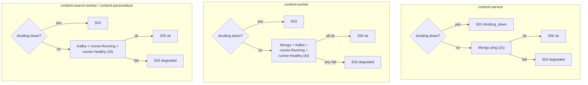

# Health and observability

How to tell whether the Content service is healthy, what each probe
actually checks, every metric it exports, and how to correlate a client
error with a server log line.

## Endpoints

| Endpoint | Binaries | Purpose |
| --- | --- | --- |
| `GET /healthz` | service, worker, search, personalizer | Liveness |
| `GET /readyz` | service, worker, search, personalizer | Readiness |
| `GET /metrics` | service, worker, search, personalizer | Prometheus scrape |
| `POST /query` | service only | GraphQL |
| `GET /` | service only | Playground |
| `GET /internal/posts/{id}` | service only | AI callback, `X-Internal-Secret` |

> Only `content-service` publishes a host port. To scrape a worker from
> the host, exec into its container:
>
> ```bash
> docker compose -p topos-content-local exec content-worker \
>   curl -s localhost:4003/metrics
> ```

## Liveness: `/healthz`

```json
200 {"status":"ok"}
503 {"status":"shutting_down"}
```

It checks exactly one thing: the process-wide shutting-down flag. It
touches **no dependency**. That is the point — a liveness probe that
fails when MongoDB blips would restart a container that is perfectly
capable of recovering.

## Readiness: `/readyz`

Readiness is **different per binary**, because each binary needs
different things.



| Binary | Handler | Checks |
| --- | --- | --- |
| `content-service` | `ReadyzHandler` | shutting-down flag, **MongoDB only** |
| `content-worker` | `WorkerHealthHandler` | flag, MongoDB, Kafka, consumer running, AI healthy |
| `content-search-worker` | `SearchWorkerHealthHandler` | flag, Kafka, consumer running, AI healthy |
| `content-personalizer` | `SearchWorkerHealthHandler` | flag, Kafka, consumer running, AI healthy |

Each check has a **2-second** context budget.

### What `/readyz` omits on the API

Three dependencies are never checked, all on purpose:

1. **Redis** — fail-open; a dead cache does not stop reads.
2. **Kafka** — the API only *produces*, and publishing is best-effort.
3. **The AI service** — optional for every read.

Note that **no readiness probe pings Redis anywhere in this service**.
The helper that would — `pingRedis` in
[`internal/health/health.go`](../../internal/health/health.go) — is
defined but never called, so `content_dependency_up{dep="redis"}` only
moves when a real cache operation runs, never because of a probe.

### Other gaps

1. **`WorkerHealthHandler` accepts a `*cache.Cache` parameter it never
   uses** — the summary worker's readiness does not depend on Redis
   either.
2. **`SearchWorkerHealthHandler` pings Kafka up to three times per
   probe** — once inside the decision and again in each response body.
   The status that decides the response and the `kafka` field it returns
   are separate pings and can, in principle, disagree.

### `runner.Healthy`

```go
func (b *baseRunner) Healthy(ctx context.Context) error {
    if err := b.Running(); err != nil { return err }
    return b.aiService.Health(ctx)   // no open breaker + connection ready
}
```

`aiService.Health` makes **no RPCs** — it only reports whether a breaker
is open and the gRPC connection is ready. Probes therefore never perturb
the AI service.

> **A worker can be "unready" while perfectly healthy.**
>
> `grpcClient.Health` is literally `conn.GetState() == connectivity.Ready`.
> The channel is built with `grpc.NewClient`, whose contract is *"No I/O
> is performed. Use of the ClientConn for RPCs will automatically cause it
> to connect."* Until the **first** AI RPC the channel is unconnected,
> `runner.Healthy` fails, and a worker answers `503` with:
>
> ```text
> {"status":"degraded","db":"ok","kafka":"ok"}
> ```
>
> In other words, a worker that has consumed nothing yet — a quiet
> topic, a fresh deployment — reports degraded until real traffic makes
> an AI call. The repo pins this down with
> `TestGRPCClientHealthFailsWithoutConnection` in
> [`internal/infrastructure/ai/client_test.go`](../../internal/infrastructure/ai/client_test.go).
>
> What that means in practice:
>
> - **Compose is unaffected** — its health check is `/healthz`, which
>   ignores dependencies entirely.
> - **A readiness probe on `/readyz` would be wrong for workers** — the
>   pod would never be Ready on a quiet topic. Probe `/healthz` for the
>   workers and reserve `/readyz` for `content-service`.

### Sample responses

```bash
$ curl -s localhost:4002/readyz
{"status":"ok","db":"ok"}

$ curl -s localhost:4002/readyz          # Mongo down
{"status":"degraded","db":"unavailable"}   # HTTP 503

$ curl -s localhost:4002/readyz          # during shutdown
{"status":"shutting_down","db":"unavailable"}   # HTTP 503
```

### Wiring the probes

| Probe | Path | Config |
| --- | --- | --- |
| Kubernetes liveness | `/healthz` | `periodSeconds: 10`; no `initialDelaySeconds` needed (the HTTP server starts last, after Mongo retries) |
| Kubernetes readiness — **API only** | `/readyz` | `periodSeconds: 5` |
| Kubernetes readiness — **workers** | `/healthz` | `/readyz` never becomes green on a quiet topic — see the note above |
| Compose healthcheck | `/healthz` | already set in `infra/compose.yml`: 30 s interval, 10 s timeout, 3 retries, **no `start_period`** |

Compose uses **`/healthz`**, not `/readyz`, so a container is "healthy"
even when MongoDB is down. If you want orchestration to wait for a
*working* database, probe `/readyz`.

The missing `start_period` is the other thing to know: a container whose
first health check lands while Mongo is still being retried will burn a
retry. The retries are generous (3 × 30 s) so it recovers, but if you
tune the health check, add `start_period: 60s`.

## Logs

Structured `log/slog` on stdout. Format is `json` by default; set
`LOG_FORMAT=text` for human-readable lines.

```json
{"time":"2026-09-30T10:15:00.123Z","level":"INFO","service":"content-service",
 "request_id":"a1b2c3d4e5f60708","msg":"request","method":"POST",
 "path":"/query","status":200,"duration_ms":12}
```

Every line carries **`service`** — one of `content-service`,
`content-worker`, `content-search-worker`, `content-personalizer` — so
logs from the four processes stay separable.

### Where request IDs come from

`RequestIDMiddleware` is the **outermost** middleware, so it applies to
every route:

1. An incoming `X-Request-ID` is accepted if it is ≤ 64 characters and
   made only of letters, digits, `-`, `_`, `.`. Anything else is
   **discarded in favour of a server-generated ID** — client input can
   never inject log content.
2. The ID goes into the response header `X-Request-ID`.
3. It is attached to the request context along with a logger already
   bound to `request_id`.
4. `extensions.request_id` on every GraphQL error carries the same value.

**Correlating a client failure with a server log is therefore a string
copy** — see [Error handling](../components/error-handling.md).

### Log lines worth alerting on

| Message | Level | Meaning |
| --- | --- | --- |
| `graphql operation failed` | error | An unclassified resolver error — includes `error`, `request_id`, `operation` |
| `graphql resolver panic` | error | Panic inside a resolver |
| `panic recovered in handler chain` | error | Panic outside a resolver, with a full stack |
| `message failed after all retries, sending to dlq` | error | Something dead-lettered |
| `failed to publish event` | warn | **A Kafka event was silently lost** |
| `failed to publish to dlq` | error | Offset stays uncommitted; message will be redelivered |
| `mongo ping failed, retrying` | warn | Startup database retries |
| `mongo unavailable, running in degraded mode` | warn | Booted with a lazy client |
| `ai <op> failed, using fallback` | warn | Read path degraded |
| `recommend feed failed, serving recency fallback` | warn | Personalisation off |
| `circuit breaker opened: <domain>` | — | (not logged; visible only as `content_ai_breaker_state`) |

## Metrics

`GET /metrics` on every binary. There are **29 metrics**, all under the
`content_` namespace. They are defined in
[`internal/metrics/metrics.go`](../../internal/metrics/metrics.go).

### HTTP

| Metric | Type | Labels |
| --- | --- | --- |
| `content_http_requests_total` | counter | `method`, `route`, `status` (`2xx`/`3xx`/`4xx`/`5xx`) |
| `content_http_request_duration_seconds` | histogram | `method`, `route` |
| `content_http_requests_in_flight` | gauge | — |
| `content_http_panics_total` | counter | — |

Probe and metrics paths (`/healthz`, `/readyz`, `/metrics`, `/health`,
`/ready`) are **excluded** from request counting, so probe traffic never
distorts your traffic graphs.

> `route` is `r.URL.Path`, not a templated route — so `/internal/posts/
> 665f…` appears as its own label value. That is fine for `/query`, but
> do not build dashboards on `route` for the internal endpoint.

### GraphQL

| Metric | Type | Labels |
| --- | --- | --- |
| `content_graphql_operations_total` | counter | `operation`, `status` |
| `content_graphql_operation_duration_seconds` | histogram | `operation`, `status` |
| `content_graphql_errors_total` | counter | `operation`, `kind` |

> ### `content_graphql_operations_total` is effectively a constant
>
> It is incremented in exactly one place, [`cmd/server/main.go`](../../cmd/server/main.go),
> with **hard-coded labels**:
>
> ```go
> metrics.GraphQLOperationsTotal.WithLabelValues("query", "success").Inc()
> metrics.GraphQLOperationDuration.WithLabelValues("query", "success").Observe(...)
> ```
>
> Every GraphQL request — query *or* mutation, success *or* failure —
> increments `operation="query", status="success"`. It never distinguishes
> them, and it is not incremented at all when the response is an auth 401
> or a panic 500.
>
> **Do not use it to measure success rate.** Use
> `content_graphql_errors_total` for failures, and
> `content_http_request_duration_seconds{route="/query"}` for latency.

`content_graphql_errors_total{kind}` values: `unauthorized`,
`forbidden`, `not_found`, `validation`, `conflict`, `client`,
`internal`. Because GraphQL responses ride on HTTP 200, **this is the
only signal that resolver failures are happening.**

### Cache

| Metric | Type | Labels |
| --- | --- | --- |
| `content_cache_hits_total` | counter | — |
| `content_cache_misses_total` | counter | — |
| `content_cache_errors_total` | counter | — |
| `content_cache_breaker_state` | gauge | — (0 closed, 1 open, 2 half-open) |
| `content_cache_invalidations_total` | counter | `operation` (`key`/`lists`), `result` (`ok`/`error`) |
| `content_redis_connected` | gauge | — (0/1) |

`content_cache_errors_total` rising while `content_redis_connected`
stays 1 means intermittent Redis trouble the breaker has not yet opened
on.

### Dependencies and probes

| Metric | Type | Labels |
| --- | --- | --- |
| `content_dependency_up` | gauge | `dep` ∈ `db`, `redis`, `kafka` (0/1) |
| `content_dependency_ping_duration_seconds` | histogram | `dep` |
| `content_probe_checks_total` | counter | `probe` ∈ `liveness`, `readiness`; `result` ∈ `ok`, `degraded`, `shutting_down` |
| `content_db_query_duration_seconds` | histogram | `operation`, `status` ∈ `success`, `error` |

### AI

| Metric | Type | Labels |
| --- | --- | --- |
| `content_ai_fallback_engaged_total` | counter | `operation` |
| `content_ai_breaker_state` | gauge | `domain` ∈ `generation`, `search`, `chat`, `index`, `profile`, `recommend` (0/1/2) |

`content_ai_fallback_engaged_total` counts **both** "the primary failed"
and "the breaker was already open" — it is a measure of degraded calls,
not a breaker transition count.

### Recommendations

| Metric | Type | Labels |
| --- | --- | --- |
| `content_recommend_cold_start_total` | counter | — |
| `content_recommend_feed_served_total` | counter | `mode` ∈ `default`, `surprise`, `fresh`, `explorer` |
| `content_recommend_feed_interaction_total` | counter | `mode`, `kind` ∈ `view`, `like`, `save` |

`mode` is the **lowercase domain value**, not the uppercase GraphQL enum
(`DEFAULT` → `default`).

Interactions with no feed attribution (opened directly from a list, or
with no `mode` argument) are **not** counted, keeping the per-mode
engagement ratio clean.

### Content

| Metric | Type | Labels |
| --- | --- | --- |
| `content_posts_created_total` | counter | — |
| `content_posts_updated_total` | counter | — |
| `content_posts_deleted_total` | counter | — |
| `content_interactions_total` | counter | `kind` ∈ `view`,`like`,`save`; `status` ∈ `published`,`publish_failed`,`deduplicated`,`removed`,`error` |

`status=deduplicated` on a `view` is normal — repeat views within the
24-hour `view:` key window are collapsed.

### Workers

| Metric | Type | Labels |
| --- | --- | --- |
| `content_worker_messages_total` | counter | `result` ∈ `completed`, `skipped`, `failed`, `dlq`, `dlq_failed` |
| `content_worker_retries_total` | counter | — |
| `content_worker_consumer_lag` | gauge | `reader` (index of the Kafka reader, `0`…`n-1`) |

Lag is refreshed every **15 seconds** from kafka-go's reader stats.

> `content_worker_consumer_lag` is **not emitted at all before the first
> 15-second tick**, and readers are labelled by position rather than
> topic. With `WORKER_CONCURRENCY=3` you get `reader="0"`, `"1"`, `"2"`.

## Useful queries

```promql
# error rate by kind — the real failure signal
sum by (kind) (rate(content_graphql_errors_total[5m]))

# server-side failures only
sum by (operation) (rate(content_graphql_errors_total{kind="internal"}[5m]))

# cache effectiveness
rate(content_cache_hits_total[5m])
  / (rate(content_cache_hits_total[5m]) + rate(content_cache_misses_total[5m]))

# something is being dead-lettered
increase(content_worker_messages_total{result="dlq"}[15m])

# a breaker is stuck open
content_ai_breaker_state == 1

# recommendations falling back to recency
rate(content_recommend_cold_start_total[5m])

# publishes being lost while posts are created
rate(content_posts_created_total[5m])
  - rate(content_worker_messages_total{result="completed"}[5m])
```

### Suggested alerts

| Alert | Expression | Why |
| --- | --- | --- |
| API not ready | `content_dependency_up{dep="db"} == 0` for 2 m | `/readyz` would be 503 |
| Resolver failures | `sum(rate(content_graphql_errors_total{kind="internal"}[5m])) > 0.1` | Real bugs |
| Cache breaker open | `content_cache_breaker_state == 1` for 5 m | Redis down; load shifting to Mongo |
| AI breaker open | `content_ai_breaker_state == 1` for 10 m | AI outage |
| Dead letters | `increase(content_worker_messages_total{result="dlq"}[15m]) > 0` | Background work failing |
| Consumer falling behind | `content_worker_consumer_lag > 1000` | Backlog |
| Panics | `increase(content_http_panics_total[15m]) > 0` | Recovered crashes |
| Lost publishes | `rate(content_posts_created_total[5m])` spikes with flat worker counters | Kafka write failures |

## Tracing

Enabled only when `OTEL_EXPORTER_OTLP_ENDPOINT` is set; otherwise the
no-op tracer is in place and logging still works.

| Span | Source | Attributes |
| --- | --- | --- |
| `graphql` | `otelhttp.NewHandler` around `/query` | HTTP standard attributes |
| `process message` | summary worker | `post.id`, `kafka.partition`, `kafka.offset` |
| `index post` | search worker | `post.id`, `kafka.partition`, `kafka.offset` |
| `delete from index` | search worker (tombstone) | `post.id`, `kafka.partition`, `kafka.offset` |
| `update user profile` | personalizer | `user.id`, `post.id`, `kafka.partition`, `kafka.offset` |
| Mongo queries | `otelmongo` monitor | driver attributes |
| gRPC calls | `otelgrpc` | AI client attributes |

The `/query` span covers **auth, resolution, and outbound calls**, so a
single trace shows the whole request including the AI or Mongo time.

Tracer names: `content-worker`, `content-search-worker`,
`content-personalizer`.

## A debugging walkthrough

```bash
# 1. is it alive and ready?
curl -s localhost:4002/healthz
curl -s localhost:4002/readyz

# 2. are dependencies up?
curl -s localhost:4002/metrics | grep -E '^content_dependency_up|^content_redis_connected'

# 3. are errors happening?
curl -s localhost:4002/metrics | grep '^content_graphql_errors_total'

# 4. correlate: take the request id from the client error
curl -s localhost:4002/metrics | grep '^content_cache_breaker_state\|^content_ai_breaker_state'

# 5. tail logs filtered by that request id
docker compose -p topos-content-local logs content-service | grep a1b2c3d4e5f60708
```

## Related

- [Caching and resilience](../concepts/caching-and-resilience.md) — what the breaker metrics mean
- [Reliability, retries, and DLQ](reliability.md) — worker metrics in context
- [Error handling](../components/error-handling.md) — `kind` labels and `request_id`
- [Configuration](../getting-started/configuration.md) — `LOG_*` and `OTEL_*`
