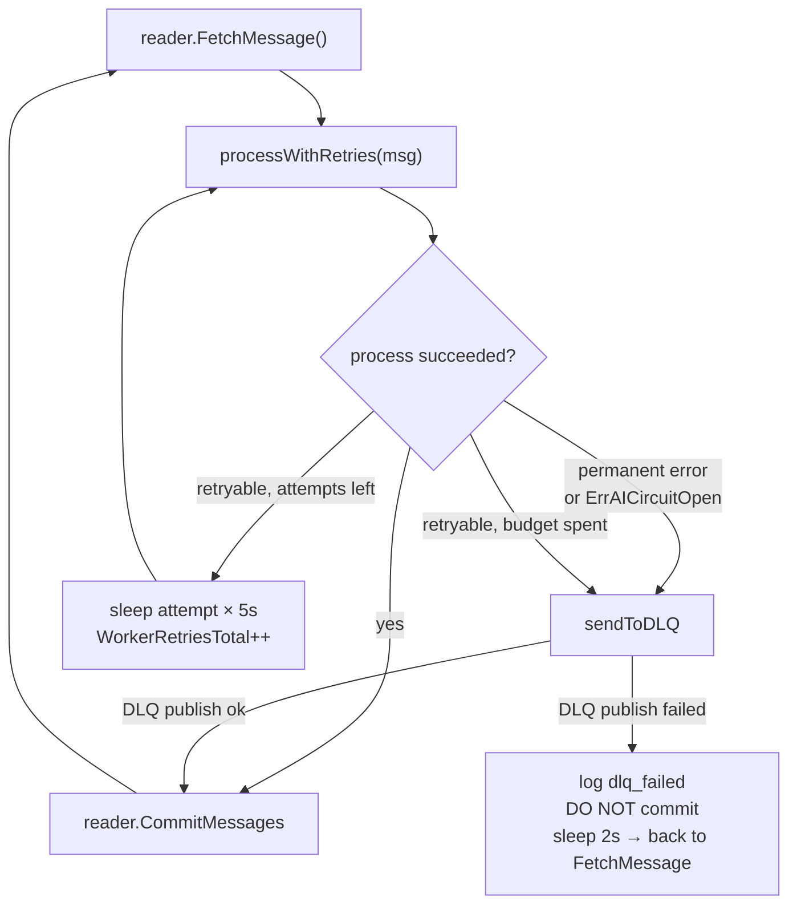
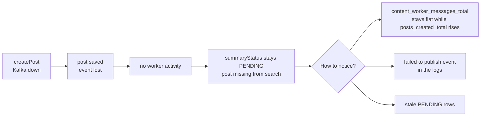
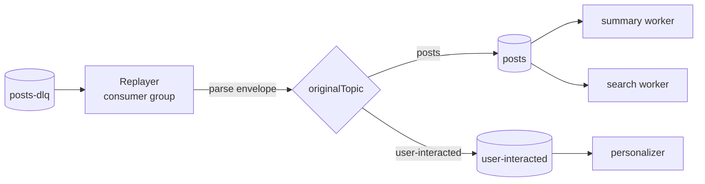
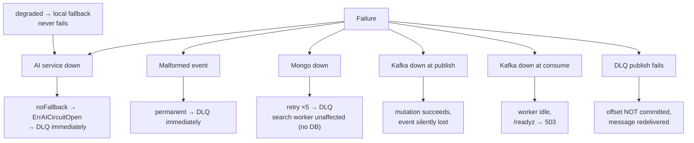

# Reliability, retries, and dead letters

Background work in this service can fail — the AI service goes down, a
message is malformed, Kafka restarts. This page is the reference for
what happens next: the retry budget, what counts as permanent, how a
message reaches the dead-letter topic, and how to get it back.

## The processing pipeline

All three workers share one piece of machinery,
`baseRunner` in [`internal/worker/runner.go`](../../internal/worker/runner.go).



**The offset is committed only when the message has been either
successfully processed or successfully dead-lettered.** A crash anywhere
else means redelivery, and every handler is written to tolerate that.

## Retry budget

| Parameter | Value | Constant |
| --- | --- | --- |
| Attempts | 5 | `maxRetries` |
| Backoff | `attempt × 5s` | `retryBase = 5 * time.Second` |
| Sequence | 5 s, 10 s, 15 s, 20 s | — |
| Total worst-case per message | ~50 s | — |
| Lag report interval | 15 s | `lagReportInterval` |
| DLQ publish retry delay | 2 s | `dlqRetryDelay` |

Note the sequence has **four sleeps for five attempts** — the fifth
failure exits the loop immediately without sleeping.

```go
// the whole retry policy, in one place
for attempt := 1; attempt <= b.maxRetries; attempt++ {
    processErr = process(ctx, m)
    if processErr == nil { return nil }
    if isPermanent(processErr) || errors.Is(processErr, domain.ErrAICircuitOpen) {
        return processErr          // no retries, straight to the DLQ
    }
    metrics.WorkerRetriesTotal.Inc()
    select {
    case <-ctx.Done(): return ctx.Err()
    case <-time.After(time.Duration(attempt) * b.retryBase):
    }
}
return processErr
```

There is no jitter and no exponential multiplier — the schedule is
exactly `attempt × 5s`, which makes test timings predictable.

## Permanent vs retryable

A permanent error skips the remaining attempts and goes to the DLQ
immediately.

| Classification | Errors | Rationale |
| --- | --- | --- |
| **Permanent** | `permanentf("unmarshal event: ...")` | Re-reading the same bytes will not fix them |
| **Permanent** | `permanentf("event is missing postId")` | Nothing to process |
| **Permanent** | `permanentf("interaction is missing userId or postId")` | Nothing to process |
| **Permanent** | `domain.ErrAICircuitOpen` | The AI breaker is open — retrying now wastes 50 s |
| **Retryable** | Anything else, including a normal gRPC error | Likely transient |

`domain.ErrAICircuitOpen` deserves emphasis: when the AI breaker opens,
**the worker dead-letters immediately instead of burning its retry
budget.** During a long AI outage, messages land on the DLQ quickly and
the worker keeps consuming. Once the outage is over you replay them.

Errors that *are* retryable but exhaust all five attempts also go to the
DLQ — a non-permanent classification only means "try again", not
"retry forever".

## What each worker treats as permanent

| Worker | Topic | Permanent failures |
| --- | --- | --- |
| `content-worker` | `posts` | Unmarshal failure, missing `postId` |
| `content-search-worker` | `posts` | Unmarshal failure, missing `postId` |
| `content-personalizer` | `user-interacted` | Unmarshal failure, missing `userId` or `postId` |

Everything else — AI errors, Mongo errors, index errors — is retryable.

## Skips are not failures

A message that is correctly understood but needs no work is
**completed**, not failed:

| Condition | Worker | Result label |
| --- | --- | --- |
| Empty value (tombstone) | all three | `skipped` |
| Tombstone with no key | search | `skipped` (logged as `tombstone without key`) |
| Post already `COMPLETED` with a summary | summary | `completed` |
| Post deleted since publish | summary | `completed` |

Skipped messages are committed normally. `content_worker_messages_total`
separates `completed`, `skipped`, `failed`, and `dlq`.

## The dead-letter envelope

A dead-lettered message is **not** the original bytes. It is wrapped:

```json
{
  "originalTopic": "posts",
  "error": "generate summary: rpc error: code = Unavailable",
  "payload": "<base64 of the original message value>",
  "timestamp": "2026-09-29T10:15:00Z"
}
```

Defined as `DeadLetterMessage` in
[`kafka_producer.go`](../../internal/infrastructure/messaging/kafka_producer.go).

| Property | Value |
| --- | --- |
| Topic | `posts-dlq` (env `KAFKA_DLQ_TOPIC`) — **shared by all three workers** |
| Key | The original message key, preserved |
| `payload` | Base64-encoded original bytes, so malformed payloads survive |
| `error` | The final cause, as text |

The shared DLQ topic is important: `posts-dlq` receives dead letters from
`posts` **and** `user-interacted`. You cannot tell them apart by topic —
you tell them apart by decoding the envelope's `originalTopic`.

> **Because the key is preserved**, a replayed message lands on the same
> partition of its original topic, preserving per-post and per-user
> ordering.

## The quiet failure mode

The publish path is best-effort ([Publishing flow](../concepts/publishing-flow.md#what-createpost-actually-does)):

```go
if err := s.publisher.PublishPostCreated(ctx, post); err != nil {
    slog.Warn("failed to publish event", "error", err)   // ← warning only
}
// mutation still succeeds
```

If Kafka is unreachable at the moment someone saves a post:

- The post **is** saved (correct).
- **No event is ever emitted**, so no summary and no search index entry.
- Nothing lands in the DLQ — the DLQ only receives messages a worker
  actually consumed.
- The only signal is a `failed to publish event` warn log line and, later,
  a post with `summaryStatus: PENDING` that never changes.



**Detection:**

```promql
# events published vs posts created — a gap means lost publishes
rate(content_posts_created_total[5m])
rate(content_worker_messages_total{result="completed"}[5m])
```

**Correction:** there is no automatic repair. You would re-publish the
event yourself, or edit the post to bump `updatedAt` and trigger
`post.updated`.

## Replay

`content-dlq-replay` republishes dead letters onto their original topic.

```bash
# from services/content/
go run ./cmd/dlq-replay

# environment
KAFKA_BROKERS=localhost:9092
KAFKA_DLQ_TOPIC=posts-dlq
KAFKA_REPLAY_GROUP=content-search-dlq-replay   # resume point
```



| Property | Behaviour |
| --- | --- |
| Consumer group | `content-search-dlq-replay` — **resumes where the last run stopped** |
| First run | Starts at `FirstOffset` (oldest message) |
| Termination | Stops after **30 s** with no new message (`drainTimeout`) |
| Malformed envelope | Skipped and logged; the rest of the run continues |
| Republish failure | **Aborts the whole run** |
| Delivery | At-least-once — a crash between write and commit replays once more |

The at-least-once property is safe because every consumer is idempotent:
re-indexing a post upserts, re-summarizing an already-`COMPLETED` post is
skipped, and re-updating a profile is a no-op.

> **There is no dry-run mode.** The binary has no `--dry-run` flag and no
> way to preview what it will republish. If you want to inspect first,
> read the DLQ yourself with a console consumer.
>
> There is also **no filter** — a run replays *everything* in the DLQ
> that the group has not yet consumed, including messages you may have
> decided to abandon.

### Replaying safely

```bash
# 1. see what is waiting (read-only, does not move the group offset)
kcat -C -b localhost:9092 -t posts-dlq -o beginning -J | jq '.[] | .payload | fromjson | {originalTopic, error}'

# 2. once the AI service is healthy again, replay
go run ./cmd/dlq-replay

# 3. watch the workers pick them up (worker ports stay inside the
#    Docker network, so exec into the container)
docker compose -p topos-content-local exec content-worker \
  curl -s localhost:4003/metrics | grep content_worker_messages_total
```

Step 1 with `kcat` does **not** use the replay consumer group, so it does
not disturb your resume point.

### Resetting a replay group

If a replay aborted halfway and you want a clean start:

```bash
# destructive: the group will re-read every message from the beginning
kafka-consumer-groups --bootstrap-server localhost:9092 \
  --delete-offsets --group content-search-dlq-replay --topic posts-dlq
```

Careful: replaying an already-replayed batch is safe (idempotent) but
costs AI calls.

## Failure modes at a glance



| Failure | Reader impact | Recovery |
| --- | --- | --- |
| AI down | Reads mostly fine; generation fails | Auto (breaker half-open) → replay DLQ |
| Malformed event | None | Fix data; message stays in DLQ |
| Mongo down | All queries fail; `/readyz` 503 | Auto reconnect |
| Kafka down at publish | None (mutation succeeds) | Manual re-publish |
| Kafka down at consume | Workers idle, `/readyz` 503 | Auto on broker return |
| DLQ publish fails | None | Automatic redelivery |

## Observing background health

```bash
# from services/content/
make logs SERVICE=content-worker
make logs SERVICE=content-search-worker
make logs SERVICE=content-personalizer

# worker HTTP endpoints are not published to the host — exec in
docker compose -p topos-content-local exec content-worker \
  curl -s localhost:4003/metrics | grep -E 'content_worker_|content_ai_'
docker compose -p topos-content-local exec content-worker \
  curl -s localhost:4003/readyz
```

| Metric | What it tells you |
| --- | --- |
| `content_worker_messages_total{result}` | `completed` / `skipped` / `failed` / `dlq` / `dlq_failed` |
| `content_worker_retries_total` | Retry attempts — a steady rise means chronic AI or DB trouble |
| `content_worker_consumer_lag{reader}` | Uncommitted backlog per reader, updated every 15 s |
| `content_ai_fallback_engaged_total{operation}` | AI calls that did not reach the primary |
| `content_ai_breaker_state{domain}` | 0 closed, 1 open, 2 half-open |

```promql
# alert: something is being dead-lettered
increase(content_worker_messages_total{result="dlq"}[15m]) > 0

# alert: falling behind
content_worker_consumer_lag > 1000

# alert: a breaker is stuck open
content_ai_breaker_state == 1
```

## Operational checklist

**During an AI outage:**

1. Confirm with `content_ai_breaker_state` — which domain is open?
2. Let workers dead-letter (they will, quickly, on `ErrAICircuitOpen`).
3. Watch `content_worker_messages_total{result="dlq"}`.
4. Confirm reads still work — they should.

**After recovery:**

1. Wait for `content_ai_breaker_state` to return to 0.
2. Drain the DLQ: `go run ./cmd/dlq-replay`.
3. Watch `content_worker_messages_total{result="completed"}` rise.
4. Spot-check a post's `summaryStatus`.

**Investigating a post with no summary:**

1. Is `summaryStatus` `PENDING`? If `FAILED`, the worker already gave up
   on that content.
2. Did `createPost` log `failed to publish event`? → the event never
   existed. Re-trigger by editing the post.
3. Was it dead-lettered? Search the DLQ for the post ID as a key.
4. Is the summary worker consuming? Check its `/readyz` and lag.

## Next steps

- [Publishing flow](../concepts/publishing-flow.md) — how events are produced
- [Caching and resilience](../concepts/caching-and-resilience.md) — why `ErrAICircuitOpen` exists
- [Health and observability](health-and-observability.md) — probes and alerting
- [Testing overview](../testing/overview.md) — the integration tests covering these paths
