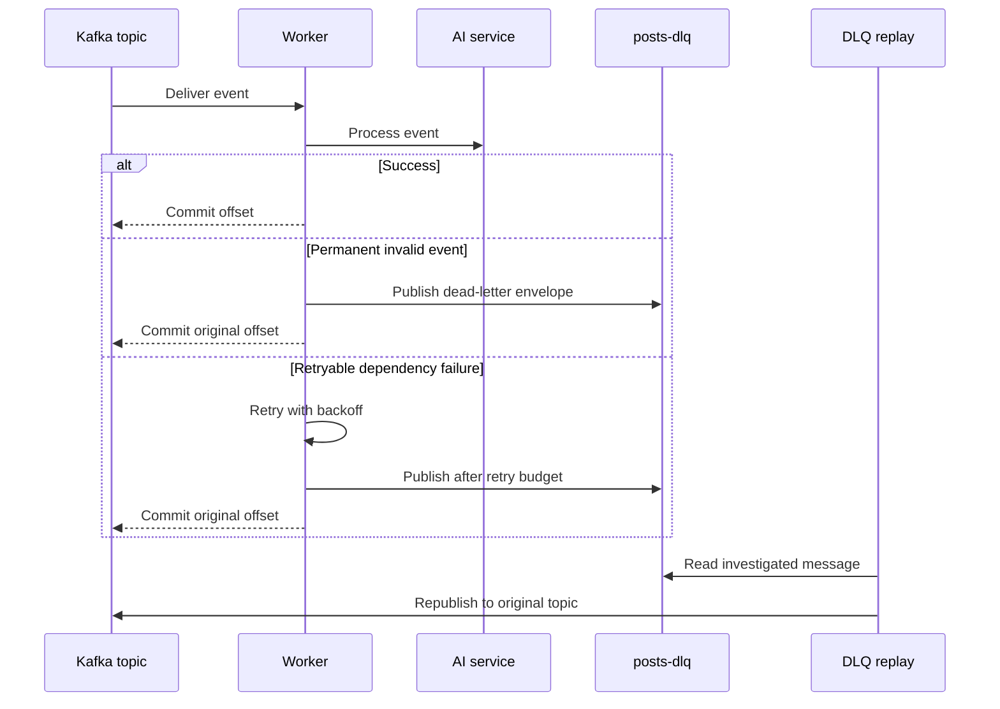

# Reliability, retries, and DLQ

Workers use Kafka consumer groups and retry transient processing failures. A
message that cannot succeed is placed on the configured dead-letter topic for
investigation and later replay.

Malformed event JSON and missing required IDs are permanent failures. A deleted
post is a successful skip for the summary worker. Replaying before fixing a
systemic error only sends the message back into the same failure path.

## Degraded dependencies

| Dependency | Behaviour |
| --- | --- |
| MongoDB unavailable | API can boot but readiness is degraded; content operations fail safely. |
| Redis unavailable | Cache is fail-open; reads use MongoDB and writes keep the canonical store. |
| Kafka unavailable | Publishing/consuming is degraded; workers cannot make progress. |
| AI unavailable | Workers retry and may ultimately dead-letter work. |

Use `make logs SERVICE=<service>` and the worker metrics endpoints to diagnose
the failing stage.
