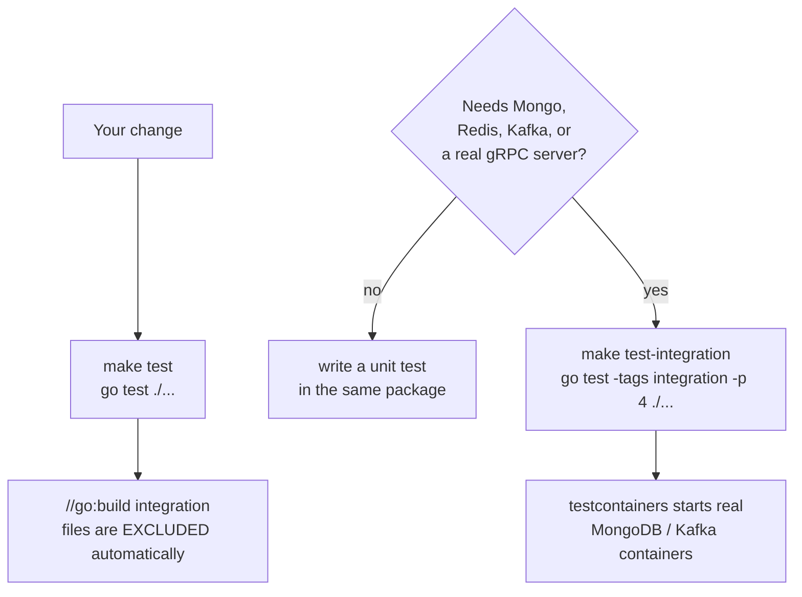

# Testing

How the Content service is tested, what runs where, and how to write a
test that fits the existing conventions.

Run everything from **`services/content/`**.

## Commands

```bash
make test               # unit tests — no Docker required
make test-integration   # integration tests — needs Docker
make vet                # go vet ./... AND go vet -tags integration ./...
make fmt                # gofmt -l .   (lists files, does not fix them)
make coverage           # unit coverage with generated code filtered out
make generate           # protoc → proto/ai/   (NOT gqlgen — see below)
```

> There is **no `make lint` target**, even though `lint` appears in
> `.PHONY`. Use `make vet` and `make fmt`.

### What CI runs

[`.github/workflows/service-content.yaml`](../../../../.github/workflows/service-content.yaml):

| Job | Command |
| --- | --- |
| `quality-assurance` | `go vet ./...` then `go test -v -cover ./...` |
| `integration` | `go test -tags integration -v ./...` |
| `build-and-push` | Docker build of the four image targets |

CI does **not** run `gofmt`, a linter, or a coverage gate. Formatting and
vetting are developer responsibilities.

## Two tiers



| | Unit | Integration |
| --- | --- | --- |
| Command | `make test` | `make test-integration` |
| Build tag | none | `//go:build integration` |
| Docker | **not required** | **required** |
| Typical runtime | milliseconds | tens of seconds |
| Parallelism | default | `-p 4` (capped — see below) |
| Files | 37 | 10 |

The exclusion is by **build tag**, not by a runtime skip. A file starting
with `//go:build integration` is not even compiled by `make test`.

### Why `-p 4`

```make
# -p 4 caps how many packages boot testcontainers at once; running every
# container-booting package in parallel starves docker and makes the
# kafka/mongo suites flaky under load.
test-integration:
	go test -tags integration -p 4 ./...
```

Do not "optimise" this by removing `-p 4`. CI omits it and is correspondingly
more prone to flakiness.

## What is where

```
graph/                          resolvers, error presenter, batching
cmd/server/                     wiring + the internal posts endpoint
internal/service/               business rules, with hand-written mocks
internal/repository/            Mongo implementations (mostly integration)
internal/cache/                 Redis + breaker (miniredis)
internal/worker/                Kafka consumer logic (fakes + integration)
internal/infrastructure/ai/     gRPC client, breakers, noop fallback
internal/middleware/            auth, metrics, recovery, request ID
internal/dlq/                   replay logic
```

### Integration-tagged files (10)

| File | Covers |
| --- | --- |
| `cmd/server/internal_posts_integration_test.go` | `GET /internal/posts/{id}` against real Mongo |
| `internal/db/mongo_test.go` | Connection, retry, lazy fallback |
| `internal/repository/mongo_repository_test.go` | Posts, tags, pagination, `FindBulk` |
| `internal/repository/mongo_chat_test.go` | Chat and message persistence |
| `internal/repository/mongo_post_draft_repository_test.go` | **`TransitionStatus` CAS semantics** |
| `internal/repository/mongo_post_interaction_test.go` | Unique-index upserts |
| `internal/service/post_draft_service_integration_test.go` | Draft lifecycle end to end |
| `internal/worker/kafka_integration_test.go` | Retry, poison → DLQ, tombstones |
| `internal/worker/personalizer_integration_test.go` | Interaction processing and DLQ |
| `internal/dlq/replay_integration_test.go` | Replay round trip |

### Notable unit tests

| File | What it pins down |
| --- | --- |
| `internal/service/post_draft_concurrency_test.go` | Two reviewers racing — only one publishes |
| `internal/service/post_service_test.go` | Validation, slugs, ownership, fallbacks (uses **miniredis**) |
| `internal/service/caching_test.go` | Cache read-through and invalidation |
| `graph/batch_test.go` | The 5 ms coalescing window and fan-out |
| `graph/errors_test.go` | Which messages reach the client |
| `internal/cache/cache_test.go` | Breaker transitions (miniredis) |
| `internal/infrastructure/ai/client_test.go` | Breaker thresholds, `degraded` vs `noFallback` |
| `internal/pagination/pagination_test.go` | Every clamping rule |
| `internal/middleware/auth_test.go` | Anonymous vs invalid vs valid tokens |

## Writing a test

### Rule 1: unit tests must not need Docker

If your test would start a container, it belongs behind the
`//go:build integration` tag.

### Rule 2: prefer fakes over mocks where the code already does

[`internal/testutil/mocks.go`](../../internal/testutil/mocks.go) provides
hand-written doubles for every domain interface:

```go
MockPostRepository     MockTagRepository        MockChatRepository
MockPostInteractionRepository                  MockPostDraftRepository
MockAIService          MockEventPublisher      MockSummaryProcessor
```

Typical service test:

```go
func TestCreatePost_RejectsOversizedTitle(t *testing.T) {
    repo := &testutil.MockPostRepository{}
    ai := &testutil.MockAIService{}
    svc := NewPostService(repo, &testutil.MockTagRepository{}, nil,
        &testutil.MockEventPublisher{}, ai)

    _, err := svc.CreatePost(ctx, strings.Repeat("x", 201), "body", "u1", nil, nil, nil, "")
    require.ErrorIs(t, err, domain.ErrValidation)
}
```

Two conventions visible there:

- **Assert with `require.ErrorIs(t, err, domain.ErrXxx)`** — never match
  on the message string.
- **Pass `nil` for a dependency the code path never reaches**, as with
  the cache. `withCache` explicitly handles a nil cache.

### Rule 3: use `miniredis`, not a real Redis

Redis behaviour is emulated in-process. Only MongoDB and Kafka need real
containers.

### Rule 4: integration tests boot containers with testcontainers

[`internal/testutil/kafka.go`](../../internal/testutil/kafka.go) wraps
the boilerplate:

```go
ctx := context.Background()
brokers := testutil.StartKafka(t, ctx)          // starts a Kafka container
testutil.EnsureTopic(t, ctx, brokers, "posts-dlq")
```

Mongo is started directly with `testcontainers.GenericContainer` in
[`internal/db/mongo_test.go`](../../internal/db/mongo_test.go) and the
repository tests, in the same style. Containers are bound to cleanup, so
they are torn down per test.

### Rule 5: keep the retry budget in tests

`baseRunner.maxRetries` and `retryBase` are struct fields precisely so
tests can shrink them:

```go
w.baseRunner.maxRetries = maxRetries
w.baseRunner.retryBase = 10 * time.Millisecond
```

The Kafka integration tests assert that a poison message reaches the DLQ
within 60 seconds and that `maxRetries` attempts actually happened.

## Coverage

```bash
make coverage
```

Runs `go test ./... -coverprofile`, then filters with `GENERATED_RE`:

```
graph/generated.go | graph/model/ | proto/ai/ | .pb.go
internal/db/ | internal/repository/ | internal/bootstrap/
internal/testutil/ | cmd/
```

The rationale is in the Makefile:

> Excluded from coverage: only generated code. Keep wiring (bootstrap/cmd)
> and data layers (db/repository) visible so coverage gaps are not hidden.

**That comment is stale**: `internal/db/`, `internal/repository/`,
`internal/bootstrap/`, `internal/testutil/`, and `cmd/` are all filtered
out, so wiring and data layers are in fact *hidden* from the number. If
you need to know how well-tested the repository layer is, look at the
integration tests directly rather than at `make coverage`.

There is no coverage threshold and CI does not enforce one.

## Codegen

| Source | Regenerate with | Output |
| --- | --- | --- |
| `proto/ai/ai_service.proto` | `make generate` | `proto/ai/*.pb.go`, `*_grpc.pb.go` |
| `graph/schema.graphqls` | `go run github.com/99designs/gqlgen` | `graph/generated.go`, `graph/federation.go`, `graph/model/models_gen.go`, resolver stubs |

> **`make generate` runs protoc only** — it does not run gqlgen. This
> differs from what `AGENTS.md` claimed; the Makefile target invokes
> `protoc` for the AI proto and nothing else.

Both outputs are **committed** (`graph/generated.go` and `graph/model/`
are tracked; `services/ai/src/generated/` is the gitignored one in this
repo). Never edit them by hand.

After changing `graph/schema.graphqls`:

```bash
cd services/content
go run github.com/99designs/gqlgen
make test
make vet
```

`tools.go` (build tag `tools`) pins the gqlgen dependency so
`go run github.com/99designs/gqlgen` resolves the same version as
`go.mod`.

`gqlgen.yml` uses `resolver: layout: follow-schema`, so new schema
fields appear as stubs at the **end** of `graph/schema.resolvers.go`.
Move them into place and fill them in — but expect gqlgen to shuffle
them back on the next run.

## Load tests

k6 scenarios plus a Go event producer, run against an isolated compose
stack (`infra/compose.load.yml`).

```bash
make load-test                      # mixed workload, defaults below
make load-test-reads
make load-test-writes
make load-test-chat
make load-test-interactions
make load-test-worker               # producers → workers, k6 scrapes metrics
```

| Variable | Default | Meaning |
| --- | --- | --- |
| `RPS` | `50` | Target requests per second |
| `VUS` | `20` | Virtual users |
| `DURATION` | `30s` | Run length |
| `SCRIPT` | `mixed` | `mixed`, `reads`, `writes`, `chat`, `interactions` |
| `WEIGHTS` | `posts:30,post:20,…` | Operation mix for `mixed` |
| `SEED_POST_COUNT` | `1000` | Posts created before the run |
| `SEED_USERS` | `20` | Distinct authenticated users |
| `PARTITIONS` | `3` | Kafka partitions |
| `LLM_MODE` | `fake` | `fake` or `real` |
| `EMBEDDING_MODE` | `fake` | `fake` or `ollama` |

The stack is torn down automatically when the run ends (including on
failure), so a crashed run does not leave containers behind.

Chat latency budgets widen with the model:

| `LLM_MODE` / `EMBEDDING_MODE` | `CHAT_P95` | `CHAT_P99` |
| --- | --- | --- |
| defaults (both `fake`) | 500 ms | 1500 ms |
| `EMBEDDING_MODE=ollama` | 2000 ms | 4000 ms |
| `LLM_MODE=real` | 15 s | 30 s |

`LLM_MODE=real` takes precedence over the embedding setting. Only the
default row is free: `EMBEDDING_MODE=ollama` pulls a model and starts an
`ollama` container under a compose profile, so **fake runs never
download a model**.

Scripts live in [`load-tests/k6/`](../../load-tests/k6);
the Go producer in [`load-tests/producer/`](../../load-tests/producer).

## Common mistakes

| Mistake | Why it bites |
| --- | --- |
| Writing a container test without `//go:build integration` | `make test` now needs Docker and CI's first job gets slow/flaky |
| Removing `-p 4` from `make test-integration` | Docker starvation → flaky Kafka/Mongo suites |
| Asserting on an error message string | Messages are client-facing and change; use `ErrorIs` |
| Asserting `kind == "validation"` from a response | `kind` never reaches the client — see [Error handling](../components/error-handling.md) |
| Running `gofmt -w .` blindly | `make fmt` only *lists*; fix the files it names |
| Expecting `make generate` to run gqlgen | It runs protoc only |
| Running two `make load-test` at once | Port and container-name collisions |

## Related

- [Quick start](../getting-started/quickstart.md) — running the stack under test
- [Architecture](../concepts/architecture.md) — the layers these tests target
- [Draft lifecycle](../concepts/draft-lifecycle.md) — the concurrency test explained
- [Reliability](../operations/reliability.md) — what the Kafka integration tests assert
