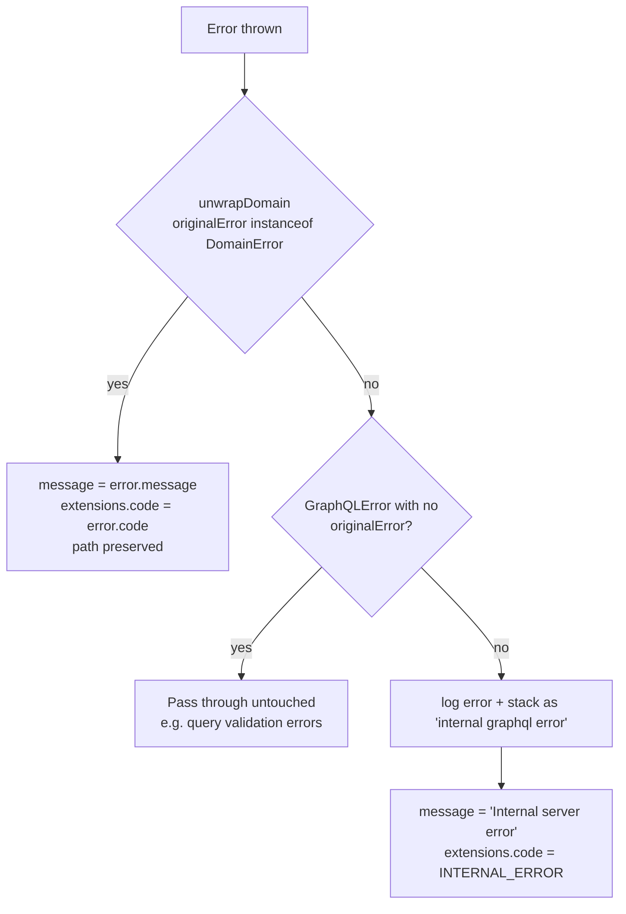

# Error handling

How failures are represented, where they surface, and what a client should do
about them.

The service has one rule that keeps this simple: **every expected failure is a
`DomainError` subclass with a stable string `code`**, and the code — not the
message — is the contract.

## The error catalog

Defined in [`src/errors.ts`](../../src/errors.ts):

| Class | `code` | HTTP | Raised when |
| --- | --- | --- | --- |
| `ValidationError` | `VALIDATION_ERROR` | 400 | Zod rejected an input, the `cursor` is not a UUID, or the body is not valid JSON |
| `UnauthorizedError` | `UNAUTHORIZED` | 401 | A protected operation (`updateProfile`) ran without a valid token |
| `InvalidCredentialsError` | `INVALID_CREDENTIALS` | 401 | Signin email unknown or password wrong (identical for both) |
| `UserNotFoundError` | `USER_NOT_FOUND` | 404 | `user(id)` for an unknown or soft-deleted account |
| `UserAlreadyExistsError` | `USER_ALREADY_EXISTS` | 409 | Duplicate email/username at signup, or a username taken on update |
| `PayloadTooLargeError` | `PAYLOAD_TOO_LARGE` | 413 | Request body exceeds 256 KB |
| `ServiceUnavailableError` | `SERVICE_UNAVAILABLE` | 503 | Postgres unreachable, pool timeout, or a query exceeded 7 s |
| `GraphqlTimeoutError` | `GRAPHQL_TIMEOUT` | 504 | The whole operation exceeded 10 s |
| `RateLimitedError` | `RATE_LIMITED` | 429 | Quota exhausted; `extensions` also carries `retryAfterMs` and `policy`, and the response sets `Retry-After` |
| `DomainError` (base) | — | — | Abstract; never instantiated directly |

Anything else becomes `INTERNAL_ERROR`. The message for those is always the
generic *"Internal server error"* — stack traces and driver messages are logged
but never sent to the client.

> The HTTP column is the status the *equivalent* HTTP error would carry. Over
> GraphQL, the response body is still `200` with an `errors[]` array; the code
> travels in `errors[].extensions.code`. Non-GraphQL routes return real status
> codes (see [HTTP errors](#http-errors-outside-graphql)).
>
> The one exception is quota rejection: when every error in the response is
> `RATE_LIMITED`, the handler rewrites the response to a real HTTP `429` with
> a `Retry-After` header (seconds, from the longest `retryAfterMs`), so
> clients can back off without parsing the body.

## Where an error surfaces

| Raised in | Surface | Shape |
| --- | --- | --- |
| A resolver, service, or repository during an operation | GraphQL response | `{ "errors": [{ "message", "extensions": { "code" }, "path" }] }` |
| Reading the request body (size/JSON) | Plain HTTP, before Apollo runs | `{ "error": { "code", "message" } }` + status |
| The operation timeout | Plain HTTP, caught in the handler | `{ "error": { "code": "GRAPHQL_TIMEOUT", ... } }` + `504` |
| Any unhandled throw on a non-GraphQL route | Hono `onError` | `{ "error": { "code": "INTERNAL_ERROR", ... } }` + `500` |

## Prisma and driver error mapping

[`toDomainError()`](../../src/errors.ts) translates driver-level failures so
callers never see a raw Prisma error:

| Source | Condition | Becomes |
| --- | --- | --- |
| `PrismaClientKnownRequestError` | `P2002` — unique constraint violated | `USER_ALREADY_EXISTS` (409) |
| `PrismaClientKnownRequestError` | `P2023` — malformed cursor | `VALIDATION_ERROR` (400) |
| `PrismaClientKnownRequestError` | `P2025` — record not found (e.g. update target missing) | `USER_NOT_FOUND` (404) |
| `PrismaClientKnownRequestError` | `P1001` / `P1002` / `P1017` — can't connect, interrupted, pool timeout | `SERVICE_UNAVAILABLE` (503) |
| `PrismaClientInitializationError` | Client failed to start | `SERVICE_UNAVAILABLE` (503) |
| Message matches `ECONNREFUSED`, `ETIMEDOUT`, pool timeout, `ECONNRESET`, "Connection terminated" | Transport-level failure | `SERVICE_UNAVAILABLE` (503) |
| The repository's 7 s timer | Query too slow | `SERVICE_UNAVAILABLE` (503) |
| Anything unrecognised | — | **re-thrown unchanged** (becomes `INTERNAL_ERROR` at the edge) |

### The three classifiers

Two classification helpers drive both error mapping and retry policy:

| Helper | Matches | Used for |
| --- | --- | --- |
| `isConnectionEstablishmentError` | `P1001`, init errors, `ECONNREFUSED`, `ETIMEDOUT`, pool timeout | Deciding that a **write** may be safely retried |
| `isTransientDbError` | Everything above **plus** `P1002`, `P1017`, `ECONNRESET`, "Connection terminated" | Deciding that a **read** may be retried |
| `isDbUnavailableError` | Connection + transient patterns, plus a 503 message | Mapping to `SERVICE_UNAVAILABLE` |

The difference between the first two is a safety property, not a nuance: if the
connection was never established the query never reached the server, so
retrying cannot double-insert. See
[Caching and resilience](../concepts/caching-and-resilience.md#what-gets-retried-and-why).

## GraphQL error shaping

[`formatError()`](../../src/graphql/formatError.ts) runs on every GraphQL error:

Consequences worth knowing:

- **Client-facing messages are controlled.** A domain error returns its authored
  message; an unexpected one returns a fixed string.
- **GraphQL's own errors pass through.** A typo in the query document or a
  request for an unknown field produces the standard GraphQL validation message
  with its real path — those are useful, not leaks.
- **Every unexpected error is logged** with its stack while the client sees
  `INTERNAL_ERROR`. Correlate using the `requestId` field logged by the HTTP
  middleware.

## HTTP errors outside GraphQL

Non-`/graphql` routes go through Hono's `app.onError` in
[`src/app.ts`](../../src/app.ts):

| Error | Response |
| --- | --- |
| `DomainError` | `{ "error": { "code", "message" } }` with the class's `httpStatus`; logged at `info` |
| Anything else | `{ "error": { "code": "INTERNAL_ERROR", "message": "Internal server error" } }` with `500`; logged at `error` |

## Request-level guards

Checked in [`src/http/handlers.ts`](../../src/http/handlers.ts) *before* Apollo
runs:

| Guard | Limit | Error |
| --- | --- | --- |
| Declared `Content-Length` | 256 KB | `PAYLOAD_TOO_LARGE` |
| Streaming body actually read | 256 KB (a lying header can't bypass it) | `PAYLOAD_TOO_LARGE` |
| Body parses as JSON | — | `VALIDATION_ERROR` ("Request body must be valid JSON") |
| Operation duration | 10 s | `GRAPHQL_TIMEOUT` |

### Operation-name sanitisation

Metrics and logs record the GraphQL operation name, but only a known allowlist
(`me`, `user`, `users`, `signup`, `signin`, `updateProfile`) is kept verbatim.
Anything else is recorded as `anonymous` or `unknown`, so a caller cannot
flood the `graphql_operations_total` label cardinality by sending arbitrary
names ([`sanitizeOperationName`](../../src/graphql/formatError.ts)).

## Client guidance

| Code | What the client should do |
| --- | --- |
| `VALIDATION_ERROR` | Fix the input; the message states the failing rule. Do not retry unchanged. |
| `UNAUTHORIZED` | Prompt for signin / refresh the token. |
| `INVALID_CREDENTIALS` | Show "invalid email or password" — do not distinguish the two halves. |
| `USER_NOT_FOUND` | Treat as "no such user" (deleted or never existed). |
| `USER_ALREADY_EXISTS` | Show "email or username taken". Do not retry. |
| `PAYLOAD_TOO_LARGE` | Shrink the request; do not retry. |
| `SERVICE_UNAVAILABLE` | Retry with backoff — this is transient by construction. |
| `GRAPHQL_TIMEOUT` | Retry once if idempotent (a read); **do not** blindly retry a mutation. |
| `INTERNAL_ERROR` | Retry with backoff, then surface a generic failure. |

Retries for `5xx` should be capped and jittered; the service itself uses 2
attempts with exponential backoff for its own database calls, which is a
reasonable default for clients too.

## Next steps

- [Request flows](../concepts/request-flows.md) — where each error is thrown
- [GraphQL API](graphql-api.md) — the operations these errors come from
- [Health and observability](../operations/health-and-observability.md) —
  alerting on error rates
