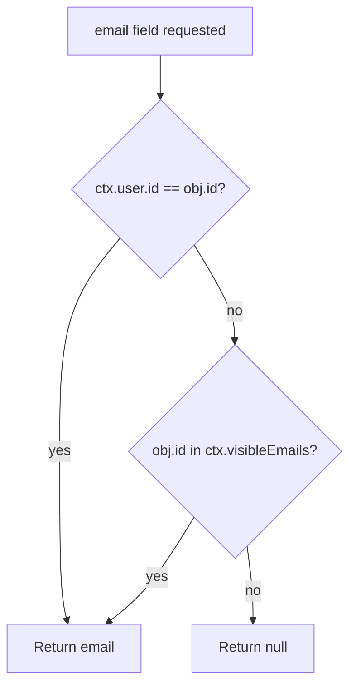

# User GraphQL API

The contract for everything the User service exposes. The authoritative schema
is [`schema.graphql`](../../schema.graphql); this page explains it and shows
working examples.

Endpoint: `POST http://localhost:4001/graphql` (behind the gateway, `POST
http://localhost:4000/graphql`).

## Contents

- [Query](#query) · [Mutation](#mutation) · [Types](#types)
- [Input rules](#input-rules) · [Pagination](#pagination)
- [Authentication](#authentication-requirements) · [Email visibility](#email-visibility)
- [Federation](#federation) · [Examples](#examples) · [Error codes](#error-codes)

## Query

| Operation | Arguments | Returns | Auth | Description |
| --- | --- | --- | --- | --- |
| `me` | — | `User` (nullable) | Optional | The authenticated user, or `null` if no valid token was sent |
| `user(id: ID!)` | `id` — a user UUID | `User` (nullable) | Optional | One user by ID; throws `USER_NOT_FOUND` if unknown or deleted |
| `users(limit: Int = 20, cursor: ID)` | `limit` clamped to 1–50; `cursor` must be a UUID | `[User!]!` | Optional | A page of active users, newest first |

```graphql
type Query {
  me: User
  user(id: ID!): User
  users(limit: Int = 20, cursor: ID): [User!]!
}
```

No query requires authentication, but `me` only returns data when a token is
present.

## Mutation

| Operation | Arguments | Returns | Auth | Description |
| --- | --- | --- | --- | --- |
| `signup(email, username, password)` | All `String!` | `AuthPayload!` | No | Creates an account; fails with `USER_ALREADY_EXISTS` if taken |
| `signin(email, password)` | Both `String!` | `AuthPayload!` | No | Verifies credentials; fails with `INVALID_CREDENTIALS` |
| `updateProfile(username, name, bio, avatarUrl, bannerUrl)` | All optional | `User!` | **Required** | Updates the caller's own profile |

```graphql
type Mutation {
  signup(email: String!, username: String!, password: String!): AuthPayload!
  signin(email: String!, password: String!): AuthPayload!
  updateProfile(
    username: String
    name: String
    bio: String
    avatarUrl: String
    bannerUrl: String
  ): User!
}
```

Things this API deliberately does **not** expose:

| Not available | Notes |
| --- | --- |
| Change email | No mutation accepts `email` on an existing account |
| Change password | No mutation exists yet |
| Delete account | No mutation exists; `deletedAt` is set out of band |
| Refresh token | Tokens are valid for `JWT_EXPIRES_IN` (7 d) and must be re-obtained via `signin` |
| Pagination `offset` | Cursor-based only |

## Types

### `User`

| Field | Type | Visible to | Notes |
| --- | --- | --- | --- |
| `id` | `ID!` | Everyone | Federation key |
| `username` | `String!` | Everyone | Lowercase, `a-z0-9_` |
| `email` | `String` | **Owner only** | `null` for everyone else — see [Email visibility](#email-visibility) |
| `name` | `String` | Everyone | Defaults to the username at signup |
| `bio` | `String` | Everyone | ≤ 280 chars |
| `avatarUrl` | `String` | Everyone | `http(s)` URL |
| `bannerUrl` | `String` | Everyone | `http(s)` URL |
| `createdAt` | `String!` | Everyone | ISO-8601 timestamp |

`password`, `updatedAt`, and `deletedAt` exist in the database but are **not**
in the GraphQL schema — they cannot be queried.

### `AuthPayload`

| Field | Type | Notes |
| --- | --- | --- |
| `token` | `String!` | `Bearer` token to send in `Authorization` on later requests |
| `user` | `User!` | The account just created or authenticated |

## Input rules

Enforced by Zod in [`src/schemas.ts`](../../src/schemas.ts) *before* any
database work. A violation raises `VALIDATION_ERROR` (`400`) with the first
issue's message.

| Field | Rules | Used by |
| --- | --- | --- |
| `email` | Trimmed, lowercased, valid email format | `signup`, `signin` |
| `username` | Trimmed, lowercased, **3–30** chars, only `a-z`, `0-9`, `_` | `signup`, `updateProfile` |
| `password` | **12–128** chars, must contain at least one letter **and** one digit | `signup` |
| `password` (signin) | 1–128 chars (existing hashes verify on their own) | `signin` |
| `name` | 1–50 chars, or `null` to clear | `updateProfile` |
| `bio` | ≤ 280 chars, or `null` to clear | `updateProfile` |
| `avatarUrl`, `bannerUrl` | Valid URL, ≤ 2048 chars, must start `http://` or `https://`, or `null` to clear | `updateProfile` |
| `cursor` | Must be a UUID, otherwise `400` | `users` |
| `limit` | Not rejected — clamped into `1..50` | `users` |

Note the asymmetry: `limit` is *clamped*, everything else *fails*. `limit` is a
performance hint from the caller, so an out-of-range value is corrected rather
than punished; a malformed `cursor`, by contrast, indicates a client bug worth
reporting.

## Pagination

`users` uses **keyset (cursor) pagination**. The cursor is the `id` of the last
row from the previous page, and rows are ordered by `createdAt DESC, id DESC` so
the boundary is stable even while users sign up.

```graphql
# page 1
query FirstPage {
  users(limit: 20) {
    id
    username
    createdAt
  }
}

# page 2 — pass the id of the last user from page 1
query SecondPage {
  users(limit: 20, cursor: "0b8f0a6e-6f5a-4a1c-9a1e-2c9e3f7d1b44") {
    id
    username
    createdAt
  }
}
```

There is no `pageInfo` object: an empty array means you have reached the end.

## Authentication requirements

Send the token as a standard bearer header:

```http
Authorization: Bearer <token from signup or signin>
```

The pattern is parsed in [`createContext()`](../../src/context.ts) as
`/^Bearer\s+(\S+)$/i`. A missing, malformed, expired, or wrong-secret token
means **unauthenticated**, not an error: `me` returns `null`, and only
`updateProfile` then fails (with `UNAUTHORIZED`).

## Email visibility

`User.email` is resolved per field, not per query:



- `ctx.user` is set by a valid token — so you can always read **your own** email.
- `ctx.visibleEmails` is populated only by `signup` and `signin` in the *same
  request*, because that caller just proved ownership with the password. It is
  created fresh per request and never persists.

So `users { email }` returns `null` for every row, and querying another user's
profile never exposes their email.

## Federation

The schema is an Apollo Federation v2 subgraph:

```graphql
extend schema @link(url: "https://specs.apollo.dev/federation/v2.0", import: ["@key"])

type User @key(fields: "id") {
  id: ID!
  # ...
}
```

- `@key(fields: "id")` marks `id` as the entity key: any other subgraph can
  write `User(id: "...")` and the gateway will ask *this* service to resolve it.
- Resolution goes through `User.__resolveReference`, which returns a placeholder
  for deleted accounts and `null` for unknown IDs — details in
  [Request flows](../concepts/request-flows.md#federation-reference-lookup).
- Other subgraphs may add fields to `User`; this service owns the identity
  fields listed above.

Because the gateway composes subgraphs, always query through
`http://localhost:4000/graphql`. Querying `:4001` directly works for these
operations but bypasses composition, CORS, and header propagation rules.

## Examples

### Signup

```bash
curl -s http://localhost:4001/graphql \
  -H 'Content-Type: application/json' \
  -d '{"query":"mutation { signup(email: \"alice@example.com\", username: \"alice\", password: \"correct-horse-123\") { token user { id username email createdAt } } }"}'
```

```json
{
  "data": {
    "signup": {
      "token": "eyJhbGciOiJIUzI1NiIsInR5cCI6IkpXVCJ9...",
      "user": {
        "id": "0b8f0a6e-6f5a-4a1c-9a1e-2c9e3f7d1b44",
        "username": "alice",
        "email": "alice@example.com",
        "createdAt": "2026-09-29T10:15:00.000Z"
      }
    }
  }
}
```

### Signin and reuse the token

```bash
TOKEN=$(curl -s http://localhost:4001/graphql \
  -H 'Content-Type: application/json' \
  -d '{"query":"mutation { signin(email: \"alice@example.com\", password: \"correct-horse-123\") { token } }"}' \
  | jq -r '.data.signin.token')

curl -s http://localhost:4001/graphql \
  -H "Authorization: Bearer $TOKEN" \
  -H 'Content-Type: application/json' \
  -d '{"query":"{ me { id username email name } }"}'
```

### Update a profile

```bash
curl -s http://localhost:4001/graphql \
  -H "Authorization: Bearer $TOKEN" \
  -H 'Content-Type: application/json' \
  -d '{"query":"mutation { updateProfile(name: \"Alice\", bio: \"Writes things\", avatarUrl: \"https://example.com/a.png\") { id name bio avatarUrl } }"}'
```

Passing `bio: null` clears it; omitting `bio` leaves it unchanged.

### List users

```bash
curl -s http://localhost:4001/graphql \
  -H 'Content-Type: application/json' \
  -d '{"query":"{ users(limit: 5) { id username name createdAt } }"}'
```

## Error codes

Every error carries a stable `extensions.code`:

| Code | HTTP | Meaning |
| --- | --- | --- |
| `VALIDATION_ERROR` | 400 | Input failed a Zod rule (or a malformed cursor/body) |
| `UNAUTHORIZED` | 401 | `updateProfile` without a valid token |
| `INVALID_CREDENTIALS` | 401 | Unknown email or wrong password |
| `USER_NOT_FOUND` | 404 | `user(id)` for an unknown or deleted account |
| `USER_ALREADY_EXISTS` | 409 | Duplicate email/username, or a taken username |
| `PAYLOAD_TOO_LARGE` | 413 | Request body over 256 KB |
| `SERVICE_UNAVAILABLE` | 503 | Postgres unreachable, pool timeout, or query over 7 s |
| `GRAPHQL_TIMEOUT` | 504 | Operation exceeded 10 s |
| `RATE_LIMITED` | 429 | Quota exhausted — wait `extensions.retryAfterMs` (or `Retry-After`), then retry |
| `INTERNAL_ERROR` | 500 | Unexpected failure — details are logged, never returned |

Full mapping and what the client should do:
[Error handling](../components/error-handling.md).

## Next steps

- [Authentication flow](../concepts/authentication-flow.md) — what the token
  contains and how it is verified
- [Request flows](../concepts/request-flows.md) — step-by-step per operation
- [Error handling](../components/error-handling.md) — handling failures
- [Data model](../concepts/data-model.md) — where these fields are stored
