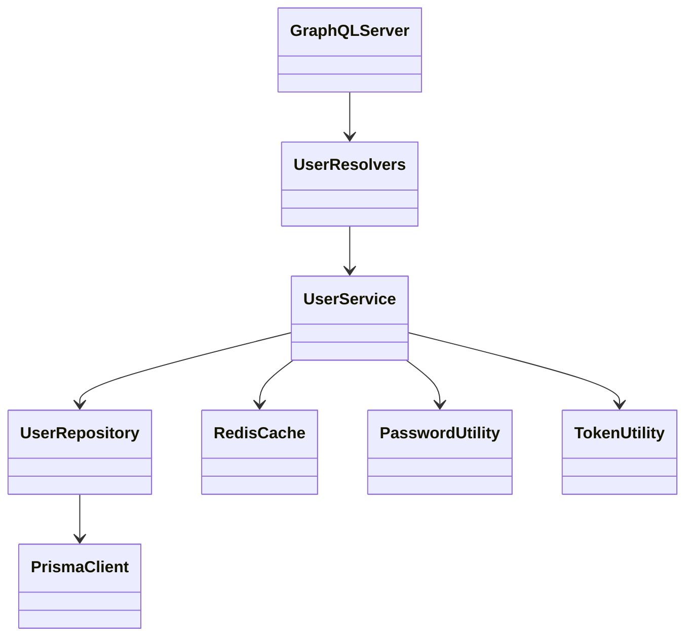

# User service architecture

Resolvers adapt the federated GraphQL schema to account operations. The service
layer applies account rules; the repository uses Prisma for PostgreSQL. Redis is
a cache, not the account source of truth. Password and JWT helpers are isolated
under `src/utils/`.
