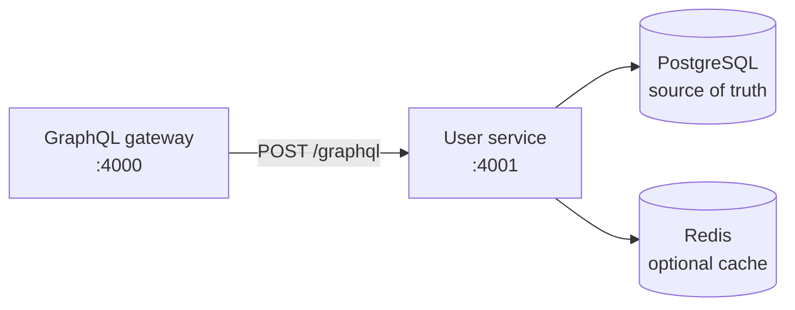
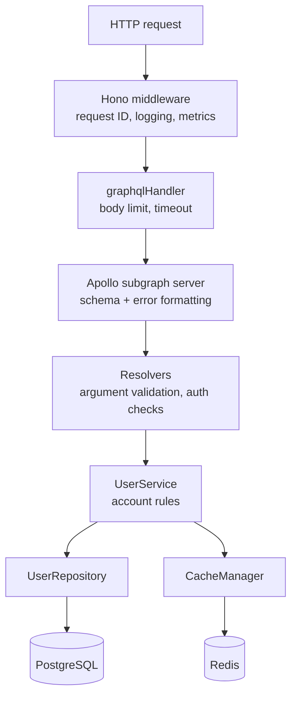
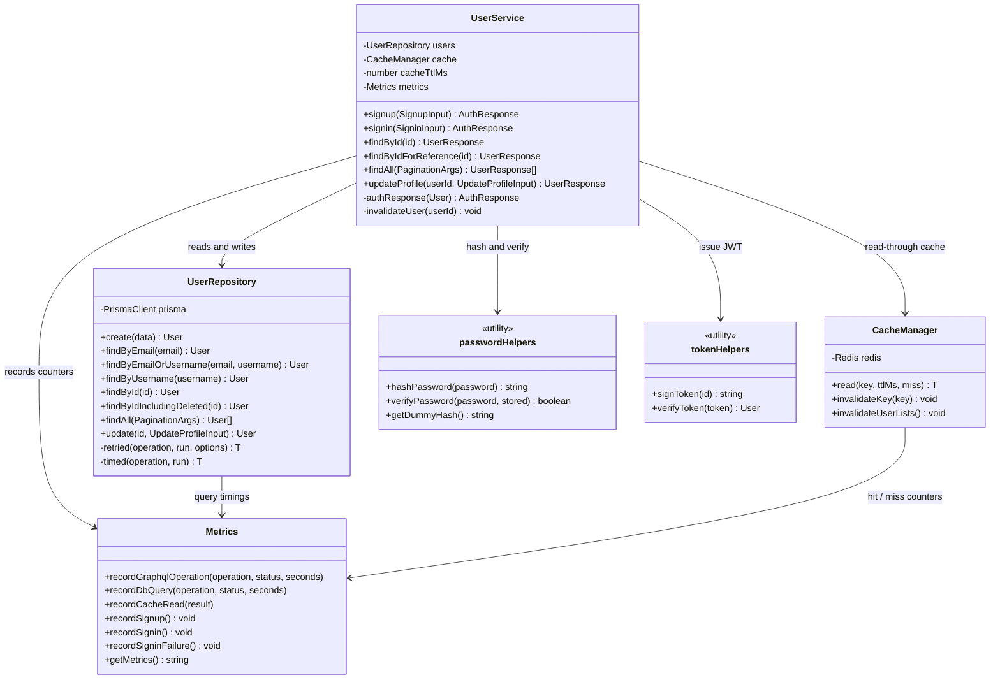
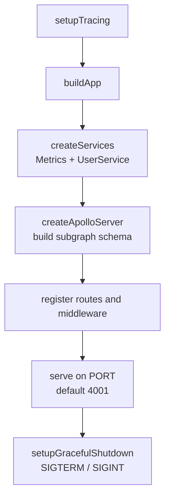
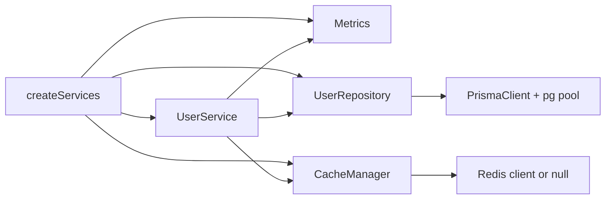

# User service architecture

This document explains how the User service is structured: what runs when a
request arrives, which class owns which responsibility, and why the code is
laid out this way.

If you are completely new to the service, read the [overview](#overview) and
[code layout](#how-the-code-is-organized) first, then use the rest as a
reference.

## Overview

The User service is a single Node process that exposes one HTTP server on port
`4001`. That server hosts two things:

1. **A GraphQL subgraph** at `POST /graphql` — where all account operations
   happen.
2. **Operational endpoints** — `/health`, `/ready`, `/metrics`, and `/`.

It talks to exactly two datastores: PostgreSQL, which is the source of truth for
accounts, and Redis, which is an optional read cache.



**Why is Redis optional?** Accounts must always be readable and writable, so
Postgres is required. The cache only makes repeated reads faster — if Redis is
down the service falls straight through to Postgres. See
[Caching and resilience](caching-and-resilience.md).

**Why is this a "subgraph"?** Topos splits its GraphQL API across several
services and merges them behind one gateway. Each backend service is a
*subgraph*; the gateway composes them into a single schema for the browser. The
User service owns the `User` type, so nothing else has to store account data.

## How a request travels

Every GraphQL request passes through the same five stops:



| Stop | Source file | Responsibility |
| --- | --- | --- |
| Middleware | [`src/app.ts`](../../src/app.ts), [`src/observability/middleware.ts`](../../src/observability/middleware.ts) | Assigns a request ID, logs each request, records HTTP metrics |
| HTTP handler | [`src/http/handlers.ts`](../../src/http/handlers.ts) | Enforces the 256 KB body limit and 10 s operation timeout, builds per-request context |
| Apollo server | [`src/graphql/server.ts`](../../src/graphql/server.ts) | Holds the federated schema and formats errors |
| Resolvers | [`src/graphql/resolvers.ts`](../../src/graphql/resolvers.ts) | Validates arguments, checks authentication, applies field-level rules |
| Service | [`src/user.service.ts`](../../src/user.service.ts) | Business rules: uniqueness, credential checks, cache invalidation |
| Repository | [`src/repositories/user.repository.ts`](../../src/repositories/user.repository.ts) | All SQL, plus retries, timeouts, and error translation |

The resolvers never touch Prisma and the service never builds GraphQL responses.
That split is what makes the rules testable without a database — see
[`src/__tests__/user.service.spec.ts`](../../src/__tests__/user.service.spec.ts).

## How the code is organized

### Class diagram

The names below are the real classes and functions in the repository, with the
file that defines each one.



| Class or helper | File | What it owns |
| --- | --- | --- |
| `UserService` | [`src/user.service.ts`](../../src/user.service.ts) | Account rules: duplicate detection, credential verification, token issuance, cache invalidation |
| `UserRepository` | [`src/repositories/user.repository.ts`](../../src/repositories/user.repository.ts) | Every database query, with retry, timeout, and error-translation wrappers |
| `CacheManager` | [`src/lib/cache.ts`](../../src/lib/cache.ts) | Read-through caching and cache invalidation |
| `Metrics` | [`src/observability/metrics.ts`](../../src/observability/metrics.ts) | Prometheus counters, histograms, and gauges |
| password helpers | [`src/utils/password.ts`](../../src/utils/password.ts) | scrypt hashing and constant-time verification |
| token helpers | [`src/utils/token.ts`](../../src/utils/token.ts) | JWT signing and verification |

Two more types are not classes but appear throughout the code:

- **`DomainError`** ([`src/errors.ts`](../../src/errors.ts)) — the base class for
  every expected failure. Each subclass carries a stable `code` and an HTTP
  status. See [Error handling](../components/error-handling.md).
- **`GraphQLContext`** ([`src/context.ts`](../../src/context.ts)) — the per-request
  object handed to every resolver: the authenticated user, the `UserService`,
  and the set of user IDs whose email is visible in this request.

### Project structure

```
services/user/
├── schema.graphql            # Federated GraphQL schema (the API contract)
├── prisma/
│   ├── schema.prisma         # Database schema
│   └── migrations/           # Ordered SQL migrations
├── src/
│   ├── index.ts              # Entry point: tracing, server, shutdown
│   ├── app.ts                # Builds the Hono app and wires routes
│   ├── container.ts          # Constructs services (manual DI)
│   ├── context.ts            # Per-request GraphQL context
│   ├── schemas.ts            # Zod validation for every input
│   ├── errors.ts             # Domain errors and error translation
│   ├── domain/user.ts        # Response shapes and Prisma → API mapping
│   ├── graphql/
│   │   ├── server.ts         # Apollo subgraph server
│   │   ├── typeDefs.ts       # Schema as a string (mirrors schema.graphql)
│   │   ├── resolvers.ts      # Query / Mutation / User field resolvers
│   │   └── formatError.ts    # Error shaping for GraphQL responses
│   ├── repositories/
│   │   └── user.repository.ts
│   ├── user.service.ts       # Business rules
│   ├── http/handlers.ts      # /graphql, health, readiness, metrics handlers
│   ├── lib/                  # Prisma, Redis, cache, retry, shutdown
│   ├── observability/        # Logger, metrics, tracing, HTTP middleware
│   ├── utils/                # Password and token helpers
│   └── integration/          # Testcontainers-based integration tests
├── infra/                    # Compose stacks (dev, prod, load test)
├── load-tests/k6/            # k6 scenarios
├── scripts/                  # Migrator and AI database bootstrap
└── docs/                     # This documentation
```

`src/generated/` holds the Prisma client. It is gitignored and regenerated with
`make db-generate`; never edit it by hand.

## Startup sequence

[`src/index.ts`](../../src/index.ts) is deliberately short. In order, it:



1. **`setupTracing()`** starts OpenTelemetry if
   `OTEL_EXPORTER_OTLP_ENDPOINT` is set; otherwise it logs that tracing is off
   and continues ([`src/observability/tracing.ts`](../../src/observability/tracing.ts)).
2. **`buildApp()`** creates the `Metrics` and `UserService` objects, starts
   Apollo, and registers middleware and routes
   ([`src/app.ts`](../../src/app.ts)).
3. **`serve()`** starts the Node HTTP server on `env.PORT` (default `4001`).
4. **`setupGracefulShutdown()`** installs `SIGTERM`/`SIGINT` handlers: probes
   immediately start reporting `shutting_down`, in-flight requests are allowed
   to finish, Redis and Postgres are closed, and the process exits — with a 10 s
   hard deadline
   ([`src/lib/shutdown.ts`](../../src/lib/shutdown.ts)).

**Configuration loads before any of this.** Importing
[`src/config/env.ts`](../../src/config/env.ts) parses and validates all
environment variables with Zod. If a required value is missing or malformed, the
process exits at import time with a validation error rather than failing later
on the first request. In `ENV_TYPE=prod` the same module first hydrates missing
values from AWS Secrets Manager and SSM. See
[Configuration](../getting-started/configuration.md).

### Dependency construction

There is no dependency-injection framework. [`src/container.ts`](../../src/container.ts)
is a single `createServices()` function that news up the objects in
dependency order and hands them to the app:



This keeps construction in one readable place while remaining plain TypeScript —
tests build `UserService` directly with fakes instead of loading the container.

## Why this design

| Decision | Benefit |
| --- | --- |
| **Resolvers → service → repository** | Business rules are testable without GraphQL or a database |
| **Validation at the resolver edge** | Bad input never reaches the service layer, and errors carry GraphQL paths |
| **Cache in the service, not the repository** | Cache policy stays with the rules that own invalidation; the repository stays a pure data access layer |
| **Fail-open Redis** | A cache outage can never take down signup or signin |
| **Zod config at import time** | Misconfiguration fails at startup, not on the first request |
| **Errors as a class hierarchy** | One `formatError` maps every expected failure to a stable code and status |
| **Manual construction in `container.ts`** | Zero framework magic; tests can build any slice of the graph |

## Next steps

- [Data model](data-model.md) — what is stored in Postgres
- [Request flows](request-flows.md) — a step-by-step walkthrough of an operation
- [Caching and resilience](caching-and-resilience.md) — how failures are absorbed
- [GraphQL API](../components/graphql-api.md) — the API contract
