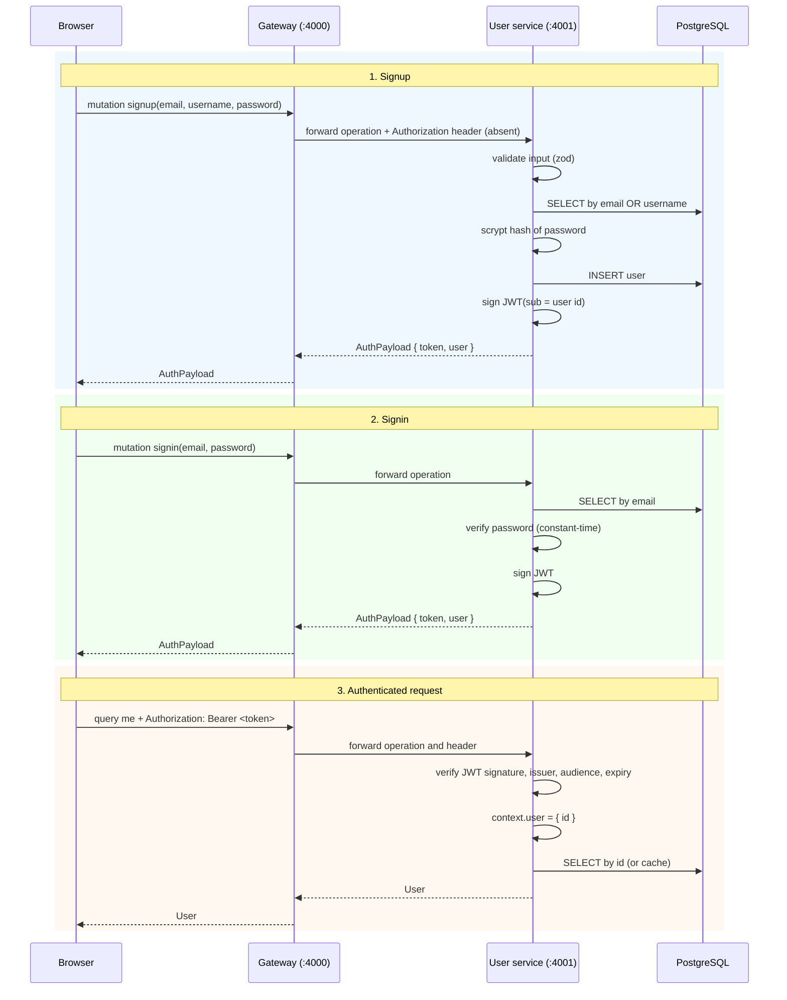
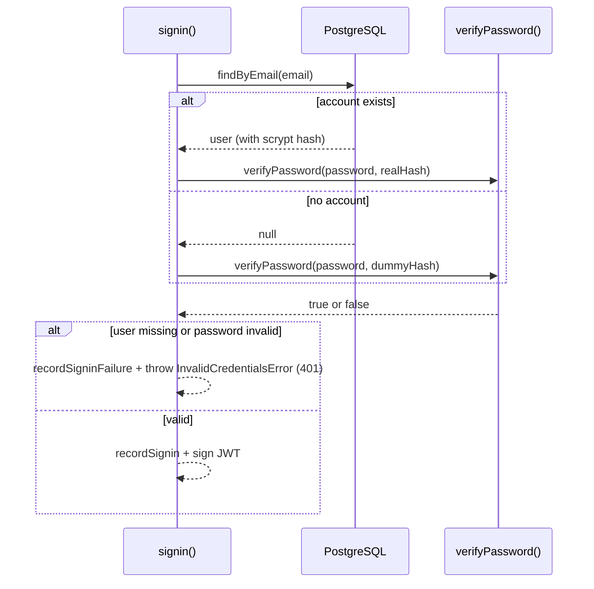
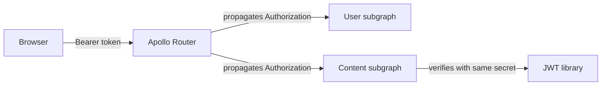

# Authentication flow

This document explains how a browser becomes authenticated in Topos: how
passwords are stored, how a JWT is issued, how later requests prove identity,
and what can go wrong.

Two properties shape everything below:

- **Stateless.** There are no server-side sessions and no refresh tokens. The
  JWT *is* the session, and it is valid for 7 days by default.
- **Shared.** The same token is understood by the content service, so one
  signin covers the whole platform.

## The three moments of auth



The gateway forwards the `Authorization` header to the subgraph. The User
service reads it in [`createContext()`](../../src/context.ts) — the same
function runs for every operation, whether or not the caller sent a token.

## Step 1: signup

Inside [`UserService.signup()`](../../src/user.service.ts):

1. **Uniqueness check** — `findByEmailOrUsername` looks for an active account
   with either value. If one exists, `UserAlreadyExistsError` (`409`) is thrown
   *before* any write.
2. **Hash the password** — scrypt with a fresh random salt (see
   [Password storage](#password-storage)).
3. **Insert** — the row is created with `name` defaulted to the username.
4. **Invalidate the user lists** — any cached `users(...)` page is now stale.
5. **Record the metric** — `user_signups_total` increments.
6. **Sign a token** — `signToken(user.id)` returns the JWT, returned alongside
   the new `User` in an `AuthPayload`.

The resolver then adds the new user's ID to `ctx.visibleEmails`, which is what
lets the response include the email even though the request is unauthenticated —
the caller just proved they own it by supplying the credentials.

### Validation applied before any of this

Defined in [`src/schemas.ts`](../../src/schemas.ts):

| Input | Rule |
| --- | --- |
| `email` | Trimmed, lowercased, must be a valid email, ≤ 254 chars |
| `username` | Trimmed, lowercased, 3–30 chars, `a-z`, `0-9`, `_` only |
| `password` | 12–128 chars, must contain **both** letters and digits |

Failures throw `ValidationError` (`400`) with the first Zod issue's message.

## Step 2: signin

Signin looks nearly identical, with one security detail worth understanding:



**Why hash against a dummy when the email is unknown?** If the service returned
immediately for unknown emails and took ~100 ms for known ones, an attacker
could enumerate registered accounts purely by timing. `getDummyHash()`
([`src/utils/password.ts`](../../src/utils/password.ts)) computes a real scrypt
hash once (lazily, then cached) and runs the same expensive verification, so
both paths cost the same.

The response to the caller is identical either way: `InvalidCredentialsError`
with the message *"Invalid email or password"*. It never says which half was
wrong.

> Both failures increment `user_signin_failures_total`. A sudden spike is a
> useful alert — see [Health and observability](../operations/health-and-observability.md).

## Password storage

Passwords use **scrypt** from Node's built-in `node:crypto` — no native
dependency, memory-hard, and configurable cost.

| Parameter | Value | Why |
| --- | --- | --- |
| `N` (cost) | `131072` (2^17) | OWASP recommended minimum |
| `r` (block size) | `8` | Standard pairing with N |
| `p` (parallelism) | `1` | Fine for a web service |
| Salt | 16 random bytes per password | Unique per account, defeats rainbow tables |
| Key length | 64 bytes | Output width |
| Comparison | `timingSafeEqual` | Constant time; no leak from early exit |

The stored string embeds the parameters:

```
scrypt:131072:8:1:<salt hex>:<key hex>
```

Because the cost parameters travel with the hash, you can raise `N` for new
passwords later without invalidating existing ones — old hashes keep verifying
with their embedded values.

**Never logged:** the pino logger
([`src/observability/logger.ts`](../../src/observability/logger.ts)) redacts
`password` and `token` fields at every depth.

## Step 3: the JWT

Issued by [`signToken()`](../../src/utils/token.ts) with the `jose` library:

| Claim | Value | Source |
| --- | --- | --- |
| `id` | The user's UUID | Function argument (the only payload field) |
| `alg` | `HS256` | Hard-coded |
| `iss` | `user-service` | `JWT_ISSUER` |
| `aud` | `topos` | `JWT_AUDIENCE` |
| `iat` | Now | Set automatically |
| `exp` | Now + `JWT_EXPIRES_IN` (default `7d`) | `JWT_EXPIRES_IN` |

`JWT_SECRET` must be **at least 32 characters** — Zod rejects shorter secrets at
startup.

### Verification

`verifyToken()` refuses a token unless **all** of these hold:

1. The HS256 signature matches the shared secret.
2. `iss` equals `JWT_ISSUER`.
3. `aud` equals `JWT_AUDIENCE`.
4. `alg` is `HS256` (an `alg: none` token is rejected outright).
5. `exp` is in the future.
6. The payload contains an `id` string.

Any failure — including a malformed token — returns `null`, never an exception.
The request then proceeds as **unauthenticated**: `me` resolves to `null`, and
protected mutations throw `UnauthorizedError`. There is no error thrown merely
for sending a bad token.

## How the token reaches other services



The router forwards `Authorization` to whichever subgraph handles the operation.
The content service verifies the token itself, which is why **`JWT_SECRET`,
`JWT_ISSUER`, and `JWT_AUDIENCE` must be identical across the user and content
services** — if they drift, requests authenticated by the user service are
rejected by the content service (or worse, accepted when they should not be).

Configuration lives in [`src/config/env.ts`](../../src/config/env.ts); see
[Configuration](../getting-started/configuration.md) and the cross-service note
in [Request flows](request-flows.md).

## Email stays private

`email` is nullable in the schema for a reason. The field resolver in
[`src/graphql/resolvers.ts`](../../src/graphql/resolvers.ts) returns it only to:

- **The account itself** — `ctx.user.id === obj.id`, i.e. an authenticated
  request for your own record; **or**
- **The same request that just proved ownership** — signup/signin add the ID to
  `ctx.visibleEmails`, which is created fresh per request and never persists.

Everyone else — including unauthenticated callers querying `users` — gets `null`.
Username, name, bio, and avatar URLs remain publicly readable by comparison.

## Troubleshooting

| Symptom | Likely cause | Where to look |
| --- | --- | --- |
| `UNAUTHORIZED` on `updateProfile` | Missing/expired/invalid `Authorization` header | Token expiry, `JWT_SECRET` mismatch between services |
| `INVALID_CREDENTIALS` on signin | Wrong password, or the account does not exist | Both produce the same message by design |
| `USER_ALREADY_EXISTS` on signup | Email or username taken (active accounts only) | [Data model](data-model.md#soft-deletion) |
| `VALIDATION_ERROR` on signup | Password under 12 chars, missing a digit or letter, or an invalid username | [`src/schemas.ts`](../../src/schemas.ts) |
| Token accepted by user service but rejected by content service | `JWT_SECRET` / `JWT_ISSUER` / `JWT_AUDIENCE` differ between services | Both services' env config |
| Login suddenly slow for *all* users | scrypt cost raised, or Postgres latency | `db_query_duration_seconds` |

## Next steps

- [Request flows](request-flows.md) — the full path of each operation
- [Error handling](../components/error-handling.md) — what every code means
- [Configuration](../getting-started/configuration.md) — JWT and secret settings
- [GraphQL API](../components/graphql-api.md) — calling signup and signin
