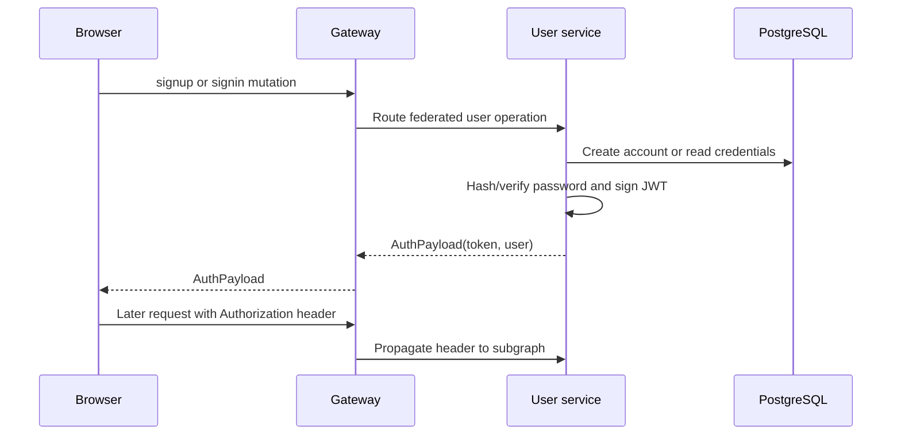

# Authentication flow

The router explicitly propagates `Authorization`. The content service can then
authorize content operations using the same signed identity. Keep JWT issuer,
audience, and secret configuration aligned across user and content services.
