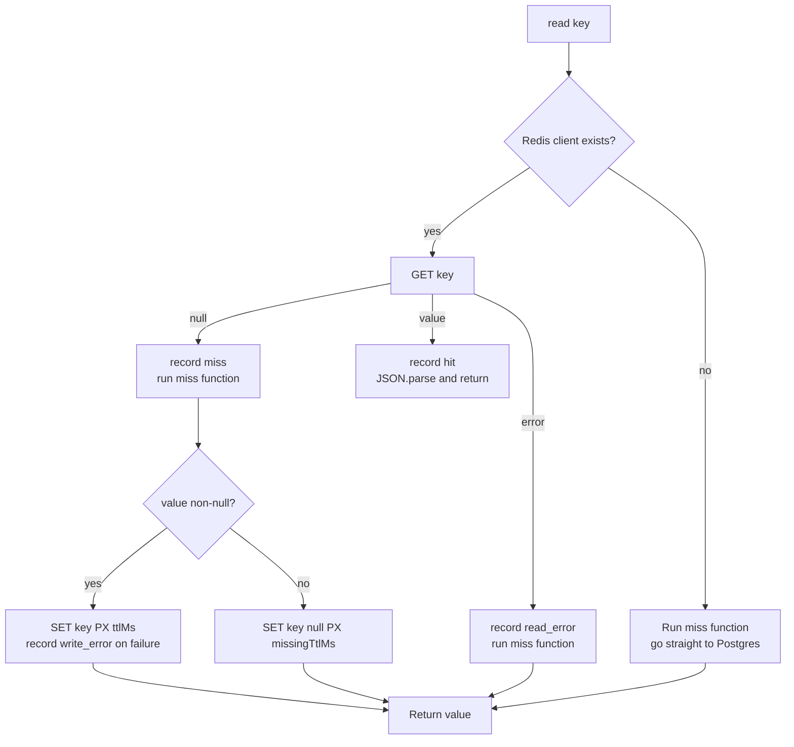
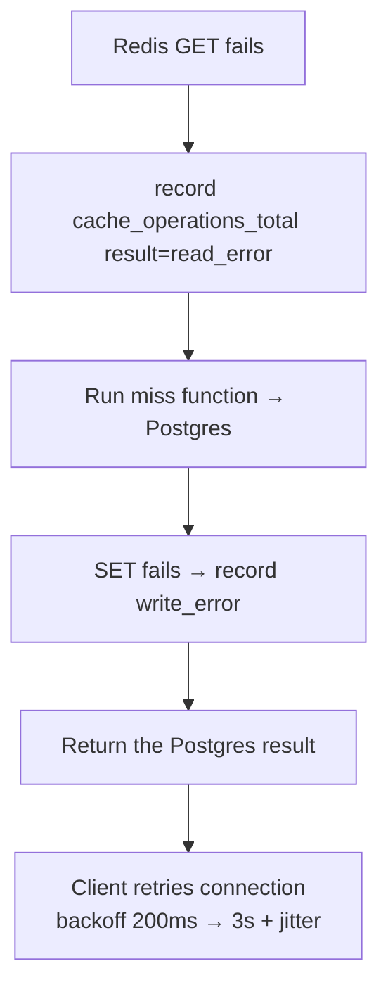

# Caching and resilience

How the User service stays fast when everything is healthy and stays *up* when
something is not. Two dependencies with very different roles:

| Dependency | Role | If it fails |
| --- | --- | --- |
| PostgreSQL | Source of truth for accounts | Requests return `SERVICE_UNAVAILABLE` (`503`); readiness probe reports degraded |
| Redis | Optional read-through cache | **Fail-open**: every read falls through to Postgres; the service keeps working |

Postgres is required because accounts cannot be invented. Redis is optional
because it only makes repeated reads faster.

## The cache

[`CacheManager`](../../src/lib/cache.ts) wraps an `ioredis` client that may be
`null` (when `REDIS_URL` is unset) or disconnected. Every method checks for that
first and quietly does nothing — there is no separate "cache disabled" mode to
configure.

### Read-through algorithm

`read(key, ttlMs, miss)` is the only way reads happen:



Three properties worth knowing:

- **Caching failures never break a read.** If `GET` or `SET` throws, the method
  records a metric and returns the database result anyway. A broken cache costs
  you speed, not correctness.
- **`null` results are cached too** — for `REDIS_MISSING_CACHE_TTL_MS`
  (default 60 s) instead of the normal TTL. This stops repeated lookups of an
  unknown ID from hammering Postgres, while keeping the window short enough
  that a newly created user appears within a minute.
- **Only JSON-serialisable values are stored.** In practice that means
  `UserResponse` objects and `null`. Prisma `User` rows are converted with
  `toUserResponse()` *before* caching, so the cache never holds a `Date` object
  that would come back as a string.

### Keys and TTLs

| Key | Value | Written when | TTL |
| --- | --- | --- | --- |
| `user:{id}` | `UserResponse` or `null` | First `me` / `user(id)` / `updateProfile` read of that ID | `REDIS_CACHE_TTL_MS` (1 h), or `REDIS_MISSING_CACHE_TTL_MS` (60 s) for `null` |
| `users:{limit}:{cursor}` | Array of `UserResponse` | First `users(...)` call for that exact page | `REDIS_CACHE_TTL_MS` (1 h) |

Nothing else is cached. Notably **credentials are never cached**: `signup` and
`signin` always read Postgres directly, so a stale entry can never let someone
log in with an old password or into a deleted account.

### Invalidation

| Trigger | What is invalidated | How |
| --- | --- | --- |
| `signup` | All `users:*` pages | `SCAN MATCH users:*` + batched `DEL` |
| `updateProfile` | That `user:{id}` **and** all `users:*` pages | `DEL` + the same `SCAN` sweep |

The list sweep exists because a new or changed user makes *every* page of
`users(...)` stale — and pages are cached under keys that include their cursor,
so they cannot be enumerated any other way. The scan runs with `COUNT 500` in a
cursor loop and deletes in batches of 500 keys, so it never issues one
unbounded `DEL`.

Both invalidations swallow their own errors and record
`cache_invalidations_total{operation,result}` instead. Stale data with a
one-hour TTL is an acceptable outcome; failing a signup because Redis hiccuped
during the sweep is not.

> `SCAN`, not `KEYS`: `KEYS` blocks Redis for the duration of a full-keyspace
> scan. `SCAN` iterates incrementally and stays safe on a shared instance.

## Resilience to Postgres

The repository wraps **every** operation with three independent defences
([`src/repositories/user.repository.ts`](../../src/repositories/user.repository.ts),
[`src/lib/retry.ts`](../../src/lib/retry.ts)):

| Defence | Detail |
| --- | --- |
| **Timeout** | `Promise.race` against a 7 s timer → `SERVICE_UNAVAILABLE`. Guarantees a slow query cannot hold a request open until the 10 s GraphQL timeout fires. |
| **Retry** | Up to 2 retries with exponential backoff (100 ms base, ×2 per attempt, ±50 % jitter) — but only for errors classified as retryable. |
| **Translation** | The final error is mapped to a `DomainError`, so callers never see a raw Prisma or `pg` error. |

### What gets retried, and why

| Operation class | Retry condition | Reasoning |
| --- | --- | --- |
| **Reads** (`findBy*`, `findAll`) | Any transient DB error: connection establishment, `P1002` (interrupt), `P1017` (pool exhausted), `ECONNRESET`, "Connection terminated" | Reads are idempotent — running one twice is harmless |
| **Writes** (`create`, `update`) | **Only** connection-establishment errors (`P1001`, init failures, `ECONNREFUSED`, `ETIMEDOUT`, pool timeout) | If the connection was never established, the query was never sent, so a retry cannot double-insert. A query that reached the server and then died is *not* retried — the outcome is unknown and a blind retry could duplicate a row |

That distinction is the important one: **writes are never retried after the
query has been dispatched.** Uniqueness is additionally protected by the unique
index, which is the real backstop against a duplicate signup.

## Failure modes

### Redis unavailable



- The `ioredis` client is created with `enableOfflineQueue: false`, so commands
  **fail immediately** while disconnected instead of queueing and hanging. This
  is what makes fail-open actually fast.
- `maxRetriesPerRequest: 2` and `connectTimeout: 2000` bound every command.
- Reconnection runs in the background with a linear-then-capped backoff
  (`min(times × 200, 3000)` ms plus up to 20 % jitter). Redis coming back needs
  no restart — the next `GET` simply succeeds.
- The `redis_connected` and `dependency_up{dep="redis"}` gauges drop to `0`.

**No Redis at all:** leave `REDIS_URL` empty. The client is `null`, `CacheManager`
short-circuits to the database on every call, and readiness still reports Redis
as `unavailable` (which is correct — there is no cache).

### Postgres unavailable

- Reads and writes return `SERVICE_UNAVAILABLE` after retries and the 7 s
  timeout.
- `/ready` and `/readyz` return `503` with `status: "degraded"` — traffic should
  be pulled.
- `/health` and `/healthz` (liveness) still return `200` as long as the process
  is healthy. **Liveness must not depend on the database**, or a database
  outage would restart every instance and make things worse.
- Postgres *startup* failures are surfaced earlier: the pool's `error` handler
  logs them, and every query fails fast through `connectionTimeoutMillis`
  (`PG_POOL_CONNECTION_TIMEOUT_MS`, default 5 s).

### Degraded modes you can reproduce

The compose targets in [`Makefile`](../../Makefile) let you run each scenario
deliberately:

```bash
make up WITH_REDIS=0     # Postgres up, Redis container never started
make up WITH_POSTGRES=0  # Redis up, Postgres container never started
make up                  # fully degraded: service only
```

| Mode | GraphQL behaviour | Probes |
| --- | --- | --- |
| `WITH_REDIS=0` | Everything works, uncached; `redis_connected=0` | `/ready` reports `redis: unavailable` but returns `200` (DB is fine) |
| `WITH_POSTGRES=0` | All account operations → `SERVICE_UNAVAILABLE` | `/ready` → `503` degraded, `/health` → `200` |
| Both off | Everything → `SERVICE_UNAVAILABLE` | `/ready` → `503` |

This is why `make up` keeps `USER_REDIS_URL` pointing at the stopped host when
Redis is disabled — the reconnect path gets exercised rather than bypassed.

### Process shutdown

On `SIGTERM`/`SIGINT` ([`src/lib/shutdown.ts`](../../src/lib/shutdown.ts)):

1. A flag flips so `/health` and `/ready` immediately return `503
   shutting_down` — the load balancer stops sending new traffic.
2. The HTTP server stops accepting connections; in-flight requests finish.
3. Redis disconnects, then the Prisma client and pg pool close.
4. The process exits `0`. A 10 s timer forces `exit(1)` if any of that hangs.

## What to watch

| Signal | Query | Meaning |
| --- | --- | --- |
| Cache effectiveness | `rate(cache_operations_total{result="hit"}) / rate(cache_operations_total)` | Low hit rate = cache churn or frequent invalidation |
| Cache health | `cache_operations_total{result=~"read_error\|write_error"}` rising | Redis is failing — the service is falling through to Postgres |
| Redis connectivity | `redis_connected == 0` for more than a few seconds | Outage or misconfiguration |
| DB pressure | `rate(db_query_duration_seconds_sum)` + `db_pool_connections{state="waiting"}` | Waiting connections climbing means the pool is saturated (`PG_POOL_MAX`) |
| Retry storms | `db_query_duration_seconds{status="error"}` | Sustained errors, not transient blips |
| Failures reaching users | `rate(graphql_errors_total)` grouped by `code` | Which error dominates |

Full metric catalogue and probe semantics:
[Health and observability](../operations/health-and-observability.md).

## Why this design

| Decision | Benefit |
| --- | --- |
| **Fail-open cache** | A Redis outage cannot block signup or signin |
| **Cache in the service layer** | Invalidation sits next to the rules that make data stale |
| **Negative caching with a short TTL** | Protects Postgres from hot unknown-ID lookups without hiding new users for long |
| **Retry reads broadly, writes narrowly** | Speed without risking duplicate rows |
| **7 s DB timeout under a 10 s operation timeout** | Failures surface as a clear `503`, not an ambiguous `504` |
| **Liveness independent of dependencies** | A database outage doesn't trigger a restart storm |
| **Metrics on every cache error path** | Fail-open never means fail-silent |

## Next steps

- [Architecture](architecture.md) — where `CacheManager` and the repository fit
- [Health and observability](../operations/health-and-observability.md) — the
  probes and metrics referenced above
- [Configuration](../getting-started/configuration.md) — TTLs, pool sizes, and
  Redis settings
