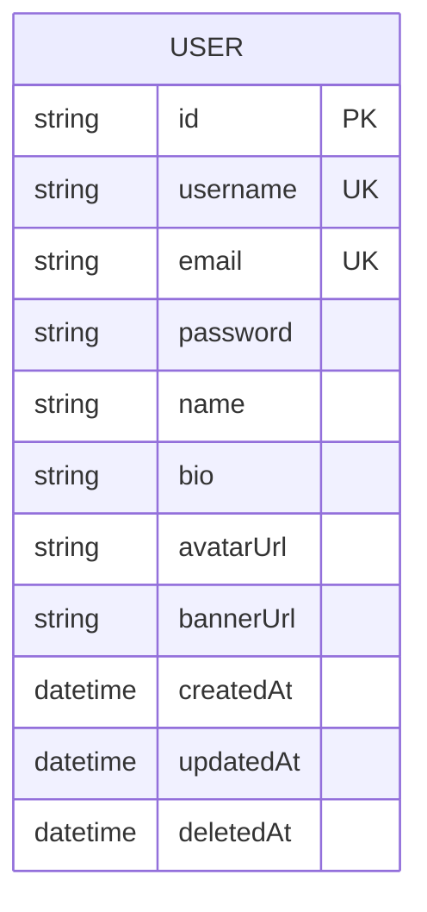

# Account data model

The Prisma schema currently defines one persisted application model.

`username` and `email` are unique. `deletedAt` supports soft-deletion-aware
queries. Prisma maintains indexes on `(createdAt, id)` and `deletedAt`. The
complete model is in [`prisma/schema.prisma`](../../prisma/schema.prisma).

Posts are not stored in this database. The content subgraph references the
federated `User` entity by ID, so cross-service relationships are API-level
links rather than relational foreign keys.
