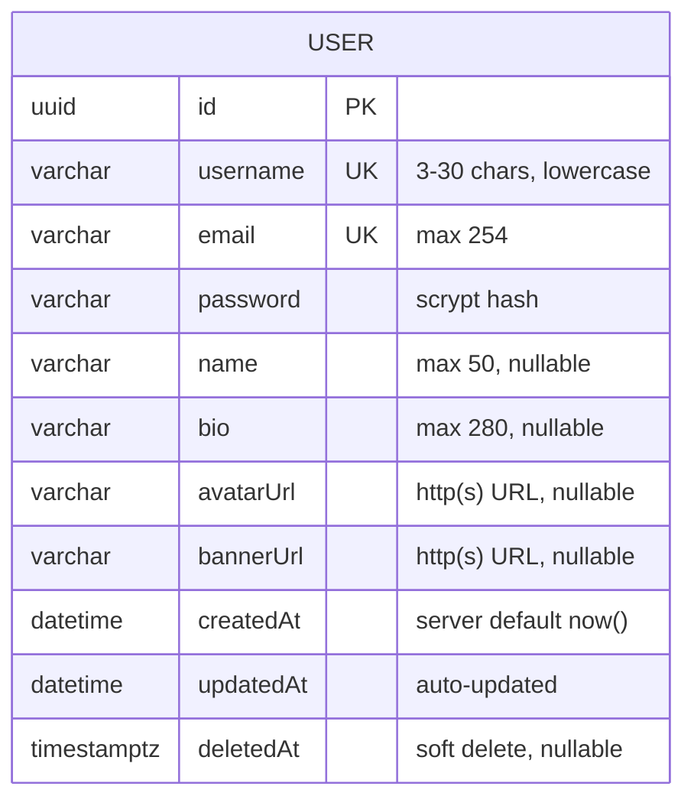
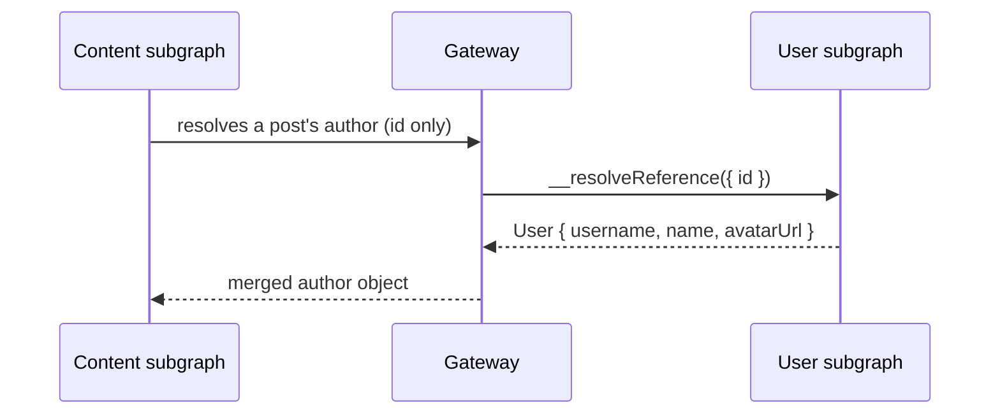

# Account data model

The User service is the only service that writes account rows. Everything it
stores lives in one PostgreSQL table, `User`, managed by Prisma.

This page is for anyone who needs to know what is stored, what each column
means, and how queries behave — especially around deleted accounts.

## Entity diagram



There is deliberately only one entity. Posts, tags, and summaries belong to the
[content service](../../../../docs/components/README.md); the User service stores
identity and nothing else.

## Columns

| Column | Type | Constraints | Notes |
| --- | --- | --- | --- |
| `id` | `String` (uuid) | primary key | Generated by Prisma with `@default(uuid())`; this is the federation key other subgraphs use |
| `username` | `String` | **unique**, `varchar(30)` | Normalized to lowercase by [validation](../components/graphql-api.md#input-rules) before insert |
| `email` | `String` | **unique**, `varchar(254)` | Stored lowercase; only visible to the account itself |
| `password` | `String` | `varchar(255)` | A `scrypt:` hash — never a plaintext or reversible value |
| `name` | `String?` | `varchar(50)` | Display name; defaults to the username at signup |
| `bio` | `String?` | `varchar(280)` | Free text |
| `avatarUrl` | `String?` | `varchar(2048)` | Must be `http://` or `https://` |
| `bannerUrl` | `String?` | `varchar(2048)` | Must be `http://` or `https://` |
| `createdAt` | `DateTime` | `default(now())` | Set once, never changes |
| `updatedAt` | `DateTime` | `@updatedAt` | Refreshed by Prisma on every update |
| `deletedAt` | `DateTime?` | `timestamptz(3)` | `NULL` for active accounts; set when an account is soft-deleted |

Source: [`prisma/schema.prisma`](../../prisma/schema.prisma).

### The password column in detail

`password` holds the output of `hashPassword()` from
[`src/utils/password.ts`](../../src/utils/password.ts) in this format:

```
scrypt:131072:8:1:<16-byte salt as hex>:<64-byte derived key as hex>
```

The parameters (`N=131072`, `r=8`, `p=1`, 64-byte key) follow the OWASP
recommendation for scrypt. They are stored *with* the hash so that a future
change to the cost parameters can be rolled out per account — old hashes still
verify with their own embedded parameters. Verification compares derived keys
with `timingSafeEqual`, so it does not leak how close a guess was.

## Indexes

Prisma declares two indexes:

| Index | Columns | Serves |
| --- | --- | --- |
| `User_createdAt_id_idx` | `(createdAt DESC, id DESC)` | The `users` query, which pages newest-first using this exact order |
| `User_deletedAt_idx` | `(deletedAt)` | Every query that adds `deletedAt: null` — i.e. almost all of them |

Uniqueness is enforced by **four** unique indexes, created by the migrations:

| Index | Purpose |
| --- | --- |
| `User_username_key` | Plain uniqueness (what Prisma's `@unique` expects) |
| `User_email_key` | Plain uniqueness |
| `User_username_lower_key` | **Authoritative** case-insensitive uniqueness: `UNIQUE (LOWER(username))` |
| `User_email_lower_key` | **Authoritative** case-insensitive uniqueness: `UNIQUE (LOWER(email))` |

The application lowercases `email` and `username` before persisting them, so the
`lower()` indexes are the real guarantee that `Alice@Example.com` and
`alice@example.com` cannot both register. They are functional indexes, so they
hold even if a row were inserted by another tool that skipped the application's
normalisation.

The migration also adds `CHECK` constraints for column lengths
(`username` 3–30, `email` 5–254, `name` ≤ 50, `bio` ≤ 280, URLs ≤ 2048) as
defence in depth alongside the `VARCHAR` limits.

### How the indexes are used

`findAll` orders by `[{ createdAt: 'desc' }, { id: 'desc' }]` **on purpose** to
match the `(createdAt, id)` index — a query that ordered by anything else would
sort the whole table:

```sql
-- what Prisma generates for users(limit: 20, cursor: <id>)
SELECT * FROM "User"
WHERE "deletedAt" IS NULL
ORDER BY "createdAt" DESC, "id" DESC
LIMIT 20;
-- with a cursor, Prisma also adds: AND "id" = <cursor> ... (seek pagination)
```

Because the order is stable (`createdAt` could tie; `id` breaks the tie), a
cursor never skips or repeats a row, even while new users sign up between pages.

## Soft deletion

Accounts are never hard-deleted by this service. Setting `deletedAt` marks an
account as gone while keeping the row:

- **Every normal query filters it out.** `findByEmail`, `findById`,
  `findByEmailOrUsername`, `findByUsername`, and `findAll` all add
  `deletedAt: null`.
- **A deleted email and username become reusable**, because the uniqueness
  check only sees active rows.
- **References still resolve.** Content service rows may point at a user that
  has since deleted their account. `findByIdForReference` loads the row
  *including* deleted ones and returns a stable placeholder instead of `null`, so
  a post's author renders as `deleted_user` / `Deleted User` rather than breaking
  the response.

> `deletedAt` is an index on its own so that the "active only" filter stays a
> cheap index condition rather than a per-row check.

## What is *not* stored here

| Not here | Where it lives |
| --- | --- |
| Posts, drafts, tags, comments | [Content service](../../../../docs/components/README.md) (MongoDB) |
| Vector embeddings and summaries | AI service (Qdrant) |
| Sessions or refresh tokens | Nowhere — auth is a stateless 7-day JWT |
| Roles or permissions | Not modelled yet |

### No foreign keys across services

The content subgraph stores a `User` **ID** on its documents, but there is no
foreign key — the two services use different databases (MongoDB and Postgres).
The link is maintained at the GraphQL level through federation:



This means the author lookup can fail independently of the post lookup. When it
does, the reference resolver still returns a placeholder for deleted users and
`null` for unknown IDs — see
[Request flows](request-flows.md#federation-reference-lookup) for how that is
handled.

## Migrations

Migrations live in [`prisma/migrations/`](../../prisma/migrations) and are
applied by the `user-migrator` container (`prisma migrate deploy`) before the
service starts. They are **not** applied by the running service.

| Migration | What it did |
| --- | --- |
| `20260802_init_user_schema` | Created the `User` table with plain unique indexes **and** the `lower()` functional unique indexes on `email`/`username` |
| `20260922000000_normalize_user_model` | Added `deletedAt`, converted columns from `TEXT` to `VARCHAR(n)`, added length `CHECK` constraints, and created the `(createdAt, id)` and `deletedAt` indexes |

To add one during development:

```bash
# from services/user/
make db-migrate      # prisma migrate dev — creates and applies a migration
```

Apply existing migrations without creating new ones (what the migrator
container does): `make db-deploy`.

After changing `schema.prisma`, always run `make db-generate` — the generated
client in `src/generated/` is what the code imports.

## Next steps

- [Architecture](architecture.md) — where the repository and service sit
- [Request flows](request-flows.md) — how each query uses this model
- [GraphQL API](../components/graphql-api.md) — the fields exposed over the API
