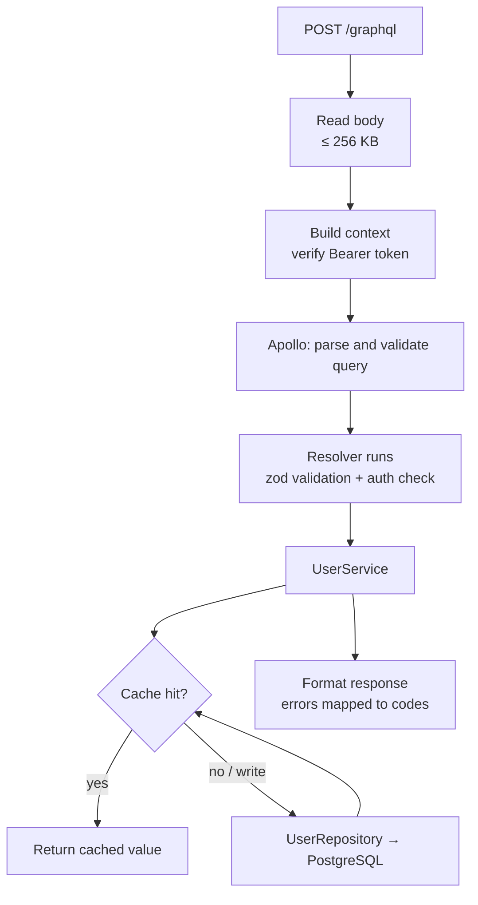
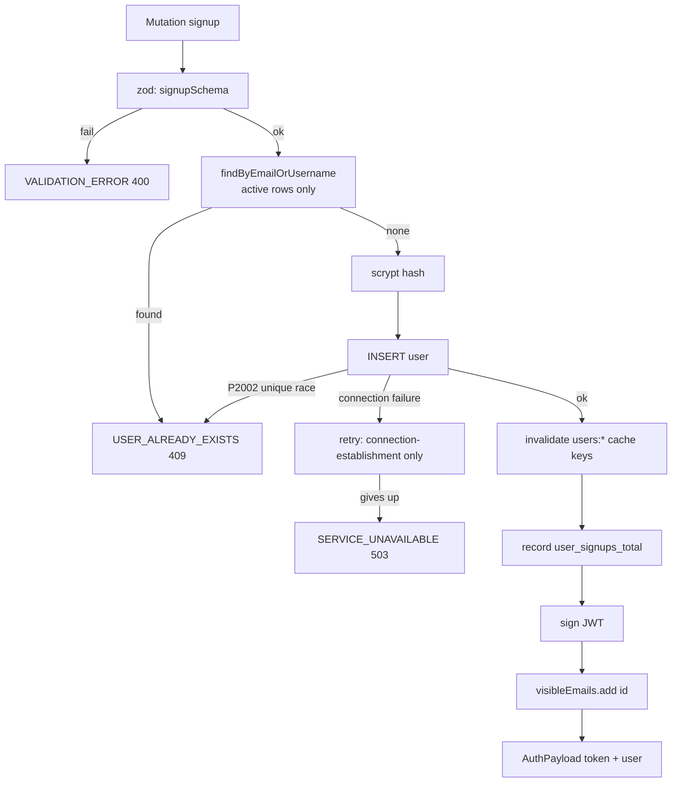
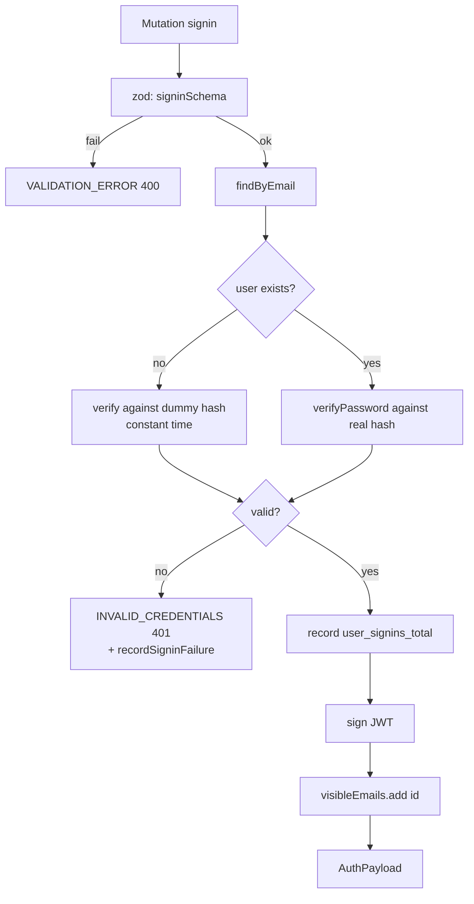
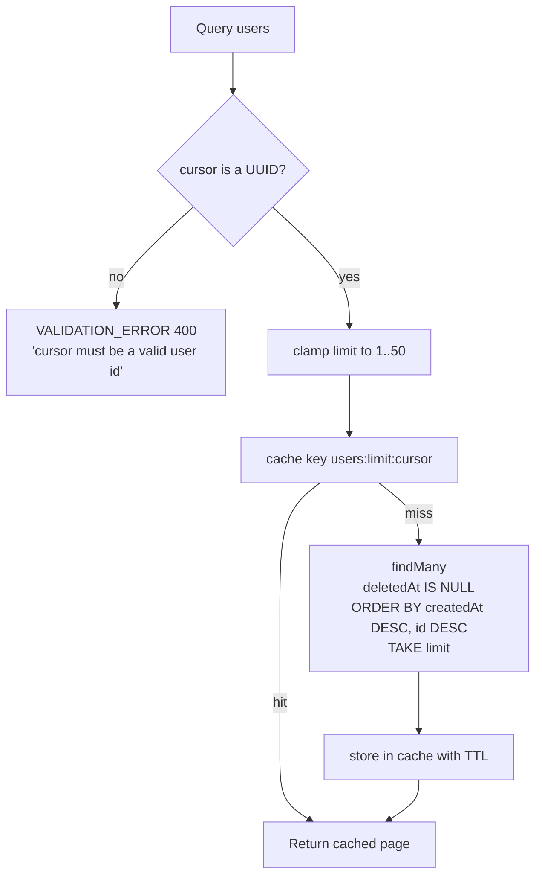
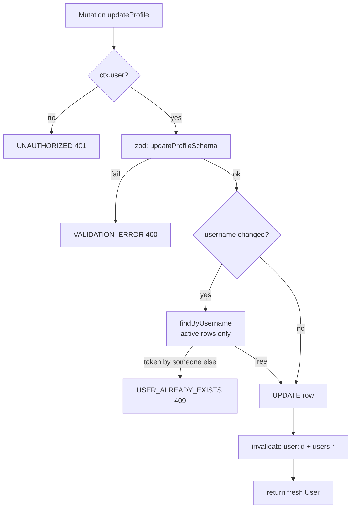
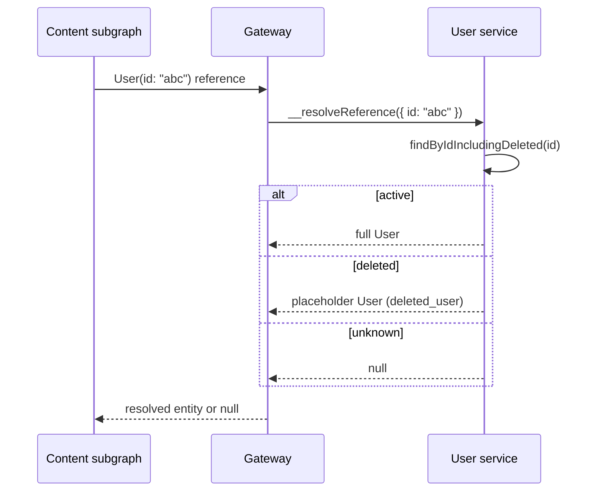

# Request flows

This document follows individual GraphQL operations from the HTTP request to
the database and back. Read it when you want to know exactly what happens — in
what order, which validation runs, which errors can be thrown, and whether the
cache is involved.

For the code layout behind these flows, see [Architecture](architecture.md).
For auth internals (hashing, JWT claims), see
[Authentication flow](authentication-flow.md).

## The common path

Every operation, without exception, passes through these stages:

Three guardrails wrap the whole path:

| Guardrail | Value | Behaviour when exceeded |
| --- | --- | --- |
| Body size | 256 KB | `PAYLOAD_TOO_LARGE` (`413`) before Apollo runs |
| Operation timeout | 10 s | `GRAPHQL_TIMEOUT` (`504`) — Apollo's work is abandoned |
| Malformed JSON body | — | `VALIDATION_ERROR` (`400`) |

All three are defined in
[`src/http/handlers.ts`](../../src/http/handlers.ts).

## `signup`

Notes:

- The uniqueness check and the `P2002` catch cover the same race from both
  sides — two simultaneous signups with the same email can both pass the
  `SELECT`, but the unique index rejects the second `INSERT`.
- `name` is set to the username at creation; the GraphQL `signup` mutation has
  no `name` argument.
- No cache is *written* here. Only list caches are invalidated, because the new
  user changes every `users(...)` page.

## `signin`

Notes:

- `findByEmail` filters `deletedAt: null`, so a soft-deleted account cannot
  sign in.
- The password is verified **always**, even when no user was found — this is the
  timing-equalisation described in
  [Authentication flow](authentication-flow.md#step-2-signin).
- Signin does not touch the cache.

## `me`

| Stage | Behaviour |
| --- | --- |
| Auth | Optional. With no valid token, the resolver returns `null` (not an error). |
| Resolver | `ctx.user ? findById(ctx.user.id) : null` |
| Cache | Read-through on `user:{id}` with `REDIS_CACHE_TTL_MS` (default 1 h). |
| Database | On a miss: `findById`, which excludes soft-deleted rows. |
| Result | `User` or `null`. |

Because a soft-deleted account is filtered out, `me` returns `null` for it —
the equivalent of being signed out.

## `user(id)`

Same lookup as `me`, but the result is **required**:

- Valid token or not, an unknown/deleted ID throws `UserNotFoundError` (`404`).
- The ID is used verbatim as the cache key, so `user:{id}` is shared with `me`.

This is the operation to use when you know an ID; use `me` when you may not be
authenticated.

## `users(limit, cursor)`

Details:

- **`limit`** defaults to 20 and is clamped: `min(max(floor(limit), 1), 50)`.
  A `limit` of 0, a negative number, or 500 all end up in `1..50`. Non-integer
  input is floored rather than rejected.
- **`cursor`** must be a UUID (it is the `id` of the last row of the previous
  page). Anything else fails fast with a `400` *before* the database is
  touched — this also prevents Prisma's `P2023` (invalid cursor) from surfacing
  as a confusing internal error.
- **Order** is `createdAt DESC, id DESC`, matching the `(createdAt, id)` index
  and guaranteeing a stable page boundary. See
  [Data model](data-model.md#how-the-indexes-are-used).
- **Empty result** is possible: the resolver returns `[]`, never `null`.
- The cache key includes both `limit` and `cursor`, so each distinct page is
  cached separately; all of them are dropped together by
  `invalidateUserLists()` when any user is created or updated.

## `updateProfile`

Notes:

- Only an authenticated user can update their **own** profile. There is no
  argument to update someone else — `userId` comes from the token, never from
  the request body.
- Omitting a field leaves it unchanged; passing `null` clears it (for `name`,
  `bio`, `avatarUrl`, `bannerUrl`).
- The response comes from the `UPDATE ... RETURNING` row, so it reflects the
  new values immediately even though the cache was just invalidated.
- `email` and `password` are **not** accepted by this mutation. There is
  currently no API to change either.

## Federation reference lookup

When another subgraph resolves an author of a post, the gateway calls
`User.__resolveReference({ id })` on this service.

| Situation | Returned |
| --- | --- |
| Active user | The full `User` |
| Soft-deleted user | A **placeholder**: `username: "deleted_user"`, `name: "Deleted User"`, `email: ""` |
| Unknown ID | `null` |

Two deliberate choices:

- **Deleted users still resolve.** A post written by someone who deleted their
  account keeps rendering an author rather than a broken field. The placeholder
  comes from [`UserService.findByIdForReference()`](../../src/user.service.ts).
- **This lookup bypasses the cache** and reads `findByIdIncludingDeleted`
  directly, because cached `user:{id}` entries only ever contain active users —
  caching a placeholder would risk serving it to the account's own `me` query.

After the reference is resolved, the gateway merges the returned fields into
whatever the content subgraph asked for. If the *email* of that user is needed,
the field resolver still applies the privacy rule — a reference lookup does not
make someone's email public.

## Cross-service authentication

The flows above stay inside this service, but one detail spans services:

1. The browser sends `Authorization: Bearer <token>` to the **gateway**.
2. The gateway forwards that header to whichever subgraph resolves the
   operation (`gateway/router.yaml` explicitly allows and forwards
   `Authorization`).
3. The **content service verifies the same JWT independently** — same secret,
   same issuer, same audience.

So the user service never calls the content service and vice versa; the token is
the shared contract. If `JWT_SECRET`, `JWT_ISSUER`, or `JWT_AUDIENCE` differ
between them, tokens minted here will be rejected there. Keep them aligned —
see [Configuration](../getting-started/configuration.md).

## Where each flow can fail

| Code | HTTP | Typical source in these flows |
| --- | --- | --- |
| `VALIDATION_ERROR` | 400 | Bad input, malformed cursor, malformed JSON |
| `UNAUTHORIZED` | 401 | `updateProfile` with no valid token |
| `INVALID_CREDENTIALS` | 401 | Signin with unknown email or wrong password |
| `USER_ALREADY_EXISTS` | 409 | Duplicate email/username, or a taken username on update |
| `USER_NOT_FOUND` | 404 | `user(id)` for an unknown or deleted ID |
| `PAYLOAD_TOO_LARGE` | 413 | Request body over 256 KB |
| `SERVICE_UNAVAILABLE` | 503 | Postgres unreachable, pool timeout, or a 7 s query timeout |
| `GRAPHQL_TIMEOUT` | 504 | The whole operation exceeded 10 s |

Full definitions and the Prisma error mapping:
[Error handling](../components/error-handling.md).

## Next steps

- [Architecture](architecture.md) — the classes these flows run through
- [Caching and resilience](caching-and-resilience.md) — what happens when a
  dependency fails mid-flow
- [GraphQL API](../components/graphql-api.md) — request and response examples
