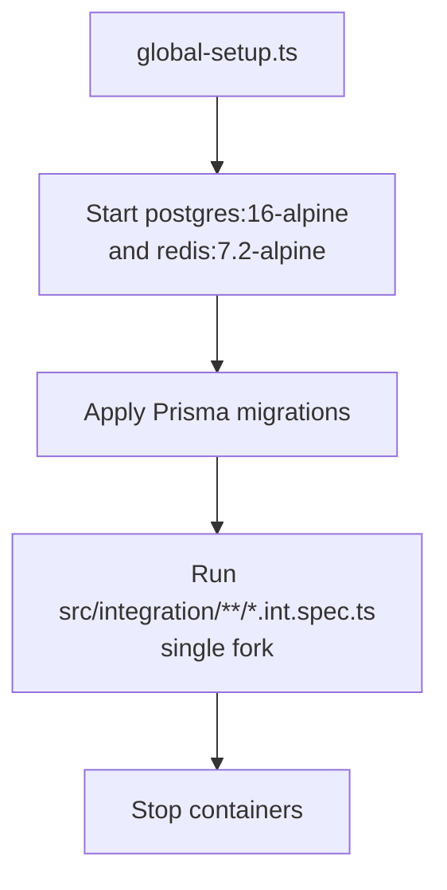

# Testing

How to run the User service's tests, what each layer covers, and how to add to
them. All commands run from `services/user/`.

## Commands

| Command | What it runs | Needs Docker |
| --- | --- | --- |
| `npm test` | Unit tests once (`vitest run`) | No |
| `npm run test:watch` | Unit tests in watch mode | No |
| `npm run test:coverage` | Unit tests with coverage thresholds enforced | No |
| `npm run test:integration` | Integration tests against real Postgres + Redis | **Yes** |
| `npm run test:integration:watch` | Integration tests in watch mode | **Yes** |
| `npm run lint` | `tsc --noEmit` **then** ESLint over the whole project | No |
| `npm run db:generate` | Regenerates the Prisma client | No |

Run `npm run db:generate` (or `make db-generate`) after any change to
`prisma/schema.prisma` and after a fresh clone — the generated client in
`src/generated/` is gitignored, and both the code and the tests import it.

## The two suites

They are separated by config file, not by naming alone:

| | Unit | Integration |
| --- | --- | --- |
| Config | [`vitest.config.ts`](../../vitest.config.ts) | [`vitest.config.int.ts`](../../vitest.config.int.ts) |
| Pattern | `src/**/*.spec.ts` | `src/integration/**/*.int.spec.ts` |
| Excludes | `src/integration/**` | — |
| Infrastructure | None — fakes and stubs | Testcontainers: `postgres:16-alpine` + `redis:7.2-alpine` |
| Timeouts | default | 60 s per test, 180 s per hook (container startup) |
| Concurrency | default | `pool: 'forks'`, `singleFork: true` (one container set, one process) |
| Typical duration | milliseconds | tens of seconds (containers start once, in `globalSetup`) |

Because the unit config *excludes* `src/integration/**`, `npm test` never
accidentally tries to start a container.

## What unit tests cover

Tests sit next to the code in `__tests__/` folders:

| Area | Tests | Covers |
| --- | --- | --- |
| Service | [`src/__tests__/user.service.spec.ts`](../../src/__tests__/user.service.spec.ts) | Signup/signin rules, duplicate detection, cache invalidation, `findByIdForReference` placeholder |
| Resolvers | [`src/graphql/__tests__/resolvers.spec.ts`](../../src/graphql/__tests__/resolvers.spec.ts) | Auth checks, cursor validation, limit clamping, email visibility |
| Repository | [`src/repositories/__tests__/user.repository.spec.ts`](../../src/repositories/__tests__/user.repository.spec.ts) | Retry classification, query timeout, Prisma error translation |
| Cache | [`src/lib/__tests__/cache.spec.ts`](../../src/lib/__tests__/cache.spec.ts) | Hit/miss, null caching, fail-open on Redis errors |
| Password / token | [`src/utils/__tests__/`](../../src/utils/__tests__) | Hash round-trips, dummy-hash behaviour, JWT claims and rejection cases |
| Errors | [`src/__tests__/errors.spec.ts`](../../src/__tests__/errors.spec.ts) | Every `toDomainError` mapping |
| HTTP handlers | [`src/http/__tests__/handlers.spec.ts`](../../src/http/__tests__/handlers.spec.ts) | Body limit, operation timeout, probe status codes |
| Config | — | *Not covered* (excluded: see coverage below) |

The service tests construct `UserService` directly with a fake repository and
cache — no container, no database, no network. That is the payoff of the
[resolver → service → repository split](../concepts/architecture.md#class-diagram).

## What integration tests cover

[`src/integration/__tests__/user.service.int.spec.ts`](../../src/integration/__tests__/user.service.int.spec.ts)
runs the real `UserService` against real containers:

- Signup creates a row whose `password` starts with `scrypt:` and is **not** the
  plaintext, and the returned token verifies.
- Duplicate email/username raise `UserAlreadyExistsError`.
- Signin accepts the right password and rejects the wrong one.
- The cache actually round-trips through Redis.
- Soft-deleted accounts are excluded from lookups.

Setup flow ([`helpers/`](../../src/integration/helpers)):



Each test file's `beforeEach` wipes state (`prisma.user.deleteMany()`,
`redis.flushall()`), so tests do not depend on ordering.

## Coverage thresholds

`npm run test:coverage` fails the build below:

| Metric | Threshold |
| --- | --- |
| Lines | 85 % |
| Statements | 85 % |
| Functions | 85 % |
| Branches | 80 % |

Coverage deliberately excludes wiring and generated code, which would otherwise
dilute the signal without telling you anything about behaviour:

```
src/generated/**    src/index.ts    src/app.ts    src/config/**
src/lib/prisma.ts   src/lib/redis.ts    src/integration/**    **/*.spec.ts
```

`src/app.ts` and `src/config/env.ts` are excluded because they are pure wiring
(route registration, environment parsing) — their behaviour is asserted
indirectly through the handler and config tests that sit beside them.

## Load tests

Separate from the Vitest suites. k6 scenarios live in
[`load-tests/k6/`](../../load-tests/k6) and run against an isolated compose
stack (own Postgres and Redis, host ports `5434`/`6381`), so they never touch
your dev data.

```bash
make load-test                          # mixed scenario, RPS=50 VUS=20 DURATION=30s
make load-test SCRIPT=signin            # one scenario
make load-test SCRIPT=signup VUS=10 DURATION=2m RPS=20
make load-test-cold                     # flush Redis first, measure cold-cache reads
make load-test-tail                     # follow logs while it runs
make load-test-stop                     # tear the stack down
```

| Scenario | Exercises |
| --- | --- |
| `signup` | Account creation, cache list invalidation |
| `signin` | Credential verification (scrypt cost is the bottleneck) |
| `me` | Cache hit/miss behaviour |
| `users` | Cursor pagination and list caching |
| `update-profile` | Writes plus dual invalidation |
| `mixed` | All of the above, weighted: `users:30, user:15, me:20, signin:20, updateProfile:10, signup:5` |

Knobs: `RPS`, `VUS`, `DURATION`, `SCRIPT`, `WEIGHTS`, `SEED_USERS`, and memory
limits (`PG_MEM`, `REDIS_MEM`, `SVC_MEM`, `K6_MEM`).

## Lint

```bash
npm run lint        # tsc --noEmit && eslint .
```

Type-checking runs first, so a type error fails before ESLint is invoked. The
shared config is [`eslint.config.ts`](../../eslint.config.ts).

## Writing new tests

1. **Unit by default.** Put the file in the `__tests__/` folder next to the code
   and give it a `.spec.ts` extension. Build the object under test directly with
   fakes — do not import the container.
2. **Reach for integration only** when the behaviour *is* the interaction:
   Prisma query semantics, Redis round-trips, retry against a real connection
   failure. Name it `*.int.spec.ts` under `src/integration/`.
3. **Reset state between tests.** Integration tests wipe Postgres and Redis in
   `beforeEach`; unit tests should not share mutable module state.
4. **Assert on `code`, not messages.** Domain errors carry a stable `code`
   (see [Error handling](../components/error-handling.md)); messages may be
   reworded.
5. **Keep it Docker-free until it isn't.** If a unit test needs a container, the
   behaviour probably belongs in the integration suite.

Before pushing:

```bash
npm run lint
npm test
npm run test:coverage        # thresholds must pass
npm run test:integration     # requires Docker
```

## Troubleshooting

| Symptom | Fix |
| --- | --- |
| `Cannot find module './generated/prisma/client.js'` | `npm run db:generate` |
| Integration tests time out at startup | Docker not running, or the image pull is slow — first run pulls `postgres:16-alpine` and `redis:7.2-alpine` |
| Coverage thresholds failing | Run `npm run test:coverage` locally to see which file regressed |
| Port conflict in integration tests | Testcontainers allocates random host ports; a clash is usually another compose stack holding `5432` |
| `load-test` fails to start | Another stack is using the load-test ports (`5434`, `6381`) — `make load-test-stop` |
| Tests pass locally, fail in CI | Did CI run `db:generate`? The generated client is not committed |

## Next steps

- [Quick start](../getting-started/quickstart.md) — run the service first
- [Architecture](../concepts/architecture.md) — the layers these tests target
- [Request flows](../concepts/request-flows.md) — behaviour worth testing
